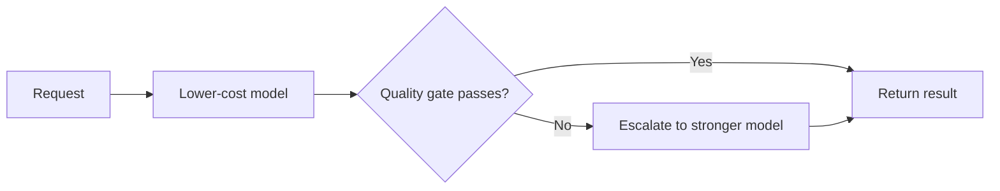

# Intro

Model selection chooses which model may serve a workload; routing chooses per request among approved candidates. Larger or frontier models often perform better on difficult tasks, while smaller models often cost less and respond faster, but these are tendencies rather than contracts. A smaller specialized or fine-tuned model can win on a narrow task, and a frontier model can miss a latency SLA or regress after a provider update. The production rule is empirical: choose the least expensive candidate that clears task evaluation, safety, reliability, and latency gates on your traffic.

This note covers application-level routing between complete models. Token-level routing among experts inside one sparse model is a different mechanism covered in [[AI & ML/LLM/LLM#Mixture-of-experts|mixture-of-experts routing]].

## Selection criteria

Evaluate every candidate against the same versioned workload and constraints:

- **Task quality** — correctness, groundedness, tool-call success, and failure slices on your labeled set.
- **Latency** — p50 and p95 under the expected prompt size, output length, concurrency, and region.
- **Cost** — input, cached input, output, tool calls, and retry or escalation cost per successful task.
- **Capabilities** — required context, structured outputs, tools, modalities, and language coverage.
- **Safety and policy** — refusal behavior, data handling, residency, and provider terms.
- **Operations** — rate limits, uptime, version pinning, observability, and fallback behavior.

Public leaderboards shortlist candidates. They do not replace [[AI & ML/LLM/Evaluation/Evaluation|evaluation]] on the distribution and rubric that determine your release.

## Routing patterns

### Deterministic task mapping

Map known task classes to models in configuration: extraction to one candidate, complex synthesis to another, image work to a multimodal model. This is easiest to audit when task boundaries are explicit.

### Classifier routing

A cheap classifier predicts task type or difficulty before generation. It avoids paying for a failed first attempt, but a false “easy” decision can silently reduce quality. Evaluate the router as a decision system, including per-route recall for hard or safety-sensitive cases.

### Cascade

Start with a lower-cost model and escalate when an observable gate fails: schema validation, groundedness check, low calibrated confidence, or an explicit unsupported result.

A cascade saves money only if the first attempt plus escalation costs less than sending every request directly to the stronger model. It can increase p95 latency for escalated traffic, so measure the end-to-end path rather than individual model latency.

## Router evaluation

Build a labeled routing set from real traffic. For each request, record which candidates pass the task rubric, their latency, and full cost. Then evaluate the routing policy against an oracle that selects the cheapest passing model.

Track:

- Task success after routing, not just classifier accuracy.
- Hard-query miss rate and safety-sensitive miss rate.
- Escalation frequency and the cost of duplicate generation.
- p95 latency by route and after fallback.
- Drift when traffic, prompts, provider versions, or prices change.

Shadow evaluation can run alternative candidates without serving their answers. Use it to recalibrate routes before changing user-visible assignment.

## Operations

Put one gateway boundary around provider calls so model identifiers, fallbacks, timeouts, and routing policy are configuration rather than scattered conditionals. Log the route decision, candidate version, gate result, latency, and safe token/cost metadata without recording sensitive prompts or responses by default.

Pin versions where possible and rerun evaluation when a provider changes a model behind an alias. A fallback must satisfy the same capability and policy requirements; an available model that cannot honor the output contract is not a safe fallback.

## Pitfalls

**Frontier by default** — it hides the absence of task thresholds and can spend the most on traffic a smaller candidate already passes.

**Small by assumption** — low advertised cost is irrelevant if retries, failures, or human escalation make cost per successful task higher.

**Router accuracy as the goal** — a class label is only a proxy. Optimize end-to-end task success subject to cost and latency constraints.

**Unmeasured cascade tails** — escalated requests pay two generations and often dominate p95 latency.

**Provider aliases without regression gates** — silent model changes invalidate earlier routing evidence.

## Tradeoffs

| Strategy | Main benefit | Main cost | Good fit |
| --- | --- | --- | --- |
| One approved model | Simple operations | Pays one model’s tradeoffs for all traffic | Uniform workload or early product |
| Deterministic mapping | Auditable decisions | Rules drift as traffic changes | Clear task categories |
| Classifier router | One generation per request | Misrouting risk and calibration work | Predictable difficulty signals |
| Cascade | Observable second chance | Duplicate cost and tail latency | Cheap reliable failure gate |
| Fine-tuned specialist | Low serving cost on one task | Training and model lifecycle | Stable, high-volume narrow task |

## Questions

> [!QUESTION]- Why are “frontier is best” and “small is cheap” insufficient selection rules?
> They describe common tendencies, not the result on a particular task and serving stack. Selection requires measured quality, safety, latency, and cost per successful task under the same workload.

> [!QUESTION]- When should you use a classifier instead of a cascade?
> Use a classifier when difficulty can be predicted before generation and duplicate latency is expensive. Use a cascade when the first result produces a reliable, cheap failure signal. Evaluate both end to end because classifier misses and cascade retries fail differently.

## References

- [FrugalGPT](https://arxiv.org/abs/2305.05176) — primary work on LLM cascades and cost-quality optimization.
- [RouteLLM](https://arxiv.org/abs/2406.18665) — primary learned-routing work using preference data to trade quality against cost.
- [Chatbot Arena](https://arxiv.org/abs/2403.04132) — primary description of a human-preference leaderboard useful for shortlisting, not task-specific release decisions.
- [LiteLLM](https://docs.litellm.ai/) — practical gateway reference for provider abstraction, fallback, and routing configuration.
