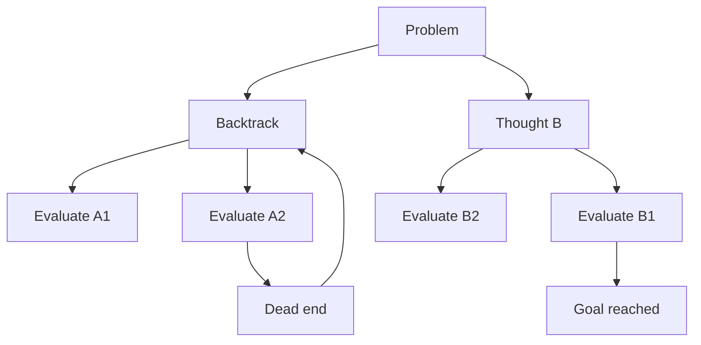

Standard prompting often fails on tasks that require multi-step reasoning, such as arithmetic word problems, logic puzzles, or constrained planning. Reasoning-focused prompts improve reliability by making intermediate steps explicit, which reduces shortcut errors and forces the model to keep track of state across steps. A practical progression is: Chain-of-Thought (one explicit reasoning path), Self-Consistency (many sampled paths with voting), and Tree of Thoughts (branching search with evaluation and backtracking). You can think of this as moving from single-pass reasoning to probabilistic ensemble reasoning and finally to explicit search.

# Chain-of-Thought Prompting

Chain-of-Thought (CoT) prompting was introduced by Wei et al. (2022) as a way to elicit intermediate reasoning steps before the final answer. In practice, teams use two variants:

1. Few-shot CoT: include 1-n worked examples that show the reasoning process and final answer format.
2. Zero-shot CoT: append an instruction such as "Let's think step by step" (Kojima et al. 2022).

Why it works: it decomposes a hard objective into smaller local decisions the model is better at. Instead of jumping directly to an answer token sequence, the model is nudged to produce latent checkpoints (facts, sub-results, constraints), which lowers the chance of early irreversible mistakes.

Example (same task, with and without CoT):

```text
Question: I buy 10 apples, give away 4, buy 5 more, then eat 1. How many remain?

Direct answer (no CoT): 11  (incorrect)

CoT-style answer:
Start with 10.
Give away 4 -> 6.
Buy 5 -> 11.
Eat 1 -> 10.
Final answer: 10  (correct)
```

In production terms, CoT usually improves accuracy on arithmetic, symbolic manipulation, and rule-following tasks, but it can still fail when the model commits to a wrong intermediate assumption and never revisits it.

# Self-Consistency

Self-Consistency (Wang et al. 2022) replaces one greedy CoT path with multiple sampled CoT paths and selects the most frequent final answer. Mechanically, you run CoT decoding at temperature greater than zero, collect N independent reasoning traces, then aggregate by majority vote (or weighted vote if you add confidence scoring).

Why this helps: different sampled paths make different mistakes, so idiosyncratic errors tend to cancel out while the correct answer appears repeatedly.

```text
Question: When I was 6, my sister was half my age. Now I'm 70. How old is she?

Sampled path 1 -> 67
Sampled path 2 -> 67
Sampled path 3 -> 35

Majority vote -> 67 (correct)
```

Tradeoff: this costs roughly N model calls instead of 1, so latency and token spend scale up with sample count.

# Tree of Thoughts

Tree of Thoughts (ToT), proposed by Yao et al. (2023), generalizes CoT from one linear chain to a branching reasoning tree. At each step, the model proposes multiple candidate thoughts, evaluates their promise, and then explores selected branches further using BFS or DFS. Because exploration is explicit, the process can backtrack from dead ends instead of being trapped in the first plausible chain.



ToT is most useful when the solution space is large and non-linear (planning, puzzle solving, constrained search). For straightforward math or extraction tasks, the search overhead is usually unnecessary.

# Tradeoffs

| Technique | Calls | Accuracy profile | Best use case | Main downside |
| --- | --- | --- | --- | --- |
| Chain-of-Thought | 1 | Strong baseline for many reasoning tasks | Arithmetic, logic, structured step-by-step tasks | Can lock into one bad chain |
| Self-Consistency | N | Better than single CoT on many verifiable tasks | Tasks with a clear final answer you can vote on | Higher cost and latency |
| Tree of Thoughts | Many (branching) | Often highest on hard search/planning tasks | Problems needing exploration, lookahead, backtracking | Most expensive and operationally complex |

Decision rule:

1. Start with zero-shot CoT.
2. If error rate is still too high and answers are verifiable, move to self-consistency with a small N.
3. Use ToT only when the problem genuinely requires search (not just calculation).

# Questions

> [!QUESTION]- When does Chain-of-Thought usually help, and when can it hurt?
> **Expected answer:**
>
> - Helps on multi-step arithmetic, logic, and planning where intermediate state tracking matters.
> - Helps when tasks are decomposable into small correct sub-steps.
> - Can hurt on simple factual queries by adding unnecessary tokens and extra room for drift.
> - Can also hurt if the first bad assumption propagates through a single chain.
>   **Why:** this tests whether the candidate understands mechanism-level fit, not just a slogan like "CoT is always better".

> [!QUESTION]- Explain the cost vs. accuracy tradeoff in self-consistency.
> **Expected answer:**
>
> - Accuracy often improves because multiple sampled chains reduce single-path bias.
> - Cost and latency increase roughly with sample count N.
> - Diminishing returns appear after a small N; tune N against SLA and budget.
> - Works best when there is a clear way to compare or vote on final answers.
>   **Why:** this checks practical engineering judgment under production constraints.

> [!QUESTION]- When is Tree of Thoughts justified over CoT or self-consistency?
> **Expected answer:**
>
> - Use ToT when success requires explicit exploration of alternatives and backtracking.
> - Typical cases: planning, combinatorial puzzles, multi-constraint decision paths.
> - Not justified for easy tasks where CoT already reaches target quality.
> - Choose search strategy (BFS/DFS/beam) based on branching factor, depth, and compute budget.
>   **Why:** this evaluates whether the candidate can map algorithmic search cost to task difficulty.

# References

- [Chain-of-Thought Prompting Elicits Reasoning in Large Language Models (Wei et al., 2022)](https://arxiv.org/abs/2201.11903) — original CoT paper showing that few-shot examples with reasoning steps dramatically improve performance on arithmetic and symbolic tasks.
- [Large Language Models are Zero-Shot Reasoners (Kojima et al., 2022)](https://arxiv.org/abs/2205.11916) — introduces zero-shot CoT via the "Let's think step by step" prompt, enabling reasoning without few-shot examples.
- [Self-Consistency Improves Chain of Thought Reasoning in Language Models (Wang et al., 2022)](https://arxiv.org/abs/2203.11171) — shows that sampling multiple reasoning paths and taking the majority answer improves accuracy over single-path CoT.
- [Tree of Thoughts: Deliberate Problem Solving with Large Language Models (Yao et al., 2023)](https://arxiv.org/abs/2305.10601) — introduces ToT, enabling LLMs to explore multiple reasoning branches and backtrack, outperforming CoT on planning tasks.
- [Prompting Guide: Chain-of-Thought](https://www.promptingguide.ai/techniques/cot) — practitioner overview of CoT variants with prompt examples and when to apply each.
- [Prompting Guide: Self-Consistency](https://www.promptingguide.ai/techniques/consistency) — explains the self-consistency sampling approach with implementation guidance.
- [Prompting Guide: Tree of Thoughts](https://www.promptingguide.ai/techniques/tot) — practical guide to ToT with prompt templates and use-case recommendations.
- [Engineering Blog: Tree of Thoughts Prompting](https://github.com/dave1010/tree-of-thought-prompting) — community implementation of ToT prompting with examples and prompt templates.
