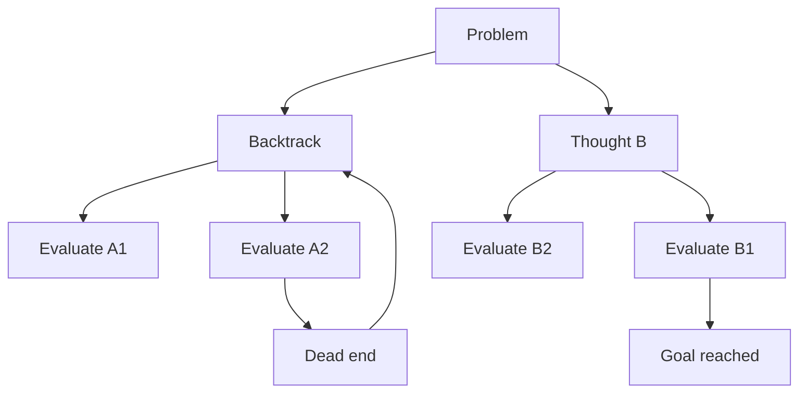

Some tasks cannot be answered reliably in one jump. Arithmetic, logic, and planning all require state to survive across several decisions. Reasoning techniques give the model or its surrounding system more room to construct, compare, and check those decisions.

The methods form a cost ladder. Chain-of-Thought elicits one path. Self-Consistency samples several paths and aggregates their answers. Tree of Thoughts adds an explicit search procedure with branching and backtracking. None guarantees correct reasoning, and a convincing trace is still only model output.

# Chain-of-Thought Prompting

Wei et al. (2022) showed that worked reasoning examples can improve performance on sufficiently large models. Two forms became common:

1. Few-shot CoT: include worked examples that show a reasoning process and final-answer format.
2. Zero-shot CoT: append an instruction such as "Let's think step by step" (Kojima et al. 2022).

An external scratchpad can turn one difficult generation into a sequence of smaller continuations. That often helps on benchmark problems with explicit intermediate state. It also creates more tokens in which an early mistake can spread, so the trace needs verification rather than trust.

Example (same task, with and without CoT):

```text
Question: I buy 10 apples, give away 4, buy 5 more, then eat 1. How many remain?

Direct answer (no CoT): 11  (incorrect)

CoT-style answer:
Start with 10.
Give away 4 -> 6.
Buy 5 -> 11.
Eat 1 -> 10.
Final answer: 10  (correct)
```

Visible reasoning also has a product boundary. Some model APIs return concise answers or summaries rather than hidden internal reasoning, and exposing a long scratchpad is rarely the right user interface. Production systems usually need verifiable intermediate results, tool outputs, or a concise rationale.

# Self-Consistency

Self-Consistency (Wang et al. 2022) samples several reasoning paths instead of accepting one greedy path. The system groups equivalent final answers and selects the most frequent one.

The method helps when independent samples fail differently and the final answer can be compared mechanically. It is much weaker for open-ended outputs where two correct answers may not match and a majority can repeat the same misconception.

```text
Question: When I was 6, my sister was half my age. Now I'm 70. How old is she?

Sampled path 1 -> 67
Sampled path 2 -> 67
Sampled path 3 -> 35

Majority vote -> 67 (correct)
```

Cost and token use grow roughly with the sample count. Calls can run in parallel to reduce wall-clock latency, but they still consume capacity, and the aggregation rule becomes another part of the system to test.

# Tree of Thoughts

Tree of Thoughts (ToT), proposed by Yao et al. (2023), wraps the model in a search algorithm. The model proposes candidate states and may help score them. Breadth-first, depth-first, or beam-like search decides which branches continue. Dead ends can be abandoned instead of becoming the rest of one irreversible completion.


```mermaid
flowchart TD
    S[Problem] --> A[Thought A]
    S --> B[Thought B]
    A --> A1[Evaluate A1]
    A --> A2[Evaluate A2]
    B --> B1[Evaluate B1]
    B --> B2[Evaluate B2]
    A2 --> X[Dead end]
    X --> A[Backtrack]
    B1 --> G[Goal reached]
```

ToT fits problems with meaningful alternatives, delayed consequences, and a state that can be evaluated along the way. Straightforward extraction has no useful search tree. Ordinary arithmetic is usually cheaper to send to a calculator.

# Tradeoffs

| Technique | Calls | Accuracy profile | Best use case | Main downside |
| --- | --- | --- | --- | --- |
| Chain-of-Thought | 1 | Strong baseline for many reasoning tasks | Arithmetic, logic, structured step-by-step tasks | Can lock into one bad chain |
| Self-Consistency | N | Better than single CoT on many verifiable tasks | Tasks with a clear final answer suitable for voting | Higher cost and latency |
| Tree of Thoughts | Many (branching) | Can improve tasks with a useful search state | Problems needing exploration, lookahead, backtracking | Most expensive and operationally complex |

Use the cheapest method that clears the evaluation target:

1. Start with one direct call and an answer format that can be checked.
2. Add CoT-style decomposition when the task genuinely has intermediate state.
3. Use self-consistency when final answers can be normalized and voted on.
4. Use ToT only when the problem contains an actual search space.

# Questions

> [!QUESTION]- When does Chain-of-Thought help, and when can it make a result worse?
> Chain-of-Thought can help when a task has intermediate state that can be expressed as a sequence of smaller decisions. It adds little to simple retrieval or extraction, where the extra tokens mainly create more room for drift. A wrong assumption near the start can shape the rest of the trace, and a fluent explanation still does not prove the answer is correct. The technique earns its cost when the intermediate steps improve measured results or expose something that can be checked independently.

> [!QUESTION]- When does Tree of Thoughts justify its cost over Chain-of-Thought or self-consistency?
> Tree of Thoughts fits a real search problem where candidate states can be generated, evaluated, revisited, and abandoned when they lead to a dead end. Planning and combinatorial search can have that shape; extraction usually does not. Its cost grows with the branching factor and depth, and a weak evaluator can keep the wrong branches. If a direct call or deterministic tool already meets the evaluation target, the tree adds work without improving the result.

# References

- [Chain-of-Thought Prompting Elicits Reasoning in Large Language Models (Wei et al., 2022)](https://arxiv.org/abs/2201.11903)
- [Large Language Models are Zero-Shot Reasoners (Kojima et al., 2022)](https://arxiv.org/abs/2205.11916)
- [Self-Consistency Improves Chain of Thought Reasoning in Language Models (Wang et al., 2022)](https://arxiv.org/abs/2203.11171)
- [Tree of Thoughts: Deliberate Problem Solving with Large Language Models (Yao et al., 2023)](https://arxiv.org/abs/2305.10601)
