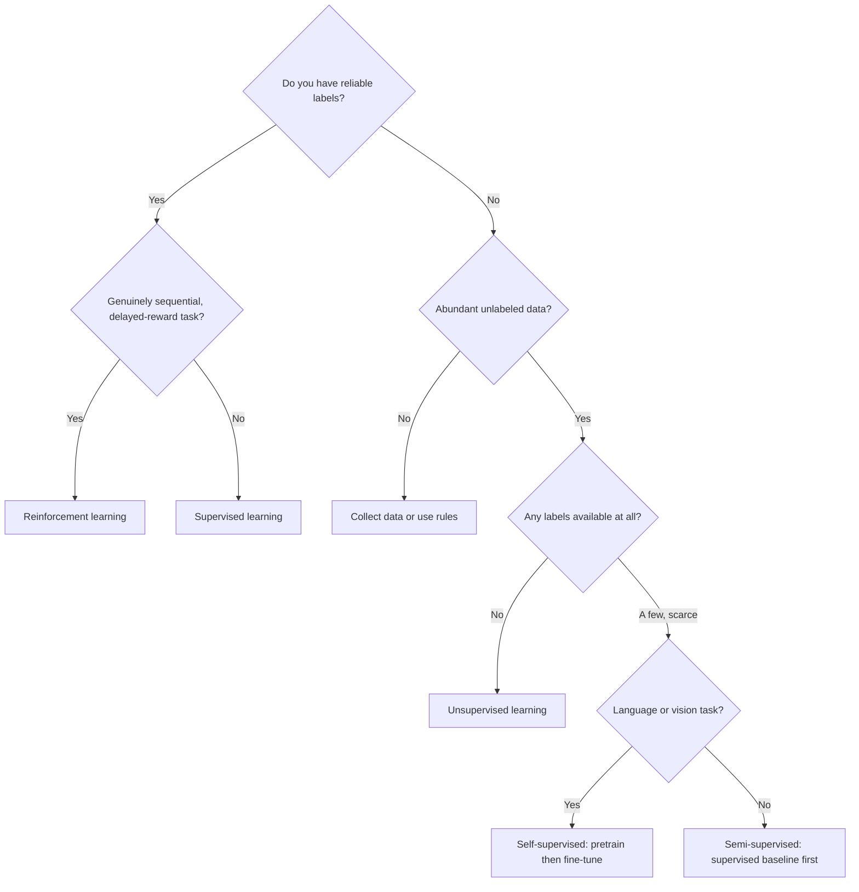

Machine learning types describe how a model learns from data and feedback. Choosing the wrong type is expensive: it changes your data requirements, training loop, evaluation criteria, and operational complexity from day one. The decision is driven by what signal you have, not by what architecture is fashionable.

<nav style="--card-accent: 16, 185, 129;" class="folder-structure-map" aria-label="Types section map">
<article class="db-card folder-map-node folder-map-node-empty">
No notes in this section yet.
</article>
</nav>

# Supervised Learning

Train on labeled input-output pairs and optimize prediction quality directly against known targets.

**Mechanism**: At each step, the model predicts an output, computes loss against the ground-truth label, and updates parameters via backpropagation. Training continues until validation loss plateaus or a business metric threshold is met.

**Concrete example**: Label 50k support tickets with owning team (`Billing`, `Security`, `Platform`). Train a text classifier. Route new tickets automatically with human override for low-confidence cases. Measure precision/recall per team.

**Data requirements**: Labeled examples for every class or target range. Quality matters more than quantity — 10k clean labels outperform 100k noisy ones.

**Key limitations**: Label cost scales with problem complexity. Distribution shift between training and production degrades performance silently. Global metrics (AUC, accuracy) can hide failures on high-value slices.

**When to use**: Any time you have reliable labels and an explicit prediction target. Default choice for classification, regression, and ranking.

# Unsupervised Learning

Find structure in data without target labels — segmentation, anomaly detection, or compact representations.

**Mechanism**: The model optimizes an objective that captures structure in the input space: grouping similar points (k-means, DBSCAN), reconstructing inputs with fewer dimensions (PCA, autoencoders), or flagging observations that deviate from baseline (isolation forest).

**Concrete example**: A payments team clusters merchants by transaction behavior (volume, velocity, category mix) using k-means. Discovered segments reveal a hidden high-risk cohort that manual review missed. Segments guide policy review and prioritize future labeling.

**Data requirements**: No labels needed. Large unlabeled datasets work well. Feature engineering matters more than in supervised settings because there is no loss signal to guide representation learning.

**Key limitations**: No ground truth to validate against — cluster quality is subjective. Different seeds or hyperparameters can produce different results. Downstream utility must be validated separately.

**When to use**: Exploratory analysis, anomaly detection, dimensionality reduction before a supervised task, or when labeling is infeasible.

# Self-Supervised Learning

Build supervision from raw data by creating proxy prediction tasks. Pretrain on unlabeled corpora, then fine-tune on small labeled datasets.

**Mechanism**: Design a proxy objective that the model can optimize without human labels — masked token prediction (BERT), next-token prediction (GPT), contrastive image pairs (SimCLR). The learned representation transfers to downstream tasks with limited labels.

**Concrete example**: An enterprise search system pretrains embeddings on 10M internal documents using a contrastive objective (similar documents should be close in embedding space). Fine-tuned on 2k relevance-labeled query-document pairs. Retrieval quality improves 18% over a supervised-only baseline trained on the same 2k pairs.

**Data requirements**: Large unlabeled corpus for pretraining. Small labeled dataset for fine-tuning. Pretraining data quality and diversity matter — domain mismatch between pretraining and target task reduces transfer.

**Key limitations**: Pretraining is compute-intensive. Proxy objective may not capture structure relevant to the target task. Pretraining loss improving does not guarantee downstream quality improving.

**When to use**: Language, vision, and multimodal systems where labels are scarce but unlabeled data is abundant. Foundation of modern LLMs and vision transformers.

# Semi-Supervised Learning

Combine a small labeled dataset with a larger unlabeled dataset to reduce labeling cost while maintaining supervised-level performance.

**Mechanism**: Train an initial model on labeled data. Generate pseudo-labels for high-confidence unlabeled examples. Retrain on the combined set. Repeat. Variants include consistency regularization (predictions should be stable under augmentation) and graph-based label propagation.

**Concrete example**: A moderation team has 8k labeled toxic comments and 2M unlabeled comments. Initial classifier achieves 82% precision. Accept pseudo-labels with confidence >0.95 (adds 180k examples). Retrain: precision rises to 87%. Validation guards prevent minority-class recall from dropping.

**Data requirements**: Small labeled set + large unlabeled set. Pseudo-label quality depends on initial model quality — a weak initial model produces noisy pseudo-labels that compound errors.

**Key limitations**: Pseudo-labeling amplifies majority classes unless explicitly constrained. Incorrect pseudo-labels reinforce errors. Requires careful threshold tuning and class-conditional calibration.

**When to use**: When labeling is expensive but you have abundant unlabeled data and a clear target variable. Common in NLP, medical imaging, and content moderation.

# Reinforcement Learning

Train an agent to choose actions that maximize long-term reward through interaction with an environment.

**Mechanism**: At each step, the agent observes state, takes an action, receives reward, and transitions to a new state. Training optimizes expected cumulative reward (not immediate reward). Reward design and simulator quality are critical — the agent will find shortcuts if the reward function is incomplete.

**Concrete example**: A customer-support routing policy optimizes escalation decisions across multiple steps. Immediate reward: resolution probability. Long-term reward: customer satisfaction score and handling cost. The RL policy learns to delay escalation for borderline cases, reducing cost by 12% while maintaining satisfaction.

**Data requirements**: A simulator or real environment to interact with. Reward signal for each action. Large amounts of interaction data (orders of magnitude more than supervised learning for equivalent performance).

**Key limitations**: Reward design is hard — proxy rewards lead to specification gaming. Exploration is expensive and risky in production. Evaluation requires online A/B testing, not offline metrics. Debugging is difficult.

**When to use**: Sequential decision-making where outcome quality depends on multiple steps and delayed feedback. Avoid for one-step prediction problems where supervised learning works — RL adds operational risk without benefit.

# Comparison

| Type | Labeled Data | Compute Cost | Typical Applications | Key Libraries |
|------|-------------|--------------|---------------------|---------------|
| Supervised | Required (all) | Low–medium | Classification, regression, ranking | scikit-learn, XGBoost, PyTorch |
| Unsupervised | None | Low–medium | Clustering, anomaly detection, dimensionality reduction | scikit-learn, UMAP |
| Self-Supervised | Pretraining: none; Fine-tuning: small | High (pretraining) | LLMs, vision transformers, embeddings | Hugging Face, PyTorch |
| Semi-Supervised | Small labeled + large unlabeled | Medium | NLP, medical imaging, moderation | scikit-learn, PyTorch |
| Reinforcement | Reward signal only | Very high | Robotics, game AI, recommendation | Stable Baselines3, RLlib |

# Decision Rule

Start with supervised learning whenever you have reliable labels and an explicit target; it is the simplest to evaluate, debug, and operate. Drop to unsupervised when there are no labels, self-supervised when unlabeled data is abundant but labels are scarce (especially language and vision), and semi-supervised when labeling is expensive but a clear target exists. Reserve reinforcement learning for genuinely sequential, delayed-reward problems, since it adds reward design complexity, exploration risk, and operational overhead rarely justified for single-step decisions.

# References

- [Google ML Intro — What is ML?](https://developers.google.com/machine-learning/intro-to-ml/what-is-ml) — Google's canonical intro to ML types with clear definitions and examples
- [scikit-learn — Supervised learning](https://scikit-learn.org/stable/supervised_learning.html) — practical supervised learning reference with algorithms, parameters, and use-case guidance
- [Hugging Face — Self-supervised learning](https://huggingface.co/blog/self-supervised-learning) — practitioner explanation of SSL and its role in LLM and vision model pretraining
- [OpenAI Spinning Up in Deep RL](https://spinningup.openai.com/en/latest/spinningup/rl_intro.html) — canonical RL intro from practitioners; covers policy gradients, value functions, and exploration
- [Rules of ML](https://developers.google.com/machine-learning/guides/rules-of-ml) — Google's practical ML engineering guide; covers when to use ML vs simpler approaches
