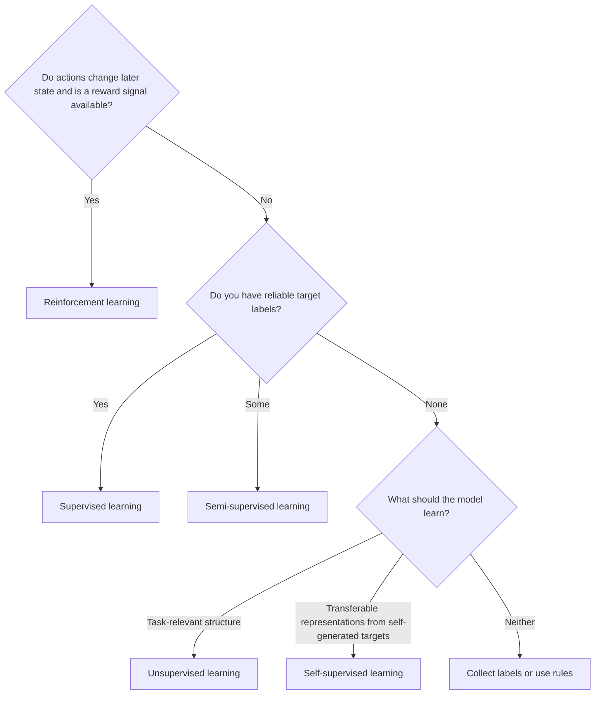

The useful way to classify machine learning is by its learning signal. Labels, proxy targets, rewards, or the absence of a target determine what the training loop can optimize and how its result can be evaluated. Model architecture comes later.

That boundary matters. A classifier trained from labeled tickets and an agent learning from delayed rewards may use similar neural-network components, but they solve different problems and fail in different ways.

<nav style="--card-accent: 16, 185, 129;" class="folder-structure-map" aria-label="Types section map">
<article class="db-card folder-map-node folder-map-node-empty">
No notes in this section yet.
</article>
</nav>

# Supervised learning

Supervised learning fits a function from inputs to known targets. A training example might pair a support ticket with its owning team, an image with a class, or a house with its sale price. The learning algorithm reduces error on those pairs. Backpropagation is one way to do that for differentiable models, while trees use different fitting procedures.

The held-out set must represent the production decisions that matter. Overall accuracy can look healthy while recall for a rare fraud class collapses. Labels can also encode old policy or annotation mistakes, and distribution shift makes yesterday's validation score a poor description of today's traffic.

This is usually the first choice for classification, regression, or ranking when the target is explicit and trustworthy. It has the cleanest evaluation story because predictions can be compared with answers the model did not see during training.

# Unsupervised learning

Unsupervised learning has inputs but no target variable. Its objective imposes a notion of structure: k-means minimizes distance to cluster centers, PCA preserves directions of high variance, and an isolation forest treats easily isolated observations as unusual.

The objective is only a proxy for usefulness. Two merchant clusters can be mathematically well separated and still mean nothing to a risk policy. Results therefore need an external check, such as whether the segments explain different behavior or improve a downstream decision. Random initialization, scaling, and feature choice can change the grouping substantially.

It fits exploratory analysis, representation reduction, and anomaly detection when labeled outcomes do not exist. But a cluster ID is not a discovered truth. It is the output of a chosen objective and feature space.

# Self-supervised learning

Self-supervised learning derives targets from the data itself. A language model predicts hidden or subsequent tokens. A vision model may learn that two transformed views came from the same image. No human annotator supplies those targets.

The usual payoff is a representation that can support several downstream tasks. It may be fine-tuned with labels, used to create embeddings, or prompted directly. Transfer is strongest when the pretraining data and proxy task expose the distinctions needed later. Lower pretraining loss alone does not prove that retrieval, classification, or generation improved.

Pretraining can consume far more data and compute than a task-specific supervised model. It earns that cost when reusable representations or scarce labels matter, especially for language and vision.

# Semi-supervised learning

Semi-supervised learning uses labeled and unlabeled examples for the same target task. A common loop trains a supervised baseline, assigns pseudo-labels to confident unlabeled examples, and retrains with the enlarged set. Consistency regularization takes another route by penalizing predictions that change under harmless input transformations.

The unlabeled pool helps only when it resembles the production distribution and the starting model is good enough to supply useful signal. Otherwise pseudo-labeling feeds early mistakes back into training. Majority classes tend to receive more confident pseudo-labels, so per-class validation and calibration matter more than the headline metric.

This approach is worth considering when labels are expensive, unlabeled data is plentiful, and a supervised baseline already establishes what success means.

# Reinforcement learning

Reinforcement learning learns a policy for choosing actions in an environment. The environment returns observations and rewards, possibly long after the action that caused them. Training seeks a policy with high expected cumulative reward rather than the best isolated prediction.

Sequential interaction and credit assignment justify RL. A routing policy, for example, may trade an immediate handling cost against the later chance of resolution. Delayed reward makes credit assignment harder, but reward can also arrive immediately. The same machinery is needless for a one-step ticket classifier with known labels.

Reward design sets the real objective. An incomplete proxy invites specification gaming, while exploration can be unsafe or expensive on a live system. Offline simulation helps, but the simulator can teach behavior that exploits its own blind spots. Production use needs stronger guardrails and evaluation than a conventional prediction service.

# How the Learning Signals Differ

| Type | Learning signal | Evaluation question | Common failure |
|---|---|---|---|
| Supervised | Human- or system-provided target | Does it predict held-out targets on important slices? | Label errors or production drift |
| Unsupervised | Structure imposed by an objective | Does the discovered structure help a real decision? | Mathematically tidy but useless groups |
| Self-supervised | Targets derived from raw data | Does the representation transfer to the downstream task? | Proxy loss improves without useful transfer |
| Semi-supervised | A few labels plus unlabeled examples | Does unlabeled data beat the supervised baseline safely? | Confirmation bias from wrong pseudo-labels |
| Reinforcement | Reward from interaction | Does the policy improve long-term return under constraints? | Reward gaming or unsafe exploration |

# Choosing the Learning Signal

```mermaid
flowchart TD
    A{Do actions change later state and is a reward signal available?} -->|Yes| D[Reinforcement learning]
    A -->|No| B{Do you have reliable target labels?}
    B -->|Yes| E[Supervised learning]
    B -->|Some| C[Semi-supervised learning]
    B -->|None| G{What should the model learn?}
    G -->|Task-relevant structure| H[Unsupervised learning]
    G -->|Transferable representations from self-generated targets| I[Self-supervised learning]
    G -->|Neither| F[Collect labels or use rules]
```

Reliable labels and a clear target point to supervised learning. With no labels, the choice depends on the desired output: unsupervised methods look for task-relevant structure, while self-supervised methods learn reusable representations from proxy targets. A small labeled set can anchor a semi-supervised approach.

Reinforcement learning is the narrow branch. It needs an environment or simulator, actions that change later state, and a reward signal for their consequences; per-example target labels are not its defining input. If the problem can be reduced to independent labeled examples, a supervised formulation is easier to test and operate.

# Questions

> [!QUESTION]- What learning signal distinguishes supervised, self-supervised, and reinforcement learning even when all three use a neural network?
> Supervised learning receives an external target for each example. Self-supervised learning derives a proxy target from the input itself, such as a hidden or next token. Reinforcement learning receives rewards from actions in an environment and optimizes return across a trajectory. The architecture does not determine which learning problem is being solved.

# References

- [Google ML Intro — What is ML?](https://developers.google.com/machine-learning/intro-to-ml/what-is-ml)
- [scikit-learn — Supervised learning](https://scikit-learn.org/stable/supervised_learning.html)
- [OpenAI Spinning Up in Deep RL](https://spinningup.openai.com/en/latest/spinningup/rl_intro.html)
