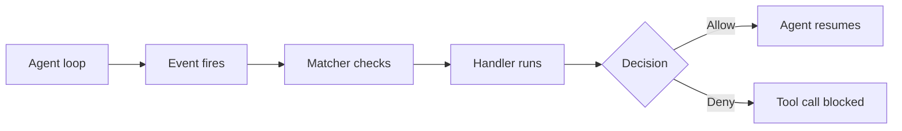

In coding agents, hooks are lifecycle callbacks that run custom logic at defined execution points without modifying the agent core. They are the control layer for guardrails, formatting, compliance, and operational automation. Mechanically, the agent reaches a trigger point, pauses the main loop, passes event context as structured JSON to one or more registered handlers, and uses the handler result to continue, modify, or abort the operation. This is the same interceptor pattern as Git hooks and CI pipeline steps, adapted to the agent loop where the unit of work is a tool call rather than a commit.



For reusable instruction bundles that shape agent behavior, see [[Skills]]. For MCP tool extensions, see [[Plugins]].

# How Hooks Work

The hook system has three layers: **events** define when hooks fire, **matchers** filter which firings are relevant, and **handlers** execute the logic.

**Events** are lifecycle moments grouped by purpose:

| Category | Examples | Purpose |
| --- | --- | --- |
| Tool events | PreToolUse, PostToolUse, PostToolUseFailure | Guardrails and quality gates on tool calls |
| Session events | SessionStart, Stop, SessionEnd | Setup, teardown, completion logic |
| Prompt events | UserPromptSubmit, PreCompact | Input validation, context management |
| Agent events | SubagentStart, SubagentStop | Orchestration and monitoring |
| Operational events | Notification, ConfigChange, TaskCompleted | Alerts, audit, workflow integration |

**Matchers** are regex patterns that filter when a handler runs. For tool events, the matcher tests against the tool name — `Edit|Write` matches file-editing tools, `mcp__.*` matches any MCP tool. Some events like Stop fire unconditionally without matcher support.

**Handlers** come in four types (Claude Code, the most comprehensive implementation):

- **Command**: shell script receives JSON on stdin, returns exit code and optional JSON on stdout. Most common type.
- **HTTP**: POST to an endpoint with the same JSON contract. Good for external service integration.
- **Prompt**: single-turn LLM evaluation for nuanced decisions that scripts cannot express as rules.
- **Agent**: spawns a subagent with tool access to verify conditions before returning a decision.

**Exit code semantics** for command hooks on block-capable events like PreToolUse: `0` allows execution, `2` denies and blocks the tool call, other non-zero codes signal an error. Post-execution events like PostToolUse cannot retroactively undo completed actions.

# Hooks Across Tools

**Claude Code** has the most mature hook implementation: 17 event types, 4 handler types, regex matchers, async execution, and configuration at user, project, managed-policy, plugin, and skill scope. JSON config lives in settings.json files at each scope level.

**Cursor** introduced hooks in v1.7 (October 2025) with a similar event model: `beforeShellExecution`, `afterFileEdit`, `beforeMCPExecution`, `sessionStart`, `sessionEnd`, `stop`, and others. Command-only handlers. Config lives in `.cursor/hooks.json` at project or global scope.

**Other agents** (Windsurf, Cline, Aider) have no formal lifecycle hooks yet. These tools use rules, auto-approve settings, or git hooks as their enforcement boundary.

**Git hooks** are the foundational model. `pre-commit` and `commit-msg` enforce standards before history is written; `post-commit` and server-side hooks support notifications and policy checks. Agents without native hooks typically fall back to git hooks for quality gates.

# Concrete Example

A two-stage Claude Code policy: block edits to protected files up front, then auto-format accepted writes immediately after execution.

```json
{
  "hooks": {
    "PreToolUse": [
      {
        "matcher": "Edit|Write",
        "hooks": [
          {
            "type": "command",
            "command": "jq -r '.tool_input.file_path' | xargs -I{} check-protected-files.sh \"{}\""
          }
        ]
      }
    ],
    "PostToolUse": [
      {
        "matcher": "Edit|Write",
        "hooks": [
          {
            "type": "command",
            "command": "jq -r '.tool_input.file_path' | xargs -I{} npx prettier --write \"{}\""
          }
        ]
      }
    ]
  }
}
```

Cursor uses a similar structure in `.cursor/hooks.json` with event names like `afterFileEdit` instead of `PostToolUse`.

# Pitfalls

## Slow Hooks Stall the Agent Loop

- **What goes wrong**: heavyweight commands (full test suites, whole-repo lint) run synchronously on every tool call, inflating loop latency.
- **Why it happens**: hooks are blocking by default and developers add broad checks without scoping them to changed files.
- **How to avoid it**: scope checks to changed files only, use matchers to limit which tools trigger which hooks, and mark non-critical hooks as async where the runtime supports it.

## Silent Failures Pass Violations Through

- **What goes wrong**: the hook script exits 0 even when it should have blocked, or writes errors to stderr that the agent runtime ignores.
- **Why it happens**: scripts swallow non-zero exit codes in pipelines, or error handling defaults to continue instead of fail closed.
- **How to avoid it**: test hooks against known-bad inputs, ensure the error path explicitly returns exit code 2, and mirror critical hook logic in CI as a safety net.

## Post-Hooks Race with Agent Edits

- **What goes wrong**: a PostToolUse formatter rewrites a file the agent is about to read or edit again in the next loop iteration, creating conflicting diffs or stale reads.
- **Why it happens**: the agent does not re-read files after post-hooks run, or the formatter changes semantics beyond whitespace.
- **How to avoid it**: limit post-hooks to deterministic formatters (Prettier, Black) that produce semantically equivalent output, and verify the agent re-reads modified files after hook execution.

# Tradeoffs

| Choice | Option A | Option B | Decision criteria |
| --- | --- | --- | --- |
| Validation posture | Strict blocking via PreToolUse deny | Advisory logging via PostToolUse warn | Strict catches violations before damage but adds latency and can false-positive block valid operations. Start strict for destructive operations; use advisory for style and formatting. |
| Hook scope | Broad checks on every tool call | Targeted checks scoped by matcher | Broad gives complete coverage but makes the agent slow and brittle. Default to targeted; broaden only when you find gaps in coverage. |
| Handler type | Command via shell script | Prompt or Agent via LLM evaluation | Commands are fast, deterministic, and debuggable. LLM handlers evaluate nuance but add inference latency and non-determinism. Use commands for clear policy rules; use LLM hooks for subjective judgment calls on high-stakes decisions. |

# Questions

> [!QUESTION]- Why should destructive-operation controls live in PreToolUse rather than PostToolUse?
>
> - PreToolUse is the last decision point before side effects execute.
> - PostToolUse runs after execution and cannot reliably undo external side effects like file writes, shell commands, or API calls.
> - Preventive controls produce cleaner failure modes than post-hoc remediation.
> - The complementary pattern: deny in pre-hooks, then lint, format, and log in post-hooks.
> - This adds latency to every in-scope tool call, so reserve pre-hook gating for operations where an unblocked violation costs more than the delay.

> [!QUESTION]- How do you design hook pipelines that improve quality without making the agent unusably slow?
>
> - Gate only high-risk actions synchronously — destructive shell commands, writes to protected paths.
> - Keep post-hooks deterministic and incremental — format changed files, not the whole repo.
> - Move expensive validation (full test suites, security scans) to commit and CI boundaries or async hook paths.
> - Track hook execution time and failure rate; split or prune hooks that dominate loop latency.
> - More hooks buy more safety but more friction; the win is narrow matching plus the cheapest check that still catches the violation.

> [!QUESTION]- When should you use an LLM-based hook instead of a deterministic script?
>
> - Use deterministic scripts when the policy can be expressed as a clear rule — regex match, file path check, exit code.
> - Use LLM-based hooks when the decision requires judgment that rules cannot capture, such as whether a code change introduces a security risk.
> - LLM hooks add 1-5 seconds of inference latency and introduce non-determinism where the same input may produce different decisions.
> - Reserve LLM hooks for high-stakes, ambiguous decisions where a false negative is expensive.
> - Deterministic hooks are fast and predictable but rigid; LLM hooks handle nuance at the cost of latency and non-determinism, so spend them only where a missed violation outweighs occasional false positives.

# References

- [Hooks reference -- full event schema, configuration, JSON I/O, exit codes, async and HTTP hooks (Claude Code Docs)](https://docs.anthropic.com/en/docs/claude-code/hooks) -- comprehensive reference for the most mature hook implementation.
- [Automate workflows with hooks -- quickstart guide with practical examples (Claude Code Docs)](https://docs.anthropic.com/en/docs/claude-code/hooks-guide) -- step-by-step guide for common hook patterns.
- [Cursor 1.7 adds hooks for agent lifecycle control -- overview and early adoption patterns (InfoQ, 2025)](https://www.infoq.com/news/2025/10/cursor-hooks/) -- industry coverage of Cursor's hook implementation and community reception.
- [How to use Cursor 1.7 hooks -- practical setup and configuration guide (skywork.ai, 2025)](https://skywork.ai/blog/how-to-cursor-1-7-hooks-guide/) -- hands-on Cursor hook configuration with real examples.
- [Git hooks -- official reference for the foundational lifecycle hook model (git-scm)](https://git-scm.com/docs/githooks) -- the original hook pattern that agent hooks extend.
- [Building effective agents -- architecture patterns including tool use and control flow (Anthropic Engineering)](https://www.anthropic.com/engineering/building-effective-agents) -- broader context on agent architecture where hooks fit as the control layer.
- [Cursor rules, commands, skills, and hooks -- complete guide to agent customization features (Theodoros Kokosioulis, 2026)](https://theodoroskokosioulis.com/blog/cursor-rules-commands-skills-hooks-guide/) -- practitioner guide comparing hooks with rules, commands, and skills in Cursor.
