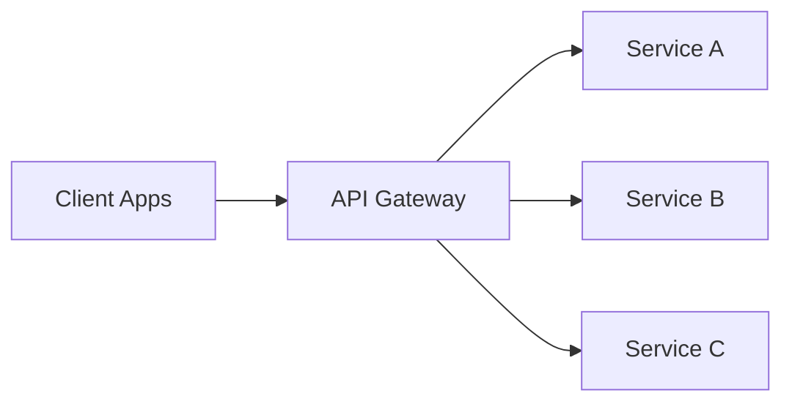

# Intro

An API Gateway is a single entry point between external clients and a set of backend services. It centralizes cross-cutting concerns such as request routing, authentication and authorization enforcement, rate limiting, TLS termination, and traffic policies so individual services do not have to re-implement them. This matters because it gives you one place to enforce consistency and security while keeping clients simpler, especially when each client would otherwise need to call many services directly. You reach for it when you have microservices with multiple consumer types, or when you want a BFF approach where each client family gets an API surface tailored to its needs.

In .NET ecosystems, a common implementation is to run a reverse proxy gateway at the system edge and keep service-level business behavior inside domain services.

## Core Responsibilities



- **Request routing**: Map incoming paths, headers, hostnames, or methods to the right downstream service.
- **Authentication and authorization**: Validate tokens at the edge and enforce coarse-grained access policy before forwarding.
- **Rate limiting and quotas**: Protect services from abusive or accidental traffic spikes.
- **Request and response transformation**: Normalize payload shape, hide internal endpoint changes, or project data for specific clients.
- **[[Load Balancing]]**: Distribute requests across service instances using health-aware selection.
- **[[Circuit Breaker|Circuit breaking]] and resiliency policies**: Fail fast when a downstream is unhealthy and apply retries or fallback only where safe.
- **TLS termination**: Offload certificate handling and HTTPS policy enforcement from every backend service.
- **[[Observability]]**: Emit centralized logs, traces, metrics, and correlation IDs for end-to-end troubleshooting.

## Patterns

### Gateway Routing

Use the gateway as the policy and routing edge. Clients call one host, and route rules dispatch traffic to internal services.

When it works best:

- Many services are private on internal networks.
- You need consistent auth and throttling policy.
- You want controlled API evolution at the boundary.

### Gateway Aggregation

The gateway composes a single response from multiple service calls to reduce client round trips.

Concrete example:

- Mobile app needs order summary page.
- Gateway calls `Orders`, `Payments`, and `Shipping` services.
- Gateway returns one payload tuned for the mobile screen.

Use carefully: aggregation is orchestration logic, not domain logic. Keep it thin and response-oriented.

### Gateway Offloading

The gateway handles edge concerns such as TLS, compression, CORS, header normalization, and request size limits.

Benefit:

- Service teams focus on domain behavior.
- Security and policy changes roll out in one place.

### BFF (Backend for Frontend)

Separate gateways or gateway routes per client type (web, mobile, partner API) when each has different payload, latency, or auth requirements.

Why this is useful:

- Web clients might need richer payloads.
- Mobile clients might need smaller aggregated responses.
- Partner APIs often need stricter contract stability and separate throttling.

## .NET Implementation (YARP)

For .NET, YARP (Yet Another Reverse Proxy) is a Microsoft-maintained reverse proxy library (`Yarp.ReverseProxy`) that you can use as the core of an API gateway.

Minimal `appsettings.json` routing and cluster example:

```json
{
  "ReverseProxy": {
    "Routes": {
      "orders-route": {
        "ClusterId": "orders-cluster",
        "Match": {
          "Path": "/api/orders/{**catch-all}"
        }
      },
      "catalog-route": {
        "ClusterId": "catalog-cluster",
        "Match": {
          "Path": "/api/catalog/{**catch-all}"
        }
      }
    },
    "Clusters": {
      "orders-cluster": {
        "Destinations": {
          "orders-d1": {
            "Address": "https://orders-service.internal/"
          }
        }
      },
      "catalog-cluster": {
        "Destinations": {
          "catalog-d1": {
            "Address": "https://catalog-service.internal/"
          }
        }
      }
    }
  }
}
```

Minimal registration in ASP.NET Core:

```csharp
var builder = WebApplication.CreateBuilder(args);

builder.Services
    .AddReverseProxy()
    .LoadFromConfig(builder.Configuration.GetSection("ReverseProxy"));

var app = builder.Build();

app.MapReverseProxy();

app.Run();
```

YARP composes well with ASP.NET Core middleware and observability tooling. Ocelot is a known alternative and can be a pragmatic fit in teams already invested in its ecosystem.

## Gateway vs Service Mesh

API Gateway and Service Mesh solve different traffic planes and are often used together.

- **Gateway (north-south)**: Handles client-to-system traffic, public API exposure, edge auth, and external policy enforcement.
- **Service mesh (east-west)**: Handles service-to-service traffic inside the platform, including mTLS, retries, traffic shifting, and per-service telemetry.

Rule of thumb:

- Put internet-facing boundary policy in the gateway.
- Put internal service communication policy in the mesh.

## Tradeoffs

- **Direct client to services vs gateway**: Direct calls reduce one network hop but increase client complexity and duplicate policy enforcement.
- **Single gateway vs BFF gateways**: Single gateway is simpler to operate; BFF improves client optimization and team autonomy at the cost of more moving parts.
- **Centralized transformation vs service-owned contracts**: Gateway transformations can shield clients from churn, but too much translation can hide unhealthy service boundaries.

## Pitfalls

1. **Gateway becomes a monolith bottleneck**
   - What goes wrong: every change flows through one oversized gateway, and outages impact all consumers.
   - Why it happens: uncontrolled feature growth and weak horizontal scaling strategy.
   - How to prevent/detect: keep gateway stateless, scale out aggressively, split by bounded context or BFF when ownership and traffic diverge.

2. **Business logic creeps into the gateway**
   - What goes wrong: domain rules are duplicated at the edge, causing inconsistent behavior and hard-to-test flows.
   - Why it happens: aggregation code gradually turns into orchestration and then decision logic.
   - How to prevent/detect: enforce a boundary rule that gateway owns transport and policy only; domain invariants stay in services.

3. **Extra latency from the additional hop**
   - What goes wrong: p95 and p99 latency increase, especially under fan-out aggregation.
   - Why it happens: more network hops, serialization work, and downstream dependency chains.
   - How to prevent/detect: measure end-to-end traces, cap fan-out depth, use parallel downstream calls, and cache only where freshness allows.

4. **Configuration sprawl with many routes**
   - What goes wrong: route conflicts, accidental exposure, and hard-to-review config changes.
   - Why it happens: rapid service growth without governance for route naming and ownership.
   - How to prevent/detect: define route conventions, enforce config validation in CI, and assign clear ownership per route group.

## Questions

> [!QUESTION]- How do you design gateway aggregation endpoints for client efficiency, and what do you keep out of the gateway?
> Use gateway routing for normal traffic and add a few targeted aggregation endpoints where a client — usually mobile — would otherwise make five round trips for one screen. The gateway composes those reads and tunes the payload, but it stays thin: auth, throttling, routing, transformation, observability, and nothing else. Business rules, transactions, and domain invariants live in the backend services, with correlation IDs flowing across the fan-out so you can trace a slow screen. The line to hold: aggregation is response-shaping, not orchestration — the moment decision logic creeps in, you have a distributed monolith.

> [!QUESTION]- When would you choose a single API gateway versus a BFF approach?
> A single gateway is simpler to run and the right default when clients have similar needs and ship on a shared cadence. Reach for BFF — a gateway or route set per client type — when web, mobile, and partner clients want materially different payloads, auth, or latency profiles, or when separate teams own them and want deployment autonomy. The catch is operational: every extra gateway is one more thing to deploy, monitor, and secure. Start with one and split to BFF only when client divergence or team boundaries actually justify the cost.

> [!QUESTION]- Where do API Gateway and service mesh responsibilities belong in one architecture?
> They handle different traffic planes, so they sit side by side rather than compete. The gateway owns north-south traffic — clients entering the system — so edge auth, TLS termination, external rate limits, and API surface control belong there. The mesh owns east-west traffic between internal services: mTLS, retries, traffic shifting, and per-service telemetry. The gateway guards the front door; the mesh governs the hallways.

## References

- [API Gateway pattern (Azure Architecture Center)](https://learn.microsoft.com/azure/architecture/patterns/gateway-routing) — pattern description covering routing, aggregation, and offloading cross-cutting concerns.
- [YARP documentation](https://learn.microsoft.com/aspnet/core/fundamentals/servers/yarp/getting-started) — official getting-started guide for Microsoft's YARP reverse proxy library for .NET.
- [YARP GitHub repository](https://github.com/dotnet/yarp) — source code, samples, and issue tracker for the YARP project.
- [Ocelot documentation](https://ocelot.readthedocs.io/en/latest/) — configuration reference for the Ocelot .NET API gateway including routing, authentication, and rate limiting.
- [Microservices.io — API Gateway pattern (Chris Richardson)](https://microservices.io/patterns/apigateway.html) — pattern catalog entry covering API gateway vs BFF, forces, and consequences in microservices architectures.
