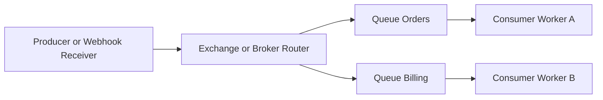

# Intro

Message queues decouple producers from consumers by buffering messages until consumers are ready. They absorb spikes, isolate failures, and keep systems working when downstream services slow. Use queues for webhook ingestion and background work.

<nav style="--map-accent: 234, 179, 8;" class="folder-structure-map" aria-label="Message Queues section map"><div class="folder-map-children"><article class="folder-map-node"><div class="folder-map-node-body"><div class="folder-map-node-heading"><span class="folder-map-node-title-group"><span class="folder-map-entry-icon" aria-hidden="true"><svg xmlns="http://www.w3.org/2000/svg" stroke-linejoin="round" stroke-linecap="round" stroke-width="2" stroke="currentColor" fill="none" viewBox="0 0 24 24"><path d="M14.5 2H6a2 2 0 0 0-2 2v16a2 2 0 0 0 2 2h12a2 2 0 0 0 2-2V7.5L14.5 2z"/><polyline points="14 2 14 8 20 8"/><line y2="13" y1="13" x2="8" x1="16"/><line y2="17" y1="17" x2="8" x1="16"/><line y2="9" y1="9" x2="8" x1="10"/></svg></span><span class="folder-map-node-title" title="Kafka">Kafka</span></span></div><p>Distributed event streaming platform built on an append-only commit log, giving durability, high throughput, and replayable per-key ordering.</p></div><span class="folder-map-hit"><a class="internal-link" href="Home/Architecture/Distributed Systems/Message Queues/Kafka.md" data-tooltip-position="top" aria-label="Kafka">Kafka</a></span></article><article class="folder-map-node"><div class="folder-map-node-body"><div class="folder-map-node-heading"><span class="folder-map-node-title-group"><span class="folder-map-entry-icon" aria-hidden="true"><svg xmlns="http://www.w3.org/2000/svg" stroke-linejoin="round" stroke-linecap="round" stroke-width="2" stroke="currentColor" fill="none" viewBox="0 0 24 24"><path d="M14.5 2H6a2 2 0 0 0-2 2v16a2 2 0 0 0 2 2h12a2 2 0 0 0 2-2V7.5L14.5 2z"/><polyline points="14 2 14 8 20 8"/><line y2="13" y1="13" x2="8" x1="16"/><line y2="17" y1="17" x2="8" x1="16"/><line y2="9" y1="9" x2="8" x1="10"/></svg></span><span class="folder-map-node-title" title="MSMQ">MSMQ</span></span></div><p>Windows-native, disk-durable message queuing for reliable asynchronous messaging in on-premise environments; now a legacy technology.</p></div><span class="folder-map-hit"><a class="internal-link" href="Home/Architecture/Distributed Systems/Message Queues/MSMQ.md" data-tooltip-position="top" aria-label="MSMQ">MSMQ</a></span></article><article class="folder-map-node"><div class="folder-map-node-body"><div class="folder-map-node-heading"><span class="folder-map-node-title-group"><span class="folder-map-entry-icon" aria-hidden="true"><svg xmlns="http://www.w3.org/2000/svg" stroke-linejoin="round" stroke-linecap="round" stroke-width="2" stroke="currentColor" fill="none" viewBox="0 0 24 24"><path d="M14.5 2H6a2 2 0 0 0-2 2v16a2 2 0 0 0 2 2h12a2 2 0 0 0 2-2V7.5L14.5 2z"/><polyline points="14 2 14 8 20 8"/><line y2="13" y1="13" x2="8" x1="16"/><line y2="17" y1="17" x2="8" x1="16"/><line y2="9" y1="9" x2="8" x1="10"/></svg></span><span class="folder-map-node-title" title="RabbitMQ">RabbitMQ</span></span></div><p>Open-source AMQP 0-9-1 broker routing messages from exchanges to queues via bindings, decoupling producers from consumers.</p></div><span class="folder-map-hit"><a class="internal-link" href="Home/Architecture/Distributed Systems/Message Queues/RabbitMQ.md" data-tooltip-position="top" aria-label="RabbitMQ">RabbitMQ</a></span></article></div><style>
.folder-structure-map {
  --map-accent: 16, 185, 129;
  --map-gap: 0.75rem;
  width: 100%;
  box-sizing: border-box;
  margin: 0.5rem 0 0.75rem;
  container-name: folder-map;
  container-type: inline-size;
}
.folder-map-children {
  /* Flex (not grid) so each card sizes to its own title — a long title widens
     its card and pushes to another row instead of being truncated, and rows
     grow to fill the width with no empty tracks when there are few cards. */
  display: flex;
  flex-wrap: wrap;
  gap: var(--map-gap);
}
.folder-map-node {
  position: relative;
  /* No overflow:hidden here: on a flex item that collapses min-width:auto to 0,
     letting the card shrink below its title + note-count and clip them. Without
     it, the card's min size is its content, so long titles widen the card (and
     wrap to another row) instead of being cut off. The accent gradient gets its
     own border-radius below to stay inside the rounded corners. */
  flex: 1 1 12rem;
  min-height: 2.75rem;
  box-sizing: border-box;
  border: 1px solid var(--background-modifier-border, var(--lightgray, #d8dee9));
  border-radius: var(--radius-m, 0.55rem);
  background-color: var(--background-primary, var(--light, #ffffff));
  box-shadow: 0 0 0 rgba(0, 0, 0, 0);
  transition: border-color 150ms ease, background-color 150ms ease, box-shadow 150ms ease, transform 150ms ease;
}
.folder-map-node::before {
  content: "";
  position: absolute;
  inset: 0;
  border-radius: inherit;
  pointer-events: none;
  background: radial-gradient(
    ellipse 150% 175% at -22% -38%,
    rgba(var(--map-accent), 0.09) 0%,
    rgba(var(--map-accent), 0.04) 38%,
    rgba(var(--map-accent), 0.014) 66%,
    transparent 90%
  );
  opacity: 0.78;
  transition: opacity 150ms ease;
}
.folder-map-node:hover,
.folder-map-node:focus-within {
  border-color: rgba(var(--map-accent), 0.55);
  background-color: color-mix(in srgb, rgb(var(--map-accent)) 2.5%, var(--background-primary, var(--light, #ffffff)));
  box-shadow: 0 0.45rem 1.1rem rgba(0, 0, 0, 0.08);
  transform: translateY(-0.125rem);
}
.folder-map-node:hover::before,
.folder-map-node:focus-within::before {
  opacity: 1;
}
.folder-map-node-body {
  position: relative;
  z-index: 0;
  display: flex;
  min-height: 2.75rem;
  box-sizing: border-box;
  flex-direction: column;
  justify-content: center;
  padding: 0.5rem 0.75rem;
}
.folder-map-node-heading {
  display: flex;
  align-items: center;
  justify-content: space-between;
  gap: 0.75rem;
}
.folder-map-node-title-group {
  display: flex;
  align-items: center;
  gap: 0.5rem;
}
.folder-map-entry-icon {
  display: flex;
  width: 1.1rem;
  height: 1.1rem;
  flex: 0 0 auto;
  color: rgb(var(--map-accent));
}
.folder-map-entry-icon svg {
  display: block;
  width: 100%;
  height: 100%;
}
.folder-map-node-title {
  display: block;
  margin: 0;
  color: var(--text-normal, var(--dark, #1f2937));
  font-size: 1rem;
  font-weight: 700;
  line-height: 1.25;
  white-space: nowrap;
}
.folder-map-node p {
  display: none;
  margin: 0.45rem 0 0;
  color: var(--text-muted, var(--darkgray, #5f6b7a));
  font-size: 0.875rem;
  line-height: 1.45;
}
.folder-map-node-count {
  display: block;
  flex: 0 0 auto;
  color: var(--text-muted, var(--darkgray, #5f6b7a));
  font-size: 0.875rem;
  white-space: nowrap;
}
.folder-map-hit {
  position: absolute;
  inset: 0;
  z-index: 1;
}
.folder-map-hit a {
  position: absolute;
  inset: 0;
  min-width: 2.75rem;
  min-height: 2.75rem;
  border-radius: var(--radius-m, 0.55rem);
  background: transparent !important;
  font-size: 0;
}
.folder-map-hit a:focus-visible {
  outline: 2px solid rgb(var(--map-accent));
  outline-offset: -0.3rem;
}
.folder-map-empty {
  margin: 1rem 0 0;
  color: var(--text-muted, var(--darkgray, #5f6b7a));
  font-size: 0.875rem;
}
@container folder-map (min-width: 40rem) {
  .folder-map-node {
    min-height: 6rem;
  }
  .folder-map-node-body {
    min-height: 6rem;
    justify-content: flex-start;
    padding: 0.85rem 0.9rem;
  }
  .folder-map-node p { display: block; }
}
@container folder-map (min-width: 64rem) {
  .folder-map-node,
  .folder-map-node-body { min-height: 6.75rem; }
}
@media (prefers-reduced-motion: reduce) {
  .folder-map-node { transition: none; }
  .folder-map-node::before { transition: none; }
  .folder-map-node:hover,
  .folder-map-node:focus-within { transform: none; }
}
</style></nav>

## Core concepts

- **Queue vs Topic**
- `Queue` (point-to-point): one message is consumed by one worker in a competing-consumer group.
- `Topic` (pub/sub): one event is consumed by multiple independent subscriber groups.
- Terminology varies: RabbitMQ uses exchanges, Kafka uses topics/partitions, and Service Bus uses subscriptions.



- **Delivery guarantees**

- `At-most-once`: possible loss, no redelivery.

- `At-least-once`: redelivery until ack or policy cutoff (DLQ/TTL), duplicates expected.

- `Effectively-once` for one side effect is usually `at-least-once + idempotency + transactional boundary`.

- End-to-end exactly-once across external systems is generally not realistic.

- **Ordering and partitioning**

- Ordering is usually per partition/queue shard, not global.

- More partitions improve throughput but weaken global order guarantees.

- If per-entity ordering matters (for example `OrderId`), route by a stable key to one partition.

- Retries/redelivery and competing consumers can reorder events.

- Kafka rebalances can cause duplicate processing when offsets were not committed; out-of-order effects usually come from multi-partition reads or concurrent handlers.

## Reliability patterns

- **DLQ for poison messages**

- Use DLQ when messages repeatedly fail and block healthy traffic.

- Broker specifics: Service Bus uses `MaxDeliveryCount`; RabbitMQ uses DLX + TTL/retry queues; Kafka has no broker DLQ and uses an app dead-letter topic.

- Operate DLQ as a first-class system: alerts, replay tooling, retention ownership.

- **Retry with backoff**

- Retry transient failures with exponential backoff + jitter.

- If the broker supports delayed delivery, prefer broker-managed delay; otherwise use retry queues/topics.

- **Idempotency keys**

- Persist a durable idempotency key (`MessageId` or business key).

- Avoid check-then-act; it races. Reserve/upsert key atomically (unique index or transactional insert), then apply side effects.

- Commit business write and idempotency completion in one database transaction; broker ack/offset commit follows after success.

- **Ack modes and offset commits**

- Auto-ack favors throughput but risks loss on mid-processing crashes.

- Manual ack after successful side effects favors correctness.

- RabbitMQ `nack`/requeue and Service Bus `Abandon` cause retry/redelivery; dead-lettering is separate.

- Kafka uses offset commits instead of ack/nack: commit after processing and rely on idempotency for duplicate safety.

- Lock or visibility expiration can also trigger redelivery, so long handlers need lock renewal/extension.

- **Backpressure**

- Limit in-flight work using prefetch/QoS.

- Track queue depth, lag, and oldest-message age to avoid memory and latency collapse.

## Concrete .NET example (Webhook -> Queue -> Worker)

Common webhook pattern: acknowledge HTTP quickly, enqueue durable work, then process asynchronously with idempotent handlers.

```csharp
public sealed class WebhookController : ControllerBase
{
    private readonly IMessagePublisher _publisher;

    public WebhookController(IMessagePublisher publisher)
    {
        _publisher = publisher;
    }

    [HttpPost("/webhooks/provider")]
    public async Task<IActionResult> Receive([FromBody] ProviderWebhook payload, CancellationToken ct)
    {
        var envelope = new WebhookEnvelope(
            messageId: payload.EventId,
            occurredAtUtc: DateTimeOffset.UtcNow,
            eventType: payload.Type,
            body: payload);

        await _publisher.PublishAsync("webhooks.incoming", envelope, ct);
        return Accepted();
    }
}

public sealed class WebhookWorker
{
    private readonly IIdempotencyStore _idempotency;
    private readonly IBusinessHandler _handler;

    public async Task HandleAsync(WebhookEnvelope message, IAckContext ack, CancellationToken ct)
    {
        await using var tx = await _handler.BeginTransactionAsync(ct);

        try
        {
            // Interfaces are conceptual; reserve inside the transaction boundary.
            var state = await _idempotency.TryReserveAsync(message.MessageId, tx, ct);
            if (state == ReservationState.Completed)
            {
                await tx.RollbackAsync(ct);
                await ack.AckAsync(ct);
                return;
            }

            if (state == ReservationState.InProgress)
            {
                await tx.RollbackAsync(ct);
                await ack.NackForRetryAsync(ct);
                return;
            }

            await _handler.ProcessAsync(message, tx, ct);
            await _idempotency.MarkCompletedAsync(message.MessageId, tx, ct);
            await tx.CommitAsync(ct);
            await ack.AckAsync(ct);
        }
        catch
        {
            await tx.RollbackAsync(ct);
            await ack.NackForRetryAsync(ct);
            return;
        }
    }
}
```

## .NET platform choices

Use [[RabbitMQ]] for routing-heavy queues and latency-sensitive tasks. Use [[Kafka]] for replayable event streams. Use Azure Service Bus for managed messaging with queues/topics and dead-lettering.

| Option | Strengths | Tradeoffs | Typical .NET fit |
|---|---|---|---|
| RabbitMQ | Rich routing, easy work queues, low latency | Cluster ops are your responsibility unless managed | Background jobs, webhook pipelines, command dispatch |
| Kafka | High throughput, durable log, strong replay | Partition model and ops complexity | Event streaming, analytics, event sourcing feeds |
| Azure Service Bus | Fully managed with enterprise messaging features | Cost and platform coupling | Azure-native workflows and integration |

- `IDistributedCache` is not a queue.
- Cache stores key-value state; queues store ordered work items/events with ack/retry semantics.

## Pitfalls

- **1) Ordering assumptions across partitions**

- What goes wrong: teams assume global ordering and break business invariants.

- Why: most brokers guarantee order per partition, and retries/prefetch/competing consumers can still reorder work.

- Mitigation: partition by entity key, limit concurrency per key, and make handlers reorder-tolerant.

- **2) Poison messages without DLQ**

- What goes wrong: one bad message retries forever and starves healthy traffic.

- Why: missing dead-letter policy.

- Mitigation: bounded retries plus DLQ routing and alerts.

- **3) At-least-once without idempotency**

- What goes wrong: duplicate charges, emails, or external calls.

- Why: redelivery is expected but handler side effects are not deduplicated.

- Mitigation: durable idempotency keys with atomic reservation.

- **4) Silent queue growth**

- What goes wrong: backlog grows until OOM or latency SLO failure.

- Why: weak observability and missing backpressure/autoscaling.

- Mitigation: alert on depth, oldest-message age, lag, and in-flight count.

## Questions

- **1) In at-least-once processing, how do you prevent loss and duplicate side effects when a consumer crashes?**

- Expected answer:
  - Use manual ack only after successful business commit.
  - If crash happens before ack, rely on broker redelivery.
  - Use atomic idempotency reservation (unique key or transactional insert).
  - Bound retries and route persistent failures to DLQ.

- **2) When do you choose Kafka over RabbitMQ for a .NET service?**

- Expected answer:
  - Choose Kafka for replayable event streams with high throughput.
  - Choose RabbitMQ for low-latency work queues and routing-key patterns.
  - Consider ordering constraints per partition/queue key.
  - Compare operational complexity and team experience.

- **3) Which metrics should page you first in queue-driven systems?**

- Expected answer:
  - Queue depth and age of oldest message.
  - Consumer lag or unacked in-flight count.
  - DLQ rate and retry rate.
  - End-to-end processing latency and failure ratio.

## References

- [RabbitMQ Documentation](https://www.rabbitmq.com/docs)
- [Apache Kafka Documentation](https://kafka.apache.org/documentation/)
- [Microsoft - Queue-based load leveling](https://learn.microsoft.com/azure/architecture/patterns/queue-based-load-leveling)
- [Microsoft - Service Bus dead-letter queues](https://learn.microsoft.com/azure/service-bus-messaging/service-bus-dead-letter-queues)
- [Microsoft - Service Bus locks and settlement](https://learn.microsoft.com/azure/service-bus-messaging/message-transfers-locks-settlement)
- [RabbitMQ Documentation - Dead Letter Exchanges](https://www.rabbitmq.com/docs/dlx)
- [RabbitMQ Documentation - Time-to-Live and Expiration](https://www.rabbitmq.com/docs/ttl)
- [Martin Kleppmann - Should You Put Several Event Types in the Same Kafka Topic?](https://martin.kleppmann.com/2018/01/18/event-types-in-kafka-topic.html)
