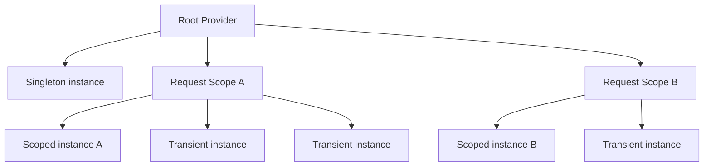

# Intro

Dependency Injection (DI) is a design pattern where objects receive dependencies from an external source instead of creating them internally, which is a practical form of Inversion of Control (IoC). It matters because it improves testability, keeps components loosely coupled, and makes systems composable as they grow. In modern .NET, DI is not optional architecture flavor: ASP.NET Core uses the built-in container as the default composition root for wiring the application.

## How It Works

The container lifecycle is three steps: register, resolve, dispose.

### 1) Registration (`builder.Services.Add*`)

You describe what the container can build and the service lifetime.

```csharp
var builder = WebApplication.CreateBuilder(args);

// Registration
builder.Services.AddScoped<IOrderRepository, SqlOrderRepository>();
builder.Services.AddSingleton<IClock, SystemClock>();
builder.Services.AddTransient<IEmailSender, SmtpEmailSender>();
```

The container stores service descriptors (service type, implementation, lifetime). Most services are not instantiated at registration time.

### 2) Resolution (constructor injection, `[FromServices]`, `IServiceProvider`)

At runtime, the container builds an object graph and injects dependencies.

```csharp
public class OrderService(IOrderRepository repo, IClock clock)
{
    public async Task<Order> PlaceOrder(CreateOrderDto dto)
    {
        var order = new Order(dto.CustomerId, clock.UtcNow);
        await repo.SaveAsync(order);
        return order;
    }
}
```

```csharp
app.MapGet("/time", ([FromServices] IClock clock) => Results.Ok(clock.UtcNow));
```

Constructor injection is the default for business logic because dependencies stay explicit. `IServiceProvider` is acceptable in factories/middleware/scope-bound infrastructure code, but not as a default style for domain/application services.

### 3) Disposal

The container manages `IDisposable` and `IAsyncDisposable` based on lifetime boundaries:

- `Transient`: disposed when the owning scope is disposed (if container-created)
- `Scoped`: disposed when the scope ends (request end in ASP.NET Core)
- `Singleton`: disposed when host/root provider shuts down

This is why manually disposing injected services in controllers/services is usually wrong.

## Service Lifetimes (Mechanics + Usage)

### Transient

`AddTransient<TService, TImpl>()`: new instance every resolution.

Use for:

- Lightweight stateless services
- Pure mappers/formatters/strategies without cross-request state

Mechanism details:

- Every resolve call gets a fresh instance.
- If a singleton captures a transient field during construction, that instance effectively behaves like singleton state for that singleton instance.

### Scoped

`AddScoped<TService, TImpl>()`: one instance per scope.

Use for:

- `DbContext`
- Unit-of-work/request-consistent operations

Mechanism details:

- ASP.NET Core creates one scope per HTTP request.
- All scoped resolutions in the same request share the same object.
- Background services have no automatic request scope; create one explicitly.

### Singleton

`AddSingleton<TService, TImpl>()`: one instance for app lifetime.

Use for:

- Thread-safe caches
- Configuration/time abstractions
- `IHttpClientFactory` (factory is singleton)

Mechanism details:

- Lives in root provider, shared across requests.
- Must be thread-safe.
- Must not hold scoped dependencies.

## Lifetime Scope Diagram



Singleton is rooted once, scoped is request-local, transient is created fresh each resolution.

## Captive Dependency (Critical Pitfall)

Captive dependency happens when a long-lived service (usually singleton) captures a shorter-lived service (usually scoped).

Why it is dangerous:

- Scoped state leaks outside intended request boundaries
- Stale data and incorrect cross-request behavior
- EF Core lifetime rules get broken
- Disposal timing becomes invalid and can cause connection/resource leakage

In ASP.NET Core Development, this usually surfaces as `InvalidOperationException` when scope validation is enabled (`ValidateScopes`).

### Anti-pattern: singleton directly depends on scoped service

```csharp
public sealed class CacheWarmupService(AppDbContext db) : IHostedService
{
    public async Task StartAsync(CancellationToken cancellationToken)
    {
        // BAD: hosted service is singleton, AppDbContext is scoped
        var count = await db.Orders.CountAsync(cancellationToken);
    }

    public Task StopAsync(CancellationToken cancellationToken) => Task.CompletedTask;
}
```

### Fix: inject `IServiceScopeFactory` and resolve scoped inside explicit scope

```csharp
public sealed class CacheWarmupService(IServiceScopeFactory scopeFactory) : IHostedService
{
    public async Task StartAsync(CancellationToken cancellationToken)
    {
        await using var scope = scopeFactory.CreateAsyncScope();
        var db = scope.ServiceProvider.GetRequiredService<AppDbContext>();
        var count = await db.Orders.CountAsync(cancellationToken);
    }

    public Task StopAsync(CancellationToken cancellationToken) => Task.CompletedTask;
}
```

## Service Locator Anti-pattern

Service Locator means pulling dependencies from `IServiceProvider` inside business logic (`GetService<T>()` / `GetRequiredService<T>()`) instead of declaring constructor dependencies.

Why it is a problem:

- Hides true dependencies
- Moves failures from compile-time shape to runtime resolution
- Makes tests harder because setup must mimic container behavior

```csharp
public sealed class CheckoutService(IServiceProvider provider)
{
    public async Task ProcessAsync()
    {
        var repo = provider.GetRequiredService<IOrderRepository>();
        var sender = provider.GetRequiredService<IEmailSender>();
        await repo.SaveChangesAsync();
        await sender.SendAsync("done");
    }
}
```

Prefer explicit constructor dependencies in application/business services.

When acceptable:

- Factory patterns choosing implementation at runtime
- Middleware/infrastructure activation code
- Explicit scope management in background jobs

## Keyed Services (.NET 8+)

Keyed services support multiple implementations for one abstraction with explicit keys.

```csharp
builder.Services.AddKeyedScoped<ICache, RedisCache>("redis");
builder.Services.AddKeyedScoped<ICache, MemoryCacheAdapter>("memory");

app.MapGet("/cache/ping", ([FromKeyedServices("redis")] ICache cache) =>
{
    return Results.Ok(new { cache = cache.GetType().Name, status = "ok" });
});
```

Use this when selection is explicit and stable; avoid turning keys into hidden runtime condition trees in core domain code.

## Pitfalls

### 1) Captive dependency

- What goes wrong: singleton holds scoped dependency.
- Why: lifetime mismatch (long-lived object captures short-lived state).
- Mitigation: resolve scoped dependencies inside temporary scopes via `IServiceScopeFactory`.

### 2) Service Locator anti-pattern

- What goes wrong: hidden dependencies, runtime-only failures, brittle tests.
- Why: dependencies are fetched ad hoc from container instead of explicit contracts.
- Mitigation: constructor injection for business logic; constrain locator usage to infrastructure.

### 3) Registering `DbContext` as singleton

- What goes wrong: stale tracking state, threading issues, and potential connection pool exhaustion.
- Why: `DbContext` is not thread-safe and is designed for short unit-of-work scope.
- Mitigation: keep `DbContext` scoped (`AddDbContext<TContext>()` default), create per-operation scopes in workers.

### 4) Circular dependencies (`A -> B -> A`)

- What goes wrong: container cannot construct object graph and throws.
- Why: bidirectional service orchestration and poor boundary design.
- Mitigation: redesign boundaries, split responsibilities, or introduce event/mediator flow.

## Tradeoffs

- Built-in container vs external container: built-in is usually enough and operationally simpler; external containers may offer advanced features but add complexity.
- Constructor injection vs method/locator resolution: constructor injection maximizes explicitness and testability; method injection (`[FromServices]`) is fine at endpoint boundaries; locator resolution should stay in infrastructure code.

## Questions

> [!QUESTION]- Explain `Transient`, `Scoped`, and `Singleton` lifetimes with a safe production example each.
> The three differ by how long the container keeps one instance. Transient is a fresh instance per resolution — fine for lightweight stateless services like mappers or formatters. Scoped is one instance per scope, which in ASP.NET Core means per HTTP request; the canonical case is `DbContext`, where one unit of work per request keeps tracking and transactions coherent. Singleton is one instance for the app's lifetime — good for thread-safe shared state like a cache, an `IClock`, or `IHttpClientFactory` — but it must be thread-safe and must never capture a scoped dependency. The thing to get right: lifetime is about shared state and thread-safety, not performance.

> [!QUESTION]- Why is Service Locator an anti-pattern in business logic, and when is it acceptable?
> Service Locator means reaching into `IServiceProvider` (`GetRequiredService<T>()`) from inside a class instead of declaring the dependency in its constructor. In business logic that hides what the class actually needs — the constructor stops telling the truth — so a missing registration fails at runtime instead of compile time, and tests have to mimic the container instead of just passing fakes. It's acceptable in the places that genuinely pick implementations at runtime: factories, middleware activation, and explicit scope management in background jobs. The rule: constructor injection for anything with business logic; the locator only in infrastructure that has no other way to resolve.

> [!QUESTION]- What is a captive dependency, and how do you fix it?
> It's when a longer-lived service captures a shorter-lived one — classically a singleton or `IHostedService` holding a scoped `DbContext`. The scoped object then outlives its intended request boundary, giving you stale state, broken EF Core change tracking, and disposal at the wrong time. In Development the scope validator catches it and throws `InvalidOperationException`; in Production it just misbehaves quietly. The fix is to not inject the scoped service at all: inject `IServiceScopeFactory`, open a short scope where you need the work, resolve inside it, and let it dispose. The tell to watch for is a singleton constructor asking for anything request-scoped.

## References

- [Dependency injection in .NET](https://learn.microsoft.com/en-us/dotnet/core/extensions/dependency-injection)
- [Dependency injection guidelines - .NET](https://learn.microsoft.com/en-us/dotnet/core/extensions/dependency-injection-guidelines)
- [Understanding scopes in ASP.NET Core - Andrew Lock](https://andrewlock.net/understanding-scopes-in-asp-net-core/)
- [Service Locator is an Anti-Pattern - Steve Smith](https://ardalis.com/service-locator-is-an-anti-pattern/)
