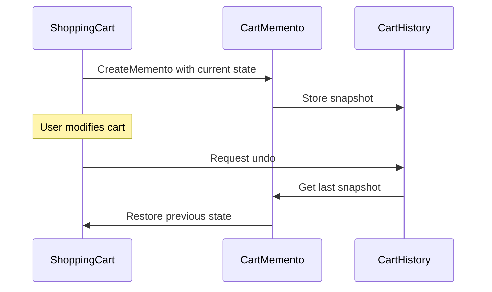

# Memento

Save points in a video game are Mementos. Before a boss fight, the game captures your exact state — health, inventory, position, quest progress — into a save file. If you die, you restore from the save point and try again. The save file captures everything needed to recreate the moment without exposing the game’s internal data structures to the save system.

The Memento pattern captures and externalizes an object’s internal state so it can be restored later, without violating encapsulation. Three participants: the **originator** (your shopping cart) creates a memento containing a snapshot of its state. The **caretaker** (the history manager) stores mementos without inspecting their contents. When undo is needed, the originator restores itself from a memento. The caretaker never accesses or modifies the saved state — it just holds the opaque snapshots.



## Problem

A shopping cart has no undo. Removing an item by accident is permanent, and abandoned cart recovery requires external DB snapshots with no clean abstraction:

```csharp
public class ShoppingCart
{
    public List<CartItem> Items { get; set; } = [];
    public string? DiscountCode { get; set; }
    public decimal Total => Items.Sum(i => i.Price * i.Quantity);

    // ⚠️ No way to undo — once an item is removed, it's gone
    public void RemoveItem(Guid productId) =>
        Items.RemoveAll(i => i.ProductId == productId);

    // ⚠️ No snapshot capability — abandoned cart recovery requires external logic
}

public class CartController
{
    public IActionResult RemoveItem(Guid productId)
    {
        _cart.RemoveItem(productId);
        // ⚠️ Customer immediately regrets this — no undo button
        return Ok();
    }
}
```

Here's what breaks when requirements change: adding "undo last change" requires retrofitting state tracking into the cart — a significant refactor.

## Solution

`CartMemento` captures cart state; `CartHistory` stores snapshots:

```csharp
// Memento — immutable snapshot of cart state
public sealed record CartMemento(
    IReadOnlyList<CartItem> Items,
    string? DiscountCode,
    DateTime SnapshotAt);

// Originator — creates and restores from mementos
public class ShoppingCart
{
    private List<CartItem> _items = [];
    public string? DiscountCode { get; private set; }
    public IReadOnlyList<CartItem> Items => _items.AsReadOnly();
    public decimal Total => _items.Sum(i => i.Price * i.Quantity);

    public void AddItem(CartItem item) => _items.Add(item);
    public void RemoveItem(Guid productId) => _items.RemoveAll(i => i.ProductId == productId);
    public void ApplyDiscount(string code) => DiscountCode = code;

    // ✅ Creates a snapshot of current state
    public CartMemento Save() =>
        new(_items.Select(i => i with { }).ToList().AsReadOnly(), DiscountCode, DateTime.UtcNow);

    // ✅ Restores state from a snapshot
    public void Restore(CartMemento memento)
    {
        _items = memento.Items.Select(i => i with { }).ToList(); // deep copy
        DiscountCode = memento.DiscountCode;
    }
}

// Caretaker — stores mementos without inspecting them
public class CartHistory
{
    private readonly Stack<CartMemento> _history = new();

    public void Push(CartMemento memento) => _history.Push(memento);

    public CartMemento? Pop() => _history.TryPop(out var m) ? m : null;

    public bool CanUndo => _history.Count > 0;

    // ✅ Serialize for abandoned cart recovery
    public string Serialize() => JsonSerializer.Serialize(_history.ToArray());
    public static CartHistory Deserialize(string json)
    {
        var history = new CartHistory();
        var mementos = JsonSerializer.Deserialize<CartMemento[]>(json) ?? [];
        foreach (var m in mementos.Reverse()) history.Push(m);
        return history;
    }
}

// Usage
var cart = new ShoppingCart();
var history = new CartHistory();

cart.AddItem(new CartItem(laptopId, 1, 1299m));
history.Push(cart.Save()); // ✅ snapshot before change

cart.RemoveItem(laptopId); // customer removes item

// Customer clicks "Undo"
if (history.CanUndo)
    cart.Restore(history.Pop()!); // ✅ laptop is back
```

Abandoned cart recovery now uses `CartHistory.Serialize()` — the same snapshot mechanism, no separate DB schema needed.

## You Already Use This

**EF Core `ChangeTracker.OriginalValues`** — EF Core stores the original database values for each tracked entity. `entry.OriginalValues["Total"]` returns the value before any in-memory changes. `entry.CurrentValues.SetValues(entry.OriginalValues)` restores the entity to its original state — a Memento restore.

**JSON serialization as state snapshot** — `JsonSerializer.Serialize(cart)` captures the cart state as a string. `JsonSerializer.Deserialize<ShoppingCart>(json)` restores it. This is the Memento pattern with JSON as the memento format — used for abandoned cart recovery, session state, and event sourcing snapshots.

**`DataSet.GetChanges()` / `RejectChanges()`** — `DataSet.GetChanges()` returns a memento of all modified rows. `RejectChanges()` restores the dataset to its original state.

## Tradeoffs

**Use it when**: you need undo/redo, checkpoints, or rollback of _in-memory_ state **without breaking encapsulation** — the caretaker holds opaque snapshots and can't peek inside. Good for editors, wizards, shopping carts, and game saves.

**Don't reach for it when**: the state is large — every snapshot **copies the whole state**, so memory grows with history depth. There, prefer **command-based undo** (store the _inverse_ operation, far cheaper) or, for a full audit trail, [[Event Sourcing]] (which reconstructs state from a log and snapshots only periodically).

**vs Command undo**: a **Command** remembers _how to reverse one action_ (delta); a **Memento** remembers _the entire prior state_ (snapshot). Command is leaner for big state with small changes; Memento is simpler when changes are complex or scattered. Also mind **deep-copy correctness** — a shallow snapshot that shares mutable references silently corrupts on restore.

## Questions

> [!QUESTION]- How do you prevent the memento from growing unbounded in memory?
> Limit the history depth: keep only the last N mementos (a bounded stack). For long-running sessions, serialize mementos to Redis or a database instead of keeping them in memory. For abandoned cart recovery, store only the latest snapshot (not the full history). The tradeoff: deeper history = more undo steps but more memory. For most UX scenarios, 10-20 undo steps is sufficient. For audit/compliance scenarios, store all snapshots in a database with a TTL.

> [!QUESTION]- When is Memento overkill compared to simpler approaches?
> When the state is small and the undo operation is simple. If "undo remove item" just means re-adding the item, store the removed item directly — no need for a full cart snapshot. Memento earns its complexity when: (1) the state is complex and interrelated (discount + items + shipping options all affect each other), (2) you need multiple undo levels, or (3) you need to restore state across sessions (abandoned cart). For single-step undo of simple operations, store the delta (what changed) rather than the full snapshot.

## References

- [Memento — refactoring.guru](https://refactoring.guru/design-patterns/memento) — canonical pattern description with originator/caretaker diagram and C# example
- [ChangeTracker — EF Core — Microsoft Learn](https://learn.microsoft.com/en-us/ef/core/change-tracking/) — EF Core's built-in Memento for entity state tracking
- [Event Sourcing pattern — Microsoft Learn](https://learn.microsoft.com/en-us/azure/architecture/patterns/event-sourcing) — Memento at scale: storing state changes as an immutable event log
