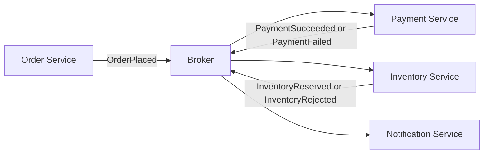
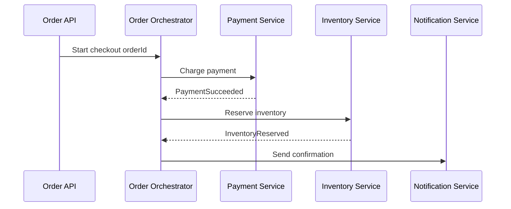

# Intro

Event-Driven Architecture (EDA) is a style where services communicate by publishing and consuming events instead of calling each other directly through synchronous APIs. The core idea is that a producer emits a fact (`OrderPlaced`, `PaymentFailed`, `InventoryReserved`) and does not need to know who reacts to it. This matters because it reduces runtime coupling, allows services to scale independently, and improves resilience when one downstream component is temporarily unavailable. You reach for EDA when workflows cross service boundaries, when processing can be asynchronous, and when you specifically need durable retained events for audit or replay.

In interview terms: EDA is not "just using a queue". It is a contract-driven communication model where events represent state changes, subscribers own their reaction logic, and consistency is typically eventual rather than immediate.

EDA runs on a message broker — usually [[Architecture/Distributed Systems/Message Queues/Message Queues|Message Queues]] — with [[RabbitMQ]] and [[Kafka]] the two dominant choices, the former for flexible routing and the latter for partitioned, retained event logs.

## Core Concepts

### Event Types

**Domain Event**

- Describes something meaningful that happened inside a bounded context.
- Produced by domain logic because business state changed.
- Examples: `InvoiceIssued`, `OrderConfirmed`, `CustomerUpgradedToPremium`.
- Scope: primarily internal to the service/domain, though some may later be promoted externally.

**Integration Event**

- A stable, explicit contract published for other services to consume.
- Usually emitted after local transaction success and often via an outbox/publisher pipeline.
- Examples: `OrderPlacedIntegrationEvent`, `PaymentCapturedIntegrationEvent`.
- Scope: cross-service communication. Versioning and backward compatibility matter.

**Event Notification**

- Lightweight signal saying "something changed", often with minimal payload (ID + timestamp + type).
- Consumers fetch full state separately when needed.
- Example: `CatalogItemChanged { ItemId, ChangedAt }`.
- Scope: low payload fan-out scenarios, cache invalidation, or trigger-based processing.

### Difference at a Glance

| Type | Primary purpose | Payload style | Typical audience |
| --- | --- | --- | --- |
| Domain Event | Capture domain fact | Rich domain data | Same bounded context |
| Integration Event | Cross-service contract | Stable DTO contract | Other services |
| Event Notification | Signal change happened | Minimal metadata | Many listeners that re-query |

Practical rule: model domain events first, then map only the externally relevant subset into integration events.

## Patterns

### Choreography

In choreography, each service reacts to events independently. No central coordinator tells services what to do next.



Use when teams want autonomy and workflows can be decomposed into independent reactions.

### Orchestration

In orchestration, a central component (process manager/saga orchestrator) directs the workflow and issues commands.



Use when workflow visibility, explicit state handling, and compensation logic are first-class requirements.

### Tradeoffs

- **Choreography**: looser coupling and easier service autonomy, but harder to trace global flow and reason about emergent behavior as subscriptions grow.
- **Orchestration**: clearer process control, easier audit/debug per workflow instance, but introduces a central dependency that can become a bottleneck or single point of operational complexity.

## .NET Example (ASP.NET Core + MassTransit + RabbitMQ)

This example publishes an integration event when an order is placed, then consumes it in a separate service. The publisher does not know who subscribes.

### Shared Contract

```csharp
namespace Contracts;

public record OrderPlacedIntegrationEvent(
    Guid EventId,
    Guid OrderId,
    Guid CustomerId,
    decimal Total,
    DateTime OccurredAtUtc
);
```

### Publisher (Order Service)

```csharp
using Contracts;
using MassTransit;

var builder = WebApplication.CreateBuilder(args);

builder.Services.AddMassTransit(x =>
{
    x.UsingRabbitMq((context, cfg) =>
    {
        cfg.Host("localhost", "/", h =>
        {
            h.Username("guest");
            h.Password("guest");
        });
    });
});

var app = builder.Build();

app.MapPost("/orders", async (IPublishEndpoint publish) =>
{
    var orderId = Guid.NewGuid();

    // Imagine local DB transaction succeeded before this publish.
    var evt = new OrderPlacedIntegrationEvent(
        EventId: Guid.NewGuid(),
        OrderId: orderId,
        CustomerId: Guid.NewGuid(),
        Total: 129.90m,
        OccurredAtUtc: DateTime.UtcNow
    );

    await publish.Publish(evt);
    return Results.Accepted($"/orders/{orderId}", new { orderId });
});

app.Run();
```

### Consumer (Billing Service)

```csharp
using Contracts;
using MassTransit;

public sealed class OrderPlacedConsumer : IConsumer<OrderPlacedIntegrationEvent>
{
    public async Task Consume(ConsumeContext<OrderPlacedIntegrationEvent> context)
    {
        var message = context.Message;

        // Idempotency key: message.EventId (store processed IDs in durable storage).
        // Business action: create payment intent, emit PaymentRequested event, etc.
        await Task.CompletedTask;
    }
}
```

```csharp
using MassTransit;

var builder = WebApplication.CreateBuilder(args);

builder.Services.AddMassTransit(x =>
{
    x.AddConsumer<OrderPlacedConsumer>();

    x.UsingRabbitMq((context, cfg) =>
    {
        cfg.Host("localhost", "/", h =>
        {
            h.Username("guest");
            h.Password("guest");
        });

        cfg.ReceiveEndpoint("billing-order-placed", e =>
        {
            e.ConfigureConsumer<OrderPlacedConsumer>(context);
        });
    });
});

var app = builder.Build();
app.Run();
```

Production note: pair publish with the transactional outbox pattern to avoid "DB commit succeeded but event publish failed" gaps.

## Pitfalls

### 1) Event Ordering

- **What goes wrong**: consumers may process `OrderCancelled` before `OrderPlaced` (or receive updates in different order across partitions/queues).
- **Why**: distributed brokers and parallel consumers do not guarantee global ordering.
- **Mitigation**: design handlers for per-aggregate ordering where needed (partition by aggregate key), include version/sequence in events, and detect stale events.

### 2) Idempotency

- **What goes wrong**: duplicate delivery causes duplicate side effects (double charge, duplicate email, repeated inventory decrement).
- **Why**: at-least-once delivery is common in real systems.
- **Mitigation**: use deterministic idempotency keys (`EventId`), store processed-message fingerprints, and make state transitions conditional.

### 3) Event Schema Evolution

- **What goes wrong**: a producer ships a breaking payload change and multiple consumers fail.
- **Why**: integration events are shared contracts with independent deployment cycles.
- **Mitigation**: version events, evolve contracts backward-compatibly (additive first), and validate in contract tests before release.

### 4) Distributed Flow Debugging

- **What goes wrong**: incidents are hard to reconstruct across many async hops.
- **Why**: no single request thread shows full workflow.
- **Mitigation**: propagate correlation/causation IDs, instrument with OpenTelemetry traces/metrics/logs, and keep searchable event audit logs.

## Questions

> [!QUESTION]- When would you choose orchestration over choreography in an event-driven workflow?
> Orchestrate when the workflow is long-running and needs real ordering or compensation — a checkout that charges payment, reserves inventory, then ships. A central process manager keeps that flow easy to follow and roll back, at the cost of one more component that can bottleneck. Choreography fits loosely-related reactions, like "order placed" fanning out to email, analytics, and search: autonomous and decoupled, but no single place knows the whole story, so tracing gets harder as subscriptions grow. Rule of thumb — orchestrate transactions you must reason about end to end; choreograph independent reactions.

> [!QUESTION]- How do you evolve integration event contracts without breaking consumers?
> Treat the event as a public API — other teams deploy against it on their own schedule. Keep changes additive; never rename or drop a field in place. For a genuine breaking change, version it (`OrderPlaced.v2`) and publish both through a migration window until consumers move over. Consumer-driven contract tests in CI catch regressions before release, and deserialization-failure metrics surface a bad change in minutes. The mindset that keeps you safe: an event schema is a long-lived contract, not an internal DTO you can refactor freely.

> [!QUESTION]- How do you process events reliably under at-least-once delivery?
> Duplicates and reordering are normal, so the goal is making at-least-once safe, not chasing exactly-once. The core move is idempotent consumers: key on the `EventId`, keep a durable set of handled IDs, and make the second delivery a no-op. A transactional outbox closes the publishing gap so a committed change always emits its event — no "DB committed but publish lost" holes. Where order matters, partition by aggregate key and carry a sequence number so consumers can drop stale events. Exactly-once is a myth; idempotency plus the outbox is how you fake it safely.

## References

- [Martin Fowler - What do you mean by Event-Driven?](https://martinfowler.com/articles/201701-event-driven.html)
- [Microsoft Learn - Asynchronous messaging options](https://learn.microsoft.com/azure/architecture/guide/technology-choices/messaging)
- [Microsoft Learn - Event-driven architecture style](https://learn.microsoft.com/azure/architecture/guide/architecture-styles/event-driven)
- [Microsoft Learn - Competing consumers pattern](https://learn.microsoft.com/azure/architecture/patterns/competing-consumers)
- [MassTransit Documentation](https://masstransit.io/)
- [Cloud Design Patterns - Idempotent Consumer](https://learn.microsoft.com/azure/architecture/patterns/idempotent-consumer)
- [Particular Blog - Banish ghost messages and zombie records from your web tier](https://particular.net/blog/transactional-session)
