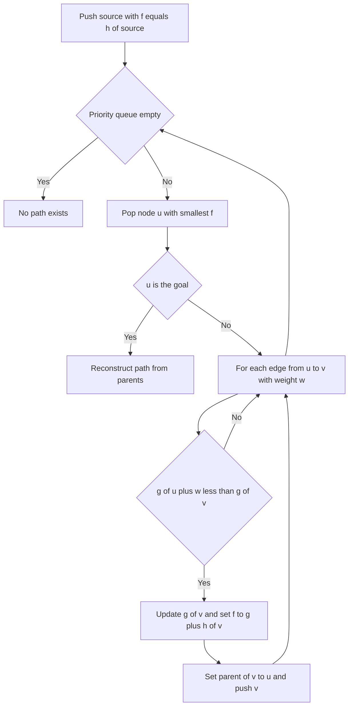

# Intro

A\* is a best-first shortest-path search that orders its frontier by `f(n) = g(n) + h(n)`: `g(n)` is the exact cost already paid to reach `n` from the source, and `h(n)` is a _heuristic_ estimate of the cost remaining to the goal. By always expanding the node with the smallest `f`, A\* pushes toward the target instead of blindly rippling outward, so on spatial graphs it settles orders of magnitude fewer nodes than an uninformed search while still returning the optimal path — provided the heuristic obeys the right constraints.

A\* is the workhorse of grid pathfinding (game NPCs, robot navigation) and road routing, and it sits at the center of a spectrum: it _becomes_ [[Dijkstra]] when `h ≡ 0` (no goal information, so it explores by `g` alone) and it _becomes_ [[Greedy Best-First Search]] when you drop `g` and rank by `h` alone (fast but no longer optimal). Reach for A\* when you have a cheap, admissible estimate of distance-to-goal and a single target; fall back to [[Dijkstra]] for all-pairs queries or graphs with no meaningful heuristic, and consider [[Bidirectional Search]] when the branching factor makes even A\* too wide.

## How It Works

1. Initialize `g[source] = 0`, `f[source] = h(source)`, and push `source` onto a min-priority queue keyed by `f`. All other `g` values start at infinity.
2. Pop the node `u` with the smallest `f`. If `u` is the goal, reconstruct the path via `parent[]` and stop.
3. For each edge `(u, v, w)`, compute the tentative cost `g[u] + w`. If it beats the recorded `g[v]`, update `g[v]`, set `f[v] = g[v] + h(v)`, record `parent[v] = u`, and push `v`.
4. Move `u` to the closed set and repeat until the goal is popped or the queue empties (no path).

The correctness guarantee hinges on the heuristic:

- **Admissibility** — `h(n)` never _overestimates_ the true remaining cost. This alone makes the _tree-search_ form of A\* optimal: the goal cannot be popped through a suboptimal path because any cheaper alternative still on the frontier has a smaller or equal `f`.
- **Consistency (monotonicity)** — for every edge `(u, v, w)`, `h(u) ≤ w + h(v)`, and `h(goal) = 0`. Consistency implies admissibility and is strictly stronger: it guarantees `f` never decreases along a path, so the _first_ time A\* pops a node its `g` is already optimal. That is what lets the graph-search form safely close nodes and never reopen them.

Complexity: on an explicit finite graph, a consistent heuristic expands each node at most once, so A\* costs `O((V + E) log V)` — exactly Dijkstra's bound, which is what A\* becomes when `h ≡ 0`. A good heuristic does not improve that worst case; it shrinks the constant by expanding a small fraction of `V`. The exponential blow-up people quote (`O(b^d)` in branching factor and solution depth) belongs to the _implicit_ search setting, where the state space is generated on the fly and is effectively unbounded. Space is the real limiter either way: A\* keeps every generated node in memory, so on large maps the open and closed sets, not CPU time, are what break it.

## Example

```text
4-connected grid, moving from S to G. Walls are #, open cells are '.'.
Heuristic h = Manhattan distance to G (admissible for 4-way movement, unit cost).

  col: 0 1 2 3
row0:  S . . .
row1:  # # . .
row2:  . . . G

f = g + h, g = steps from S.

Expand S(0,0): g=0, h=|0-2|+|0-3|=5, f=5.
  Neighbor (0,1): g=1, h=4, f=5.  (down is a wall)
Expand (0,1) f=5: neighbor (0,2): g=2, h=3, f=5.
Expand (0,2) f=5: neighbors (0,3) g=3 h=2 f=5, and (1,2) g=3 h=2 f=5.
Expand (0,3) f=5: neighbor (1,3): g=4, h=1, f=5.
Expand (1,3) f=5: neighbor (2,3)=G: g=5, h=0, f=5.
Pop G: optimal path S -> (0,1) -> (0,2) -> (0,3) -> (1,3) -> G, cost 5.

Every node A* expanded had f=5 — it walked almost straight to G. Dijkstra,
with h=0, orders purely by g, so before reaching G at g=5 it would also
have expanded (1,2) and the whole bottom row (2,2),(2,1),(2,0), which lead
away from the goal. That skipped work is the heuristic paying off.
```

## Diagram



## Pitfalls

### An inadmissible heuristic silently returns a suboptimal path

- **What goes wrong**: A\* still terminates and returns _a_ path, but not the cheapest one — and it gives no warning that anything is off.
- **Why it happens**: if `h` overestimates remaining cost for some node on the true optimal path, that node's `f` is inflated, so A\* pops the goal via a cheaper-looking (but actually longer) route before it ever expands the real shortest path.
- **How to avoid it**: prove admissibility for your heuristic before trusting it. When you _deliberately_ inflate `h` for speed, do it knowingly as weighted A\* (below) and treat suboptimality as a documented tradeoff, not a bug.

### Manhattan distance with diagonal movement allowed

- **What goes wrong**: on an 8-connected grid where a diagonal step costs `√2 ≈ 1.41`, Manhattan distance counts that step as `2`, overestimating the true remaining cost and breaking admissibility — so A\* can return a non-optimal path.
- **Why it happens**: Manhattan assumes you must move in axis-aligned steps; enabling diagonals shortens the real distance below what Manhattan reports.
- **How to avoid it**: match the heuristic to the movement model. Use Manhattan (`|dx| + |dy|`) only for 4-way movement; use octile (`(dx + dy) + (√2 − 2)·min(dx, dy)`) or Chebyshev for 8-way, and Euclidean when movement is unconstrained.

### Closing nodes under an admissible-but-inconsistent heuristic without reopening

- **What goes wrong**: with graph-search A\* that never revisits closed nodes, an admissible-but-_inconsistent_ heuristic can cause a node to be finalized with a non-optimal `g`, because a cheaper path to it is discovered only _after_ it was closed — corrupting every path that runs through it.
- **Why it happens**: only consistency guarantees `f` is non-decreasing and that the first pop of a node is optimal. Admissibility alone does not.
- **How to avoid it**: either use a provably consistent heuristic (most standard grid heuristics are), or allow node _reopening_ — when a shorter `g` to a closed node appears, pull it back into the open set. Reopening restores optimality at the cost of extra expansions.

## Tradeoffs

| Choice | Option A | Option B | Decision criteria |
| --- | --- | --- | --- |
| Heuristic strength | A\* with informed `h` explores near-`O(E)` on good heuristics | [[Dijkstra]] `O((V+E) log V)`, `h ≡ 0` | Use A\* when a cheap admissible estimate to a single goal exists; use Dijkstra for all-pairs, multi-target, or when no heuristic is meaningful. |
| Optimality vs speed | Plain A\* returns the optimal path | Weighted A\* with `f = g + ε·h`, `ε > 1` | Weighted A\* expands far fewer nodes and stays within a factor `ε` of optimal; use it when a slightly longer path is acceptable and latency matters (real-time games). |
| Goal targeting | A\* ranks by `g + h` | [[Greedy Best-First Search]] ranks by `h` alone | Greedy is faster but neither optimal nor complete; use it only when any valid path suffices and you can tolerate detours around concave obstacles. |
| Wide branching | Unidirectional A\* | [[Bidirectional Search]] A\* | Bidirectional roughly square-roots the frontier size for point-to-point queries on large maps, at the cost of a reversible graph and a subtle meeting condition. |

Weighted A\* is the pressure valve between these rows: scaling `h` by `ε > 1` trades a bounded amount of optimality (the returned path costs at most `ε` times the optimum) for a dramatic cut in expanded nodes. Setting `ε = 1` recovers exact A\*; letting `ε → ∞` approaches greedy behavior.

## Questions

> [!QUESTION]- What is the difference between an admissible and a consistent heuristic, and why does it matter?
>
> - Admissible: `h(n)` never overestimates the true remaining cost to the goal.
> - Consistent (monotone): `h(u) ≤ w(u,v) + h(v)` for every edge, with `h(goal) = 0` — a triangle-inequality condition that implies admissibility.
> - Admissibility alone makes tree-search A\* optimal; consistency additionally guarantees `f` never decreases along a path, so a node's first pop is already optimal and graph-search A\* can close nodes without ever reopening them.
> - The practical payoff: with a consistent heuristic you skip the reopening logic entirely and each node is expanded once — so when you can prove consistency (most grid heuristics are consistent), you get both correctness and the simplest, fastest implementation.

> [!QUESTION]- How does A\* relate to Dijkstra and Greedy Best-First Search?
>
> - A\* orders the frontier by `f = g + h`, blending cost-so-far with estimated cost-to-go.
> - Set `h ≡ 0` and A\* ranks purely by `g` — it becomes [[Dijkstra]], uninformed and optimal.
> - Drop `g` and rank purely by `h` and it becomes [[Greedy Best-First Search]] — goal-hungry, fast, but neither optimal nor complete.
> - A\* is the tunable middle of that spectrum, and weighted A\* (`f = g + ε·h`) lets you slide between exact-optimal and greedy by choosing how much to trust the heuristic — which is why one algorithm covers routing, games, and planning by just swapping `h`.

> [!QUESTION]- You enable diagonal movement on a grid and paths suddenly look wrong. What is the likely cause?
>
> - Diagonal steps cost `√2 ≈ 1.41`, but a Manhattan heuristic (`|dx| + |dy|`) counts a diagonal as two unit moves.
> - That overestimates the remaining cost, making the heuristic inadmissible and letting A\* return a suboptimal path with no error raised.
> - The fix is to switch to an octile or Chebyshev heuristic that accounts for diagonal cost, matching `h` to the movement model.
> - The lesson generalizes: A\* is only as correct as its heuristic, and a heuristic that was admissible under one cost model can silently break when the movement rules change — always re-derive admissibility when the graph's cost structure changes.

## References

- [A\* search algorithm (Wikipedia)](https://en.wikipedia.org/wiki/A*_search_algorithm) — formal definition, admissibility and consistency proofs, and weighted variants.
- [Amit's A\* Pages (Stanford, Amit Patel)](https://theory.stanford.edu/~amitp/GameProgramming/) — the definitive practical guide to grid heuristics (Manhattan, Chebyshev, octile, Euclidean) and tuning.
- [Introduction to A\* (Red Blob Games)](https://www.redblobgames.com/pathfinding/a-star/introduction.html) — interactive walkthrough of Dijkstra, Greedy, and A\* on the same map.
- [A Formal Basis for the Heuristic Determination of Minimum Cost Paths (Hart, Nilsson, Raphael 1968)](https://ieeexplore.ieee.org/document/4082128) — the original paper introducing A\* and its optimality conditions.
