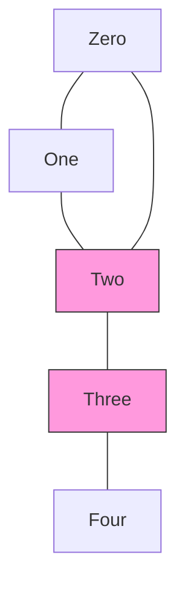

# Intro

In an undirected graph, an **articulation point** (cut vertex) is a vertex whose removal increases the number of connected components — delete it and the graph falls apart. A **bridge** (cut edge) is the edge analogue: an edge whose removal disconnects the graph. Both identify **single points of failure**: in a network topology, an articulation router or bridge link is the node/cable whose outage partitions the system. They also underpin decomposition into biconnected components (2-vertex-connected blocks) and 2-edge-connected components.

The naive approach — remove each vertex or edge, re-run a connectivity check, and see if the component count grew — costs `O(V·(V+E))`. The insight is that a single [[DFS BFS|DFS]] finds _all_ of them at once in `O(V + E)`, using the same `disc[]`/`low[]` low-link machinery that [[Strongly Connected Components|Tarjan's SCC]] algorithm uses. The DFS tree turns "does removing this disconnect anything?" into a local numeric test on each edge.

## How It Works

Run a DFS from any vertex. For each vertex `v` record:

- `disc[v]` — its discovery time (the order DFS first reaches it).
- `low[v]` — the smallest `disc` reachable from `v`'s subtree using tree edges plus **at most one** back edge (an edge to an already-visited ancestor). Initialize `low[v] = disc[v]`, then for each tree child `c` take `low[v] = min(low[v], low[c])`, and for each back edge `v → w` take `low[v] = min(low[v], disc[w])`.

The DFS tree has only **tree edges** and **back edges** (no cross edges, because the graph is undirected). A back edge from `v`'s subtree to an ancestor of `v` is an alternate route that survives removing `v` or the tree edge above it. The two rules read `low` against `disc` to detect the _absence_ of such a route:

- **Articulation point (non-root `u`)**: `u` is a cut vertex **iff it has a child `v` with `low[v] >= disc[u]`**. That inequality means nothing in `v`'s subtree can reach above `u` — so `u` is the only way in or out of that subtree.

- **Articulation point (root)**: the DFS root is a cut vertex **iff it has two or more DFS children**. With one child the root is a leaf-side of the tree and removing it leaves the rest connected; with two children the only path between those subtrees runs through the root.

- **Bridge `(u, v)`** where `v` is a child of `u`: the edge is a bridge **iff `low[v] > disc[u]`** — a _strict_ inequality. Strictness is the whole difference from the vertex rule: a back edge landing exactly on `u` (giving `low[v] == disc[u]`) still keeps `u` an articulation point, but it provides an alternate route around the _edge_ `(u, v)`, so the edge is not a bridge.

- **Complexity**: `O(V + E)` time — one DFS, constant work per edge — and `O(V)` space for the `disc`/`low` arrays, visited flags, and recursion stack (worst case a path graph of depth `V`).

## Example

A C# implementation finding both articulation points and bridges in one pass. Adjacency stores an **edge id** per neighbor so the parent _edge_ — not just the parent vertex — can be skipped; this is what makes parallel edges correct (see Pitfalls).

```csharp
public sealed class CutFinder
{
    private readonly List<(int to, int id)>[] _adj;
    private readonly int[] _disc, _low;
    private int _timer;

    public HashSet<int> ArticulationPoints { get; } = new();
    public List<(int u, int v)> Bridges { get; } = new();

    public CutFinder(List<(int to, int id)>[] adj)
    {
        _adj = adj;
        _disc = new int[adj.Length];
        _low = new int[adj.Length];
        Array.Fill(_disc, -1);              // -1 marks unvisited
    }

    public void Run()
    {
        for (int s = 0; s < _adj.Length; s++)
            if (_disc[s] == -1)
                Dfs(s, parentEdge: -1, isRoot: true);
    }

    private void Dfs(int u, int parentEdge, bool isRoot)
    {
        _disc[u] = _low[u] = _timer++;
        int children = 0;

        foreach (var (v, id) in _adj[u])
        {
            if (id == parentEdge) continue;          // skip the edge we arrived on, once
            if (_disc[v] == -1)                       // tree edge
            {
                children++;
                Dfs(v, id, isRoot: false);
                _low[u] = Math.Min(_low[u], _low[v]);
                if (!isRoot && _low[v] >= _disc[u])   // articulation rule (non-root)
                    ArticulationPoints.Add(u);
                if (_low[v] > _disc[u])               // bridge rule (strict)
                    Bridges.Add((u, v));
            }
            else                                      // back edge
            {
                _low[u] = Math.Min(_low[u], _disc[v]);
            }
        }

        if (isRoot && children >= 2)                  // articulation rule (root)
            ArticulationPoints.Add(u);
    }
}
```

For the graph `0-1, 1-2, 2-0, 2-3, 3-4` (a triangle `0-1-2` with a tail `2-3-4`): vertices `2` and `3` are articulation points, and edges `2-3` and `3-4` are bridges. The triangle has no cut vertices among `0` and `1` because each has a back edge closing the cycle.

## Diagram



Vertices `Two` and `Three` are articulation points; the tail edges `Two to Three` and `Three to Four` are bridges, while the triangle edges are not.

## Pitfalls

### Forgetting the root special case

- **What goes wrong**: applying the child rule `low[v] >= disc[u]` to the DFS root flags it as a cut vertex whenever it has any child, over-reporting every root.
- **Why it happens**: the root has no ancestor, so `low[v] >= disc[root]` is trivially true for its first child even when removing the root changes nothing.
- **How to avoid it**: test the root separately — it is an articulation point **only** if it has two or more DFS children. Bridges have no such exception; the strict `low[v] > disc[u]` rule already handles the root correctly.

### Skipping the parent vertex instead of the parent edge

- **What goes wrong**: with **parallel edges** (two edges between `u` and `v`), skipping "any edge back to the parent vertex" ignores the second parallel edge, so the code thinks `v` has no alternate route up and misreports `(u, v)` as a bridge — even though the duplicate edge is itself the alternate route.
- **Why it happens**: the usual "don't go back to parent" guard is written as `if (v == parent) continue;`, which discards _all_ edges to the parent, not just the one traversed.
- **How to avoid it**: track the specific **edge id** used to reach the child and skip only that edge (the `id == parentEdge` guard above). Then the second parallel edge is correctly treated as a back edge, lowering `low[v]` and cancelling the false bridge.

### Assuming it works on directed graphs

- **What goes wrong**: the `disc`/`low` bridge and articulation rules assume the DFS tree has only tree and back edges; on a directed graph, cross and forward edges appear and the rules silently give wrong answers.
- **Why it happens**: undirectedness is what forbids cross edges and guarantees a back edge is a genuine two-way alternate route.
- **How to avoid it**: use this only on undirected graphs. For directed connectivity questions reach for [[Strongly Connected Components]] instead.

## Tradeoffs

| Choice | Single DFS with low-link | Remove-and-recheck | Decision criteria |
| --- | --- | --- | --- |
| Time | `O(V + E)`, one pass | `O(V·(V+E))` re-running connectivity per vertex/edge | Always prefer the DFS on graphs of any real size; the naive method is only tolerable for tiny or one-off checks. |
| Parent handling | Skip the parent **edge** by id | Skip the parent **vertex** | Edge-id skipping is mandatory when parallel edges (multigraphs) are possible; vertex-skipping is a latent bug there. |
| Cut vertices vs cut edges | `low[v] >= disc[u]` plus root rule | `low[v] > disc[u]` (strict) | They differ only by strictness and the root exception; a vertex can be an articulation point without any incident bridge, so compute the one you actually need. |
| Directed graphs | Not applicable | — | For directed reachability/cycles, decompose with [[Strongly Connected Components]] rather than adapting these rules. |

## Questions

> [!QUESTION]- What is the exact articulation-point rule, including the root case, and why does the root differ?
>
> - A non-root vertex `u` is an articulation point iff it has a DFS child `v` with `low[v] >= disc[u]` — nothing in `v`'s subtree reaches above `u`, so `u` is the only exit.
> - The root has no ancestor, so that inequality is vacuously satisfied by its first child and would over-report.
> - The root is an articulation point iff it has two or more DFS children, because those subtrees can only reach each other through the root.
> - Getting the root case wrong is the single most common bug here, and it flips answers on the most trivial inputs (a root with one child), so an interviewer will probe it directly.

> [!QUESTION]- Why is the bridge test strict (`low[v] > disc[u]`) while the articulation test is not (`low[v] >= disc[u]`)?
>
> - `low[v] == disc[u]` means the deepest a back edge from `v`'s subtree reaches is exactly `u` itself.
> - That back edge is an alternate route around the _edge_ `(u, v)`, so the edge is not a bridge — hence strict `>`.
> - But that same back edge still forces all traffic through the _vertex_ `u`, so `u` remains an articulation point — hence non-strict `>=`.
> - The one-symbol difference encodes the whole distinction between cut edges and cut vertices; conflating them mislabels edges on any graph with a back edge landing on `u`.

> [!QUESTION]- How do parallel edges break the standard parent check, and what is the fix?
>
> - The common guard `if (v == parent) continue;` skips every edge back to the parent vertex.
> - With two parallel edges between `u` and `v`, this discards the second edge too, so `v` looks like it has no route back up.
> - The algorithm then reports `(u, v)` as a bridge, even though the duplicate edge is itself the alternate path keeping the graph connected.
> - The fix is to skip the specific parent _edge_ by id, not the parent vertex — a distinction that only matters on multigraphs but silently corrupts results when it does.

## References

- [Biconnected component (Wikipedia)](https://en.wikipedia.org/wiki/Biconnected_component) — articulation points, the DFS low-link method, and biconnected decomposition.
- [Bridge (graph theory) (Wikipedia)](https://en.wikipedia.org/wiki/Bridge_\(graph_theory\)) — cut edges, 2-edge-connectivity, and the bridge-finding algorithm.
- [Finding bridges and articulation points (cp-algorithms)](https://cp-algorithms.com/graph/bridge-searching.html) — implementation with the `disc`/`low` arrays and the parent-edge subtlety.
