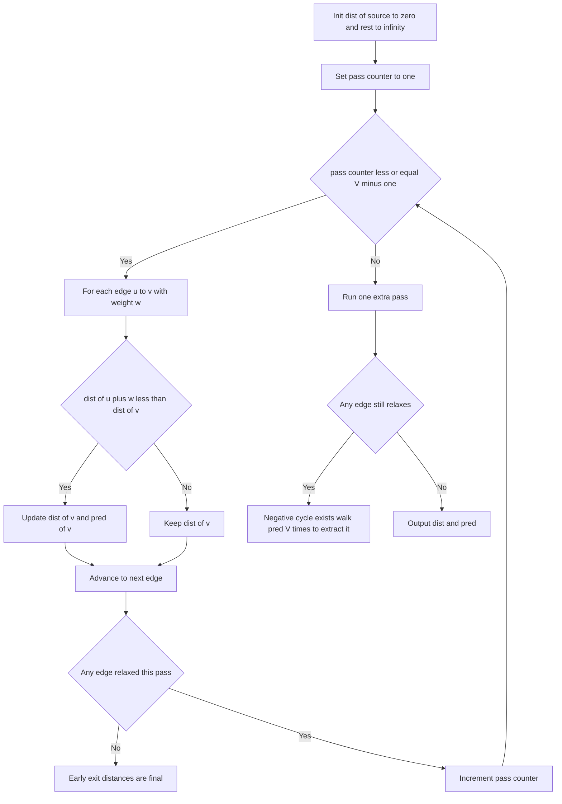

# Intro

Bellman-Ford computes shortest paths from a single source on a weighted graph that may contain **negative edge weights** — the case [[Dijkstra]] cannot handle. Instead of greedily finalizing one node at a time, it relaxes _every_ edge repeatedly: run `V−1` passes over the full edge list, and after each pass one more layer of correct distances settles into place. It is slower than Dijkstra (`O(VE)` versus `O((V+E) log V)`), so reach for it only when negative edges exist. Its other superpower is what Dijkstra structurally cannot do: a `V`-th pass that still relaxes something proves the graph has a **negative cycle**, which Bellman-Ford can then detect and even extract.

The reason it works is a fact about shortest paths, not about cleverness: any shortest path in a graph with no negative cycle is _simple_ and therefore visits at most `V` vertices, i.e. at most `V−1` edges. So after `V−1` relaxation passes every shortest path has been fully "traced out." Real deployments include the RIP distance-vector routing protocol and currency-arbitrage detection, where a negative cycle in `-log(rate)` weights _is_ a profitable arbitrage loop.

## How It Works

1. **Initialize.** Set `dist[source] = 0` and `dist[v] = ∞` for every other vertex. Optionally keep `pred[v]` to reconstruct paths and cycles.
2. **Relax all edges, `V−1` times.** In each pass, for every edge `(u, v, w)`: if `dist[u] + w < dist[v]`, update `dist[v] = dist[u] + w` and `pred[v] = u`. One pass touches all `E` edges regardless of order.
3. **Why `V−1` passes suffice.** After pass `k`, every vertex reachable by a shortest path of `k` or fewer edges holds its final distance. Since a shortest path has at most `V−1` edges, `V−1` passes finalize everything. (Guard against overflow when relaxing through an `∞` vertex — skip edges whose source is still unreached.)
4. **Detect negative cycles.** Run one more pass (the `V`-th). If any edge can _still_ be relaxed, a negative cycle is reachable from the source: no `V−1`-pass bound could have converged, so the graph has no well-defined shortest distances into that region.
5. **Extract the cycle.** Take a vertex `x` that relaxed on the `V`-th pass and walk `pred` back `V` times. This is guaranteed to land you _inside_ the cycle (the walk cannot escape a cycle it entered). From that in-cycle vertex, follow `pred` until you return to it to read off the cycle's vertices.

Two standard refinements:

- **Early exit.** If a full pass relaxes _no_ edge, all distances are final — stop. On graphs that converge quickly this turns the worst-case `O(VE)` into something far cheaper.
- **SPFA (Shortest Path Faster Algorithm).** Instead of blindly relaxing all `E` edges each pass, keep a queue of vertices whose distance just changed and only relax _their_ outgoing edges. Average-case much faster; worst case is still `O(VE)`, and adversarial graphs (e.g. certain grid/lattice inputs) hit that worst case, so SPFA is not a safe default in competitive settings.

Complexity: `O(VE)` time, `O(V)` space. Worst case `O(VE)` is triggered whenever no early exit fires — e.g. a path graph where each pass propagates the frontier by exactly one edge. On a dense graph `E ≈ V²` this is `O(V³)`, matching [[Floyd-Warshall]] for a single source, which is why all-pairs work usually switches algorithms.

## Example

```text
Vertices: 0..4. Edges (directed, some negative):
  0→1 (6)   0→2 (7)
  1→2 (8)   1→3 (5)   1→4 (-4)
  2→3 (-3)  2→4 (9)
  3→1 (-2)
  4→0 (2)   4→3 (7)
Source: 0

Edge order within a pass is arbitrary: it changes the intermediate rows but
never the final distances. This trace relaxes 3→1 before 2→3.

Init:   dist = [0, INF, INF, INF, INF]

Pass 1 (relax every edge once):
  0→1: dist[1] = 6
  0→2: dist[2] = 7
  1→2: 6+8=14, not < 7, skip
  1→3: dist[3] = 11
  1→4: dist[4] = 6-4 = 2
  2→3: 7-3 = 4 < 11, dist[3] = 4
  4→0: 2+2=4, not < 0, skip
  4→3: 2+7=9, not < 4, skip
        dist = [0, 6, 7, 4, 2]

Pass 2:
  3→1: 4-2 = 2 < 6, dist[1] = 2
  1→4: 2-4 = -2 < 2, dist[4] = -2
        dist = [0, 2, 7, 4, -2]

Pass 3:
  1→3: 2+5 = 7, not < 4, skip
  (nothing improves) -> early exit could fire here

Passes 4 (V-1 = 4): no relaxation.
Final:  dist = [0, 2, 7, 4, -2]

Negative-cycle check (pass 5): no edge relaxes -> no negative cycle.
```

Now flip `3→1` to weight `-8`. Then `0→1→3→1` keeps dropping every time you traverse it (`+5` then `−8` = `−3` per lap), the `V`-th pass still relaxes, and walking `pred` back `V` times from the offending vertex lands inside the `1 → 3 → 1` loop.

## Diagram



## Pitfalls

### Confusing "unreachable" with "negative infinity"

- **What goes wrong**: after detecting a negative cycle, code often reports a single finite distance for every vertex, but vertices reachable _through_ the cycle have distance `−∞`, which is a different state from vertices with no path at all (`+∞`).
- **Why it happens**: the `V−1`-pass distances are meaningless once a reachable negative cycle exists — they are just a snapshot mid-descent, not a converged answer.
- **How to avoid it**: after the `V`-th pass, mark every vertex that relaxed (and everything reachable from it, via a BFS/DFS) as `−∞`. Report three distinct states: finite, `+∞` (unreachable), `−∞` (reachable through a negative cycle).

### Overflow when relaxing through an unreached vertex

- **What goes wrong**: computing `dist[u] + w` while `dist[u]` is still the "infinity" sentinel (e.g. `int.MaxValue`) overflows and wraps to a small or negative number, creating phantom shortest paths.
- **Why it happens**: Bellman-Ford relaxes _every_ edge each pass, including edges leaving vertices not yet reached, unlike Dijkstra which only expands settled nodes.
- **How to avoid it**: skip any edge whose source is still at the sentinel (`if (dist[u] == INF) continue;`), or use a sentinel with head-room (e.g. a `long` set well below `long.MaxValue`).

### Trusting SPFA as a strict upgrade

- **What goes wrong**: SPFA is faster on average, so it gets used as a drop-in replacement, then times out on an adversarial graph that forces its `O(VE)` worst case.
- **Why it happens**: the queue-based refinement improves the _expected_ number of relaxations but changes nothing about the worst-case bound; special grid and lattice inputs are constructed to defeat it.
- **How to avoid it**: keep plain Bellman-Ford (with early exit) when a guaranteed bound matters; reserve SPFA for cases where you control the inputs or can tolerate the tail.

## Tradeoffs

| Choice | Option A | Option B | Decision criteria |
| --- | --- | --- | --- |
| Non-negative weights only | [[Dijkstra]] `O((V+E) log V)` | Bellman-Ford `O(VE)` | Use Dijkstra whenever all weights are `≥ 0`; it is asymptotically far faster. Only pay Bellman-Ford's cost when a negative edge actually exists. |
| All-pairs shortest paths | [[Floyd-Warshall]] `O(V³)` | Bellman-Ford per source `O(V²E)` | On dense graphs Floyd-Warshall wins and is simpler. For sparse graphs with negative edges, Johnson's algorithm reweights with one Bellman-Ford run then runs Dijkstra from each source. |
| Convergence speed | Plain passes with early exit | SPFA queue-based | Prefer early-exit Bellman-Ford when you need a guaranteed `O(VE)` bound; use SPFA only when inputs are friendly and average speed matters more than the worst case. |
| Negative-cycle handling | Bellman-Ford (`V`-th pass) | Dijkstra | Dijkstra cannot detect negative cycles at all. If cycle detection or arbitrage-loop extraction is the goal, Bellman-Ford is the tool. |

## Questions

> [!QUESTION]- Why exactly `V−1` relaxation passes, and what does a change on the `V`-th pass mean?
>
> - In a graph with no negative cycle, every shortest path is simple, so it uses at most `V−1` edges.
> - After pass `k`, all shortest paths of `k` edges or fewer are finalized, so `V−1` passes finalize every distance.
> - If a `V`-th pass still relaxes an edge, some path is _still_ getting shorter past the `V−1`-edge limit — only a negative cycle allows that.
> - So the `V`-th pass is not wasted work: it is precisely the negative-cycle detector, and it is why Bellman-Ford can do something [[Dijkstra]] structurally cannot — a decisive reason to accept its `O(VE)` cost when negative edges are in play.

> [!QUESTION]- How do you extract the actual negative cycle, not just detect one?
>
> - Find a vertex `x` that relaxed on the `V`-th pass; it is either on a negative cycle or reachable from one.
> - Walk `pred` back `V` times starting from `x`; because a `pred`-walk cannot leave a cycle it has entered, after `V` steps you are guaranteed to be _inside_ the cycle.
> - From that in-cycle vertex, follow `pred` until you return to it, collecting the vertices — that sequence is the cycle.
> - This turns detection into a concrete answer: in currency arbitrage the extracted loop is the exact sequence of trades to execute, so "there is a cycle" becomes "here is the money."

> [!QUESTION]- Why is currency arbitrage a Bellman-Ford problem, and what is the weight trick?
>
> - Model each currency as a vertex and each exchange rate `r` as a directed edge; a profitable loop multiplies rates to more than 1.
> - Take `-log(rate)` as the edge weight; then a product of rates greater than 1 becomes a _sum_ of weights less than 0.
> - A profitable arbitrage cycle is therefore exactly a negative-weight cycle, which Bellman-Ford detects and extracts.
> - The insight is that a multiplicative optimization was converted into an additive shortest-path one by taking logs — the same reframing lets shortest-path machinery answer a finance question it was never designed for.

## References

- [Bellman-Ford algorithm (Wikipedia)](https://en.wikipedia.org/wiki/Bellman%E2%80%93Ford_algorithm) — correctness, `V−1`-pass bound, and negative-cycle detection.
- [Bellman-Ford (cp-algorithms)](https://cp-algorithms.com/graph/bellman_ford.html) — implementation with early exit and cycle retrieval.
- [Finding a negative cycle in the graph (cp-algorithms)](https://cp-algorithms.com/graph/finding-negative-cycle-in-graph.html) — the pred-walk extraction technique.
- [Shortest paths (Princeton Algorithms)](https://algs4.cs.princeton.edu/44sp/) — Sedgewick on Bellman-Ford, negative cycles, and arbitrage detection.
