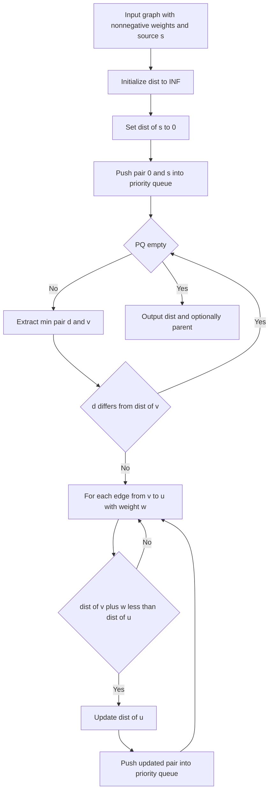

# Intro

Dijkstra's algorithm computes shortest paths from a single source to all other nodes in a graph with non-negative edge weights. It works by greedily finalizing the node with the smallest tentative distance, then relaxing its outgoing edges to improve neighbor distances. The greedy choice is correct because non-negative weights guarantee that no future path through an unfinalized node can beat the current shortest — once a node is extracted from the priority queue, its distance is final.

Use Dijkstra for routing (network shortest paths, GPS navigation), cost minimization (cheapest flight itinerary), and resource planning where edge costs represent real quantities like latency, distance, or price. It does not work when edges have negative weights — that breaks the finalization invariant and requires Bellman-Ford instead.
## How It Works

1. Initialize `dist[source] = 0` and `dist[v] = ∞` for all other nodes. Push `(0, source)` into a min-priority queue.
2. Extract the node `v` with the smallest tentative distance. If the extracted distance exceeds `dist[v]`, skip it (stale entry from lazy deletion).
3. For each outgoing edge `(v, u, w)`, check if `dist[v] + w < dist[u]`. If so, update `dist[u]` and push `(dist[v] + w, u)`.
4. Repeat until the queue is empty. Optionally maintain a `parent[]` array to reconstruct paths by walking backward from the target.

Complexity: `O((V + E) log V)` with a binary heap. On dense graphs where `E ≈ V²`, a simple array scan gives `O(V²)` which is faster than heap overhead.



## Visualization

```steptrace
{"algorithm":"dijkstra","start":"A","directed":false,"nodes":[{"id":"A"},{"id":"B"},{"id":"C"},{"id":"D"},{"id":"E"},{"id":"F"}],"edges":[{"from":"A","to":"B","weight":2},{"from":"A","to":"C","weight":5},{"from":"B","to":"C","weight":1},{"from":"B","to":"D","weight":6},{"from":"C","to":"D","weight":3},{"from":"D","to":"E","weight":1},{"from":"D","to":"F","weight":4},{"from":"E","to":"F","weight":2}]}
```

## Example

```text
Graph edges: A-B(2), A-C(5), B-C(1), B-D(4), C-D(1)
Source: A

Step 1: Extract A (dist=0). Relax A→B: dist[B]=2. Relax A→C: dist[C]=5.
Step 2: Extract B (dist=2). Relax B→C: 2+1=3 < 5, update dist[C]=3. Relax B→D: dist[D]=6.
Step 3: Extract C (dist=3). Relax C→D: 3+1=4 < 6, update dist[D]=4.
Step 4: Extract D (dist=4). No unfinalized neighbors.

Final: dist[A]=0, dist[B]=2, dist[C]=3, dist[D]=4
Shortest A→D path: A→B→C→D (cost 4)
```

## Pitfalls

### Negative Edge Weights Break Correctness

- **What goes wrong**: Dijkstra finalizes a node's distance on extraction, but a later path through a negative-weight edge can produce a shorter distance to an already-finalized node, giving wrong results.
- **Why it happens**: the greedy invariant assumes adding more edges can only increase path cost. Negative weights violate this assumption.
- **How to avoid it**: validate all edge weights are ≥ 0 before running Dijkstra. Use Bellman-Ford when negative edges exist.

### Stale Priority Queue Entries

- **What goes wrong**: without decrease-key support, updating a node's distance pushes a new entry while the old one remains. Processing stale entries wastes time and can cause incorrect relaxation if the guard check is missing.
- **Why it happens**: standard binary heaps in most languages do not support decrease-key, so lazy deletion is the common workaround.
- **How to avoid it**: always check `if extracted_dist > dist[v]: skip` before processing a node. This guard is what makes lazy deletion correct.

### Dense Graph Performance

- **What goes wrong**: on dense graphs (`E ≈ V²`), the heap-based approach becomes `O(V² log V)`, slower than the `O(V²)` array-scan version.
- **Why it happens**: heap overhead (log V per push) exceeds its benefit when nearly every node pair has an edge.
- **How to avoid it**: for dense graphs, use the simple array-scan variant that picks the minimum in `O(V)` per iteration, giving `O(V²)` total.

## Tradeoffs

| Choice | Option A | Option B | Decision criteria |
| --- | --- | --- | --- |
| Unweighted graph | [[DFS BFS\|BFS]] `O(V+E)` | Dijkstra `O((V+E) log V)` | BFS is simpler and faster when all edge weights are equal. Use Dijkstra only when weights differ. |
| Negative edges present | Bellman-Ford `O(VE)` | Dijkstra | Dijkstra is faster but requires non-negative weights. Use Bellman-Ford when negative edges exist and no negative cycles. |
| Target-directed search | A\* with heuristic | Dijkstra | A\* explores fewer nodes when a good admissible heuristic exists. Fall back to Dijkstra for all-pairs or when no heuristic is available. |

## Questions

> [!QUESTION]- Why does Dijkstra require non-negative edge weights?
>
> - Dijkstra is greedy: it treats the extracted minimum-distance node as finalized.
> - Non-negative weights guarantee no future path through unfinalized nodes can undercut a finalized distance.
> - A negative-weight edge can create a later, cheaper path to an already-finalized node, producing wrong results.
> - Bellman-Ford relaxes all edges V-1 times without the finalization assumption, handling negative weights at `O(VE)` cost.
> - Bellman-Ford handles negative weights but is slower — accept the non-negative constraint when graph structure allows it.

> [!QUESTION]- What data structures make Dijkstra practical at scale?
>
> - Adjacency list keeps memory proportional to edges for sparse graphs vs `O(V²)` for adjacency matrix.
> - Min-heap priority queue gives `O(log V)` extraction vs `O(V)` linear scan.
> - Lazy deletion avoids the need for decrease-key, which most standard library heaps lack.
> - Distance array plus parent array supports `O(V)` path reconstruction by walking parent pointers backward.
> - A Fibonacci heap improves the asymptotics to `O(V log V + E)` but has worse constant factors, so a binary heap wins in practice for most graph sizes.

> [!QUESTION]- When should you prefer A\* over Dijkstra?
>
> - A\* adds a heuristic estimating remaining cost to the target, prioritizing nodes that appear closer to the goal.
> - With an admissible heuristic (never overestimates), A\* finds optimal paths while exploring fewer nodes.
> - Without a good heuristic (e.g., abstract cost graphs, all-pairs queries), A\* degrades to Dijkstra with extra overhead.
> - A\* trades generality for speed: it needs domain knowledge (the heuristic) but can explore orders of magnitude fewer nodes on spatial graphs.

## References

- [Dijkstra's algorithm -- encyclopedic overview covering correctness proof, complexity analysis, and historical context (Wikipedia)](https://en.wikipedia.org/wiki/Dijkstra%27s_algorithm)
- [Dijkstra on sparse graphs -- implementation guide with adjacency list, binary heap, and code examples for competitive programming (cp-algorithms)](https://cp-algorithms.com/graph/dijkstra.html)
