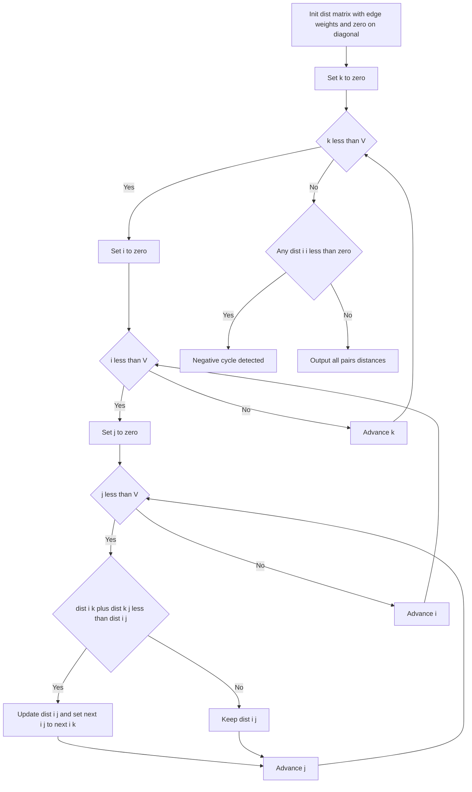

# Intro

Floyd-Warshall computes shortest paths between **every pair** of vertices in a single `O(V³)` sweep, and it handles negative edge weights (though not negative cycles — it detects those instead). It is a textbook [[Dynamic Programming]] algorithm: the sub-problem is "the shortest path from `i` to `j` that is allowed to route through only the first `k` intermediate vertices," and the answer grows by admitting one more permitted intermediate at a time. For each new intermediate `k` you ask a single question at every pair `(i, j)`: is it cheaper to keep the current path, or to go `i → k → j`?

Reach for it when you need all-pairs distances on a small-to-medium **dense** graph, or when the graph has negative edges and you want the whole distance matrix. Its charm is brevity — three nested loops and one `min` — and it beats running [[Dijkstra]] from every source on dense graphs. Do _not_ use it on large sparse graphs (`V³` dominates); there, run Dijkstra `V` times, or use Johnson's algorithm when negative edges force it.

## How It Works

Maintain a `V×V` matrix `dist` where `dist[i][j]` is the best known distance from `i` to `j`.

1. **Initialize.** `dist[i][j] = weight(i, j)` for each edge, `dist[i][i] = 0`, and `∞` everywhere else.
2. **Grow the allowed intermediate set.** For each candidate intermediate `k` from `0` to `V−1`, for every pair `(i, j)`, relax: `dist[i][j] = min(dist[i][j], dist[i][k] + dist[k][j])`.
3. **The `k`-loop MUST be the outermost loop.** After iteration `k` completes, `dist[i][j]` holds the shortest path using only intermediates drawn from `{0, …, k}`. This invariant is the whole algorithm, and it only holds if `k` is fixed while `i` and `j` sweep the full matrix. If you move `k` inside (making `i` or `j` outermost), you consult `dist[i][k]` or `dist[k][j]` values that have not yet been finalized for the current `k`, and the recurrence reads half-updated data — the results are silently wrong on many graphs even though the code still runs and terminates.
4. **In-place is safe.** The update overwrites the same 2D array rather than keeping a separate matrix per `k`. This is correct because the two cells it reads for intermediate `k` — `dist[i][k]` and `dist[k][j]` — are never improved _during_ iteration `k` (a shortest path through `k` doesn't use `k` as an intermediate of its own sub-legs, so `dist[i][k]` and `dist[k][j]` equal their values from the start of the iteration). That observation collapses the naive `O(V³)` space down to `O(V²)`.
5. **Detect negative cycles.** After the sweep, if any `dist[i][i] < 0`, vertex `i` lies on a negative cycle — a path from `i` back to itself with negative total weight.
6. **Reconstruct paths** with a companion `next[i][j]` matrix: initialize `next[i][j] = j` for each edge, and whenever the `k` relaxation improves `dist[i][j]`, set `next[i][j] = next[i][k]`. Rebuild a path by following `i → next[i][j] → …` until you reach `j`.

Complexity: `O(V³)` time (three nested `V`-length loops, always — there is no early exit), `O(V²)` space for the matrix (plus another `O(V²)` for `next` if reconstructing). Worst case equals best case; the cost is purely a function of `V`, not of edge count or weights, which makes it predictable but wasteful on sparse graphs.

**Transitive closure (Warshall's algorithm).** Replace the distance matrix with a boolean _reachability_ matrix and the `min`/`+` with OR/AND: `reach[i][j] = reach[i][j] OR (reach[i][k] AND reach[k][j])`. Same triple loop, same outer-`k` rule, answers "can `i` reach `j` at all?" for every pair.

## Example

```text
Vertices 0..3, directed edges:
  0→1 (3)   0→3 (7)
  1→0 (8)   1→2 (2)
  2→0 (5)   2→3 (1)
  3→0 (2)

dist after init (INF shown as .):
       0    1    2    3
  0 [  0    3    .    7 ]
  1 [  8    0    2    . ]
  2 [  5    .    0    1 ]
  3 [  2    .    .    0 ]

k = 0 (paths may pass through vertex 0):
  1→0→3: 8+7 = 15  -> dist[1][3] = 15
  2→0→1: 5+3 = 8   -> dist[2][1] = 8
  2→0→3: 5+7 = 12, but keep existing 1
  3→0→1: 2+3 = 5   -> dist[3][1] = 5
  3→0→3 no gain

k = 1 (now also through vertex 1):
  0→1→2: 3+2 = 5   -> dist[0][2] = 5
  2→1→2 via dist[2][1]=8 no gain
  3→1→2: 5+2 = 7   -> dist[3][2] = 7

k = 2 (now also through vertex 2):
  0→2→3: 5+1 = 6 < 7   -> dist[0][3] = 6
  1→2→3: 2+1 = 3 < 15  -> dist[1][3] = 3
  3→2→3 via dist[3][2]=7 no gain

k = 3 (now also through vertex 3):
  1→3→0: 3+2 = 5 < 8   -> dist[1][0] = 5
  2→3→0: 1+2 = 3 < 5   -> dist[2][0] = 3

Final all-pairs distances:
       0    1    2    3
  0 [  0    3    5    6 ]
  1 [  5    0    2    3 ]
  2 [  3    6    0    1 ]
  3 [  2    5    7    0 ]

No dist[i][i] < 0, so there is no negative cycle.
```

Notice how `dist[0][3]` improved from the direct edge `7` to `6` only once vertex `2` became an allowed intermediate at `k = 2` — the layered "one more intermediate" structure in action.

## Diagram



## Pitfalls

### Swapping the loop order

- **What goes wrong**: putting `i` or `j` as the outermost loop instead of `k` produces wrong distances on many graphs, yet the program compiles, runs, and terminates — so the bug hides until a specific input exposes it.
- **Why it happens**: the DP invariant "after step `k`, all paths use intermediates `≤ k`" requires the entire matrix to be updated for a fixed `k` before moving on. With `k` inside, you relax `(i, j)` using `dist[i][k]`/`dist[k][j]` cells that belong to a different, not-yet-completed stage.
- **How to avoid it**: memorize the fixed order `for k → for i → for j`, and treat `k` outermost as non-negotiable. If you ever need to justify it, recall that `k` names the _stage_ of the DP, and stages must complete before the next begins.

### Overflow when adding through infinity

- **What goes wrong**: `dist[i][k] + dist[k][j]` overflows when both operands are the `int.MaxValue` sentinel, wrapping to a negative value that then looks like a great shortcut and corrupts the matrix.
- **Why it happens**: the relaxation adds two cells unconditionally, and unreachable pairs carry the sentinel.
- **How to avoid it**: skip the relaxation when either `dist[i][k]` or `dist[k][j]` is `∞`, or use a large sentinel (e.g. a `long` well below `long.MaxValue`) that tolerates one addition without wrapping.

### Reading distances while a negative cycle is present

- **What goes wrong**: with a negative cycle in the graph, off-diagonal distances that route through the cycle are meaningless (`−∞` in truth), but the matrix reports finite numbers.
- **Why it happens**: Floyd-Warshall's `O(V³)` sweep converges only when distances are well-defined; a negative cycle breaks that, and the reported values are just where the relaxations happened to stop.
- **How to avoid it**: check the diagonal for `dist[i][i] < 0` first. If any is negative, mark every pair `(u, v)` where the path can be routed through such an `i` (i.e. `dist[u][i]` and `dist[i][v]` are finite) as `−∞` before trusting the matrix.

## Tradeoffs

| Choice | Option A | Option B | Decision criteria |
| --- | --- | --- | --- |
| Reachability only | Warshall transitive closure (boolean) | Full Floyd-Warshall (weighted) | If you only need "can `i` reach `j`," the boolean OR/AND variant is the same loop but uses bitsets for a big constant-factor win. |

## Questions

> [!QUESTION]- Why must the `k`-loop be the outermost of the three?
>
> - `dist[i][j]` after stage `k` is defined as the shortest `i`-to-`j` path using only intermediates in `{0, …, k}`.
> - That definition requires the whole matrix to finish updating for one `k` before starting the next, so `k` names a _stage_ that must complete atomically.
> - If `k` is not outermost, the relaxation reads `dist[i][k]` or `dist[k][j]` cells that belong to an unfinished stage, so the recurrence consumes half-updated data.
> - The failure is silent — the code still runs and returns numbers — which is exactly why this is the single most important thing to get right; an interviewer asks it because loop order is where real implementations quietly break.

> [!QUESTION]- Why is the in-place update on one matrix correct, giving `O(V²)` space?
>
> - The naive DP keeps a separate matrix per stage `k`, costing `O(V³)` space.
> - During stage `k`, the two cells read are `dist[i][k]` and `dist[k][j]`; neither improves _within_ stage `k`, because a shortest path through `k` never uses `k` as an intermediate of its own sub-legs.
> - So reading and writing the same array during stage `k` yields identical results to keeping a previous copy.
> - This is why the textbook algorithm is safely two-dimensional despite three loops — recognizing that the read cells are stable is what lets you drop a whole dimension of memory.

> [!QUESTION]- How does Floyd-Warshall detect a negative cycle, and how is that different from Bellman-Ford?
>
> - After the full sweep, any `dist[i][i] < 0` means there is a negative-weight path from `i` back to itself — a negative cycle through `i`.
> - It reports negative cycles for _all_ vertices at once as a by-product of the all-pairs computation, with no extra pass.
> - [[Bellman-Ford]] instead runs a dedicated `V`-th relaxation pass from one source and can walk predecessors to extract the actual cycle.
> - The practical split: use Floyd-Warshall when you already want the whole distance matrix and just need a yes/no on cycles; use Bellman-Ford when you need the concrete cycle from a specific source, as in arbitrage extraction.

## References

- [Floyd-Warshall algorithm (Wikipedia)](https://en.wikipedia.org/wiki/Floyd%E2%80%93Warshall_algorithm) — DP formulation, path reconstruction, and negative-cycle handling.
- [All-pairs shortest paths, Floyd-Warshall (cp-algorithms)](https://cp-algorithms.com/graph/all-pair-shortest-path-floyd-warshall.html) — implementation, in-place correctness, and reconstruction.
- [Johnson's algorithm (Wikipedia)](https://en.wikipedia.org/wiki/Johnson%27s_algorithm) — the sparse-graph-with-negative-edges alternative.
- [Shortest paths (Princeton Algorithms)](https://algs4.cs.princeton.edu/44sp/) — Sedgewick's treatment of shortest-path algorithms and their tradeoffs.
