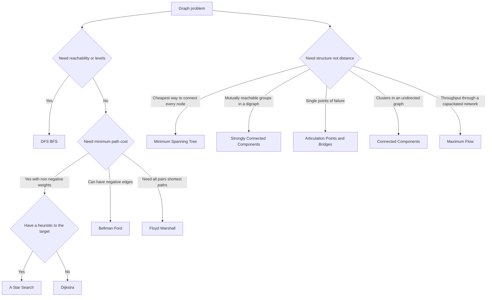

Graphs model relationships: networks, dependencies, routes, permissions, and many real-world system structures. Graph algorithms help you traverse, rank, and optimize those relationships efficiently. Example: shortest-path algorithms answer "what's the cheapest route" while BFS/DFS answer "what's reachable".

<nav style="--card-accent: 239, 68, 68;" class="folder-structure-map" aria-label="Graph Algorithms section map">
<article class="db-card folder-map-node">

<svg xmlns="http://www.w3.org/2000/svg" stroke-linejoin="round" stroke-linecap="round" stroke-width="2" stroke="currentColor" fill="none" viewBox="0 0 24 24"><path d="M14.5 2H6a2 2 0 0 0-2 2v16a2 2 0 0 0 2 2h12a2 2 0 0 0 2-2V7.5L14.5 2z"/><polyline points="14 2 14 8 20 8"/><line y2="13" y1="13" x2="8" x1="16"/><line y2="17" y1="17" x2="8" x1="16"/><line y2="9" y1="9" x2="8" x1="10"/></svg>A-Star Search

Best-first shortest-path search ordering its frontier by f(n) = g(n) + h(n), optimal when the heuristic is admissible.

<a class="internal-link" href="Home/Computer Science/Algorithms/Graph Algorithms/A-Star Search.md" data-tooltip-position="top" aria-label="A-Star Search">A-Star Search</a></article><article class="db-card folder-map-node">

<svg xmlns="http://www.w3.org/2000/svg" stroke-linejoin="round" stroke-linecap="round" stroke-width="2" stroke="currentColor" fill="none" viewBox="0 0 24 24"><path d="M14.5 2H6a2 2 0 0 0-2 2v16a2 2 0 0 0 2 2h12a2 2 0 0 0 2-2V7.5L14.5 2z"/><polyline points="14 2 14 8 20 8"/><line y2="13" y1="13" x2="8" x1="16"/><line y2="17" y1="17" x2="8" x1="16"/><line y2="9" y1="9" x2="8" x1="10"/></svg>Articulation Points and Bridges

A single DFS finds all cut vertices and cut edges, the points whose removal disconnects an undirected graph, in O(V+E).

<a class="internal-link" href="Home/Computer Science/Algorithms/Graph Algorithms/Articulation Points and Bridges.md" data-tooltip-position="top" aria-label="Articulation Points and Bridges">Articulation Points and Bridges</a></article><article class="db-card folder-map-node">

<svg xmlns="http://www.w3.org/2000/svg" stroke-linejoin="round" stroke-linecap="round" stroke-width="2" stroke="currentColor" fill="none" viewBox="0 0 24 24"><path d="M14.5 2H6a2 2 0 0 0-2 2v16a2 2 0 0 0 2 2h12a2 2 0 0 0 2-2V7.5L14.5 2z"/><polyline points="14 2 14 8 20 8"/><line y2="13" y1="13" x2="8" x1="16"/><line y2="17" y1="17" x2="8" x1="16"/><line y2="9" y1="9" x2="8" x1="10"/></svg>Bellman-Ford

Single-source shortest paths with negative edges, relaxing every edge V-1 times and detecting negative cycles.

<a class="internal-link" href="Home/Computer Science/Algorithms/Graph Algorithms/Bellman-Ford.md" data-tooltip-position="top" aria-label="Bellman-Ford">Bellman-Ford</a></article><article class="db-card folder-map-node">

<svg xmlns="http://www.w3.org/2000/svg" stroke-linejoin="round" stroke-linecap="round" stroke-width="2" stroke="currentColor" fill="none" viewBox="0 0 24 24"><path d="M14.5 2H6a2 2 0 0 0-2 2v16a2 2 0 0 0 2 2h12a2 2 0 0 0 2-2V7.5L14.5 2z"/><polyline points="14 2 14 8 20 8"/><line y2="13" y1="13" x2="8" x1="16"/><line y2="17" y1="17" x2="8" x1="16"/><line y2="9" y1="9" x2="8" x1="10"/></svg>Bidirectional Search

Runs forward and backward searches that meet in the middle, cutting O(b^d) to two O(b^(d/2)) halves.

<a class="internal-link" href="Home/Computer Science/Algorithms/Graph Algorithms/Bidirectional Search.md" data-tooltip-position="top" aria-label="Bidirectional Search">Bidirectional Search</a></article><article class="db-card folder-map-node">

<svg xmlns="http://www.w3.org/2000/svg" stroke-linejoin="round" stroke-linecap="round" stroke-width="2" stroke="currentColor" fill="none" viewBox="0 0 24 24"><path d="M14.5 2H6a2 2 0 0 0-2 2v16a2 2 0 0 0 2 2h12a2 2 0 0 0 2-2V7.5L14.5 2z"/><polyline points="14 2 14 8 20 8"/><line y2="13" y1="13" x2="8" x1="16"/><line y2="17" y1="17" x2="8" x1="16"/><line y2="9" y1="9" x2="8" x1="10"/></svg>Borůvka's Algorithm

<a class="internal-link" href="Home/Computer Science/Algorithms/Graph Algorithms/Borůvka's Algorithm.md" data-tooltip-position="top" aria-label="Borůvka's Algorithm">Borůvka's Algorithm</a></article><article class="db-card folder-map-node">

<svg xmlns="http://www.w3.org/2000/svg" stroke-linejoin="round" stroke-linecap="round" stroke-width="2" stroke="currentColor" fill="none" viewBox="0 0 24 24"><path d="M14.5 2H6a2 2 0 0 0-2 2v16a2 2 0 0 0 2 2h12a2 2 0 0 0 2-2V7.5L14.5 2z"/><polyline points="14 2 14 8 20 8"/><line y2="13" y1="13" x2="8" x1="16"/><line y2="17" y1="17" x2="8" x1="16"/><line y2="9" y1="9" x2="8" x1="10"/></svg>Connected Components

<a class="internal-link" href="Home/Computer Science/Algorithms/Graph Algorithms/Connected Components.md" data-tooltip-position="top" aria-label="Connected Components">Connected Components</a></article><article class="db-card folder-map-node">

<svg xmlns="http://www.w3.org/2000/svg" stroke-linejoin="round" stroke-linecap="round" stroke-width="2" stroke="currentColor" fill="none" viewBox="0 0 24 24"><path d="M14.5 2H6a2 2 0 0 0-2 2v16a2 2 0 0 0 2 2h12a2 2 0 0 0 2-2V7.5L14.5 2z"/><polyline points="14 2 14 8 20 8"/><line y2="13" y1="13" x2="8" x1="16"/><line y2="17" y1="17" x2="8" x1="16"/><line y2="9" y1="9" x2="8" x1="10"/></svg>DFS BFS

The two fundamental O(V + E) graph traversals: BFS gives distance ordering by layers, DFS gives depth ordering.

<a class="internal-link" href="Home/Computer Science/Algorithms/Graph Algorithms/DFS BFS.md" data-tooltip-position="top" aria-label="DFS BFS">DFS BFS</a></article><article class="db-card folder-map-node">

<svg xmlns="http://www.w3.org/2000/svg" stroke-linejoin="round" stroke-linecap="round" stroke-width="2" stroke="currentColor" fill="none" viewBox="0 0 24 24"><path d="M14.5 2H6a2 2 0 0 0-2 2v16a2 2 0 0 0 2 2h12a2 2 0 0 0 2-2V7.5L14.5 2z"/><polyline points="14 2 14 8 20 8"/><line y2="13" y1="13" x2="8" x1="16"/><line y2="17" y1="17" x2="8" x1="16"/><line y2="9" y1="9" x2="8" x1="10"/></svg>Dijkstra

Single-source shortest paths on non-negative-weighted graphs, greedily finalizing the closest tentative node and relaxing its outgoing edges.

<a class="internal-link" href="Home/Computer Science/Algorithms/Graph Algorithms/Dijkstra.md" data-tooltip-position="top" aria-label="Dijkstra">Dijkstra</a></article><article class="db-card folder-map-node">

<svg xmlns="http://www.w3.org/2000/svg" stroke-linejoin="round" stroke-linecap="round" stroke-width="2" stroke="currentColor" fill="none" viewBox="0 0 24 24"><path d="M14.5 2H6a2 2 0 0 0-2 2v16a2 2 0 0 0 2 2h12a2 2 0 0 0 2-2V7.5L14.5 2z"/><polyline points="14 2 14 8 20 8"/><line y2="13" y1="13" x2="8" x1="16"/><line y2="17" y1="17" x2="8" x1="16"/><line y2="9" y1="9" x2="8" x1="10"/></svg>Floyd-Warshall

Dynamic-programming all-pairs shortest paths in a single O(V³) sweep that handles negative edges and detects negative cycles.

<a class="internal-link" href="Home/Computer Science/Algorithms/Graph Algorithms/Floyd-Warshall.md" data-tooltip-position="top" aria-label="Floyd-Warshall">Floyd-Warshall</a></article><article class="db-card folder-map-node">

<svg xmlns="http://www.w3.org/2000/svg" stroke-linejoin="round" stroke-linecap="round" stroke-width="2" stroke="currentColor" fill="none" viewBox="0 0 24 24"><path d="M14.5 2H6a2 2 0 0 0-2 2v16a2 2 0 0 0 2 2h12a2 2 0 0 0 2-2V7.5L14.5 2z"/><polyline points="14 2 14 8 20 8"/><line y2="13" y1="13" x2="8" x1="16"/><line y2="17" y1="17" x2="8" x1="16"/><line y2="9" y1="9" x2="8" x1="10"/></svg>Greedy Best-First Search

Expands whichever node looks closest by heuristic h(n) alone; fast but neither optimal nor complete.

<a class="internal-link" href="Home/Computer Science/Algorithms/Graph Algorithms/Greedy Best-First Search.md" data-tooltip-position="top" aria-label="Greedy Best-First Search">Greedy Best-First Search</a></article><article class="db-card folder-map-node">

<svg xmlns="http://www.w3.org/2000/svg" stroke-linejoin="round" stroke-linecap="round" stroke-width="2" stroke="currentColor" fill="none" viewBox="0 0 24 24"><path d="M14.5 2H6a2 2 0 0 0-2 2v16a2 2 0 0 0 2 2h12a2 2 0 0 0 2-2V7.5L14.5 2z"/><polyline points="14 2 14 8 20 8"/><line y2="13" y1="13" x2="8" x1="16"/><line y2="17" y1="17" x2="8" x1="16"/><line y2="9" y1="9" x2="8" x1="10"/></svg>Hamiltonian Cycle

<a class="internal-link" href="Home/Computer Science/Algorithms/Graph Algorithms/Hamiltonian Cycle.md" data-tooltip-position="top" aria-label="Hamiltonian Cycle">Hamiltonian Cycle</a></article><article class="db-card folder-map-node">

<svg xmlns="http://www.w3.org/2000/svg" stroke-linejoin="round" stroke-linecap="round" stroke-width="2" stroke="currentColor" fill="none" viewBox="0 0 24 24"><path d="M14.5 2H6a2 2 0 0 0-2 2v16a2 2 0 0 0 2 2h12a2 2 0 0 0 2-2V7.5L14.5 2z"/><polyline points="14 2 14 8 20 8"/><line y2="13" y1="13" x2="8" x1="16"/><line y2="17" y1="17" x2="8" x1="16"/><line y2="9" y1="9" x2="8" x1="10"/></svg>Kruskal's Algorithm

<a class="internal-link" href="Home/Computer Science/Algorithms/Graph Algorithms/Kruskal's Algorithm.md" data-tooltip-position="top" aria-label="Kruskal's Algorithm">Kruskal's Algorithm</a></article><article class="db-card folder-map-node">

<svg xmlns="http://www.w3.org/2000/svg" stroke-linejoin="round" stroke-linecap="round" stroke-width="2" stroke="currentColor" fill="none" viewBox="0 0 24 24"><path d="M14.5 2H6a2 2 0 0 0-2 2v16a2 2 0 0 0 2 2h12a2 2 0 0 0 2-2V7.5L14.5 2z"/><polyline points="14 2 14 8 20 8"/><line y2="13" y1="13" x2="8" x1="16"/><line y2="17" y1="17" x2="8" x1="16"/><line y2="9" y1="9" x2="8" x1="10"/></svg>Maximum Flow

Finds the greatest s-to-t throughput in a capacitated network by repeatedly augmenting paths in a residual graph.

<a class="internal-link" href="Home/Computer Science/Algorithms/Graph Algorithms/Maximum Flow.md" data-tooltip-position="top" aria-label="Maximum Flow">Maximum Flow</a></article><article class="db-card folder-map-node">

<svg xmlns="http://www.w3.org/2000/svg" stroke-linejoin="round" stroke-linecap="round" stroke-width="2" stroke="currentColor" fill="none" viewBox="0 0 24 24"><path d="M14.5 2H6a2 2 0 0 0-2 2v16a2 2 0 0 0 2 2h12a2 2 0 0 0 2-2V7.5L14.5 2z"/><polyline points="14 2 14 8 20 8"/><line y2="13" y1="13" x2="8" x1="16"/><line y2="17" y1="17" x2="8" x1="16"/><line y2="9" y1="9" x2="8" x1="10"/></svg>Minimum Spanning Tree

The cheapest cycle-free edge set connecting every vertex of a weighted undirected graph, built greedily by Kruskal's or Prim's.

<a class="internal-link" href="Home/Computer Science/Algorithms/Graph Algorithms/Minimum Spanning Tree.md" data-tooltip-position="top" aria-label="Minimum Spanning Tree">Minimum Spanning Tree</a></article><article class="db-card folder-map-node">

<svg xmlns="http://www.w3.org/2000/svg" stroke-linejoin="round" stroke-linecap="round" stroke-width="2" stroke="currentColor" fill="none" viewBox="0 0 24 24"><path d="M14.5 2H6a2 2 0 0 0-2 2v16a2 2 0 0 0 2 2h12a2 2 0 0 0 2-2V7.5L14.5 2z"/><polyline points="14 2 14 8 20 8"/><line y2="13" y1="13" x2="8" x1="16"/><line y2="17" y1="17" x2="8" x1="16"/><line y2="9" y1="9" x2="8" x1="10"/></svg>Strongly Connected Components

Maximal mutually-reachable vertex sets of a digraph, found in O(V+E) by Kosaraju's or Tarjan's.

<a class="internal-link" href="Home/Computer Science/Algorithms/Graph Algorithms/Strongly Connected Components.md" data-tooltip-position="top" aria-label="Strongly Connected Components">Strongly Connected Components</a></article><article class="db-card folder-map-node">

<svg xmlns="http://www.w3.org/2000/svg" stroke-linejoin="round" stroke-linecap="round" stroke-width="2" stroke="currentColor" fill="none" viewBox="0 0 24 24"><path d="M14.5 2H6a2 2 0 0 0-2 2v16a2 2 0 0 0 2 2h12a2 2 0 0 0 2-2V7.5L14.5 2z"/><polyline points="14 2 14 8 20 8"/><line y2="13" y1="13" x2="8" x1="16"/><line y2="17" y1="17" x2="8" x1="16"/><line y2="9" y1="9" x2="8" x1="10"/></svg>Topological Sort

Linear ordering of a DAG's vertices that places every edge's source before its target, sequencing dependencies first.

<a class="internal-link" href="Home/Computer Science/Algorithms/Graph Algorithms/Topological Sort.md" data-tooltip-position="top" aria-label="Topological Sort">Topological Sort</a></article>
</nav>

# Diagram

# Algorithm Selection

## Shortest path

| Algorithm | Solves | Time | Constraint |
| --- | --- | --- | --- |
| [[DFS BFS]] | Reachability, shortest path by edge count | O(V + E) | Unweighted graphs |
| [[DFS BFS]] | Cycle detection, topological sort, components | O(V + E) | Any graph |
| [[Dijkstra]] | Single-source shortest path | O((V + E) log V) | Non-negative weights |
| [[A-Star Search\|A* Search]] | Point-to-point shortest path | O((V + E) log V), far fewer nodes expanded | Non-negative weights **and** an admissible heuristic |
| [[Greedy Best-First Search]] | Fast point-to-point path, not optimal | O((V + E) log V) | Heuristic only; sacrifices optimality for speed |
| [[Bidirectional Search]] | Point-to-point shortest path | O(b^(d/2)) vs O(b^d) | Target known; graph must be reversible |
| [[Bellman-Ford]] | Single-source shortest path | O(V·E) | Handles negative edges; detects negative cycles |
| [[Floyd-Warshall]] | All-pairs shortest path | O(V³) time, Θ(V²) space | Small/dense graphs; detects negative cycles |

## Structure and connectivity

| Algorithm | Solves | Time | Constraint |
| --- | --- | --- | --- |
| [[Minimum Spanning Tree]] | Cheapest edge set connecting all vertices | O(E log V) | Connected, undirected, weighted |
| [[Topological Sort]] | Linear order respecting dependencies | O(V + E) | Directed acyclic graph |
| [[Strongly Connected Components]] | Maximal mutually-reachable vertex sets | O(V + E) | Directed graphs |
| [[Connected Components]] | Maximal connected vertex sets | O(V + E) | Undirected graphs |
| [[Articulation Points and Bridges]] | Cut vertices and cut edges | O(V + E) | Undirected graphs |
| [[Maximum Flow]] | Max s–t throughput; min cut | O(V·E²) (Edmonds–Karp) | Capacitated network |

> [!NOTE]
> Not every graph problem admits a polynomial algorithm. [[Hamiltonian Cycle]] — visit every vertex exactly once and return to the start — is **NP-complete**, so it sits outside the selection tables above: there is no known efficient algorithm to choose, only exponential search and heuristics.

# Questions

> [!QUESTION]- When do you pick BFS over DFS?
>
> - BFS is preferred for shortest path by edge count in unweighted graphs.
> - DFS is preferred for deep traversal tasks like cycle detection and topological ordering.
> - BFS uses more memory on wide graphs because of the frontier queue.
> - Both are O(V+E), so pick by the property you need, not by speed: BFS guarantees shortest paths but its frontier can hold a whole layer; DFS uses depth-bounded memory but gives no distance guarantee.

> [!QUESTION]- Why is Dijkstra not valid with negative edges?
>
> - Dijkstra assumes once a node is finalized, its best distance is known.
> - Negative edges can later produce a shorter route to a finalized node.
> - Bellman Ford handles negative edges by repeated relaxation.
> - Dijkstra is faster (O((V+E) log V)) but only valid with non-negative weights; Bellman–Ford accepts negative edges at O(V·E) — pay the slower cost only when weights can go negative.

> [!QUESTION]- Adjacency list or adjacency matrix?
>
> - Adjacency list is the default for sparse graphs (most real-world graphs): O(V+E) space and efficient neighbor iteration.
> - Adjacency matrix uses O(V²) space but answers "is there an edge A→B?" in O(1).
> - In .NET, `Dictionary<T, List<T>>` is a common adjacency-list implementation.
> - The list saves memory and speeds traversal on sparse graphs; the matrix trades O(V²) memory for constant-time edge checks, so reach for it only on dense graphs or edge-query-heavy workloads.

# References

- [Graph algorithm (Wikipedia)](https://en.wikipedia.org/wiki/Graph_algorithm)
- [Introduction to algorithms graph lectures MIT](https://ocw.mit.edu/courses/6-006-introduction-to-algorithms-spring-2020/pages/lecture-notes/)
- [Graph algorithms cp algorithms](https://cp-algorithms.com/graph/)
- [Graph algorithms (Sedgewick and Wayne, Algorithms 4th ed.)](https://algs4.cs.princeton.edu/40graphs/) — Practitioner-oriented chapter covering graph representations, traversal implementations, and shortest-path algorithms with Java code and performance analysis.
