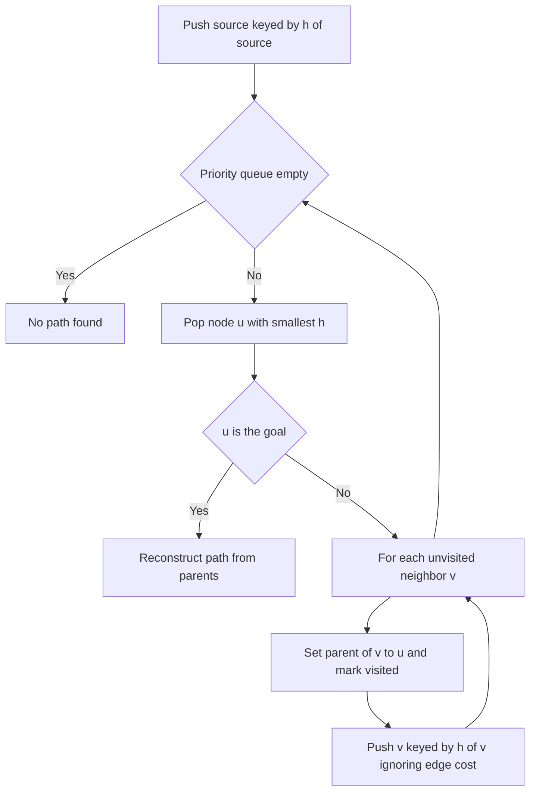

# Intro

Greedy Best-First Search (GBFS) expands whichever frontier node _looks_ closest to the goal, ranking the priority queue by the heuristic `h(n)` alone — the estimated remaining cost — and ignoring `g(n)`, the cost already paid to get there. This single-minded focus makes it fast: on an open map it charges almost straight at the goal, expanding far fewer nodes than any cost-aware search. The catch is that it never reconsiders how expensive the road behind it was, so it is **neither optimal** (the path it returns can be much longer than the shortest) **nor complete** on infinite graphs (it can chase a forever-improving heuristic down a fruitless branch and never terminate).

The clean way to see GBFS is as one extreme of a spectrum. At the other extreme sits [[Dijkstra]], which ranks purely by `g` and ignores the goal entirely — slow but optimal. [[A-Start Search|A* Search]] is the principled middle: it ranks by `f = g + h`, keeping GBFS's goal-seeking pull while restoring optimality. Reach for GBFS only when you need _a_ path fast and don't care that it's suboptimal — some level-of-detail game AI, quick reachability probes, or as the inner loop of a larger anytime planner. When the path cost actually matters, use [[A-Start Search|A* Search]] instead; the extra bookkeeping of tracking `g` is cheap and buys you correctness.

## How It Works

1. Initialize the priority queue with `source`, keyed by `h(source)`. Track visited nodes to avoid re-expansion.
2. Pop the node `u` with the smallest `h(u)` — the one the heuristic thinks is closest to the goal. If `u` is the goal, reconstruct the path and stop.
3. For each unvisited neighbor `v`, set `parent[v] = u`, mark `v` visited, and push `v` keyed by `h(v)`. The edge weight `w(u, v)` is never consulted.
4. Repeat until the goal is popped or the queue empties (no path found).

The defining move is in step 3: because the queue key is `h(v)` and not `g[v] + h(v)`, GBFS has no memory of accumulated cost. It commits to the direction that minimizes estimated distance-to-goal at each step, which is exactly why it is fast and exactly why it can be fooled.

Complexity: worst case `O(b^m)` time and space where `b` is the branching factor and `m` the maximum depth — the same bound as an uninformed search when the heuristic misleads. With a good heuristic on a well-behaved map it approaches `O(b·d)`, expanding close to a straight line of `d` nodes to the goal. Like [[A-Start Search|A* Search]], it holds every generated node in memory, so space is the practical ceiling.

## Example

```text
4-connected grid. S = start, G = goal, # = wall (a concave "U" trap).
Heuristic h = Manhattan distance to G.

  col: 0 1 2 3 4
row0:  . . . . .
row1:  . S # G .
row2:  . . # . .
row3:  . . # . .

From S(1,1), h = |1-1| + |1-3| = 2.
GBFS wants to move straight toward G, but column 2 is a wall, so the cell
that would most shrink h is blocked. Among reachable neighbors it takes the
best available h and detours UP and OVER the top of the wall:

  S(1,1) -> (0,1) h=3 -> (0,2) h=2 -> (0,3) h=1 -> (1,3)=G.

That works here. Now block the top too (wall across row0 col2): the greedy
pull keeps steering GBFS back toward the wall face nearest G, and it wastes
expansions oscillating along the barrier before finally escaping around the
long way. A* avoids this: because it also counts g, once the short-looking
route proves expensive it lets a "further-looking" but genuinely cheaper
detour overtake it.
```

The concave-obstacle failure mode is the signature weakness: a wall that cups the goal lures GBFS into the pocket because every cell inside it has a tempting low `h`, and it must thrash along the barrier before it discovers the long way around.

## Diagram



## Pitfalls

### Returns a suboptimal path and never signals it

- **What goes wrong**: GBFS terminates with a valid path that can be dramatically longer than the shortest one, with no indication anything is wrong.
- **Why it happens**: ranking by `h` alone means the algorithm optimizes "get closer to the goal now," never "minimize total cost." A locally attractive step can commit it to an expensive route.
- **How to avoid it**: if path cost matters at all, use [[A-Start Search|A* Search]] — adding `g` to the key is the entire fix. Reserve GBFS for cases where any path is acceptable.

### Concave obstacles cause thrashing

- **What goes wrong**: a wall shaped like a pocket around the goal traps GBFS — it repeatedly expands cells hugging the barrier because they score low on `h`, wasting work before escaping.
- **Why it happens**: the heuristic points straight at the goal, but the obstacle blocks that direction; without cost awareness GBFS keeps re-committing to the blocked heading.
- **How to avoid it**: use a cost-aware search (A\* or [[Dijkstra]]) on maps with concave geometry, or precompute a better heuristic that reflects obstacles (e.g., a flow field / navigation mesh distance).

### Incompleteness on infinite or unbounded graphs

- **What goes wrong**: on an infinite graph, or a finite one without visited-tracking, GBFS can follow an endlessly-improving heuristic down a branch that never reaches the goal and never terminate.
- **Why it happens**: with no bound from `g`, nothing forces the search to eventually exhaust a fruitless region; a monotically decreasing `h` estimate can lead it astray forever.
- **How to avoid it**: maintain a visited/closed set to guarantee finite graphs terminate, and prefer A\* on unbounded state spaces where completeness matters.

## Tradeoffs

| Choice | Greedy Best-First | Alternative | Decision criteria |
| --- | --- | --- | --- |
| vs [[A-Start Search\|A* Search]] | Ranks by `h`, fast, suboptimal, incomplete | Ranks by `g + h`, optimal with admissible `h` | Use GBFS only when any valid path is fine; use A\* whenever total path cost matters — the `g` term is cheap insurance. |
| vs [[Dijkstra]] | Goal-directed, ignores accumulated cost | Ignores the goal, ranks by `g`, optimal | GBFS and Dijkstra are the two extremes; pick GBFS for raw speed toward a known goal, Dijkstra for correctness or all-pairs with no heuristic. |
| Map geometry | Great on open maps, thrashes on concave obstacles | A\* handles concave geometry correctly | On maps with pockets or mazes, the greedy pull backfires — switch to a cost-aware search. |

Consistent with the [[A-Start Search|A* Search]] and [[Dijkstra]] tradeoff tables: GBFS is the pure-`h` end, Dijkstra the pure-`g` end, and A\* the tunable blend. Weighted A\* with a large weight `ε` behaves _almost_ like GBFS while still tracking `g`, which is usually the better way to buy speed without fully surrendering optimality.

## Questions

> [!QUESTION]- Why is Greedy Best-First Search neither optimal nor complete?
>
> - It orders the frontier by `h(n)` alone, the estimated cost to the goal, and never accounts for `g(n)`, the cost already spent.
> - Because it ignores accumulated cost, a locally attractive step can lock it into a globally expensive path — so the returned path can be far from shortest (not optimal).
> - On an infinite graph, or without a visited set, it can chase an ever-improving heuristic down a fruitless branch forever (not complete).
> - The takeaway: GBFS trades every correctness guarantee for speed, so it only belongs where "any path, fast" is genuinely acceptable — otherwise [[A-Start Search|A* Search]] gives you the same goal-seeking behavior with optimality restored.

> [!QUESTION]- Where does GBFS sit on the spectrum between Dijkstra and A\*?
>
> - [[Dijkstra]] ranks purely by `g` (cost-so-far) and ignores the goal — optimal but explores in all directions.
> - GBFS ranks purely by `h` (cost-to-go) and ignores accumulated cost — fast toward the goal but suboptimal and incomplete.
> - [[A-Start Search|A* Search]] ranks by `f = g + h`, combining both — the principled middle that keeps GBFS's goal pull while regaining optimality.
> - Seeing the three as one family clarifies design choices: you're really tuning how much to trust the heuristic, and weighted A\* lets you dial continuously between the A\* middle and the greedy extreme.

> [!QUESTION]- What is the concave-obstacle failure mode and how do you avoid it?
>
> - A wall shaped like a pocket around the goal gives every cell inside it a low `h`, so GBFS is lured in.
> - Once inside, the direct heading to the goal is blocked, and with no cost awareness GBFS thrashes along the barrier re-committing to the blocked direction before escaping the long way.
> - Avoid it by using a cost-aware search (A\* or [[Dijkstra]]) on maps with concave geometry, or by precomputing an obstacle-aware heuristic like a navigation-mesh distance.
> - It illustrates that a heuristic is only a hint: when map geometry contradicts the straight-line estimate, pure greedy search pays for its lack of memory — which is exactly the case A\* was designed to handle.

## References

- [Best-first search (Wikipedia)](https://en.wikipedia.org/wiki/Best-first_search) — greedy best-first as a special case of best-first search and its relation to A\*.
- [Heuristics (Amit's A\* Pages, Stanford)](https://theory.stanford.edu/~amitp/GameProgramming/Heuristics.html) — how heuristic weighting slides between Dijkstra, A\*, and greedy behavior.
- [Introduction to A\* (Red Blob Games)](https://www.redblobgames.com/pathfinding/a-star/introduction.html) — side-by-side interactive comparison of Greedy Best-First, Dijkstra, and A\* on the same grid.
