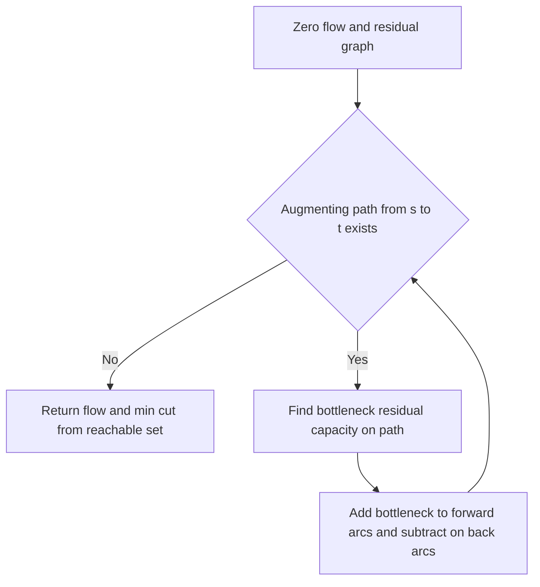

# Intro

A **flow network** is a directed graph where each edge has a **capacity** and we push flow from a source `s` to a sink `t`. A valid flow obeys two rules: **capacity** (flow on an edge never exceeds its capacity) and **conservation** (at every vertex except `s` and `t`, flow in equals flow out). The **maximum-flow** problem asks for the greatest total flow from `s` to `t` — think maximum throughput of a pipe/road/bandwidth network, or, via reductions, bipartite matching, project selection, and image segmentation.

The whole family is built on one [[Greedy Algorithms|greedy]] idea made correct by one trick. Repeatedly find an **augmenting path** from `s` to `t` with spare capacity and push flow along it. Naive greedy fails because an early path can commit flow to a suboptimal edge; the fix is the **residual graph**, which adds a **back-edge** for every unit of flow sent. The back-edge lets a later augmenting path _cancel_ earlier flow — greedy with an undo button. **Ford–Fulkerson** is this loop with any augmenting path; **Edmonds–Karp** always picks the _shortest_ augmenting path with a [[DFS BFS|BFS]], which bounds the number of iterations. Reach for max-flow when a problem reduces to routing a divisible resource under capacity limits; if capacities are all 1 and you just want connectivity, plain BFS/DFS suffices.

## How It Works

The residual graph is the engine. For an edge `u → v` with capacity `c` carrying flow `f`, the residual graph holds two arcs: a forward arc `u → v` with residual capacity `c − f` (room left), and a backward arc `v → u` with residual capacity `f` (flow that can be undone). An augmenting path is any `s → t` path in the residual graph; its bottleneck is the minimum residual capacity along it; pushing that bottleneck adds to forward arcs and subtracts from back-arcs.

1. Start with zero flow. Build the residual graph (initially forward capacities only).
2. Find an augmenting path `s → t` in the residual graph. If none exists, stop.
3. Push the bottleneck residual capacity along the path: `+bottleneck` on each forward arc used, `−bottleneck` recorded as the paired back-arc.
4. Repeat.

**Why back-edges make greedy correct.** Sending flow through a _back_-arc `v → u` means "retract some of the flow previously sent `u → v` and reroute it." Without back-edges, a bad first choice is permanent and the algorithm can wedge below the optimum; with them, every locally-committed decision stays revisable, and the loop cannot terminate until no `s → t` path remains — which, by the theorem below, is exactly the maximum.

**Max-flow min-cut theorem.** An `s`-`t` **cut** partitions vertices into a set `S` containing `s` and `T` containing `t`; its capacity is the total capacity of edges crossing `S → T`. The value of any flow is at most the capacity of any cut, and the theorem states the _maximum_ flow equals the _minimum_ cut capacity. This gives both an optimality certificate and a way to **recover the min cut**: after the algorithm halts, let `S` be the set of vertices still reachable from `s` in the final residual graph; the edges from `S` to `T` in the _original_ graph are the min cut, and they are all saturated.

- **Ford–Fulkerson** with arbitrary path selection: `O(E · f*)` where `f*` is the max-flow value, because each augmentation adds at least 1 unit (for integer capacities) and each path search is `O(E)`. On **irrational** capacities with an unlucky path choice it can converge to a wrong value or **never terminate**.
- **Edmonds–Karp** picks the shortest augmenting path (fewest edges) via BFS. The BFS distance from `s` to any vertex never decreases across augmentations, which caps the total number of augmentations at `O(V·E)`; each BFS is `O(E)`, giving `O(V·E²)` **independent of capacities**.
- **Dinic's algorithm** is the practical next step: it builds a BFS level graph and pushes _blocking flows_, reaching `O(V²·E)` in general and `O(E·√V)` on unit-capacity graphs — the go-to for bipartite matching at scale.

## Example

A hand trace showing a back-edge undo the greedy first path. Graph (all capacities 1): `s→a, s→b, a→b, a→t, b→t`. Max flow is 2 (the cut `{s}` has outgoing capacity `s→a + s→b = 2`).

```text
Residual capacities start equal to capacities. Pick paths arbitrarily (Ford-Fulkerson).

Augment 1: path s -> a -> b -> t, bottleneck = 1
  push 1: s->a full, a->b full, b->t full
  residual back-arcs appear: a->s, b->a, t->b  (each capacity 1)
  flow = 1

Augment 2: forward s->a is full and b->t is full, but a BACK-arc is open.
  path s -> b -> a -> t
    s->b  : forward, residual 1  ok
    b->a  : BACK-arc, residual 1  (cancels the a->b flow sent in Augment 1)
    a->t  : forward, residual 1  ok
  bottleneck = 1, push 1
  net effect: a->b flow returns to 0; s->a->t and s->b->t each carry 1
  flow = 2

No s -> t path remains in the residual graph. Max flow = 2.

Min cut: vertices reachable from s in the final residual = {s} only
  (s->a and s->b are both saturated). Cut edges s->a, s->b, capacity 2 = max flow.
```

The middle edge `a→b` looked useful in Augment 1 but was wrong; the back-arc `b→a` in Augment 2 quietly undoes it. Without residual back-edges the algorithm would have stalled at flow 1.

## Diagram



## Pitfalls

### Ford–Fulkerson may not terminate on irrational capacities

- **What goes wrong**: with irrational edge capacities and a pathological choice of augmenting paths, the flow value can increase by ever-smaller amounts and converge to a number strictly below the true maximum — or loop forever.
- **Why it happens**: the `O(E · f*)` bound assumes each augmentation adds at least one whole unit, which only holds for integer (or rational, after scaling) capacities.
- **How to avoid it**: use Edmonds–Karp (shortest-path augmentation) whose `O(V·E²)` bound is independent of capacity values, or scale rational capacities to integers.

### Forgetting to update the paired back-edge

- **What goes wrong**: pushing flow on a forward arc without incrementing its residual back-arc (or vice versa) makes the "undo" impossible, and the algorithm returns a flow below the maximum.
- **Why it happens**: implementations that store edges separately lose the pairing between an arc and its reverse.
- **How to avoid it**: store each edge and its reverse adjacently (the standard trick: keep an edge array and access the reverse as `index XOR 1`) so pushing `+f` on one always applies `−f` to its partner.

### Reading the min cut from the wrong graph

- **What goes wrong**: taking the reachable set `S` from `s` and then listing crossing edges from the _residual_ graph, or including back-arcs, yields the wrong cut edges or capacity.
- **Why it happens**: the reachable set is computed on the _final residual_ graph, but the cut edges and their capacities come from the _original_ graph.
- **How to avoid it**: compute `S` = vertices reachable from `s` in the final residual graph, then report original edges `u → v` with `u in S` and `v in T`; these are exactly the saturated min-cut edges.

## Tradeoffs

| Choice | Ford–Fulkerson (any path) | Edmonds–Karp (BFS shortest path) | Decision criteria |
| --- | --- | --- | --- |
| Complexity | `O(E · f*)`, scales with the flow value | `O(V·E²)`, independent of capacities | Prefer Edmonds–Karp when capacities are large or non-integer; Ford–Fulkerson only wins when `f*` is tiny. |
| Termination | May not terminate on irrational capacities | Always terminates | If capacities are not guaranteed integer, Edmonds–Karp (or scaling) is mandatory. |
| Path search | DFS or any path finder | [[DFS BFS\|BFS]] for fewest-edge path | The BFS choice is what buys the capacity-independent bound; it is not an optional detail. |
| Both vs Dinic's | Simpler to implement | — | For large graphs or bipartite matching, skip both and use Dinic's `O(V²·E)` (or `O(E·√V)` unit-capacity) blocking-flow approach. |

## Questions

> [!QUESTION]- Why do residual back-edges make the greedy augmenting-path approach correct?
>
> - A greedy first augmenting path can commit flow to an edge that a better solution would not use, and capacity constraints then block the optimum.
> - Each unit of forward flow `u → v` creates a residual back-arc `v → u` of equal residual capacity.
> - A later augmenting path can traverse that back-arc to retract and reroute the earlier flow — an undo operation.
> - This is what lets the loop keep going until no `s → t` path remains; without back-edges the algorithm can wedge strictly below the maximum, so the back-edge is the whole reason greedy augmentation is provably optimal.

> [!QUESTION]- State the max-flow min-cut theorem and explain how to recover the minimum cut.
>
> - An `s`-`t` cut splits vertices into `S` (with `s`) and `T` (with `t`); its capacity is the total capacity of edges crossing `S → T`.
> - Any flow value is at most any cut capacity (weak duality); the theorem says the maximum flow equals the minimum cut capacity.
> - After the algorithm halts, let `S` be the vertices reachable from `s` in the final residual graph; the original edges from `S` to `T` are the min cut and are all saturated.
> - This gives a checkable optimality certificate and turns max-flow into a min-cut solver, which is exactly how segmentation and project-selection problems are attacked.

> [!QUESTION]- Why is Edmonds–Karp `O(V·E²)` while Ford–Fulkerson is only `O(E · f*)`?
>
> - Ford–Fulkerson bounds iterations by the flow value `f*` because each augmentation adds at least one unit — a bound that blows up with large capacities and fails entirely on irrational ones.
> - Edmonds–Karp always augments along the shortest (fewest-edge) path via BFS.
> - Under shortest-path augmentation the BFS distance from `s` to any vertex never decreases, and each edge can be the bottleneck only `O(V)` times, capping augmentations at `O(V·E)`.
> - With `O(E)` per BFS that is `O(V·E²)`, crucially **independent of capacity magnitudes** — the reason it is preferred whenever capacities are large or non-integer.

## References

- [Maximum flow problem (Wikipedia)](https://en.wikipedia.org/wiki/Maximum_flow_problem) — flow networks, the min-cut duality, and the algorithm family.
- [Maximum flow: Ford–Fulkerson and Edmonds–Karp (cp-algorithms)](https://cp-algorithms.com/graph/edmonds_karp.html) — residual graphs, both algorithms, and the `index XOR 1` reverse-edge trick.
- [Max-flow min-cut theorem (Wikipedia)](https://en.wikipedia.org/wiki/Max-flow_min-cut_theorem) — statement, proof sketch, and cut recovery.
- [Dinic's algorithm (cp-algorithms)](https://cp-algorithms.com/graph/dinic.html) — the blocking-flow successor and its bipartite-matching bound.
