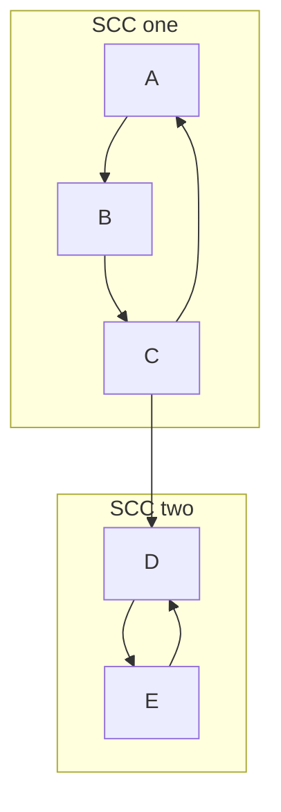

# Intro

A **strongly connected component** (SCC) of a directed graph is a maximal set of vertices where every vertex is reachable from every other — for any `u, v` in the set there is a path `u → v` **and** a path `v → u`. Mutual reachability partitions the vertices of any digraph into disjoint SCCs. Collapse each SCC to a single super-node and you get the **condensation graph**, which is always a DAG: if there were a cycle between two components they would actually be one component. That DAG structure is why SCC decomposition is the standard preprocessing step for problems on directed graphs with cycles — 2-SAT, dependency/deadlock analysis, and any dataflow that wants a [[Topological Sort]] but has cycles in the way.

Two linear-time algorithms compute SCCs: **Kosaraju's** (two [[DFS BFS|DFS]] passes, conceptually simple) and **Tarjan's** (one DFS pass, faster in practice). Both run in `O(V + E)`. Reach for SCCs whenever you need to reason about cycles or reachability in a digraph; on an _undirected_ graph "connected components" is the far simpler [[Union-Find]] / flood-fill problem instead.

## How It Works

### Kosaraju's — two passes and the transpose trick

1. Run DFS over the whole graph `G`, and when a vertex _finishes_ (all its descendants explored) push it onto a stack. The stack now holds vertices in **decreasing finish time**.
2. Build the **transpose** `Gᵀ` — the same graph with every edge reversed.
3. Pop vertices off the stack; for each not-yet-visited vertex, run DFS in `Gᵀ`. Each DFS tree is exactly one SCC.

_Why this works._ Finish times give a reverse topological order **of the condensation DAG**: the vertex that finishes last always lies in a _source_ SCC (one with no incoming condensation edges). Reversing every edge turns that source SCC into a _sink_ — a component you can enter but not leave. So when you start the second DFS from the highest-finish vertex in `Gᵀ`, it can reach every vertex in its own SCC but cannot "leak" into any other component, because the only edges out (in `Gᵀ`) lead to components already stripped off the stack. Peeling sink-after-sink off `Gᵀ` recovers the SCCs one clean tree at a time.

### Tarjan's — one pass with disc and low

Tarjan runs a single DFS and computes two numbers per vertex, plus an explicit stack of the vertices in the "current" component:

- `disc[v]` — the discovery time (DFS entry order) of `v`, assigned once.
- `low[v]` — the smallest `disc` reachable from `v`'s subtree using tree edges and **at most one** back/cross edge to a vertex still on the stack.
- an explicit stack and an `onStack[v]` flag marking vertices discovered but not yet assigned to a finished SCC.

On visiting `v`: set `disc[v] = low[v] = time++`, push `v`, mark `onStack[v] = true`. For each edge `v → w`: if `w` is unvisited, recurse and then `low[v] = min(low[v], low[w])`; else if `onStack[w]`, `low[v] = min(low[v], disc[w])`. After all edges of `v` are processed, if `low[v] == disc[v]` then `v` is the **root** of an SCC — pop the stack down to and including `v`, and those vertices are one component. The condition `low[v] == disc[v]` means nothing in `v`'s subtree found a way back above `v`, so `v` is the entry point of its component.

Tarjan reuses the exact `disc`/`low` machinery of [[Articulation Points and Bridges]]; the low-link idea is the same, only the acceptance rule differs.

- **Complexity (both)**: `O(V + E)` time — every vertex and edge is touched a constant number of times. Space is `O(V)` for the recursion stack, discovery arrays, and explicit stack; Kosaraju additionally materializes the transpose `Gᵀ`, an extra `O(V + E)`.

## Example

A hand trace of **Tarjan's** on a digraph with two cycles feeding a DAG. Edges: `A→B, B→C, C→A, C→D, D→E, E→D`. Expected SCCs: `{A, B, C}` and `{D, E}`, with condensation `{A,B,C} → {D,E}`.

```text
DFS from A. Format: disc/low, stack shown after each event.

visit A  disc=0 low=0   stack=[A]
 visit B disc=1 low=1   stack=[A,B]
  visit C disc=2 low=2  stack=[A,B,C]
   edge C→A: A on stack -> low[C]=min(2, disc[A]=0)=0
   visit D disc=3 low=3 stack=[A,B,C,D]
    visit E disc=4 low=4 stack=[A,B,C,D,E]
     edge E→D: D on stack -> low[E]=min(4, disc[D]=3)=3
    E done: low[E]=3 != disc[E]=4  -> not a root
   back in D: low[D]=min(3, low[E]=3)=3
   D done: low[D]=3 == disc[D]=3   -> ROOT, pop to D
                                      SCC = {E, D}
  back in C: low[C]=0 (already)
  C done: low[C]=0 != disc[C]=2    -> not a root
 back in B: low[B]=min(1, low[C]=0)=0
 B done: low[B]=0 != disc[B]=1     -> not a root
back in A: low[A]=min(0, low[B]=0)=0
A done: low[A]=0 == disc[A]=0      -> ROOT, pop to A
                                     SCC = {C, B, A}

SCCs discovered in reverse-topological order: {D,E} then {A,B,C}.
```

Note the components pop out in reverse topological order of the condensation — a free by-product Tarjan shares with a [[Topological Sort]].

## Diagram



## Pitfalls

### Treating cross edges like back edges in Tarjan

- **What goes wrong**: updating `low[v]` from _any_ already-visited neighbor `w` merges components that should stay separate, producing too few SCCs.
- **Why it happens**: only a vertex still `onStack` belongs to the component currently under construction; a visited vertex already popped into a finished SCC is unreachable back-up.
- **How to avoid it**: guard the update with `onStack[w]` and use `disc[w]` (not `low[w]`) for that back/cross-edge case.

### Forgetting the transpose in Kosaraju

- **What goes wrong**: running the second DFS on the original graph instead of `Gᵀ` returns the reachable set from each source, not the SCCs — components get fused.
- **Why it happens**: the finish-order ranking only isolates one SCC per tree _because_ the reversal converts sources into sinks; skip the reversal and the isolation guarantee is gone.
- **How to avoid it**: build `Gᵀ` explicitly (or a reversed adjacency view) and DFS that in the second pass. This is the `O(V+E)` memory cost Tarjan avoids.

### Recursion depth on large graphs

- **What goes wrong**: both algorithms are naturally recursive; a long path (say 10⁶ vertices in a chain) overflows the call stack.
- **Why it happens**: DFS recursion depth is bounded by the longest path, which can be `Θ(V)`.
- **How to avoid it**: convert to an explicit-stack iterative DFS, or raise the thread/stack size — the same fix any deep [[DFS BFS|DFS]] needs.

## Tradeoffs

| Choice | Kosaraju's | Tarjan's | Decision criteria |
| --- | --- | --- | --- |
| Passes over the graph | Two DFS passes, `O(V+E)` | One DFS pass, `O(V+E)` | Tarjan touches each edge once; pick it when the graph is huge or you want the lowest constant factor. |
| Extra memory | Needs the transpose `Gᵀ`, extra `O(V+E)` | Only `O(V)` arrays and one stack | On memory-tight or edge-dense graphs, Tarjan avoids materializing a reversed copy. |
| Ease of reasoning | Two plain DFS runs plus a reversal — easy to recall and prove | Subtle low-link invariant and `onStack` bookkeeping | Choose Kosaraju when clarity or whiteboard-recall matters more than a constant factor. |
| Component order out | Reverse of pop order | Pops SCCs in reverse-topological order for free | If you need the condensation topologically ordered downstream, Tarjan hands it to you directly. |

## Questions

> [!QUESTION]- Why does Kosaraju's second DFS run on the transposed graph in decreasing finish order?
>
> - The first DFS's finish times give a reverse topological order of the _condensation_ DAG; the last-finishing vertex sits in a source SCC.
> - Transposing every edge turns that source into a sink — a component you can enter but never leave.
> - Starting the second DFS from the highest-finish vertex therefore stays trapped inside one SCC instead of leaking into others.
> - Peeling sinks off the reversed graph one DFS tree at a time is what makes each tree exactly one component — drop either the transpose or the finish order and the isolation guarantee collapses.

> [!QUESTION]- In Tarjan's algorithm, what does `low[v] == disc[v]` mean, and why does it identify an SCC root?
>
> - `disc[v]` is `v`'s discovery time; `low[v]` is the smallest discovery time reachable from `v`'s subtree via tree edges and one back/cross edge to an on-stack vertex.
> - Equality means nothing in `v`'s subtree found a route back to a vertex discovered before `v`.
> - So `v` is the entry point of its component; popping the stack down to `v` yields exactly that SCC.
> - This single comparison replaces Kosaraju's whole second pass — the reason Tarjan needs only one traversal.

> [!QUESTION]- Why is the condensation of a digraph always a DAG, and what does that buy you?
>
> - Each SCC is a maximal mutually reachable set, so a cycle between two distinct components would make them one component — contradiction.
> - With no cycles, the condensation admits a topological order.
> - That lets you run DAG-only techniques (topological sort, DAG dynamic programming, 2-SAT implication solving) on graphs that originally had cycles.
> - SCC decomposition is therefore the standard "cycle-removal" preprocessing that unlocks the whole toolbox of DAG algorithms on arbitrary digraphs.

## References

- [Strongly connected component (Wikipedia)](https://en.wikipedia.org/wiki/Strongly_connected_component) — definition, condensation, and both algorithms.
- [Finding strongly connected components (cp-algorithms)](https://cp-algorithms.com/graph/strongly-connected-components.html) — Kosaraju's algorithm with the condensation and a correctness argument.
- [Tarjan's strongly connected components algorithm (Wikipedia)](https://en.wikipedia.org/wiki/Tarjan%27s_strongly_connected_components_algorithm) — the low-link invariant and single-pass procedure in detail.
