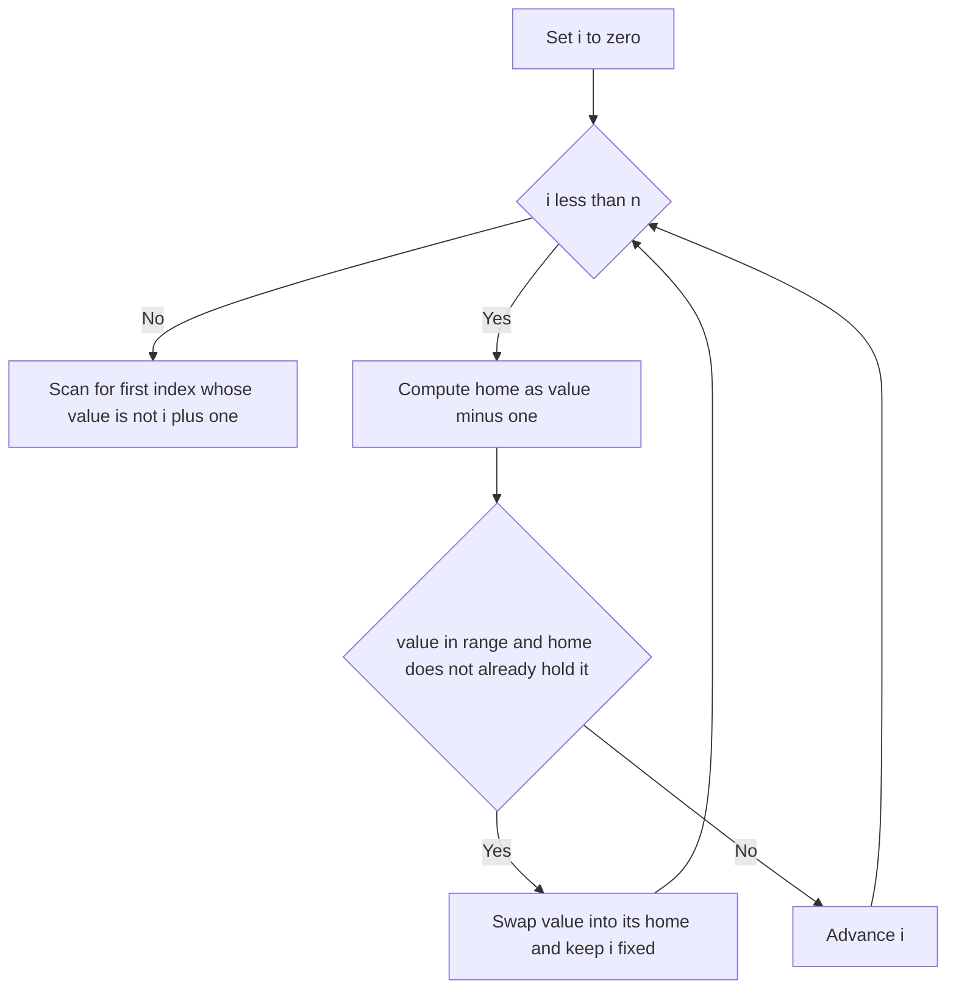

# Intro

Cyclic Sort exploits a special precondition: when an array holds a permutation of `1..n` (or `0..n−1`), every value has a **known home index** — value `v` belongs at index `v−1`. So instead of comparing elements, you walk the array and repeatedly swap whatever is at the current position to its home, until each slot holds its rightful value. This runs in `O(n)` time and `O(1)` space, beating any comparison sort — but only because the values _are_ the indices. Strip that guarantee away and the technique collapses.

Reach for it when a problem says **"an array of `n` numbers in the range `1..n`"** and then asks you to **find the missing number, the duplicate, all missing numbers, or the first missing positive** — in place and without extra memory. The `1..n` range plus the "no extra space" constraint is the signal. Once the array is cyclically sorted, the answer falls out trivially: the first index `i` whose value isn't `i+1` is where the missing or duplicated number lives. For the same problems on a **read-only** array, cyclic sort can't mutate anything, so switch to [[Fast and Slow Pointers]] or the sign-marking trick.

## How It Works

1. Walk an index `i` from `0` to `n−1`.
2. Let `v = a[i]` and its home be `home = v − 1` (for `1..n`; use `home = v` for `0..n−1`).
3. **If `v` is in range and `a[home] != v`**, swap `a[i]` and `a[home]` — this drops `v` into its home. **Do not advance `i`**: the value that swapped _into_ `i` may itself need placing, so re-examine it.
4. Otherwise (`v` already home, out of range, or a duplicate already sitting at `home`), advance `i`.
5. After the pass, scan for the first index where `a[i] != i + 1` — that mismatch reveals the missing/duplicate value.

The subtle part is complexity. The inner `while` looks like it could make the whole thing `O(n²)`, but **each swap places at least one value permanently into its home**, and a value never leaves its home once placed. There are at most `n` values to place, so there are at most `n` swaps across the entire run. Add the `n` steps of the outer walk and the total work is `O(n)` — linear, not quadratic, despite the nested loop shape. Space is `O(1)`: all rearrangement happens in the input array.

## Example

Cyclic sort placing a permutation of `1..n`, then two problems that read straight off it:

```csharp
public static void CyclicSort(int[] a)
{
    int i = 0;
    while (i < a.Length)
    {
        int home = a[i] - 1;                       // value v belongs at index v-1
        if (a[i] >= 1 && a[i] <= a.Length && a[i] != a[home])
            (a[i], a[home]) = (a[home], a[i]);      // swap into home, do NOT advance i
        else
            i++;                                    // already placed or out of range
    }
}

// Find All Numbers Disappeared in an Array (LeetCode 448): values in 1..n, find every missing one.
public static IList<int> FindDisappeared(int[] a)
{
    int i = 0;
    while (i < a.Length)
    {
        int home = a[i] - 1;
        if (a[i] != a[home]) (a[i], a[home]) = (a[home], a[i]); // duplicates make a[i]==a[home], so we skip
        else i++;
    }
    var missing = new List<int>();
    for (int j = 0; j < a.Length; j++)
        if (a[j] != j + 1) missing.Add(j + 1);      // slot j should hold j+1
    return missing;
}

// Find the Duplicate Number (LeetCode 287) — mutating variant.
public static int FindDuplicate(int[] a)
{
    int i = 0;
    while (i < a.Length)
    {
        if (a[i] != i + 1)
        {
            int home = a[i] - 1;
            if (a[i] != a[home]) (a[i], a[home]) = (a[home], a[i]);
            else return a[i];                        // home already holds this value => duplicate
        }
        else i++;
    }
    return -1;
}
```

## Diagram



## Pitfalls

- **Advancing `i` after a swap** — the value that lands in position `i` during a swap is unplaced and must be examined next, so a swap must _not_ increment `i`. Treating the loop as a plain `for` that always advances leaves values stranded and produces a half-sorted array.
- **No termination guard on duplicates** — the swap condition must be `a[i] != a[home]`, not `i != home`. When a duplicate exists, its home is already occupied by an equal value; comparing indices would swap forever, while comparing _values_ correctly stops and reveals the duplicate.
- **Applying it to non-permutation data** — the entire `O(n)` argument depends on values being a permutation of `1..n`, so each value has exactly one home. On arbitrary integers there is no home index and the technique is meaningless. Range-check every value (`1 <= v <= n`) and ignore out-of-range entries (as in first-missing-positive).

## Tradeoffs

| Choice | Cyclic Sort | Alternative | Decision criteria |
| --- | --- | --- | --- |
| find missing/duplicate in `1..n` | `O(n)` time, `O(1)` space, mutates input | boolean/count array `O(n)` time, `O(n)` space | Use cyclic sort when the "no extra memory" constraint bites; the count array is simpler when space is free. |
| duplicate on a **read-only** array | not applicable — it mutates | [[Fast and Slow Pointers]] `O(n)` time, `O(1)` space | Floyd's cycle detection treats the array as a linked list and never writes, so it is the only `O(1)`-space option when mutation is forbidden. |
| in-place marking | Cyclic Sort (rearranges values) | sign-marking (negate `a[abs(v)-1]`) | Both are `O(n)`/`O(1)`; sign-marking preserves positions but destroys signs, cyclic sort reorders but keeps magnitudes — pick by which property downstream code needs. |

## Questions

> [!QUESTION]- Why is cyclic sort `O(n)` despite the nested `while` that can re-process an index?
>
> - Each swap moves at least one value into its permanent home, and a placed value never leaves.
> - There are only `n` values, so there are at most `n` swaps across the whole run.
> - The outer walk contributes another `n` steps, so total work is `O(n)`, not `O(n²)`.
> - The nested-loop shape is misleading — amortising over the "each swap finalises a value" invariant is what proves linearity, which is the standard interview follow-up.

> [!QUESTION]- What precondition does cyclic sort require, and why can't you use it on arbitrary arrays?
>
> - The values must be a permutation of `1..n` (or `0..n−1`) so that every value maps to exactly one home index.
> - That value-equals-index mapping is what lets you place elements without any comparisons.
> - On arbitrary integers there is no home index, so the swap target is undefined and the method breaks.
> - This is why the pattern is unlocked specifically by "n numbers in the range 1..n" wording — the range constraint is not incidental, it is the whole mechanism.

> [!QUESTION]- For finding a duplicate, when do you use cyclic sort versus fast-and-slow pointers?
>
> - Both are `O(n)` time and `O(1)` extra space.
> - Cyclic sort rearranges the array in place, so it needs write access to the input.
> - If the array is **read-only**, cyclic sort is disallowed; [[Fast and Slow Pointers]] treats indices as a linked list and detects the cycle without writing.
> - The deciding factor is whether you may mutate the input — a constraint interviewers add specifically to force the pointer solution.

## References

- [Find All Numbers Disappeared in an Array (LeetCode #448)](https://leetcode.com/problems/find-all-numbers-disappeared-in-an-array/) — the canonical cyclic-sort application.
- [First Missing Positive (LeetCode #41)](https://leetcode.com/problems/first-missing-positive/) — cyclic sort with out-of-range values ignored.
- [Find the Duplicate Number (LeetCode #287)](https://leetcode.com/problems/find-the-duplicate-number/) — contrasts the mutating cyclic-sort approach with the read-only pointer method.
