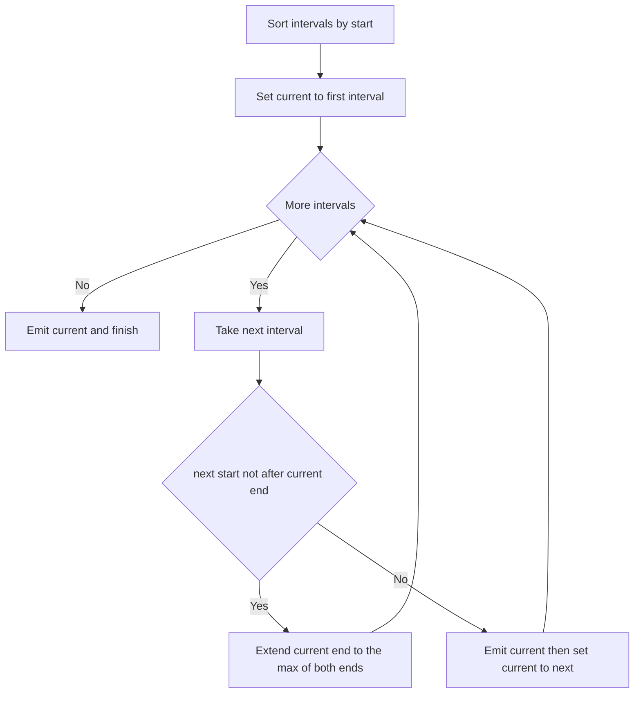

# Intro

Merge Intervals is the pattern for problems about ranges that may overlap. Sort the intervals by start, then sweep left to right: keep a "current" interval and, for each next one, either **extend** it (if it overlaps) or **flush** it and start fresh. The key insight is that sorting by start makes overlap a purely local test — once the intervals are ordered, any interval that overlaps the current one must start before the current one ends, so a single pass with one comparison per interval suffices. Total cost is `O(n log n)`, entirely dominated by the sort; the sweep itself is `O(n)`.

Reach for it when you see **"overlapping intervals"**, **"meeting rooms"**, **"calendar booking"**, or any request to merge, insert, intersect, or count ranges. The whole family — merge a list, insert one interval into a sorted list, intersect two sorted lists, or find the minimum number of rooms — shares the sort-then-sweep skeleton, often combined with [[Two Pointers]] or a [[Greedy Algorithms|greedy]] choice. When ranges never overlap or you need arbitrary point-membership queries instead of a linear sweep, an interval tree or [[Prefix Sum]] over a difference array may fit better.

## How It Works

1. **Sort** the intervals by start coordinate. This is the load-bearing step — everything after assumes ascending starts.
2. **Sweep** with a `current` interval initialised to the first. For each subsequent interval `next`:
   - If `next.start <= current.end` they **overlap**: extend `current.end = max(current.end, next.end)`. Take the max because `next` may be fully contained inside `current`.
   - Otherwise there is a gap: **emit** `current` to the output and set `current = next`.
3. **Emit** the final `current` after the loop.

For the **minimum-meeting-rooms** variant, don't merge — count. This is a **sweep line / delta counting** technique: emit `+1` at every start and `−1` at every end, sort all `2n` events, then walk them tracking a running sum. The running sum is the number of simultaneously active intervals at that moment; its maximum over the sweep is the answer. Ties matter here: process an end (`−1`) before a start (`+1`) at the same coordinate if the interval is half-open, so a meeting ending exactly when another starts reuses the room.

Complexity: `O(n log n)` time (the sort), `O(n)` for the output or the event list. The worst case — all intervals mutually overlapping, or none overlapping — changes the output size but not the asymptotics; the sort always dominates.

## Example

Merge, and the room-counting sweep line, in C#:

```csharp
public static List<int[]> Merge(int[][] intervals)
{
    Array.Sort(intervals, (a, b) => a[0].CompareTo(b[0]));   // sort by start
    var merged = new List<int[]>();
    int[] current = intervals[0];
    for (int i = 1; i < intervals.Length; i++)
    {
        if (intervals[i][0] <= current[1])                    // overlap (closed intervals)
            current[1] = Math.Max(current[1], intervals[i][1]);
        else { merged.Add(current); current = intervals[i]; } // gap: flush and restart
    }
    merged.Add(current);
    return merged;
}

// Minimum meeting rooms via delta counting (half-open [start, end)).
public static int MinMeetingRooms(int[][] meetings)
{
    int n = meetings.Length;
    var starts = new int[n];
    var ends = new int[n];
    for (int i = 0; i < n; i++) { starts[i] = meetings[i][0]; ends[i] = meetings[i][1]; }
    Array.Sort(starts);
    Array.Sort(ends);
    int rooms = 0, best = 0, e = 0;
    foreach (int s in starts)
    {
        while (e < n && ends[e] <= s) { rooms--; e++; }       // free rooms that already ended
        rooms++;                                              // this meeting needs a room
        best = Math.Max(best, rooms);
    }
    return best;
}
```

The intersection-of-two-sorted-lists variant is a [[Two Pointers]] sweep: advance the pointer whose interval ends first, emitting `[max(start), min(end)]` whenever the current pair actually overlaps.

## Diagram



## Pitfalls

- **Undefined interval convention** — whether `[1,2]` and `[2,3]` overlap depends entirely on closed vs half-open semantics. With closed intervals they touch at `2` and merge; with half-open `[1,2)` and `[2,3)` they do not. Pick one convention, write it down, and make the comparison (`<=` vs `<`) match it. Meeting-room problems almost always want half-open so back-to-back meetings share a room.
- **Forgetting the `max` when extending** — using `current.end = next.end` loses coverage when `next` is fully contained inside `current` (e.g. merging `[1,10]` with `[2,3]` must stay `[1,10]`, not shrink to `[1,3]`). Always `max(current.end, next.end)`.
- **Sorting by the wrong key or not at all** — the whole method assumes ascending starts. Sorting by end, or sweeping unsorted input, breaks the "overlap is local" guarantee and silently produces wrong merges rather than an obvious crash.

## Tradeoffs

| Choice | Sort then sweep | Alternative | Decision criteria |
| --- | --- | --- | --- |
| Merge / room count | `O(n log n)` sort-and-sweep | brute-force pairwise overlap `O(n²)` | The sweep always wins for `n` beyond a few dozen; brute force is only defensible for tiny fixed inputs. |
| Max concurrent intervals | Delta-counting sweep line `O(n log n)` | min-heap of end times `O(n log n)` | Both are optimal; delta counting is simplest when you only need the peak count, a heap when you must know _which_ intervals are active. |
| Many point-membership queries | Interval tree `O(log n)` per query, `O(n log n)` build | linear scan per query `O(n)` | Build a tree when queries greatly outnumber intervals; a one-shot sweep is cheaper for a single pass. |

## Questions

> [!QUESTION]- Why does sorting by start make a single linear sweep sufficient to merge overlapping intervals?
>
> - After sorting by start, any interval that can overlap `current` must begin at or before `current.end`.
> - So a single comparison `next.start <= current.end` decides overlap — no need to look further ahead or backward.
> - Non-overlapping intervals appear as a gap, at which point `current` is final and can be emitted.
> - This turns an `O(n²)` all-pairs overlap check into one `O(n)` pass after an `O(n log n)` sort, which is why the sort — not the sweep — is the cost that matters.

> [!QUESTION]- How does the sweep-line / delta-counting method find the minimum number of meeting rooms?
>
> - Emit `+1` at every start and `−1` at every end, then sort all events by coordinate.
> - Walk the events keeping a running sum; the sum at any point is the number of simultaneously active meetings.
> - The maximum the running sum reaches is the minimum number of rooms required.
> - Tie handling is load-bearing: process ends before starts at equal coordinates for half-open intervals, or a meeting ending exactly as another begins will wrongly demand a second room.

> [!QUESTION]- Why does the interval convention (closed vs half-open) change the answer, and how do you handle it?
>
> - It decides whether touching endpoints count as overlap: `[1,2]` and `[2,3]` merge if closed, stay separate if half-open.
> - The convention maps directly to the comparison operator — `<=` for closed, `<` for half-open.
> - Meeting-room problems usually want half-open so back-to-back bookings share resources.
> - Getting this wrong produces off-by-one errors that pass small tests and fail on boundary-touching cases, so state the convention explicitly before coding.

## References

- [Merge Intervals (LeetCode #56)](https://leetcode.com/problems/merge-intervals/) — the canonical sort-and-sweep problem.
- [Insert Interval (LeetCode #57)](https://leetcode.com/problems/insert-interval/) — inserting into an already-sorted list without a full re-sort.
- [Interval Scheduling (Wikipedia)](https://en.wikipedia.org/wiki/Interval_scheduling) — the greedy theory behind interval problems and the sweep-line method.
