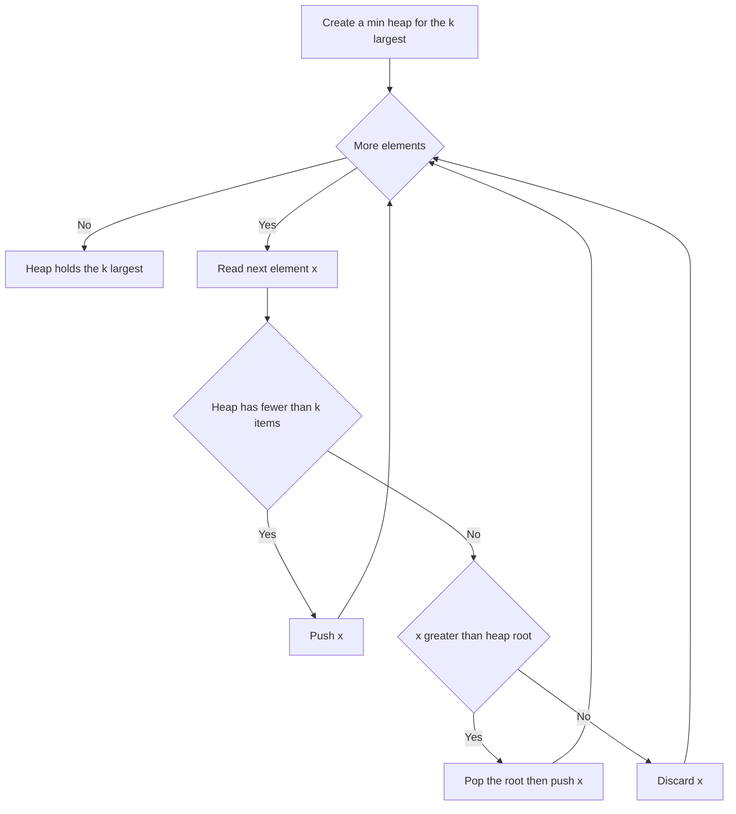

# Intro

The Top-K pattern finds the `k` largest, smallest, or most frequent items without sorting the whole input, by maintaining a **size-`k` heap** as you scan. The counter-intuitive core: to find the `k` **largest** values you keep a **min**-heap of size `k`. The heap's root is the _smallest of the `k` best seen so far_ — the weakest survivor — so when a new element arrives you compare it against that root, and if it's bigger you evict the root and insert the newcomer. After one pass the heap holds exactly the `k` largest. (Symmetrically, `k` smallest uses a max-heap.) This costs `O(n log k)` time and `O(k)` space.

Reach for it whenever a problem asks for the **"top / largest / smallest / most frequent K"** of something. The `O(n log k)` bound beats a full sort's `O(n log n)` when `k ≪ n`, but the deeper reason to prefer it is that it **works on a stream**: you never need to hold all `n` elements, only the running best `k` — essential for "top K from an infinite feed" or a dataset too large for memory. When the entire array is in memory and you don't need it sorted, [[Quick Sort|Quickselect]] finds the K-th element (and thus the top K) in `O(n)` average time; when counts are small integers, bucketing by frequency gives a linear alternative for top-K-frequent.

## How It Works

**Streaming heap (the default):**

1. Create a min-heap. Push the first `k` elements.
2. For each remaining element `x`: if `x > heap.Peek()` (the current weakest of the top `k`), pop the root and push `x`; otherwise discard `x` — it can't be in the top `k`.
3. After the scan the heap contains the `k` largest, with the K-th largest at the root.

Each push/pop is `O(log k)` — note `log k`, not `log n`, because the heap never grows past `k`. Across `n` elements that is `O(n log k)` time and `O(k)` space. This is strictly better than sorting when `k` is small and, uniquely, needs only `O(k)` memory, so it handles streams.

**Quickselect (in-memory, `O(n)` average):** partition around a pivot like [[Quick Sort]] but recurse into **only the side that contains the K-th position**, discarding the other half. Average `O(n)` because the problem size falls geometrically; worst case `O(n²)` when pivots are adversarially bad (already-sorted input with naive pivot choice). The **median-of-medians** pivot rule guarantees `O(n)` worst case at the cost of a larger constant — the same defence [[Quick Sort|introsort]] uses.

**Bucket by frequency (top-K-frequent):** count occurrences in a hash map, then place each value into a bucket indexed by its count (`0..n`). Walk buckets from high count to low, collecting `k` values. `O(n)` time and space, and it sidesteps heaps entirely when counts are bounded by `n`.

Complexity summary: heap `O(n log k)` / `O(k)`; Quickselect `O(n)` average, `O(n²)` worst (or `O(n)` worst with median-of-medians) / `O(1)` extra; bucket `O(n)` / `O(n)`.

## Example

The streaming min-heap for the `k` largest, in C#:

```csharp
public static int[] KLargest(IEnumerable<int> stream, int k)
{
    var heap = new PriorityQueue<int, int>();   // min-heap: priority == value
    foreach (int x in stream)
    {
        if (heap.Count < k)
            heap.Enqueue(x, x);                 // still filling the first k
        else if (x > heap.Peek())              // x beats the weakest survivor
        {
            heap.Dequeue();                    // evict the current minimum of the top k
            heap.Enqueue(x, x);
        }
        // else: x can't be in the top k, discard it
    }
    return heap.UnorderedItems.Select(e => e.Element).ToArray();
}

// Top K frequent elements via frequency buckets: O(n) time, no heap.
public static int[] TopKFrequent(int[] nums, int k)
{
    var count = new Dictionary<int, int>();
    foreach (int x in nums) count[x] = count.GetValueOrDefault(x) + 1;

    var buckets = new List<int>[nums.Length + 1];   // bucket[f] = values seen f times
    foreach (var (val, freq) in count)
        (buckets[freq] ??= new List<int>()).Add(val);

    var result = new List<int>();
    for (int f = nums.Length; f >= 1 && result.Count < k; f--)
        if (buckets[f] != null) result.AddRange(buckets[f]);
    return result.Take(k).ToArray();
}
```

## Diagram



## Pitfalls

- **Choosing the wrong heap polarity** — for the `k` _largest_ you need a _min_-heap so the root is the weakest of your current best and cheap to evict; a max-heap of size `k` would let you pop the _best_ element, which is backwards. Flip it for `k` smallest. Getting this wrong yields the anti-top-K (the `k` worst) and passes only symmetric test cases.
- **Sorting when you only need the top K** — a full sort is `O(n log n)` and, worse, needs all `n` elements in memory. For `k ≪ n` the heap's `O(n log k)` is faster and its `O(k)` footprint is the only thing that works on a stream. Sorting is defensible only when you also need the rest ordered.
- **Quickselect's `O(n²)` worst case** — naive pivot choice degrades to quadratic on already-sorted or adversarial input, the same failure as [[Quick Sort]]. Use a randomised pivot to make the bad case improbable, or median-of-medians to make it impossible; don't ship raw Lomuto Quickselect on untrusted input.

## Tradeoffs

| Choice | Size-`k` heap | Alternative | Decision criteria |
| --- | --- | --- | --- |
| vs full sort ([[Heap Sort]] / [[Quick Sort]]) | `O(n log k)` time, `O(k)` space, streamable | `O(n log n)`, `O(n)` space, needs all data | Use the heap when `k ≪ n` or the input is a stream; sort only when you also need every element ordered. |
| vs Quickselect | `O(n log k)`, works on streams | `O(n)` average, `O(n²)` worst, needs all data in memory and mutates it | Quickselect wins when the whole array is in memory and you want the fastest single top-K; the heap wins for streaming or when you can't mutate the input. |
| top-K-**frequent** with bounded counts | heap over frequencies `O(n log k)` | frequency-bucket sort `O(n)` | Bucketing is linear when counts are integers in `0..n`; the heap generalises to arbitrary comparable keys and unbounded ranges. |

## Questions

> [!QUESTION]- To find the `k` largest elements, why do you keep a min-heap rather than a max-heap?
>
> - The size-`k` min-heap's root is the _smallest_ of the `k` best elements seen so far — the weakest survivor.
> - A new element only matters if it beats that weakest survivor, which is exactly the `O(1)` root comparison a min-heap gives you.
> - When it does, you pop the root (evict the weakest) and push the newcomer, keeping the heap at size `k`.
> - A max-heap would expose the _strongest_ element at the root, which you never want to evict — so the polarity is inverted from most people's first instinct, and getting it right is the whole trick.

> [!QUESTION]- Why is the streaming heap `O(n log k)` and when does that beat sorting?
>
> - The heap never exceeds `k` elements, so each push/pop is `O(log k)`, not `O(log n)`.
> - Over `n` elements the total is `O(n log k)` time and `O(k)` space.
> - This beats a full sort's `O(n log n)` whenever `k ≪ n`.
> - More importantly it needs only `O(k)` memory, so it is the only option when the input is a stream too large to hold — the real reason to reach for it beyond the constant-factor speedup.

> [!QUESTION]- What is Quickselect's complexity, and how do you eliminate its worst case?
>
> - Quickselect partitions like quicksort but recurses into only the side holding the K-th position, giving `O(n)` average time because the problem shrinks geometrically.
> - Its worst case is `O(n²)`, triggered by consistently bad pivots (e.g. sorted input with a naive pivot).
> - A randomised pivot makes the bad case improbable; median-of-medians guarantees `O(n)` worst case at a higher constant factor.
> - Choose randomisation for typical workloads and median-of-medians only when adversarial input or hard real-time bounds demand a guarantee — the same trade [[Quick Sort|introsort]] makes.

## References

- [Kth Largest Element in an Array (LeetCode #215)](https://leetcode.com/problems/kth-largest-element-in-an-array/) — the canonical heap-vs-Quickselect problem.
- [Top K Frequent Elements (LeetCode #347)](https://leetcode.com/problems/top-k-frequent-elements/) — heap and bucket-sort approaches.
- [Quickselect (Wikipedia)](https://en.wikipedia.org/wiki/Quickselect) — average/worst-case analysis and pivot strategies.
- [Median of medians (Wikipedia)](https://en.wikipedia.org/wiki/Median_of_medians) — the `O(n)` worst-case pivot rule.
