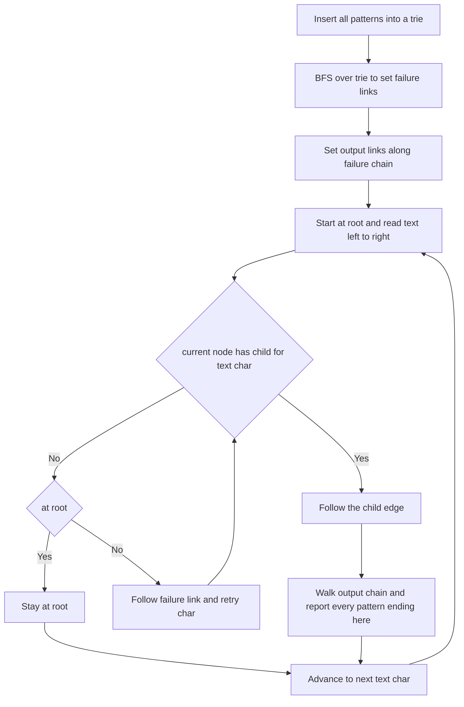

# Intro

Aho-Corasick finds **all** occurrences of **many** patterns in a text in a single pass. It builds a finite-state machine from the set of patterns — a trie of all the patterns, augmented with **failure links** and **output links** — then feeds the text through it one character at a time, never backtracking over the text. Its defining property is that search cost is `O(n + z)` where `n` is the text length and `z` the number of matches, **independent of the number of patterns**. Running [[KMP (Knuth-Morris-Pratt) Algorithm|KMP]] once per pattern would cost `O(k·n)` for `k` patterns; Aho-Corasick collapses that to one scan.

It is the direct multi-pattern generalization of KMP: the trie's failure links are exactly KMP's failure function lifted from a single string onto a tree of strings. Reach for it whenever you have a fixed dictionary of terms to match against streaming or bulk text — intrusion detection (Snort's rule engine), spam and profanity filters, `fgrep -f patternfile`, virus signature scanning, and bioinformatics motif search. Prefer [[Rabin Karp Search|Rabin-Karp]] with a hash set only when patterns are all the same length and you want a simpler probabilistic filter; use Aho-Corasick when pattern lengths vary and you need deterministic, single-pass completeness.

## How It Works

The automaton has three ingredients built on top of a trie of the pattern set.

1. **Trie (goto function).** Insert every pattern into a trie; each node is a prefix of one or more patterns, and nodes ending a pattern are marked. This is the `goto`: from a node, a character either follows a child edge or fails.

2. **Failure links.** For each node representing string `s`, its failure link points to the node representing the **longest proper suffix of `s` that is also a prefix of some pattern** — the trie-wide analogue of KMP's `lps`. When the text character has no matching child at the current node, follow failure links (which shorten the matched suffix) until a child matches or you reach the root. Because a suffix always exists at worst as the root, this always terminates.

3. **Output (dictionary) links.** A pattern can end _inside_ the matched suffix of a longer one — for instance `"he"` ends inside the state you reach after reading `"she"`. Each node's output link points to the nearest failure-reachable node that ends a pattern, forming a chain you walk on every visited state to emit all patterns ending there. **Omitting these silently misses nested matches.**

**Construction by BFS.** The failure and output links are filled level by level with a breadth-first traversal of the trie. Root's children fail to the root. For a node `u` with parent `p` and edge character `c`, follow `p`'s failure link `f`; the child of `f` on `c` (if any) is `u`'s failure target, otherwise recurse up the failure chain to the root. The output link is `u`'s failure target if that target ends a pattern, else the failure target's own output link. BFS order guarantees every failure target is finalized before it is needed.

**Search.** Start at the root; for each text character advance via `goto` (using failure links on a miss), then walk the output chain at the arrived state to report every pattern that ends there.

Complexity: construction `O(m + |Σ|·nodes)` time (where `m` is the total length of all patterns) — commonly stated as `O(m)` for a fixed alphabet — and `O(nodes·|Σ|)` space for the goto table (a hash map per node reduces this for sparse large alphabets). Search is `O(n + z)`: linear in the text plus the number of reported matches, and crucially **not** a function of `k`, the pattern count.

## Example

```text
Patterns: { he, she, his, hers }   Text: "ushers"

Trie (edges) and pattern-end nodes marked *:
  root --h--> 1 --e--> 2*(he) --r--> 6 --s--> 7*(hers)
       --s--> 3 --h--> 4 --e--> 5*(she)
  root --h--> 1 --i--> ... --s--> ...*(his)

Key failure/output links:
  node 5 (she) fails to node 2 (he)   → output link 5 -> 2*(he)
  node 4 (sh)  fails to node 1 (h)
  node 2 (he)  fails to root

Scan "ushers":
  u : no goto from root → stay at root, no output.
  s : root -> 3 (s).
  h : 3 -> 4 (sh).
  e : 4 -> 5 (she). node 5 ends "she" → report she.
      Walk output link: 5 -> 2 ends "he" → report he.   <-- nested match
  r : goto from 5 on 'r'? none. Follow failure 5->2; from 2 on 'r' -> 6 (her).
  s : 6 -> 7 (hers). node 7 ends "hers" → report hers.

Matches (start index in "ushers" = u0 s1 h2 e3 r4 s5):
  she @1..3    he @2..3    hers @2..5
```

`he` and `she` _end_ at the same position, and that is the whole point of output links: the scanner is sitting on node 5 (`she`) when it finishes reading `e`, and only the `5 -> 2` output link tells it that `he` also ends right here. Without that link it would report `she` and `hers` but silently drop the nested `he`.

## Diagram



## Pitfalls

### Forgetting Output Links Misses Nested Matches

- **What goes wrong**: reporting a match only when the _current_ node ends a pattern drops patterns that end inside a longer matched suffix, such as `he` inside `she` when searching the dictionary `{he, she, hers}` in `"ushers"`.
- **Why it happens**: the failure links alone route the automaton correctly but do not enumerate every pattern that terminates at a state; a single state can end several patterns at once.
- **How to avoid it**: build an output (dictionary) link chain and walk it fully at every visited state, or precompute the complete match list per state.

### Rebuilding the Automaton per Query

- **What goes wrong**: constructing the trie and links inside a hot loop that also runs the search throws away Aho-Corasick's advantage, turning an amortized win into repeated `O(m)` builds.
- **Why it happens**: the dictionary is treated as if it changes every call when it is actually fixed across many texts.
- **How to avoid it**: build the automaton once for a stable dictionary and reuse it across all inputs; only rebuild when the pattern set changes.

### Memory Blowup on Large Alphabets

- **What goes wrong**: storing a dense `|Σ|`-wide transition array per node explodes memory for Unicode or byte-plus-wide alphabets with many patterns.
- **Why it happens**: the goto table is `O(nodes·|Σ|)`; most entries are empty but still allocated in a dense representation.
- **How to avoid it**: use a hash map of transitions per node (sparse goto), or a double-array trie, trading a small constant-factor lookup cost for large memory savings.

## Tradeoffs

| Choice | Option A | Option B | Decision criteria |
| --- | --- | --- | --- |
| Many patterns | Aho-Corasick `O(n+z)` | [[KMP (Knuth-Morris-Pratt) Algorithm\|KMP]] per pattern `O(k·n)` | Aho-Corasick scans once regardless of `k`; switch to it as soon as `k` exceeds two or three, or when pattern lengths vary. |
| Uniform-length patterns | [[Rabin Karp Search\|Rabin-Karp]] with a hash set | Aho-Corasick | Rabin-Karp is simpler when every pattern shares one length; Aho-Corasick handles mixed lengths and gives deterministic, collision-free results. |
| Transition storage | Dense array per node | Sparse hash map per node | Dense is fastest for small alphabets (ASCII bytes); switch to sparse or a double-array trie for Unicode or huge dictionaries to control memory. |
| Dictionary volatility | Prebuilt automaton | Rebuild per change | Prebuild and reuse for a fixed dictionary; if patterns change constantly, the `O(m)` build cost may argue for a simpler per-query matcher. |

## Questions

> [!QUESTION]- Why is Aho-Corasick's search cost independent of the number of patterns?
>
> - All patterns share one trie, so common prefixes collapse into shared paths and the text drives a single walk through the automaton.
> - Each text character causes one goto transition (plus failure-link hops that are amortized `O(1)` overall, same argument as KMP), regardless of how many patterns exist.
> - Output links let a single state report every pattern that ends there, so multiple simultaneous matches cost only the `z` matches emitted, not a re-scan per pattern.
> - This is exactly why intrusion-detection engines like Snort and `fgrep -f` use it: they match thousands of signatures against a stream in one `O(n+z)` pass instead of thousands of separate scans.

> [!QUESTION]- What are failure links and output links, and what breaks if you omit each?
>
> - A failure link points from a state (string `s`) to the state for the longest proper suffix of `s` that is still a prefix of some pattern — the trie-wide version of KMP's `lps` — and drives correct transitions on a mismatch.
> - Omitting failure links breaks the automaton entirely: on a miss it has no way to resume without rescanning the text.
> - Output links chain a state to shorter patterns that also end there (like `he` ending inside `she`), and walking them enumerates all simultaneous matches.
> - Omitting output links keeps the scan correct in position but silently misses every nested pattern — the classic bug of dropping `he` when matching `{he, she, hers}` in `"ushers"`.

> [!QUESTION]- How is the automaton built, and why does the order matter?
>
> - Insert all patterns into a trie, then fill failure and output links with a breadth-first traversal from the root.
> - BFS processes nodes in increasing depth, so a node's failure target — always at a strictly smaller depth — is already finalized when computed.
> - A node's failure link is found by following its parent's failure link and taking the child on the same edge character, recursing toward the root until one exists; its output link is the nearest failure-reachable pattern-ending node.
> - Getting the order wrong (e.g. DFS) would reference unfinished failure links and produce a broken automaton, which is why the level-by-level guarantee is load-bearing, not incidental.

## References

- [Aho-Corasick algorithm -- construction, failure and output links, and applications (Wikipedia)](https://en.wikipedia.org/wiki/Aho%E2%80%93Corasick_algorithm)
- [Aho-Corasick automaton -- trie plus suffix links with implementation and complexity (cp-algorithms)](https://cp-algorithms.com/string/aho_corasick.html)
- [Efficient String Matching: An Aid to Bibliographic Search -- the original 1975 Aho and Corasick paper (CACM)](https://dl.acm.org/doi/10.1145/360825.360855)
