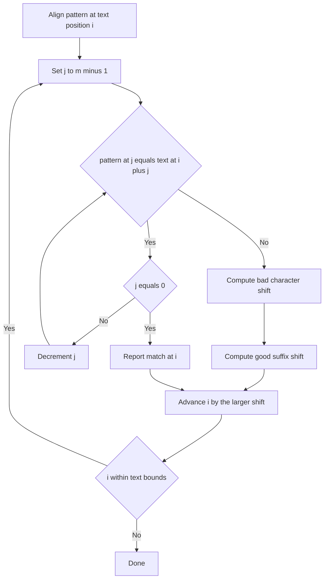

# Intro

Boyer-Moore searches for a pattern in text by aligning the pattern with the text and comparing **right-to-left**, from the last character of the pattern backward. The payoff of scanning backward is that a single mismatch can license a jump of more than one character — often the whole pattern length — so the algorithm can skip past large stretches of text without ever looking at them. This makes it _sublinear_ in practice: on typical text it examines roughly `n/m` characters, the best case being `O(n/m)`, which is why it is the fastest general-purpose single-pattern matcher for long patterns and large alphabets.

Boyer-Moore decides how far to jump using two precomputed heuristics — the **bad-character rule** and the **good-suffix rule** — and takes the larger of the two shifts. This is the algorithm behind `grep`, `memmem`, and the find command in most text editors. Reach for it when you scan long text for a moderately long literal pattern over a large alphabet. Prefer [[KMP (Knuth-Morris-Pratt) Algorithm|KMP]] when you need a hard worst-case guarantee on small alphabets, or [[Aho-Corasick]] when matching many patterns at once.

## How It Works

The pattern is aligned against the text and compared from its rightmost character leftward. On a mismatch (or a full match), two rules each propose a safe shift, and the algorithm advances by the maximum.

**Bad-character rule.** Look at the text character `c` that caused the mismatch. Shift the pattern so its _rightmost_ occurrence of `c` lines up with that text position. If `c` does not occur in the pattern at all, skip the pattern entirely past `c` — a full jump of `m`. This is what makes big alphabets fast: the more distinct characters exist, the more often the mismatching character is absent from the pattern, and the bigger the average skip.

**Good-suffix rule.** When some suffix of the pattern _did_ match before the mismatch, shift so that another occurrence of that matched suffix within the pattern lines up, or (if none exists) so that a prefix of the pattern matches a suffix of the matched region. This rule salvages the partial-match information the bad-character rule ignores.

The algorithm takes `shift = max(bad_char_shift, good_suffix_shift)`, which is always at least one, so it never stalls.

**Preprocessing.** The bad-character table is a map from character to its last index in the pattern, built in `O(m + |Σ|)` where `|Σ|` is the alphabet size. The good-suffix table is built in `O(m)` but with fiddly index arithmetic. Because the good-suffix table is error-prone for little practical gain, most production code implements **Boyer-Moore-Horspool** — bad-character rule only, using the mismatched _text_ character under the last pattern position — which is simpler and nearly as fast on real data.

Complexity: preprocessing `O(m + |Σ|)`; search `O(n/m)` best case, `O(n + m)` typical, and `O(n·m)` worst case for the plain version (triggered by highly repetitive text and pattern such as pattern `"aaaa"` in text `"aaaa...a"`). Adding **Galil's rule** — remembering how much of the pattern is already known to match after a shift, so those positions are not re-compared — restores a guaranteed `O(n)`. Space is `O(m + |Σ|)`.

## Example

```text
Pattern: TRUTH   (m=5)
Bad-character last-occurrence table: T→3, R→1, U→2, H→4  (others absent)

Text:  ...WE VALUE TRUTH...
                  TRUTH
Align pattern under text, compare right-to-left starting at the pattern's 'H'.

Alignment 1:
  Text:    W E   V A L U E   T R U T H
  Pattern: T R U T H
  Compare P[4]='H' with text 'L' (under H): mismatch.
  'L' is absent from the pattern → bad-character rule shifts the whole
  pattern past it: jump 5. We never even looked at the 4 characters to
  its left.

Alignment 2 lands with 'H' over the text's real 'H': all five characters
match right-to-left → match reported.
```

The lesson: over English text (a large alphabet) most mismatching characters are absent from a short pattern, so each mismatch buys a near-maximal jump and the scan touches only a fraction of the text.

## Diagram



## Pitfalls

### Assuming Sublinear Worst Case

- **What goes wrong**: engineers reach for Boyer-Moore expecting `O(n/m)` and get `O(n·m)` on adversarial input, such as searching `"aaab"` inside a long run of `"a"`.
- **Why it happens**: the sublinear behavior depends on frequent full-length skips, which vanish when text and pattern share long repeated runs so every alignment re-compares almost the whole pattern.
- **How to avoid it**: enable Galil's rule to guarantee `O(n)`, or use [[KMP (Knuth-Morris-Pratt) Algorithm|KMP]] when the input may be adversarial and a strict linear bound is required.

### Shipping the Full Good-Suffix Table

- **What goes wrong**: hand-rolled good-suffix tables have subtle off-by-one bugs (the "case 2" prefix fallback is easy to get wrong), producing missed matches or shifts of zero that loop forever.
- **Why it happens**: the good-suffix preprocessing is genuinely intricate and the marginal speedup over bad-character-only is small on real text.
- **How to avoid it**: implement Boyer-Moore-Horspool (bad-character only) unless profiling proves the good-suffix rule pays off; it is what `glibc`'s `memmem` and most editors actually use.

### Small Alphabets Erase the Advantage

- **What goes wrong**: on binary or DNA-scale alphabets (`|Σ|` of 2 to 4) the bad-character rule rarely fires a big skip, and Boyer-Moore performs no better than simpler scans.
- **Why it happens**: with few distinct symbols the mismatching character is almost always present in the pattern, so the rightmost-occurrence shift is small.
- **How to avoid it**: on tiny alphabets prefer [[KMP (Knuth-Morris-Pratt) Algorithm|KMP]] or a bit-parallel method (Shift-Or); Boyer-Moore's edge grows with alphabet size, not shrinks.

## Tradeoffs

| Choice | Option A | Option B | Decision criteria |
| --- | --- | --- | --- |
| Worst-case guarantee | [[KMP (Knuth-Morris-Pratt) Algorithm\|KMP]] `O(n+m)` | Boyer-Moore `O(n/m)` best, `O(nm)` worst | Use KMP when input may be adversarial; use Boyer-Moore for typical large-alphabet text where average sublinear speed dominates. Add Galil's rule to Boyer-Moore to get both. |
| Implementation effort | Boyer-Moore-Horspool (bad-char only) | Full Boyer-Moore (both rules) | Ship Horspool by default — simpler and nearly as fast. Add the good-suffix rule only when profiling proves the extra skips matter. |
| Alphabet size | Boyer-Moore | [[KMP (Knuth-Morris-Pratt) Algorithm\|KMP]] or Shift-Or | Boyer-Moore wins as `\|Σ\|` grows (English, Unicode); on 2-4 symbol alphabets (DNA, binary) its skips shrink and KMP or bit-parallel methods win. |
| Many patterns at once | [[Aho-Corasick]] | Boyer-Moore per pattern | Aho-Corasick scans once regardless of pattern count. Switch as soon as you have more than two or three patterns. |

## Questions

> [!QUESTION]- Why does Boyer-Moore scan the pattern right-to-left, and how does that make it sublinear?
>
> - Comparing from the pattern's last character means a mismatch reveals a text character that, if absent from the pattern, lets the whole pattern jump past it in one move.
> - The bad-character rule can therefore skip up to `m` characters per mismatch, so the algorithm inspects only about `n/m` characters on typical text — `O(n/m)` best case.
> - Left-to-right scanning could never justify a jump larger than one on the same information, because it learns nothing about the characters ahead.
> - The bigger the alphabet, the more often the mismatching character is absent from the pattern, so Boyer-Moore's advantage scales up precisely on the large-alphabet text (English, source code) that real find tools face.

> [!QUESTION]- What do the bad-character and good-suffix rules each contribute, and why do most implementations drop the good-suffix rule?
>
> - The bad-character rule shifts to align the pattern's rightmost copy of the mismatching text character, giving big skips on large alphabets.
> - The good-suffix rule reuses the suffix that already matched, aligning it with another occurrence inside the pattern, which helps on repetitive patterns the bad-character rule handles poorly.
> - The algorithm takes the larger of the two shifts, so it is never worse than either alone.
> - The good-suffix table's index arithmetic is error-prone for a small real-world gain, so production code (`grep`, `memmem`) usually ships Boyer-Moore-Horspool with only the bad-character rule.

> [!QUESTION]- When would you not use Boyer-Moore, and what would you use instead?
>
> - On small alphabets (DNA, binary) its skips shrink to near one, erasing the advantage — prefer [[KMP (Knuth-Morris-Pratt) Algorithm|KMP]] or a bit-parallel Shift-Or.
> - When input can be adversarial and you need a guaranteed linear bound, plain Boyer-Moore's `O(nm)` worst case is unacceptable — use KMP, or add Galil's rule to recover `O(n)`.
> - When matching many patterns at once, running Boyer-Moore per pattern is `O(k·n)` — [[Aho-Corasick]] scans once regardless of pattern count.
> - The rule of thumb: Boyer-Moore is the default for one literal pattern over a large alphabet in benign text; step away from it the moment the alphabet is tiny, the input is hostile, or the patterns are plural.

## References

- [Boyer-Moore string-search algorithm -- both heuristics, Galil's rule, and complexity analysis (Wikipedia)](https://en.wikipedia.org/wiki/Boyer%E2%80%93Moore_string-search_algorithm)
- [Boyer-Moore-Horspool algorithm -- the bad-character-only variant most real code ships (Wikipedia)](https://en.wikipedia.org/wiki/Boyer%E2%80%93Moore%E2%80%93Horspool_algorithm)
- [A Fast String Searching Algorithm -- the original 1977 Boyer and Moore paper (CACM)](https://dl.acm.org/doi/10.1145/359842.359859)
