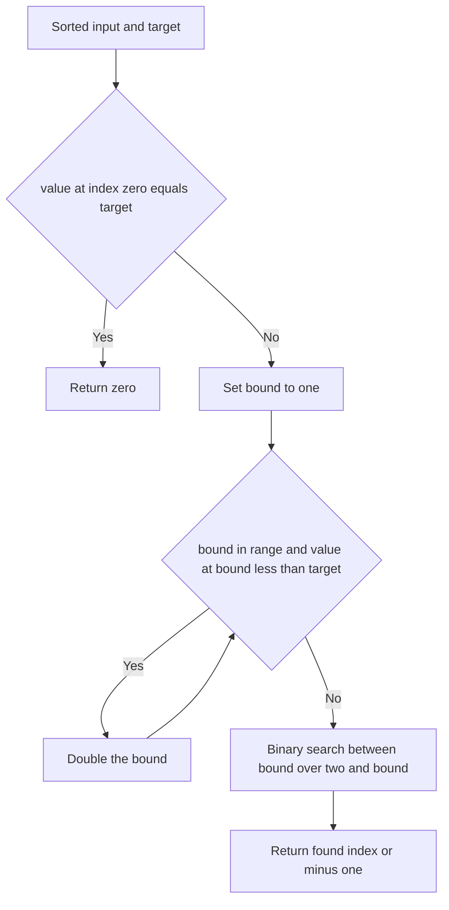

# Intro

Exponential search (also called doubling search or galloping search) finds a target in a sorted sequence by first **finding a range that must contain it**, then binary-searching that range. It probes indices `1, 2, 4, 8, 16, …`, doubling the bound until `a[i] >= target`, then runs [[Binary Search]] inside `[i/2, i]`. The doubling phase takes `O(log i)` steps and the binary search over a range of size `i/2` takes another `O(log i)`, so the whole thing is `O(log i)` where `i` is the target's _position_ — not the array length.

That distinction is the point. Exponential search is the right tool in two cases plain binary search handles poorly: **unbounded or unknown-length** sorted input (a stream, a lazily materialized list, an API you can index but not measure), where you cannot compute a midpoint without knowing `n`; and inputs where the **target sits near the front**, where `O(log i)` beats binary search's `O(log n)` because `i ≪ n`. Real systems use it: Timsort's merge step "galloping mode" is exactly this doubling search, used to skip long runs from one side quickly.

## How It Works

1. Handle `a[0]` as a special case — if it equals the target, return `0`.
2. Start with `bound = 1`. While `bound` is in range and `a[bound] < target`, set `bound *= 2`. This "gallops" past everything smaller than the target.
3. Stop when `a[bound] >= target` (or `bound` runs off the end). The target, if present, now lies in `[bound/2, min(bound, n − 1)]` — the previous bound was still below it, this one is at or past it.
4. Binary-search that half-open range and return the result.

The doubling guarantees the found range has size `bound/2 ≤ i`, so the binary search inside it is `O(log i)`. On an unbounded source you simply drop the `bound < n` guard and let the `a[bound] >= target` (or end-of-stream) condition stop the gallop.

Complexity: `O(log i)` time where `i` is the index of the target, `O(1)` space. Worst case is the target near the end (`i ≈ n`), giving `O(log n)` — the same as binary search, never worse asymptotically. Best case, a front-loaded target, is far better.

## Example

```csharp
public static int ExponentialSearch(int[] arr, int target)
{
    int n = arr.Length;
    if (n == 0) return -1;
    if (arr[0] == target) return 0;

    // Gallop: double the bound until it reaches or passes the target.
    int bound = 1;
    while (bound < n && arr[bound] < target)
    {
        bound *= 2;
    }

    // Target, if present, is in [bound/2, min(bound, n-1)].
    int left = bound / 2;
    int right = Math.Min(bound, n - 1);
    return BinarySearch(arr, target, left, right);
}

private static int BinarySearch(int[] arr, int target, int left, int right)
{
    while (left <= right)
    {
        int mid = left + (right - left) / 2;
        if (arr[mid] == target) return mid;
        if (arr[mid] < target) left = mid + 1;
        else right = mid - 1;
    }
    return -1;
}
```

## Diagram



## Pitfalls

- **Assuming the source is bounded** — the headline use case is unknown-length input, but the naive loop guards on `bound < n`. On a true stream you must instead stop the gallop when a probe returns "past the end" or `a[bound] >= target`, or you will index off the end. Decide up front whether `n` is known.
- **Integer overflow on the doubling** — `bound *= 2` on a very large array can overflow a 32-bit index and wrap negative, producing an out-of-bounds probe or an infinite loop. Cap the bound at `n` (or use a wider type) before doubling.
- **Forgetting it is still a sorted-data algorithm** — the binary search phase inherits every [[Binary Search]] precondition. Exponential search buys you range discovery, not freedom from sorting; on unsorted input the gallop's `a[bound] < target` test is meaningless.

## Tradeoffs

| Choice | Exponential Search | Alternative | Decision criteria |
| --- | --- | --- | --- |
| vs [[Binary Search]] | `O(log i)`, no length needed | `O(log n)`, needs known `n` | Prefer exponential search when the length is unknown/unbounded or the target skews toward the front; use plain binary search when `n` is known and targets are uniform. |
| vs [[Jump Search]] on bounded data | `O(log i)`, random access | `O(√n)`, forward stepping | Both bound a range first; exponential search is far faster when random access is `O(1)`, jump search wins only when backward seeks are expensive. |
| vs [[Interpolation Search]] | `O(log i)`, distribution-agnostic | `O(log log n)` uniform, `O(n)` skewed | Exponential search has no distribution assumption; use interpolation only when data is provably near-uniform and you need the extra speed. |

## Questions

> [!QUESTION]- Why is exponential search `O(log i)` rather than `O(log n)`?
>
> - The doubling phase stops as soon as `bound` reaches or passes the target's position `i`, after about `log i` steps.
> - The binary search then covers a range of size at most `i/2`, another `O(log i)`.
> - Neither phase ever looks at the whole array, so the cost tracks the target's position, not the array length.
> - This makes it strictly better than binary search when the target is near the front (`i ≪ n`) and no worse when it is near the end.

> [!QUESTION]- What lets exponential search work on an unbounded or unknown-length array?
>
> - Binary search needs `n` to compute a midpoint, so it cannot even start without knowing the length.
> - Exponential search only ever asks "is `a[bound]` still below the target?", probing indices it generates itself.
> - The doubling stops the moment a probe reaches or exceeds the target, bounding a finite range without ever needing the total size.
> - That is why it fits streams, lazily materialized lists, and indexable-but-unmeasurable sources where binary search is inapplicable.

> [!QUESTION]- Where does exponential search appear in a real production system?
>
> - Timsort's merge step switches into "galloping mode" when one run keeps winning the comparison.
> - Galloping is exponential search: it doubles ahead to find how many elements to copy from the winning run in one go.
> - This turns a long stretch of one-at-a-time comparisons into `O(log k)` work for a skip of `k` elements.
> - It is why Timsort is fast on partially ordered real-world data — the same front-loaded advantage exponential search gives on lookups.

## References

- [Exponential search (Wikipedia)](https://en.wikipedia.org/wiki/Exponential_search) — the doubling-then-binary-search scheme and unbounded-array motivation.
- [Timsort listsort.txt (CPython source)](https://github.com/python/cpython/blob/main/Objects/listsort.txt) — Tim Peters' description of galloping mode, exponential search inside a real sort.
