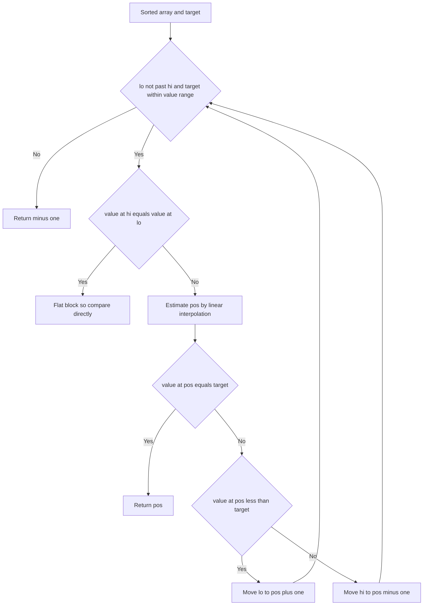

# Intro

Interpolation search improves on [[Binary Search]] by _guessing where the target should be_ instead of always probing the midpoint. Where binary search blindly picks the middle, interpolation search assumes values are spread evenly and computes a proportional position: to find `950` in `[0 … 1000]` it probes near `95%` of the way in, not `50%`. The estimate uses linear interpolation between the two endpoints:

```csharp
var pos = lo + (target − a[lo]) * (hi − lo) / (a[hi] − a[lo])
```

This is how a person finds "Smith" in a phone book — you open three-quarters of the way in, not at the middle. On **uniformly distributed** sorted data it reaches `O(log log n)`, which for a billion elements is roughly 5 probes versus binary search's 30. But that speed is entirely conditional on the distribution: the whole algorithm is a bet that the data is uniform. On skewed data — exponentially growing values, clustered timestamps, Zipfian frequencies — the interpolation formula points to the wrong region every time and it degrades to `O(n)`, worse than binary search's guaranteed `O(log n)`. The distribution assumption is not a footnote here; it is the entire story.

## How It Works

1. Keep boundaries `lo` and `hi` as in binary search, but compute the probe by interpolation rather than by halving: `pos = lo + (target − a[lo]) · (hi − lo) / (a[hi] − a[lo])`.
2. If `a[pos] == target`, return `pos`. If `a[pos] < target`, set `lo = pos + 1`; otherwise `hi = pos − 1`.
3. Loop while `lo <= hi` **and** `target` is within `[a[lo], a[hi]]` — the range check lets you bail out early when the target is absent.
4. Guard the denominator: when `a[hi] == a[lo]` the formula divides by zero. Treat that block as flat and fall back to a direct comparison.

The `O(log log n)` bound comes from the fact that, on uniform data, each probe reduces the _number of candidate elements_ to its square root rather than its half. Space is `O(1)`.

Complexity: `O(log log n)` average time on uniformly distributed keys; `O(n)` worst case on adversarial or heavily skewed distributions (the trigger is any distribution where the linear estimate is consistently far from the true position). `O(1)` space.

## Example

```csharp
public static int InterpolationSearch(int[] arr, int target)
{
    int lo = 0;
    int hi = arr.Length - 1;

    while (lo <= hi && target >= arr[lo] && target <= arr[hi])
    {
        // Flat block: interpolation would divide by zero.
        if (arr[hi] == arr[lo])
        {
            return arr[lo] == target ? lo : -1;
        }

        // Estimate position proportionally; use long to avoid overflow in the product.
        long span = (long)(target - arr[lo]) * (hi - lo);
        int pos = lo + (int)(span / (arr[hi] - arr[lo]));

        if (arr[pos] == target) return pos;
        if (arr[pos] < target) lo = pos + 1;
        else hi = pos - 1;
    }

    return -1;
}
```

## Diagram



## Pitfalls

- **Non-uniform data destroys the complexity** — the `O(log log n)` figure holds _only_ for near-uniform distributions. Feed it exponentially growing values like `1, 2, 4, 8, …, 2^k` and the interpolation estimate lands near `lo` almost every probe, so it advances one element at a time and collapses to `O(n)` — slower than binary search. Profile the actual distribution before choosing this over binary search; when in doubt, binary search's worst-case guarantee is safer.
- **Divide-by-zero on flat blocks** — when `a[lo] == a[hi]` (a run of equal values, or a one-element range) the denominator `a[hi] − a[lo]` is zero. Without a guard this throws or produces a garbage index. Check for the flat case and resolve it with a direct comparison.
- **Overflow in the interpolation product** — `(target − a[lo]) * (hi − lo)` can exceed a 32-bit integer on large arrays with large values, wrapping to a negative `pos` and an out-of-range access. Compute the product in a wider type (`long`) before dividing.

## Tradeoffs

| Choice | Interpolation Search | Alternative | Decision criteria |
| --- | --- | --- | --- |
| Probe formula | proportional estimate | fixed midpoint | The proportional probe pays off only when value gaps are even; on clustered or heavy-tailed keys the midpoint's predictability is the safer bet. |

## Questions

> [!QUESTION]- Why does interpolation search beat binary search only on uniform data?
>
> - Its probe assumes values grow linearly with index, so the interpolated position is accurate only when gaps between values are even.
> - On uniform data each probe shrinks the candidate count to its square root, giving `O(log log n)`.
> - On skewed data the estimate is consistently wrong, the range barely shrinks, and it degrades to `O(n)`.
> - So the choice is a bet on the distribution: right, it is dramatically faster; wrong, it is worse than the binary search you gave up — measure before committing.

> [!QUESTION]- What input makes interpolation search degrade to O(n), and why?
>
> - Exponentially growing keys such as `1, 2, 4, 8, …, 2^k`.
> - The interpolation formula weights by value magnitude, so for a target in the large tail it estimates a position near the far end and near `lo` for small targets, moving the boundary by roughly one element per probe.
> - With `O(1)` progress per step over `n` elements the total work is `O(n)`.
> - This is why adversarial or naturally heavy-tailed data (timestamps, frequencies) is a hard no for interpolation search.

> [!QUESTION]- Where does the division by zero come from and how do you handle it?
>
> - The probe divides by `a[hi] − a[lo]`, the value span of the current range.
> - When every value in the range is equal — a run of duplicates or a collapsed one-element range — that span is zero.
> - Dividing by it throws or yields a nonsensical index.
> - Guard it: detect `a[lo] == a[hi]`, resolve the block with a direct equality check, and return — the same defensive habit as the overflow-safe midpoint in binary search.

## References

- [Interpolation search (Wikipedia)](https://en.wikipedia.org/wiki/Interpolation_search) — the estimate formula, `O(log log n)` analysis, and its uniformity precondition.
- [Interpolation search vs binary search (GeeksforGeeks)](https://www.geeksforgeeks.org/interpolation-search/) — worked probes and the skewed-distribution degradation.
