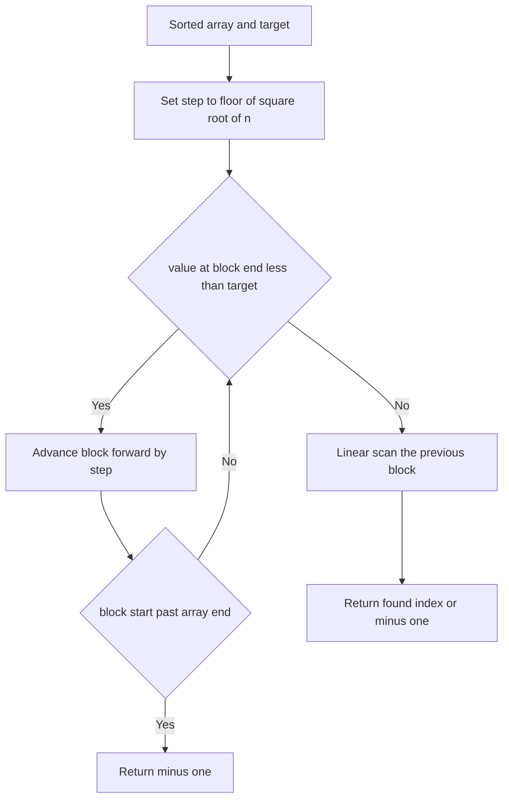

# Intro

Jump search finds a target in a sorted array by stepping forward in fixed blocks of size `m` until it overshoots the target, then linear-scanning backward within the last block. Jump `m, 2m, 3m, …` until `a[k·m] >= target`, then walk `[(k−1)·m, k·m]` one element at a time. With `n/m` jumps and up to `m` steps in the final scan, total work is `n/m + m`, minimized at `m = √n`, giving `O(√n)`.

That `O(√n)` is asymptotically worse than [[Binary Search]]'s `O(log n)`, so on a normal in-memory array binary search always wins and you should use it. Jump search has exactly one justification: it **never seeks backward by more than one block**. Binary search bounces across the whole array — a probe at index `n/2`, then `n/4`, then `3n/4` — which is cheap on RAM but expensive on media where random access is not `O(1)`: magnetic tape, a singly linked structure, a paged/streamed source where seeking forward is cheap but rewinding is not. When the cost model is "stepping forward is cheap, jumping around is expensive," jump search's bounded backward movement beats binary search's scattered probes. Absent that constraint, it is a strictly worse [[Binary Search]].

## How It Works

1. Choose block size `m = ⌊√n⌋`.
2. Jump forward: check `a[m], a[2m], a[3m], …`, advancing the block boundary while `a[block] < target`. Each jump moves forward by `m`.
3. Stop at the first block whose end value is `>= target` (or when you pass the array end). The target, if present, lies in the previous block.
4. Linear-scan that block from its start until you reach or pass the target. Return the index on a hit, `−1` otherwise.

**Why `m = √n` is optimal:** the two phases trade off. Larger blocks mean fewer jumps (`n/m`) but a longer final scan (`m`); smaller blocks mean the reverse. Minimizing `f(m) = n/m + m` by setting `f′(m) = −n/m² + 1 = 0` gives `m = √n`, and the total cost `2√n` follows. This is the same block-decomposition idea behind √-decomposition data structures.

Complexity: `O(√n)` time, `O(1)` space. Worst case is a target in the last block or absent, forcing all `n/m` jumps plus a full `m`-element scan — still `O(√n)`. Critically, only forward jumps happen; the sole backward movement is the bounded final scan of at most `m` elements.

## Example

```csharp
public static int JumpSearch(int[] arr, int target)
{
    int n = arr.Length;
    if (n == 0) return -1;

    int step = (int)Math.Floor(Math.Sqrt(n));
    int prev = 0;

    // Jump forward until the block end reaches or passes the target.
    while (arr[Math.Min(step, n) - 1] < target)
    {
        prev = step;
        step += (int)Math.Floor(Math.Sqrt(n));
        if (prev >= n) return -1;   // ran off the end without reaching target
    }

    // Linear scan the identified block; only bounded backward-adjacent movement.
    for (int i = prev; i < Math.Min(step, n); i++)
    {
        if (arr[i] == target) return i;
    }

    return -1;
}
```

## Diagram



## Pitfalls

- **Wrong block size throws away the win** — the `O(√n)` bound holds only at `m = √n`. A fixed constant block (say 100) gives `O(n)` on large arrays because the jump phase dominates; too large a block makes the linear scan dominate. Compute `m` from `n`, not a hardcoded constant.
- **Last-block boundary errors** — the final block usually is not full, so probing `a[k·m]` can index past the end. Clamp every access with `Math.Min(step, n) − 1`, and make sure the terminating jump condition fires before `prev` exceeds `n`.
- **Using it where random access is `O(1)`** — on an ordinary array jump search is simply a slower [[Binary Search]]. Its `O(√n)` only earns its keep when backward seeks are genuinely expensive (tape, linked lists, streamed pages); reaching for it on in-memory data is a mistake, not an optimization.

## Questions

> [!QUESTION]- Why is `m = √n` the optimal block size for jump search?
>
> - The cost has two parts: `n/m` jumps to reach the target's block and up to `m` steps to scan it.
> - Total cost is `f(m) = n/m + m`.
> - Minimizing gives `f′(m) = −n/m² + 1 = 0`, so `m = √n` and the total is `2√n = O(√n)`.
> - Larger blocks over-lengthen the scan; smaller blocks over-multiply the jumps — `√n` balances the two phases exactly.

> [!QUESTION]- When would jump search ever beat binary search, given it is asymptotically slower?
>
> - Binary search probes scattered indices across the whole array — cheap on RAM, expensive where random access is not `O(1)`.
> - Jump search only ever steps forward, and its single backward movement is a bounded scan of at most `√n` adjacent elements.
> - On tape, singly linked structures, or streamed/paged sources where forward reads are cheap but seeking back is costly, that bounded locality beats binary search's jumping around.
> - On any ordinary array it loses — the win exists only under the expensive-backward-seek cost model.

> [!QUESTION]- Why does jump search require sorted data, and what breaks without it?
>
> - The jump phase relies on `a[block] < target` implying the target cannot be before that block — that inference needs monotonic ordering.
> - On unsorted data an early block might straddle the target's value by accident, so a passing jump gives no guarantee about what lies behind it.
> - The algorithm would skip past the target and the final block scan would look in the wrong place.
> - Like binary search, its speed is conditional on the sorted precondition; on unsorted input fall back to [[Linear Search]].

## References

- [Jump search (Wikipedia)](https://en.wikipedia.org/wiki/Jump_search) — the block-step scheme and the `√n` optimality derivation.
- [Jump search (GeeksforGeeks)](https://www.geeksforgeeks.org/jump-search/) — worked example, block-size analysis, and comparison with binary search.
