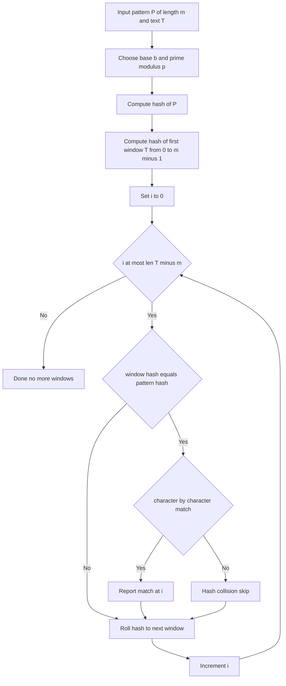

# Intro

The Rabin-Karp algorithm searches for a pattern in text by comparing hash values instead of characters directly. It computes a hash for the pattern and a rolling hash for each text window of the same length, so moving to the next window costs `O(1)` instead of recomputing from scratch. When hashes match, a character-by-character verification confirms the result. Expected time is `O(n + m)`, but pathological hash collisions can degrade to `O(nm)`.

Use Rabin-Karp when you need a simple, effective string search that extends naturally to multi-pattern matching — store all pattern hashes in a set and check each window hash against the set in `O(1)`. This makes it practical for plagiarism detection, DNA sequence matching, and log scanning with multiple signatures.

## How It Works

**Hash function**: treat each character as a digit in a base-`b` number system, modulo a large prime `p`. For a window `T[i..i+m-1]`:

`hash = (T[i] · b^(m-1) + T[i+1] · b^(m-2) + ... + T[i+m-1]) mod p`

**Rolling update**: to slide the window one position right, remove the leftmost character's contribution, shift, and add the new rightmost character:

`hash_new = (hash_old · b - T[i] · b^m + T[i+m]) mod p`

This update is `O(1)`, making the full scan `O(n)` expected. On hash match, verify the actual characters in `O(m)` to rule out collisions.



## Visualization

The card slides the pattern strip beneath the text strip, with a rolling-hash badge under the viz showing the window hash updated in O(1) at each slide. Watch how cheap non-matching windows are — a hash mismatch skips straight to the next slide — while a hash hit still triggers the character-by-character verification before a match is reported.

```steptrace
{"algorithm":"rabin-karp","text":"GEEKSFORGEEKS","pattern":"GEEK"}
```

## Example

```text
Pattern: "aba" (m=3), base=10, a=1 b=2 c=3
Pattern hash: 1·100 + 2·10 + 1 = 121

Text: "abacaba"
Window "aba": hash=121 → equals pattern hash → verify → match at 0
Roll to "bac": (121 - 1·100)·10 + 3 = 213 → skip
Roll to "aca": (213 - 2·100)·10 + 1 = 131 → skip
Roll to "cab": (131 - 1·100)·10 + 2 = 312 → skip
Roll to "aba": (312 - 3·100)·10 + 1 = 121 → verify → match at 4
```

## Pitfalls

### Poor Modulus Choice Causes Excessive Collisions

- **What goes wrong**: using a small or composite modulus increases collision probability, causing frequent false matches and degrading to `O(nm)` as every window needs character verification.
- **Why it happens**: a small modulus creates a small hash space where distinct strings land on the same value. Composite moduli have algebraic structure that increases collision clustering.
- **How to avoid it**: use a large prime (10⁹+7 or 10⁹+9 are standard). For critical applications, use double hashing (two independent hash functions) to reduce collision probability to near zero.

### Integer Overflow in Hash Arithmetic

- **What goes wrong**: the rolling hash involves multiplying large numbers (`hash · base`), which can overflow fixed-width integers and produce incorrect hash values.
- **Why it happens**: intermediate products exceed 32-bit or even 64-bit integer range when base and modulus are large.
- **How to avoid it**: apply modular reduction after every arithmetic operation, not just at the end. In languages without arbitrary-precision integers, use 64-bit types and verify that `base · modulus` fits within the integer range.

### Skipping Character Verification

- **What goes wrong**: treating a hash match as a confirmed match reports false positives — different substrings that happen to share the same hash value.
- **Why it happens**: developers optimize for speed and skip the `O(m)` verification step, assuming collisions are rare enough to ignore.
- **How to avoid it**: always verify on hash match. The expected number of verifications is small (proportional to collision rate), so the cost is negligible. Correctness is never optional.

## Questions

> [!QUESTION]- How does the rolling hash achieve O(1) window updates?
>
> - The hash treats the window as a polynomial in a chosen base. Sliding right means subtracting the leftmost character's weighted contribution, multiplying by the base, and adding the new rightmost character.
> - All three operations are constant-time arithmetic modulo the prime.
> - Without rolling, each window hash would require `O(m)` computation, making the scan `O(nm)` — no better than naive search.
> - That `O(1)` update is not free: it demands careful modular arithmetic and a well-chosen base and prime to avoid overflow and runaway collisions.

> [!QUESTION]- Why is character-by-character verification necessary on hash match?
>
> - Hash functions map a large input space to a smaller output space, so collisions are mathematically inevitable.
> - A hash match means the pattern and window might be equal; only character comparison confirms it.
> - Skipping verification turns the algorithm into a probabilistic filter that can report false positives.
> - Verification costs `O(m)` per hash match, but with a good hash those matches are rare, so the correctness guarantee is nearly free.

> [!QUESTION]- When should you choose Rabin-Karp over KMP?
>
> - When multi-pattern matching is needed — Rabin-Karp's hash-set extension is simpler than implementing Aho-Corasick.
> - When implementation simplicity matters and expected-case `O(n+m)` is acceptable.
> - When the search is probabilistic by nature (e.g., plagiarism detection scanning many documents against many patterns).
> - Rabin-Karp sacrifices worst-case determinism for implementation simplicity and natural multi-pattern support — accept this when collision risk is low and the use case favors hash-based filtering.

## References

- [Rabin-Karp algorithm -- encyclopedic overview covering rolling hash mechanics, collision analysis, and multi-pattern extension (Wikipedia)](https://en.wikipedia.org/wiki/Rabin%E2%80%93Karp_algorithm)
- [String hashing -- implementation guide for polynomial rolling hash with base and modulus selection, and applications to string matching (cp-algorithms)](https://cp-algorithms.com/string/string-hashing.html)
