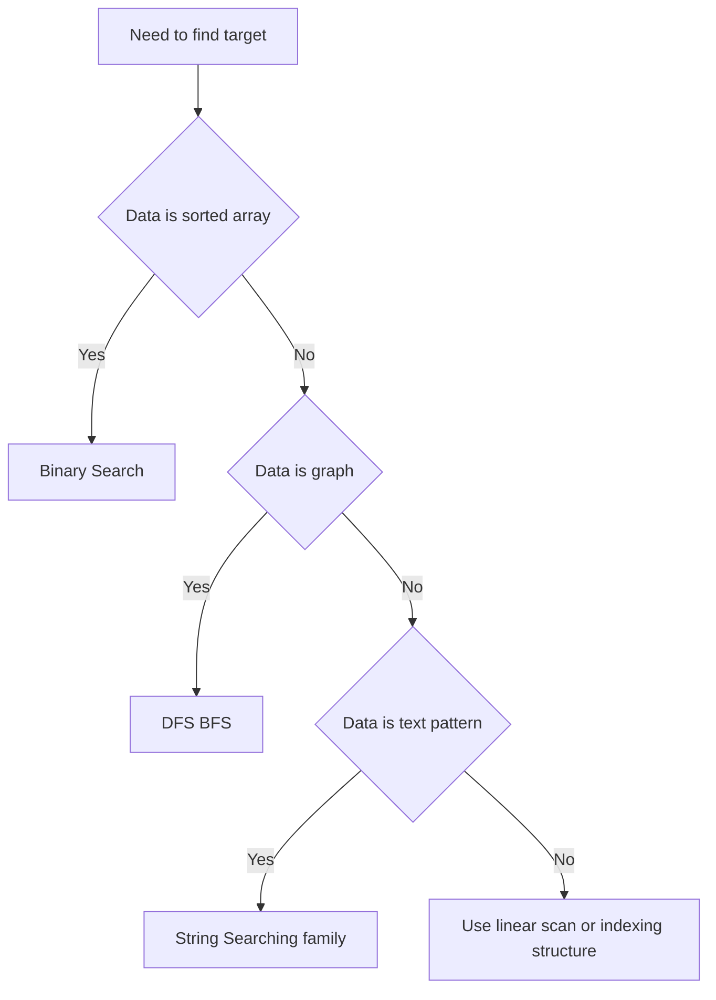

# Intro

Search algorithms find target values in collections, trees, graphs, or text while minimizing work. Choosing the right search approach depends on data ordering, data shape, and whether you need worst-case guarantees or best average speed.

Concrete example: in a sorted list of product ids, Binary Search gives fast lookups with logarithmic time. In graph traversal, BFS finds the shortest path by edge count in unweighted graphs. In text processing, KMP and Rabin Karp avoid naive full rescans.

## Diagram

## Algorithm Selection

| Data shape | Algorithm | Time | Precondition |
| --- | --- | --- | --- |
| Sorted array | [[Binary Search]] | O(log n) | Sorted, random access |
| Unsorted array | Linear scan | O(n) | None |
| Graph (unweighted) | [[DFS BFS\|BFS / DFS]] | O(V + E) | — |
| Text + pattern (single) | [[KMP (Knuth-Morris-Pratt) Algorithm\|KMP]] | O(n + m) | — |
| Text + many patterns / rolling | [[Rabin Karp Search\|Rabin–Karp]] | O(n + m) avg | Good hash to avoid collisions |

## Questions

> [!QUESTION]- What is the first decision before picking a search algorithm?
>
> - Check whether data is sorted, because that immediately enables Binary Search.
> - Identify data shape: array, graph, or text stream, because each has specialized methods.
> - Decide whether worst-case guarantees or average speed matters more.
> - Checking these preconditions first avoids picking an algorithm whose assumptions your data violates — the most common source of wrong or slow searches.

> [!QUESTION]- Why is one search algorithm never best for all cases?
>
> - Different algorithms optimize for different constraints such as ordering, memory, and preprocessing.
> - Workload shape changes the winner: single lookup, repeated queries, or many patterns.
> - Correctness constraints can force specific methods, for example sorted input for Binary Search.
> - Every choice trades preprocessing and memory against query speed; the senior move is to weigh those for the actual workload instead of reaching for a default.

> [!QUESTION]- When does preprocessing (sorting or indexing) pay off versus a plain linear scan?
>
> - A one-off search over unsorted data is just O(n) — sorting first (O(n log n)) would cost more than it saves.
> - Once many queries hit the same data, a single sort or index build is amortized across all of them and each query drops to O(log n) or O(1).
> - Indexes (hash maps, B-trees) trade memory and write cost for fast reads.
> - Preprocessing front-loads cost and memory to make repeated queries cheap, so justify it by query volume, not by instinct.

## References

- [Search algorithm (Wikipedia)](https://en.wikipedia.org/wiki/Search_algorithm) — Overview of search algorithm categories.
- [BinarySearch method (.NET API)](https://learn.microsoft.com/en-us/dotnet/api/system.array.binarysearch) — Official .NET binary search reference with usage examples.
- [Binary search (CP Algorithms)](https://cp-algorithms.com/num_methods/binary_search.html) — Implementation patterns and edge-case analysis.
- [Nearly all binary searches and mergesorts are broken (Google Research)](https://research.google/blog/extra-extra-read-all-about-it-nearly-all-binary-searches-and-mergesorts-are-broken/) — Practitioner post-mortem on a subtle overflow bug present in most binary search implementations for decades.
