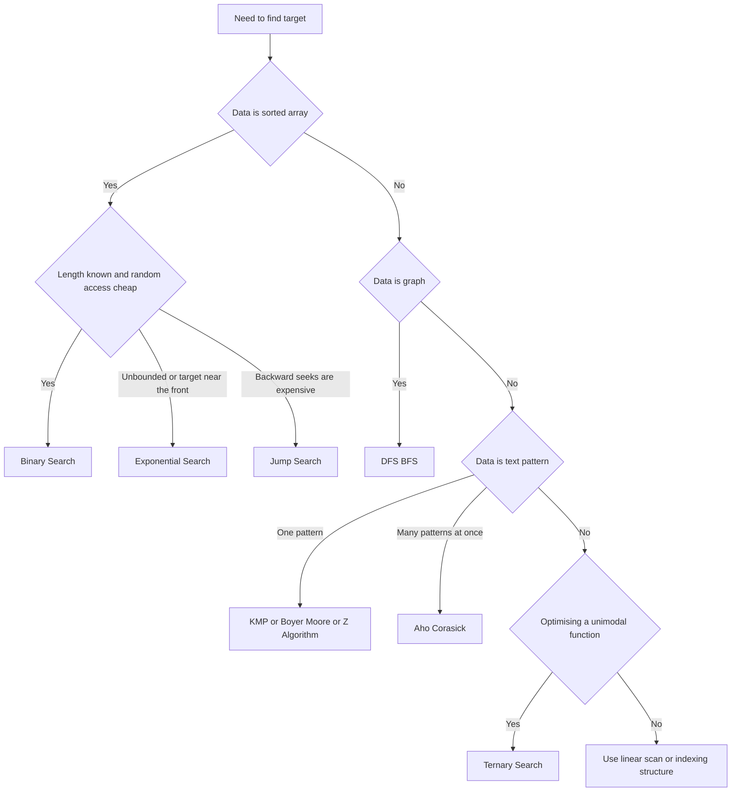

Search algorithms find target values in collections, trees, graphs, or text while minimizing work. Choosing the right search approach depends on data ordering, data shape, and whether you need worst-case guarantees or best average speed.

Concrete example: in a sorted list of product ids, Binary Search gives fast lookups with logarithmic time. In graph traversal, BFS finds the shortest path by edge count in unweighted graphs. In text processing, KMP and Rabin Karp avoid naive full rescans.

<nav style="--card-accent: 239, 68, 68;" class="folder-structure-map" aria-label="Search Algorithms section map">
<article class="db-card folder-map-node">

<svg xmlns="http://www.w3.org/2000/svg" stroke-linejoin="round" stroke-linecap="round" stroke-width="2" stroke="currentColor" fill="none" viewBox="0 0 24 24"><path d="M20 20a2 2 0 0 0 2-2V8a2 2 0 0 0-2-2h-7.9a2 2 0 0 1-1.69-.9L9.6 3.9A2 2 0 0 0 7.93 3H4a2 2 0 0 0-2 2v13a2 2 0 0 0 2 2Z"/></svg>String Matching5 notes

Finding a pattern inside text, chosen by how many patterns you match and what you preprocess.

<a class="internal-link" href="Home/Computer Science/Algorithms/Search Algorithms/String Matching/String Matching.md" data-tooltip-position="top" aria-label="String Matching">String Matching</a></article><article class="db-card folder-map-node">

<svg xmlns="http://www.w3.org/2000/svg" stroke-linejoin="round" stroke-linecap="round" stroke-width="2" stroke="currentColor" fill="none" viewBox="0 0 24 24"><path d="M14.5 2H6a2 2 0 0 0-2 2v16a2 2 0 0 0 2 2h12a2 2 0 0 0 2-2V7.5L14.5 2z"/><polyline points="14 2 14 8 20 8"/><line y2="13" y1="13" x2="8" x1="16"/><line y2="17" y1="17" x2="8" x1="16"/><line y2="9" y1="9" x2="8" x1="10"/></svg>Binary Search

Finds a target in a sorted array by repeatedly halving the search range, in O(log n).

<a class="internal-link" href="Home/Computer Science/Algorithms/Search Algorithms/Binary Search.md" data-tooltip-position="top" aria-label="Binary Search">Binary Search</a></article><article class="db-card folder-map-node">

<svg xmlns="http://www.w3.org/2000/svg" stroke-linejoin="round" stroke-linecap="round" stroke-width="2" stroke="currentColor" fill="none" viewBox="0 0 24 24"><path d="M14.5 2H6a2 2 0 0 0-2 2v16a2 2 0 0 0 2 2h12a2 2 0 0 0 2-2V7.5L14.5 2z"/><polyline points="14 2 14 8 20 8"/><line y2="13" y1="13" x2="8" x1="16"/><line y2="17" y1="17" x2="8" x1="16"/><line y2="9" y1="9" x2="8" x1="10"/></svg>Exponential Search

Finds a range containing the target by doubling probe indices, then binary-searches it, in O(log i) by target position.

<a class="internal-link" href="Home/Computer Science/Algorithms/Search Algorithms/Exponential Search.md" data-tooltip-position="top" aria-label="Exponential Search">Exponential Search</a></article><article class="db-card folder-map-node">

<svg xmlns="http://www.w3.org/2000/svg" stroke-linejoin="round" stroke-linecap="round" stroke-width="2" stroke="currentColor" fill="none" viewBox="0 0 24 24"><path d="M14.5 2H6a2 2 0 0 0-2 2v16a2 2 0 0 0 2 2h12a2 2 0 0 0 2-2V7.5L14.5 2z"/><polyline points="14 2 14 8 20 8"/><line y2="13" y1="13" x2="8" x1="16"/><line y2="17" y1="17" x2="8" x1="16"/><line y2="9" y1="9" x2="8" x1="10"/></svg>Interpolation Search

Guesses the target's position by interpolation, reaching O(log log n) on uniform sorted data.

<a class="internal-link" href="Home/Computer Science/Algorithms/Search Algorithms/Interpolation Search.md" data-tooltip-position="top" aria-label="Interpolation Search">Interpolation Search</a></article><article class="db-card folder-map-node">

<svg xmlns="http://www.w3.org/2000/svg" stroke-linejoin="round" stroke-linecap="round" stroke-width="2" stroke="currentColor" fill="none" viewBox="0 0 24 24"><path d="M14.5 2H6a2 2 0 0 0-2 2v16a2 2 0 0 0 2 2h12a2 2 0 0 0 2-2V7.5L14.5 2z"/><polyline points="14 2 14 8 20 8"/><line y2="13" y1="13" x2="8" x1="16"/><line y2="17" y1="17" x2="8" x1="16"/><line y2="9" y1="9" x2="8" x1="10"/></svg>Jump Search

Steps a sorted array in fixed blocks of size root n, then scans back one block.

<a class="internal-link" href="Home/Computer Science/Algorithms/Search Algorithms/Jump Search.md" data-tooltip-position="top" aria-label="Jump Search">Jump Search</a></article><article class="db-card folder-map-node">

<svg xmlns="http://www.w3.org/2000/svg" stroke-linejoin="round" stroke-linecap="round" stroke-width="2" stroke="currentColor" fill="none" viewBox="0 0 24 24"><path d="M14.5 2H6a2 2 0 0 0-2 2v16a2 2 0 0 0 2 2h12a2 2 0 0 0 2-2V7.5L14.5 2z"/><polyline points="14 2 14 8 20 8"/><line y2="13" y1="13" x2="8" x1="16"/><line y2="17" y1="17" x2="8" x1="16"/><line y2="9" y1="9" x2="8" x1="10"/></svg>Linear Search

Scans elements one by one until a match; O(n) and works on any data.

<a class="internal-link" href="Home/Computer Science/Algorithms/Search Algorithms/Linear Search.md" data-tooltip-position="top" aria-label="Linear Search">Linear Search</a></article><article class="db-card folder-map-node">

<svg xmlns="http://www.w3.org/2000/svg" stroke-linejoin="round" stroke-linecap="round" stroke-width="2" stroke="currentColor" fill="none" viewBox="0 0 24 24"><path d="M14.5 2H6a2 2 0 0 0-2 2v16a2 2 0 0 0 2 2h12a2 2 0 0 0 2-2V7.5L14.5 2z"/><polyline points="14 2 14 8 20 8"/><line y2="13" y1="13" x2="8" x1="16"/><line y2="17" y1="17" x2="8" x1="16"/><line y2="9" y1="9" x2="8" x1="10"/></svg>Ternary Search

Finds the extremum of a unimodal function by splitting the range in thirds each step.

<a class="internal-link" href="Home/Computer Science/Algorithms/Search Algorithms/Ternary Search.md" data-tooltip-position="top" aria-label="Ternary Search">Ternary Search</a></article>
</nav>

# Diagram

# Algorithm Selection

## Searching an array

| Data shape | Algorithm | Time | Precondition |
| --- | --- | --- | --- |
| Unsorted array, linked list, or one-pass stream | [[Linear Search]] | O(n) | None; needs no index or random access |
| Sorted array | [[Binary Search]] | O(log n) | Sorted, random access |
| Sorted, unbounded length or target near front | [[Exponential Search]] | O(log i) for target at index i | Sorted |
| Sorted, uniformly distributed keys | [[Interpolation Search]] | O(log log n) avg, O(n) worst | Sorted **and** near-uniform **numeric** distribution |
| Sorted, forward-only / costly backward seeks | [[Jump Search]] | O(√n) | Sorted |
| Unimodal function, not an array | [[Ternary Search]] | O(log n) probes | Strict unimodality |

Binary Search also serves range and insertion-point queries — lower-bound / upper-bound, first/last match — because it keeps the data in sorted order rather than building a separate index.

## Searching text

Text/pattern matching is its own sub-family — see [[String Matching]] for the full comparison.

| Data shape | Algorithm | Time | Precondition |
| --- | --- | --- | --- |
| Text + one pattern | [[KMP (Knuth-Morris-Pratt) Algorithm\|KMP]] | O(n + m) | — |
| Text + one pattern, large alphabet | [[Boyer-Moore]] | O(n/m) best, O(n) with Galil | Sublinear in practice; powers `grep` |
| Text + one pattern, prefix-structure problems | [[Z-Algorithm]] | O(n + m) | — |
| Text + many patterns at once | [[Aho-Corasick]] | O(n + matches) after build | Build cost is sum of pattern lengths |
| Text + rolling / multi-pattern hashing | [[Rabin Karp Search\|Rabin–Karp]] | O(n + m) avg | Good hash to avoid collisions |

## Searching a graph

| Data shape | Algorithm | Time | Precondition |
| --- | --- | --- | --- |
| Graph (unweighted) | [[DFS BFS\|BFS / DFS]] | O(V + E) | — |
| Graph (weighted) | See [[Graph Algorithms]] | — | [[Dijkstra]], [[A-Star Search\|A* Search]], [[Bellman-Ford]] |

# Questions

> [!QUESTION]- What is the first decision before picking a search algorithm?
>
> - Check whether data is sorted, because that immediately enables Binary Search.
> - Identify data shape: array, graph, or text stream, because each has specialized methods.
> - Decide whether worst-case guarantees or average speed matters more.
> - Checking these preconditions first avoids picking an algorithm whose assumptions your data violates — the most common source of wrong or slow searches.

> [!QUESTION]- Why is one search algorithm never best for all cases?
>
> - Different algorithms optimize for different constraints such as ordering, memory, and preprocessing.
> - Workload shape changes the winner: single lookup, repeated queries, or many patterns.
> - Correctness constraints can force specific methods, for example sorted input for Binary Search.
> - Every choice trades preprocessing and memory against query speed; the senior move is to weigh those for the actual workload instead of reaching for a default.

> [!QUESTION]- When does preprocessing (sorting or indexing) pay off versus a plain linear scan?
>
> - A one-off search over unsorted data is just O(n) — sorting first (O(n log n)) would cost more than it saves.
> - Once many queries hit the same data, a single sort or index build is amortized across all of them and each query drops to O(log n) or O(1).
> - Indexes (hash maps, B-trees) trade memory and write cost for fast reads.
> - Preprocessing front-loads cost and memory to make repeated queries cheap, so justify it by query volume, not by instinct.

# References

- [Search algorithm (Wikipedia)](https://en.wikipedia.org/wiki/Search_algorithm) — Overview of search algorithm categories.
- [BinarySearch method (.NET API)](https://learn.microsoft.com/en-us/dotnet/api/system.array.binarysearch) — Official .NET binary search reference with usage examples.
- [Binary search (CP Algorithms)](https://cp-algorithms.com/num_methods/binary_search.html) — Implementation patterns and edge-case analysis.
- [Nearly all binary searches and mergesorts are broken (Google Research)](https://research.google/blog/extra-extra-read-all-about-it-nearly-all-binary-searches-and-mergesorts-are-broken/) — Practitioner post-mortem on a subtle overflow bug present in most binary search implementations for decades.
