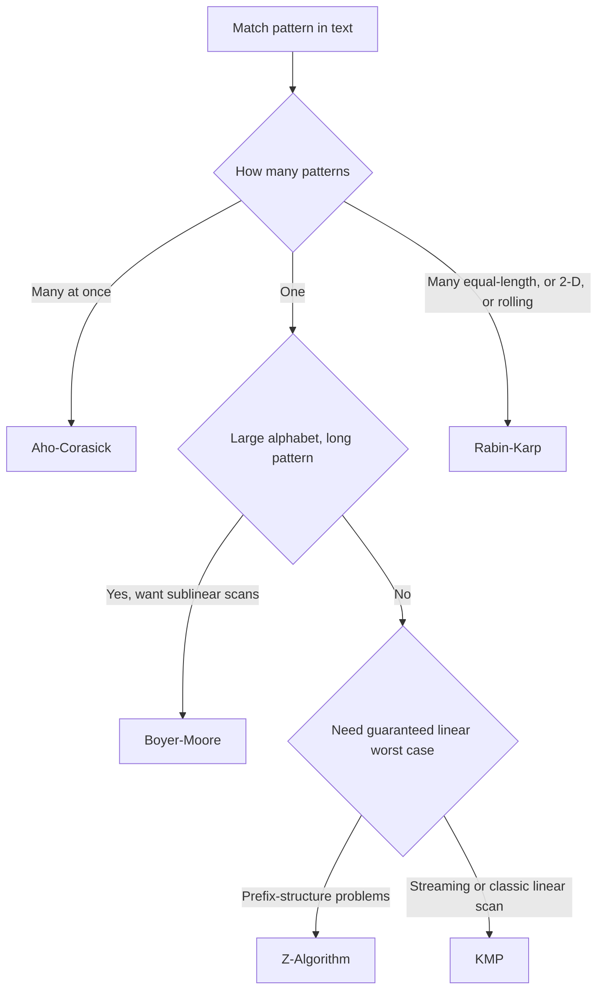

String matching finds occurrences of a pattern inside a text without the naive `O(n·m)` rescan that re-examines characters after every mismatch. The whole family exists to reuse the work a mismatch reveals: once you know a suffix of what you scanned equals a prefix of the pattern, you can shift by more than one character and never look back.

Two axes separate the members. The first is **how many patterns** you search for at once — one pattern ([[KMP (Knuth-Morris-Pratt) Algorithm|KMP]], [[Z-Algorithm]], [[Boyer-Moore]]) versus a whole set in a single pass ([[Aho-Corasick]]). The second is **what you preprocess**: most methods preprocess the _pattern_ into a failure function or shift table, while [[Rabin Karp Search|Rabin–Karp]] preprocesses nothing structural and instead fingerprints the _text_ with a rolling hash. That hashing angle is what lets Rabin–Karp scale to many equal-length patterns or extend to 2-D matching where the automaton methods do not.

<nav style="--card-accent: 239, 68, 68;" class="folder-structure-map" aria-label="String Matching section map">
<article class="db-card folder-map-node">

<svg xmlns="http://www.w3.org/2000/svg" stroke-linejoin="round" stroke-linecap="round" stroke-width="2" stroke="currentColor" fill="none" viewBox="0 0 24 24"><path d="M14.5 2H6a2 2 0 0 0-2 2v16a2 2 0 0 0 2 2h12a2 2 0 0 0 2-2V7.5L14.5 2z"/><polyline points="14 2 14 8 20 8"/><line y2="13" y1="13" x2="8" x1="16"/><line y2="17" y1="17" x2="8" x1="16"/><line y2="9" y1="9" x2="8" x1="10"/></svg>Aho-Corasick

Finds all occurrences of many patterns in one text pass using a trie with failure links, in O(n + z).

<a class="internal-link" href="Home/Computer Science/Algorithms/Search Algorithms/String Matching/Aho-Corasick.md" data-tooltip-position="top" aria-label="Aho-Corasick">Aho-Corasick</a></article><article class="db-card folder-map-node">

<svg xmlns="http://www.w3.org/2000/svg" stroke-linejoin="round" stroke-linecap="round" stroke-width="2" stroke="currentColor" fill="none" viewBox="0 0 24 24"><path d="M14.5 2H6a2 2 0 0 0-2 2v16a2 2 0 0 0 2 2h12a2 2 0 0 0 2-2V7.5L14.5 2z"/><polyline points="14 2 14 8 20 8"/><line y2="13" y1="13" x2="8" x1="16"/><line y2="17" y1="17" x2="8" x1="16"/><line y2="9" y1="9" x2="8" x1="10"/></svg>Boyer-Moore

Matches a pattern by comparing right-to-left and skipping ahead via bad-character and good-suffix rules, sublinear in practice.

<a class="internal-link" href="Home/Computer Science/Algorithms/Search Algorithms/String Matching/Boyer-Moore.md" data-tooltip-position="top" aria-label="Boyer-Moore">Boyer-Moore</a></article><article class="db-card folder-map-node">

<svg xmlns="http://www.w3.org/2000/svg" stroke-linejoin="round" stroke-linecap="round" stroke-width="2" stroke="currentColor" fill="none" viewBox="0 0 24 24"><path d="M14.5 2H6a2 2 0 0 0-2 2v16a2 2 0 0 0 2 2h12a2 2 0 0 0 2-2V7.5L14.5 2z"/><polyline points="14 2 14 8 20 8"/><line y2="13" y1="13" x2="8" x1="16"/><line y2="17" y1="17" x2="8" x1="16"/><line y2="9" y1="9" x2="8" x1="10"/></svg>KMP (Knuth-Morris-Pratt) Algorithm

Searches for a pattern in guaranteed O(n + m) time by never rescanning text, using a precomputed prefix (LPS) array.

<a class="internal-link" href="Home/Computer Science/Algorithms/Search Algorithms/String Matching/KMP (Knuth-Morris-Pratt) Algorithm.md" data-tooltip-position="top" aria-label="KMP (Knuth-Morris-Pratt) Algorithm">KMP (Knuth-Morris-Pratt) Algorithm</a></article><article class="db-card folder-map-node">

<svg xmlns="http://www.w3.org/2000/svg" stroke-linejoin="round" stroke-linecap="round" stroke-width="2" stroke="currentColor" fill="none" viewBox="0 0 24 24"><path d="M14.5 2H6a2 2 0 0 0-2 2v16a2 2 0 0 0 2 2h12a2 2 0 0 0 2-2V7.5L14.5 2z"/><polyline points="14 2 14 8 20 8"/><line y2="13" y1="13" x2="8" x1="16"/><line y2="17" y1="17" x2="8" x1="16"/><line y2="9" y1="9" x2="8" x1="10"/></svg>Rabin Karp Search

Matches patterns by comparing rolling hashes of text windows, in expected O(n + m).

<a class="internal-link" href="Home/Computer Science/Algorithms/Search Algorithms/String Matching/Rabin Karp Search.md" data-tooltip-position="top" aria-label="Rabin Karp Search">Rabin Karp Search</a></article><article class="db-card folder-map-node">

<svg xmlns="http://www.w3.org/2000/svg" stroke-linejoin="round" stroke-linecap="round" stroke-width="2" stroke="currentColor" fill="none" viewBox="0 0 24 24"><path d="M14.5 2H6a2 2 0 0 0-2 2v16a2 2 0 0 0 2 2h12a2 2 0 0 0 2-2V7.5L14.5 2z"/><polyline points="14 2 14 8 20 8"/><line y2="13" y1="13" x2="8" x1="16"/><line y2="17" y1="17" x2="8" x1="16"/><line y2="9" y1="9" x2="8" x1="10"/></svg>Z-Algorithm

Computes the Z-array (longest prefix match starting at each index) in one O(n) pass using a sliding Z-box.

<a class="internal-link" href="Home/Computer Science/Algorithms/Search Algorithms/String Matching/Z-Algorithm.md" data-tooltip-position="top" aria-label="Z-Algorithm">Z-Algorithm</a></article>
</nav>

# Diagram

# The family

| Algorithm | Patterns | Preprocesses | Time | Worst case | Aux space | Weaker case | Reach for it when |
| --- | --- | --- | --- | --- | --- | --- | --- |
| [[KMP (Knuth-Morris-Pratt) Algorithm\|KMP]] | one | pattern → prefix (failure) function | O(n + m) | O(n + m) | Θ(m) | Large alphabets, where skipping would pay | Guaranteed linear scan; never backs up in the text (streaming) |
| [[Z-Algorithm]] | one | pattern → Z-array | O(n + m) | O(n + m) | Θ(n + m) | Large text under tight memory | Prefix-structure problems; often the simpler linear method to reason about |
| [[Boyer-Moore]] | one | pattern → bad-character + good-suffix tables | O(n / m) best | O(n) with Galil rule | O(m + |Σ|) | Small alphabets, adversarial repeats | Long patterns over large alphabets — sublinear in practice; powers `grep` |
| [[Rabin Karp Search\|Rabin–Karp]] | one or many | text → rolling hash | O(n + m) avg | O(n·m) on hash collisions | Θ(m) hash / O(1) scan | Collisions or adversarial text → O(n·m) | Many equal-length patterns, plagiarism/fingerprinting, 2-D matching |
| [[Aho-Corasick]] | many | pattern set → trie + failure links | O(n + Σmᵢ + matches) | same | Θ(M·σ) dense / Θ(M) sparse | A single pattern; memory-tight dense alphabets | Scanning once for a whole dictionary of patterns |

The two linear single-pattern methods, [[KMP (Knuth-Morris-Pratt) Algorithm|KMP]] and [[Z-Algorithm]], are two views of the same prefix structure: both preprocess the pattern in `O(m)`, guarantee `O(n)` scans, and are interconvertible. [[Boyer-Moore]] gives up the worst-case simplicity to win the _average_ case by skipping ahead — the longer the pattern and the larger the alphabet, the bigger its shifts. [[Aho-Corasick]] is KMP generalised from one pattern to a set: the trie holds every pattern and the failure links are the multi-pattern equivalent of KMP's failure function. [[Rabin Karp Search|Rabin–Karp]] stands apart — it never builds an automaton, so it stays correct only up to hash collisions, which is exactly why it generalises to problems the automaton methods can't reach cheaply.

# Questions

> [!QUESTION]- Why does KMP never re-examine a text character after a mismatch?
> Its prefix (failure) function records, for every pattern position, the length of the longest proper prefix that is also a suffix. On a mismatch the pattern shifts so that this already-matched prefix aligns, so the text pointer only ever advances. That is what turns the naive `O(n·m)` scan into `O(n + m)`.

> [!QUESTION]- When is Boyer-Moore's `O(n/m)` best case actually realised, and when does it degrade?
> Sublinear scanning appears with long patterns over large alphabets, where a mismatched character usually isn't in the pattern at all and the bad-character rule shifts by nearly the full pattern length. It degrades toward `O(n·m)` on small alphabets or highly repetitive text; the Galil rule caps the worst case at `O(n)`.

> [!QUESTION]- Why choose Rabin–Karp over a linear automaton method?
> Because it fingerprints windows of the text with a rolling hash rather than building an automaton, it extends naturally where the automaton methods don't: matching many equal-length patterns at once (compare each window's hash against a set), plagiarism detection, and 2-D pattern matching. The price is that a hash collision forces a character-by-character verification, so its worst case is `O(n·m)`.

> [!QUESTION]- How is Aho-Corasick related to KMP?
> It is KMP lifted from a single pattern to a set. The patterns are stored in a trie, and each node's failure link points to the longest proper suffix that is a prefix of some pattern — the multi-pattern analogue of KMP's failure function. One pass over the text then reports every occurrence of every pattern in `O(n + Σmᵢ + matches)`.

# References

- [String-searching algorithm (Wikipedia)](https://en.wikipedia.org/wiki/String-searching_algorithm) — taxonomy of single- and multi-pattern methods and their complexity.
- [Prefix function (CP-Algorithms)](https://cp-algorithms.com/string/prefix-function.html) — KMP's prefix function and its matching applications with implementations.
- [Aho–Corasick algorithm (CP-Algorithms)](https://cp-algorithms.com/string/aho_corasick.html) — trie plus failure links for multi-pattern search.
- [Boyer–Moore string-search algorithm (Wikipedia)](https://en.wikipedia.org/wiki/Boyer%E2%80%93Moore_string-search_algorithm) — bad-character and good-suffix heuristics behind sublinear scanning.
