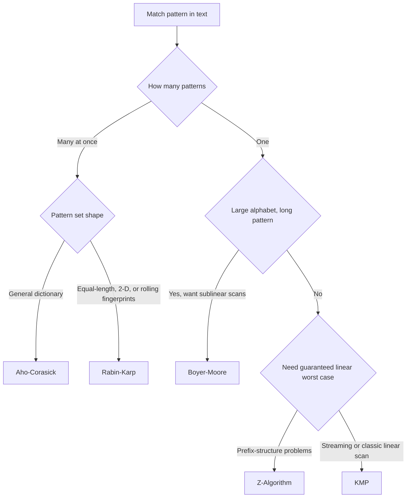

String matching finds occurrences of a pattern inside a text. A naive scan costs `O(n·m)` because it may restart the comparison after every mismatch. Faster methods keep the useful part of that failed comparison and avoid checking characters whose relationship is already known.

Pattern count is the first dividing line. [[KMP (Knuth-Morris-Pratt) Algorithm|KMP]], [[Z-Algorithm]], and [[Boyer-Moore]] handle one pattern, while [[Aho-Corasick]] scans for a whole set. Preprocessing is the other distinction. Most methods turn the pattern into a failure function or shift table. [[Rabin Karp Search|Rabin–Karp]] instead fingerprints consecutive text windows, which also works for many equal-length patterns and two-dimensional matching.

<nav style="--card-accent: 239, 68, 68;" class="folder-structure-map" aria-label="String Matching section map">
<article class="db-card folder-map-node">

<svg xmlns="http://www.w3.org/2000/svg" stroke-linejoin="round" stroke-linecap="round" stroke-width="2" stroke="currentColor" fill="none" viewBox="0 0 24 24"><path d="M14.5 2H6a2 2 0 0 0-2 2v16a2 2 0 0 0 2 2h12a2 2 0 0 0 2-2V7.5L14.5 2z"/><polyline points="14 2 14 8 20 8"/><line y2="13" y1="13" x2="8" x1="16"/><line y2="17" y1="17" x2="8" x1="16"/><line y2="9" y1="9" x2="8" x1="10"/></svg>Aho-Corasick

Finds all occurrences of many patterns in one text pass using a trie with failure links.

<a class="internal-link" href="Home/Computer Science/Algorithms/Search Algorithms/String Matching/Aho-Corasick.md" data-tooltip-position="top" aria-label="Aho-Corasick">Aho-Corasick</a></article><article class="db-card folder-map-node">

<svg xmlns="http://www.w3.org/2000/svg" stroke-linejoin="round" stroke-linecap="round" stroke-width="2" stroke="currentColor" fill="none" viewBox="0 0 24 24"><path d="M14.5 2H6a2 2 0 0 0-2 2v16a2 2 0 0 0 2 2h12a2 2 0 0 0 2-2V7.5L14.5 2z"/><polyline points="14 2 14 8 20 8"/><line y2="13" y1="13" x2="8" x1="16"/><line y2="17" y1="17" x2="8" x1="16"/><line y2="9" y1="9" x2="8" x1="10"/></svg>Boyer-Moore

Matches a pattern by comparing right-to-left and skipping ahead via bad-character and good-suffix rules.

<a class="internal-link" href="Home/Computer Science/Algorithms/Search Algorithms/String Matching/Boyer-Moore.md" data-tooltip-position="top" aria-label="Boyer-Moore">Boyer-Moore</a></article><article class="db-card folder-map-node">

<svg xmlns="http://www.w3.org/2000/svg" stroke-linejoin="round" stroke-linecap="round" stroke-width="2" stroke="currentColor" fill="none" viewBox="0 0 24 24"><path d="M14.5 2H6a2 2 0 0 0-2 2v16a2 2 0 0 0 2 2h12a2 2 0 0 0 2-2V7.5L14.5 2z"/><polyline points="14 2 14 8 20 8"/><line y2="13" y1="13" x2="8" x1="16"/><line y2="17" y1="17" x2="8" x1="16"/><line y2="9" y1="9" x2="8" x1="10"/></svg>KMP (Knuth-Morris-Pratt) Algorithm

Searches for a pattern without rescanning text by using a precomputed prefix (LPS) array.

<a class="internal-link" href="Home/Computer Science/Algorithms/Search Algorithms/String Matching/KMP (Knuth-Morris-Pratt) Algorithm.md" data-tooltip-position="top" aria-label="KMP (Knuth-Morris-Pratt) Algorithm">KMP (Knuth-Morris-Pratt) Algorithm</a></article><article class="db-card folder-map-node">

<svg xmlns="http://www.w3.org/2000/svg" stroke-linejoin="round" stroke-linecap="round" stroke-width="2" stroke="currentColor" fill="none" viewBox="0 0 24 24"><path d="M14.5 2H6a2 2 0 0 0-2 2v16a2 2 0 0 0 2 2h12a2 2 0 0 0 2-2V7.5L14.5 2z"/><polyline points="14 2 14 8 20 8"/><line y2="13" y1="13" x2="8" x1="16"/><line y2="17" y1="17" x2="8" x1="16"/><line y2="9" y1="9" x2="8" x1="10"/></svg>Rabin Karp Search

Matches patterns by comparing rolling hashes of consecutive text windows.

<a class="internal-link" href="Home/Computer Science/Algorithms/Search Algorithms/String Matching/Rabin Karp Search.md" data-tooltip-position="top" aria-label="Rabin Karp Search">Rabin Karp Search</a></article><article class="db-card folder-map-node">

<svg xmlns="http://www.w3.org/2000/svg" stroke-linejoin="round" stroke-linecap="round" stroke-width="2" stroke="currentColor" fill="none" viewBox="0 0 24 24"><path d="M14.5 2H6a2 2 0 0 0-2 2v16a2 2 0 0 0 2 2h12a2 2 0 0 0 2-2V7.5L14.5 2z"/><polyline points="14 2 14 8 20 8"/><line y2="13" y1="13" x2="8" x1="16"/><line y2="17" y1="17" x2="8" x1="16"/><line y2="9" y1="9" x2="8" x1="10"/></svg>Z-Algorithm

Computes the longest prefix match starting at each index in one forward pass using a sliding Z-box.

<a class="internal-link" href="Home/Computer Science/Algorithms/Search Algorithms/String Matching/Z-Algorithm.md" data-tooltip-position="top" aria-label="Z-Algorithm">Z-Algorithm</a></article>
</nav>

# Diagram

```mermaid
flowchart TD
  A[Match pattern in text] --> B{How many patterns}
  B -->|Many at once| C{Pattern set shape}
  C -->|General dictionary| C1[Aho-Corasick]
  C -->|Equal-length, 2-D, or rolling fingerprints| I[Rabin-Karp]
  B -->|One| D{Large alphabet, long pattern}
  D -->|Yes, want sublinear scans| E[Boyer-Moore]
  D -->|No| F{Need guaranteed linear worst case}
  F -->|Prefix-structure problems| G[Z-Algorithm]
  F -->|Streaming or classic linear scan| H[KMP]
```

# The Family

| Algorithm | Patterns | Preprocesses | Time | Worst case | Aux space | Weaker case | Reach for it when |
| --- | --- | --- | --- | --- | --- | --- | --- |
| [[KMP (Knuth-Morris-Pratt) Algorithm\|KMP]] | one | pattern → prefix (failure) function | O(n + m) | O(n + m) | Θ(m) | Large alphabets, where longer skips may help | A guaranteed linear scan that never backs up in the text |
| [[Z-Algorithm]] | one | pattern → Z-array | O(n + m) | O(n + m) | Θ(n + m) | Large text under tight memory | Prefix-overlap problems and a direct linear scan |
| [[Boyer-Moore]] | one | pattern → bad-character + good-suffix tables | O(m + |Σ| + n/m) best | O(m + |Σ| + n) with Galil rule | O(m + |Σ|) | Small alphabets or adversarial repeats | Long patterns over large alphabets, where large shifts are common |
| [[Rabin Karp Search\|Rabin–Karp]] | one or `k` equal-length patterns | text → rolling hash | Expected: O(n + m + V) for one. O(n + k·m + V) for `k` | Verification worst case: O(n·m) for one. O(n·k·m) for `k` | Θ(1) for one pattern. Θ(k) for `k` pattern hashes | Collisions or genuine matches at many windows trigger repeated verification | Many equal-length patterns, fingerprints, or 2-D matching |
| [[Aho-Corasick]] | many | pattern set → trie + failure links | O(n + Σmᵢ + matches) | same | Θ(M·σ) dense / Θ(M) sparse | A single pattern or a memory-tight dense alphabet | One scan for a dictionary of patterns |

[[KMP (Knuth-Morris-Pratt) Algorithm|KMP]] and [[Z-Algorithm]] encode the same prefix-overlap information in different arrays. Both preprocess the pattern in `O(m)` and then scan in `O(n)`. [[Boyer-Moore]] takes another route: it uses mismatch information to jump forward, often by several characters when the pattern is long and the alphabet is large. Its table reports total cost, including `O(m + |Σ|)` preprocessing. The scan contributes `O(n/m)` in the best case or `O(n)` with the Galil rule.

[[Aho-Corasick]] extends the failure-link idea from one pattern to a trie of patterns. [[Rabin Karp Search|Rabin–Karp]] builds no automaton at all. Its rolling hash filters candidate windows, followed by direct comparison of only the patterns in the matching hash bucket. A one-pattern scan keeps only a fixed number of hash values, so its auxiliary space is `Θ(1)`. Matching `k` equal-length patterns with hash buckets takes `Θ(k)`. Let `V` be the actual character work spent verifying hash-matched candidates. Including pattern hashing, expected time is `O(n + m + V)` for one pattern and `O(n + k·m + V)` for `k`. These reduce to `O(n + m)` and `O(n + k·m)` only when `V` is bounded by those terms. If all `k` patterns share the candidate hash and every window enters that bucket, verification reaches `O(n·k·m)`; ordinary windows do not compare against every pattern.

# References

- [Algorithms on Strings, Trees, and Sequences](https://doi.org/10.1017/CBO9780511574931)
