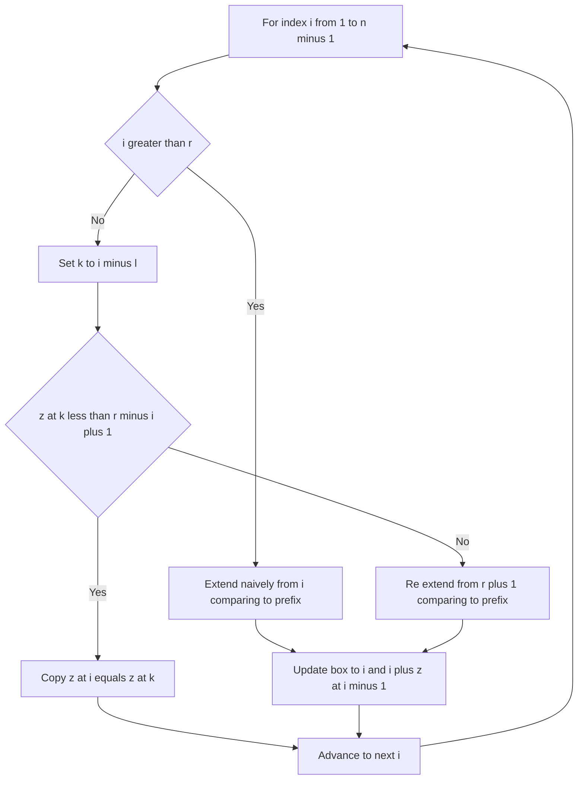

# Intro

The Z-algorithm computes, for a string `S`, the **Z-array**: `z[i]` is the length of the longest substring starting at index `i` that is also a prefix of `S`. For example, `S = "aabaab"` gives `z = [-, 1, 0, 3, 1, 0]` (`z[0]` is conventionally left undefined or set to `n`), because the substring starting at index 3 (`"aab"`) matches the prefix `"aab"` for three characters. It builds the whole array in a single `O(n)` left-to-right pass using a sliding window called the **Z-box**.

The Z-array carries the same information as [[KMP (Knuth-Morris-Pratt) Algorithm|KMP]]'s prefix (failure) function — both let you match a pattern in linear time — but many people find the Z-array easier to reason about because its definition ("how much of the prefix reappears here") is direct and geometric rather than recursive. It also composes well for problems phrased as _"for every suffix, how long is its common prefix with the whole string?"_ — exactly what `z[i]` answers. Use it for single-pattern search via the concatenation trick below, and for prefix-structure problems (periodicity, string compression, counting occurrences) where the failure function is awkward.

## How It Works

The algorithm maintains a window `[l, r]`, the **Z-box**: the interval with the largest right endpoint `r` seen so far that is known to equal a prefix of `S` (that is, `S[l..r]` equals `S[0..r-l]`). For each new index `i`, there are two cases.

1. **`i > r` (outside the box).** No information is available, so compare characters naively starting at `i` against the prefix, extending as far as they match. Set `z[i]` to that length and, if it extended past the old `r`, move the box to `[i, i + z[i] - 1]`.

2. **`i <= r` (inside the box).** The character at `i` mirrors the character at `i - l` within the known prefix, so start by copying: let `k = i - l`. If `z[k] < r - i + 1`, the mirrored value fits entirely inside the box and is provably correct, so `z[i] = z[k]` with no comparisons. Otherwise the mirrored match runs to the box edge or beyond, where information runs out, so **re-extend** character by character starting from position `r + 1`, then update the box.

**Why it is `O(n)`.** Naive character comparisons only happen when extending past `r`, and every such comparison either fails (ending this index's work) or advances `r` by one. Since `r` only ever moves right and is bounded by `n`, the total number of comparisons across the whole run is `O(n)` — the classic amortized argument, the same shape as KMP's.

**Pattern matching (the concatenation trick).** To find pattern `P` (length `m`) in text `T` (length `n`), build `S = P + '$' + T` where `$` is a separator that appears in neither string. Compute the Z-array of `S`. Any index `i` in the `T` portion with `z[i] == m` marks an occurrence of `P` in `T`: the substring there matches the full pattern prefix. The `$` guarantees no Z-value crosses the boundary, so matches are exact. This runs in `O(n + m)` time and `O(n + m)` space.

Complexity: `O(n)` time to build the Z-array, `O(n)` space. Pattern matching is `O(n + m)` time and space. There is no worst-case degradation — the linear bound is unconditional, unlike [[Rabin Karp Search|Rabin-Karp]].

## Example

```text
Build the Z-array of S = "aabxaabxay"   (indices 0..9)

i=0: z[0] = n by convention (whole string is its own prefix); box empty.
i=1: outside box. Compare S[1]='a' vs S[0]='a' match; S[2]='b' vs S[1]='a'
     mismatch. z[1]=1. Box becomes [1,1].
i=2: inside box? i=2 > r=1, so outside. S[2]='b' vs S[0]='a' mismatch.
     z[2]=0. Box unchanged.
i=3: outside. S[3]='x' vs 'a' mismatch. z[3]=0.
i=4: outside. Compare against the prefix character by character:
     S[4]='a' vs S[0]='a', S[5]='a' vs S[1]='a', S[6]='b' vs S[2]='b',
     S[7]='x' vs S[3]='x', S[8]='a' vs S[4]='a'  -> 5 chars match;
     S[9]='y' vs S[5]='a' mismatch. So z[4]=5. Box becomes [4,8].
i=5: inside box, l=4 r=8. k = i-l = 1, z[k]=z[1]=1. Is z[1]=1 < r-i+1=4?
     Yes → copy: z[5]=1, no comparisons.
i=6: inside box. k=2, z[2]=0 < 8-6+1=3 → copy: z[6]=0.
i=7: inside box. k=3, z[3]=0 < 8-7+1=2 → copy: z[7]=0.
i=8: inside box. k=4, z[4]=5 >= 8-8+1=1 → mirrored value reaches the box
     edge, so re-extend from r+1=9: S[9]='y' vs S[1]='a' mismatch. z[8]=1.
i=9: outside (i=9 > r=8). S[9]='y' vs 'a' mismatch. z[9]=0.

Z = [10, 1, 0, 0, 5, 1, 0, 0, 1, 0]
```

Indices 5, 6, 7 cost zero comparisons because their answers were copied from inside the box — that reuse is exactly what keeps the total linear.

## Diagram



## Pitfalls

### Choosing a Separator That Appears in the Input

- **What goes wrong**: for pattern matching you concatenate `P + sep + T`; if `sep` occurs in `P` or `T`, a Z-value can span the join and report a false match or hide a real one.
- **Why it happens**: the separator's only job is to cap every Z-value at `m` so nothing matches across the boundary; a separator drawn from the alphabet breaks that guarantee.
- **How to avoid it**: pick a sentinel outside the input alphabet (a `\0` byte, or a value like `-1` when working over integer arrays rather than characters).

### Mishandling the Box-Edge Case

- **What goes wrong**: when `z[i-l]` reaches or exceeds `r - i + 1`, blindly copying it overstates the match, because past `r` the characters were never verified.
- **Why it happens**: inside the box the answer is only guaranteed up to `r`; at the edge the mirror gives a lower bound, not the exact value.
- **How to avoid it**: on `z[i-l] >= r - i + 1`, set `z[i]` to the box remainder and re-extend from `r + 1`; only when `z[i-l]` is strictly smaller can you copy it outright.

### Confusing `z[i]` Direction With the Failure Function

- **What goes wrong**: people expect `z[i]` to behave like KMP's `lps[i]` and index it the same way, producing off-by-one errors when porting solutions between the two.
- **Why it happens**: both encode prefix structure, but `z[i]` measures a match _starting at_ `i` against the prefix, while `lps[i]` measures the longest prefix that is also a _suffix ending at_ `i` — different anchors.
- **How to avoid it**: keep the definitions explicit; if you need suffix-anchored information, convert deliberately rather than assuming the arrays are interchangeable index-for-index.

## Tradeoffs

| Choice | Option A | Option B | Decision criteria |
| --- | --- | --- | --- |
| Single-pattern matching | Z-algorithm `O(n+m)` | [[KMP (Knuth-Morris-Pratt) Algorithm\|KMP]] `O(n+m)` | Same asymptotics; pick whichever prefix structure you reason about more clearly. Z needs the `P+sep+T` concatenation and extra space; KMP scans `T` in place. |
| Deterministic vs probabilistic | Z-algorithm | [[Rabin Karp Search\|Rabin-Karp]] | Z-algorithm is unconditionally `O(n+m)`; Rabin-Karp is expected linear but can degrade on collisions. Use Z when worst-case matters or hashing is awkward. |
| Prefix-structure problems | Z-array | Prefix function | The Z-array answers "common prefix with the whole string at every suffix" directly; use it for periodicity and occurrence-counting where the failure function needs extra transformation. |
| Extra space | KMP `O(m)` | Z-algorithm `O(n+m)` | KMP stores only the pattern's table; Z-matching materializes the array over the full concatenation. Prefer KMP when `T` is huge and memory is tight. |

## Questions

> [!QUESTION]- What does `z[i]` mean, and how does the Z-box keep the whole computation linear?
>
> - `z[i]` is the length of the longest substring starting at index `i` that is also a prefix of the string.
> - The Z-box `[l, r]` is the match interval with the largest `r` known to equal a prefix; inside it, `z[i]` can often be copied from the mirror position `z[i-l]` with zero comparisons.
> - Naive character comparisons only occur when extending past `r`, and each such comparison either fails or pushes `r` one step right; since `r` never moves left and caps at `n`, total work is `O(n)`.
> - This is the same amortized argument as KMP's failure function, which is why the two carry equivalent power — the Z-array just expresses it as a forward-looking prefix match rather than a recursive fallback.

> [!QUESTION]- How do you use the Z-algorithm to find a pattern in text, and why the separator?
>
> - Concatenate `S = P + sep + T` where `sep` is a sentinel absent from both strings, then compute the Z-array of `S`.
> - Every index `i` inside the `T` region with `z[i] == m` (the pattern length) marks an exact occurrence of `P` at that spot.
> - The separator caps every Z-value at `m` so no match can straddle the boundary between pattern and text, keeping occurrences exact.
> - This gives deterministic `O(n+m)` matching with no collision risk — the trade versus KMP is extra space for the concatenated string against, for many people, a more intuitive mental model.

> [!QUESTION]- When would you choose the Z-algorithm over KMP or Rabin-Karp?
>
> - Over [[Rabin Karp Search|Rabin-Karp]]: when you need an unconditional linear bound and want to avoid hash tuning and collision verification.
> - Over [[KMP (Knuth-Morris-Pratt) Algorithm|KMP]]: when the problem is naturally about prefixes of the whole string (periodicity, longest common prefix per suffix, occurrence counting), where the Z-array reads off the answer directly.
> - Against both for pure in-place text search on huge text: KMP wins on memory because it stores only the pattern's `O(m)` table instead of an `O(n+m)` array.
> - The practical driver is rarely speed (all three are linear here) but clarity and memory — reach for Z when its prefix framing matches the problem, KMP when space is tight.

## References

- [Z-function -- definition, the box-based linear algorithm, and the pattern-matching application (cp-algorithms)](https://cp-algorithms.com/string/z-function.html)
- [Competitive Programmer's Handbook -- string chapter covering the Z-array and its uses (Antti Laaksonen, PDF)](https://cses.fi/book/book.pdf)
