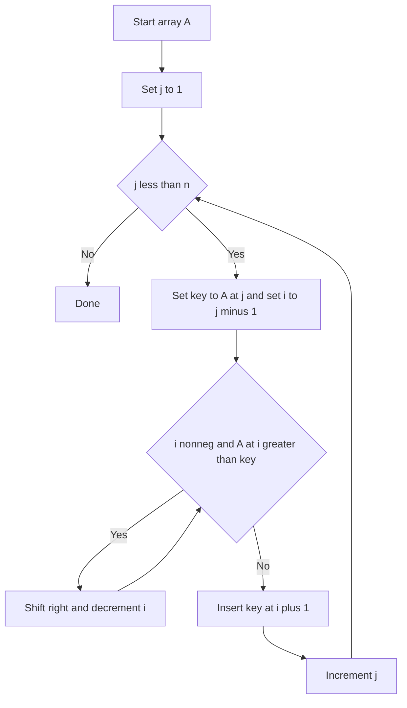

# Intro

Insertion sort grows a sorted prefix by inserting each next element into its correct position within that prefix. It is fast for small inputs and nearly-sorted data, and it is a common building block inside hybrid sorts like Timsort and introsort.
## Mechanism

Iterate left-to-right. For each element at index `j` (the "key"), shift all larger elements in the sorted prefix one position right, then insert the key into the gap. The sorted prefix grows by one element per iteration.



## Visualization

```steptrace
{"algorithm":"insertion-sort","array":[8,3,5,1,9,2,7,4]}
```

## Complexity

| Case | Time | Space |
|------|------|-------|
| Best (sorted input) | O(n) | O(1) |
| Average | O(n²) | O(1) |
| Worst (reverse-sorted) | O(n²) | O(1) |

**Properties:** stable, in-place, excellent constant factors for small n.

## C# Implementation

```csharp
public static void InsertionSort(int[] a)
{
    for (int j = 1; j < a.Length; j++)
    {
        int key = a[j];
        int i = j - 1;
        while (i >= 0 && a[i] > key)
        {
            a[i + 1] = a[i];
            i--;
        }
        a[i + 1] = key;
    }
}
```

### Binary insertion sort

Since the prefix is already sorted, you can find the insertion point with a **binary search** instead of a linear scan, cutting _comparisons_ from O(n²) to O(n log n). The catch: you still have to **shift** elements to open the gap, so the total work stays O(n²) (dominated by moves). It's a genuine win only when comparisons are far more expensive than moves (e.g. comparing long strings or via an expensive comparator).

## When to Use

- **Small arrays (n ≤ 20–50):** better constant factors than merge/quick sort due to no recursion overhead.
- **Nearly-sorted data:** O(n) best case makes it ideal when only a few elements are out of place.
- **Base case in hybrid sorts:** Timsort and introsort switch to insertion sort for small partitions.
- **Online sorting:** can sort a stream of elements as they arrive, one at a time.

## Pitfalls

### Using Insertion Sort on Large Unsorted Arrays

**What goes wrong**: insertion sort is applied to an array of 10,000 elements. At O(n²) average case, this is ~100 million comparisons. A merge sort or introsort would complete in ~130,000 comparisons.

**Mitigation**: use insertion sort only for small arrays (n ≤ 20–50) or nearly-sorted data. For general-purpose sorting, use `Array.Sort` (introsort in .NET), which switches to insertion sort internally for small partitions.

### Forgetting That Insertion Sort Is Stable

**What goes wrong**: a developer replaces insertion sort with selection sort for a small-array case, not realizing selection sort is not stable. Equal elements that were in a specific order are now reordered.

**Mitigation**: when stability matters (sorting objects by a secondary key), use insertion sort or merge sort. Selection sort and quick sort are not stable by default.

## Tradeoffs

| Algorithm | Time (avg) | Space | Stable | Best case | Use when |
|-----------|-----------|-------|--------|-----------|----------|
| Insertion sort | O(n²) | O(1) | Yes | O(n) | n ≤ 50; nearly-sorted; base case in hybrid sorts |
| Selection sort | O(n²) | O(1) | No | O(n²) | Writes are expensive; n is small |
| Bubble sort | O(n²) | O(1) | Yes | O(n) | Teaching only; never in production |
| Merge sort | O(n log n) | O(n) | Yes | O(n log n) | Stability required; linked lists; external sort |
| Quick sort (introsort) | O(n log n) | O(log n) | No | O(n log n) | General-purpose in-memory sorting |

**Decision rule**: use insertion sort for small arrays (n ≤ 50) or nearly-sorted data. For general-purpose sorting, use `Array.Sort` (introsort). For stable sorting of large arrays, use `Array.Sort` with a stable comparer or LINQ `OrderBy` (which uses merge sort).

## Questions

> [!QUESTION]- When is insertion sort faster than O(n log n) algorithms?
> For small arrays (n ≤ 20–50), insertion sort outperforms merge sort and quick sort because it has no recursion overhead, no auxiliary memory allocation, and excellent cache locality. This is why Timsort and introsort switch to insertion sort for small partitions — the constant factor advantage outweighs the asymptotic disadvantage.

> [!QUESTION]- Why is insertion sort used as the base case in Timsort?
> Timsort (Python's and Java's default sort) uses insertion sort for runs shorter than ~64 elements. At that size, insertion sort's O(n²) worst case is bounded (64² = 4096 operations), its cache-friendly sequential access beats merge sort's random access pattern, and it requires no extra memory. The combination of O(n) best case on nearly-sorted data and low constant factors makes it ideal for the small-partition base case.

## References

- [Insertion sort (Wikipedia)](https://en.wikipedia.org/wiki/Insertion_sort) — algorithm description, binary insertion sort variant, and complexity analysis.

- [Insertion sort (cp-algorithms)](https://cp-algorithms.com/sorting/insertion_sort.html) — competitive programming perspective with implementation notes.

- [Timsort (Wikipedia)](https://en.wikipedia.org/wiki/Timsort) — Python's and Java's default sort; uses insertion sort for small runs (< 64 elements), explaining why insertion sort matters in practice despite its O(n²) complexity.

- [Sorting algorithms comparison (Big-O Cheat Sheet)](https://www.bigocheatsheet.com/) — quick reference for time and space complexity of all common sorting algorithms.
