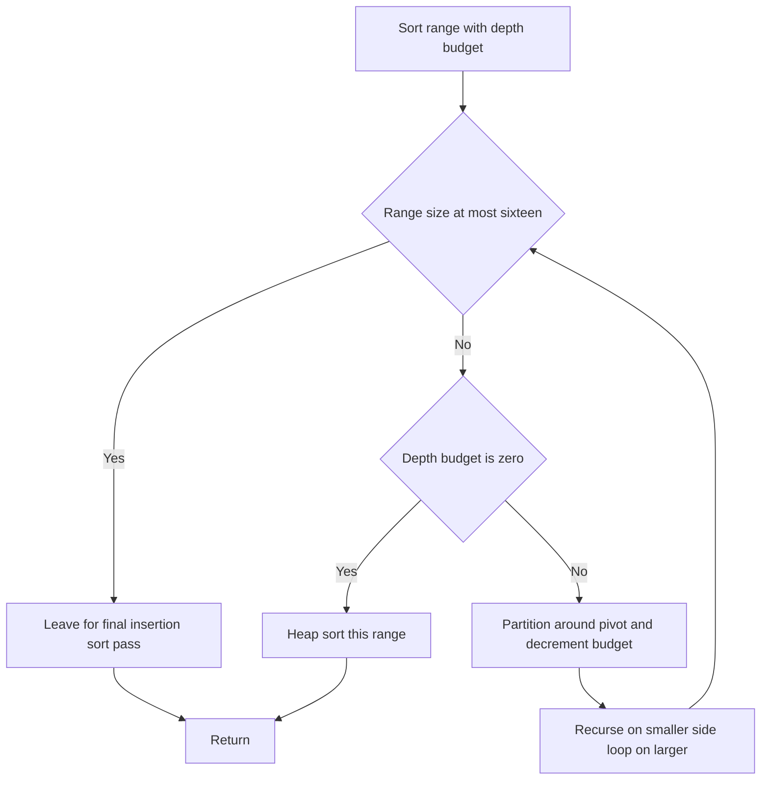

# Intro

Introsort (introspective sort) is the hybrid behind C++'s `std::sort` and .NET's `Array.Sort` for primitive types. It runs as [[Quick Sort]] for the fast, cache-friendly common case, but _introspects_ on its own recursion depth: if the depth exceeds a limit of `2·⌊log₂ n⌋` — the signature of quicksort being driven toward its `O(n²)` collapse — it switches that partition to [[Heap Sort]], which finishes in guaranteed `O(n log n)` and `O(1)` space. Partitions that shrink below a small cutoff (~16 elements) are left unsorted during recursion and cleaned up by a single final [[Insertion Sort]] pass, which is faster than recursing on tiny ranges. The result keeps quicksort's excellent average-case behavior while removing its adversarial tail.

That tail is not hypothetical. A naive quicksort with a predictable pivot (first, last, or median-of-three) can be fed a crafted input that forces maximally unbalanced partitions on every step — a "quicksort killer" — turning an `O(n log n)` sort into `O(n²)` and blowing the recursion stack. Because language runtimes expose sorting to untrusted input, that quadratic path was a real denial-of-service vector; introsort (introduced by David Musser in 1997) is the standard defense. Reach for it via the platform default whenever you are sorting primitives and do not need stability. When you _do_ need stability, use [[Tim Sort]] instead — introsort's heap-sort and quicksort phases both reorder equal keys.

## How It Works

1. **Compute a depth limit** of `2·⌊log₂ n⌋` before starting. This is the recursion budget quicksort is allowed before it is presumed to be misbehaving.
2. **Quicksort phase.** Partition around a pivot (typically median-of-three) and recurse. Decrement the depth budget on each level.
3. **Heap-sort fallback.** If the depth budget for the current partition hits zero, sort _that partition_ with [[Heap Sort]] rather than recursing further. This caps the worst case at `O(n log n)` without abandoning quicksort on the well-behaved partitions.
4. **Insertion-sort cutoff.** Stop recursing once a partition is smaller than a threshold (~16). Leave those small ranges partially ordered and run one final [[Insertion Sort]] over the whole array; on nearly-sorted small ranges it is near-linear and avoids recursion overhead.

Complexity: `O(n log n)` average _and_ worst case (the depth limit guarantees the ceiling), `O(log n)` stack space. Not stable. In practice it matches quicksort's speed on ordinary inputs because the heap-sort branch is almost never taken — it exists as insurance, not as the common path.

## Example

```csharp
public static void IntroSort(int[] a)
{
    int depthLimit = 2 * (int)Math.Log2(a.Length);
    IntroSortRange(a, 0, a.Length - 1, depthLimit);
    InsertionSort(a);            // single final pass over the whole array
}

private static void IntroSortRange(int[] a, int lo, int hi, int depth)
{
    while (hi - lo > 16)
    {
        if (depth == 0)
        {
            HeapSortRange(a, lo, hi);   // quicksort is going quadratic — bail out
            return;
        }

        depth--;
        int p = Partition(a, lo, hi);   // median-of-three pivot, Hoare/Lomuto
        // Recurse on the smaller side, loop on the larger — caps stack at O(log n).
        if (p - lo < hi - p)
        {
            IntroSortRange(a, lo, p - 1, depth);
            lo = p + 1;
        }
        else
        {
            IntroSortRange(a, p + 1, hi, depth);
            hi = p - 1;
        }
    }
    // Ranges of <= 16 are left for the final insertion-sort pass.
}
```

The `Partition`, `HeapSortRange`, and `InsertionSort` helpers are the standard ones (see [[Quick Sort]], [[Heap Sort]], and [[Insertion Sort]]). The load-bearing details are the `depth == 0` guard that hands off to heap sort and the `> 16` cutoff that defers small ranges to a single insertion-sort sweep.

## Diagram



## Pitfalls

- **Introsort is not stable — this is why platforms split their sorts.** The quicksort partition and the heap-sort fallback both move equal keys past one another. Java therefore sorts _object_ arrays with [[Tim Sort]] (stable) but sorts _primitive_ arrays with a dual-pivot quicksort, because two `int`s of equal value are indistinguishable, so stability is unobservable and the faster in-place sort wins. .NET's `Array.Sort` uses introsort and is likewise documented as unstable. If you need equal-key order preserved, do not reach for introsort.
- **The depth limit is a safety net, not a pivot strategy.** Introsort still wants good pivots — median-of-three or randomization — so the heap-sort branch stays rare; if it fired often you would pay heap sort's poor cache locality across the whole input. The limit bounds the _worst_ case; it does not excuse a lazy pivot choice that makes the average case worse.
- **The insertion-sort cutoff needs the final pass to be correct.** Leaving sub-16 ranges unsorted during recursion is only valid because a single insertion-sort pass at the end fixes every small local disorder in near-linear time. Omitting that final pass — or recursing on tiny ranges instead — either leaves the array unsorted or throws away the constant-factor win the cutoff exists to capture.

## Tradeoffs

| Choice | Introsort | Alternative | Decision criteria |
| --- | --- | --- | --- |
| vs plain [[Quick Sort]] | `O(n log n)` guaranteed, same average speed | `O(n²)` on adversarial input | Always prefer introsort for a general sort — it is quicksort plus a cheap insurance branch that almost never fires, closing the DoS-grade quadratic hole for free. |
| vs [[Heap Sort]] alone | Quicksort's cache-friendly average case | `O(n log n)` always but ~2× slower typical | Use pure heap sort only when you need `O(1)` space and a hard guarantee with no quicksort phase; otherwise introsort is faster because heap sort runs only on the rare deep partitions. |
| Stability required | Not stable ([[Introsort]] / `Array.Sort` primitives) | Stable ([[Tim Sort]] / `Array.Sort` objects) | Sort primitives with introsort where equal-key order is unobservable; switch to Tim sort for objects whenever the input order of equal keys must survive. |

## Questions

> [!QUESTION]- How does introsort remove quicksort's `O(n²)` worst case without losing its speed?
>
> - It tracks recursion depth and, once depth exceeds `2·⌊log₂ n⌋` — the fingerprint of pathologically unbalanced partitions — switches that partition to [[Heap Sort]].
> - Heap sort guarantees `O(n log n)` in `O(1)` space, so the worst case is capped while well-behaved partitions keep running as quicksort.
> - Small partitions (~16) are deferred to a single final [[Insertion Sort]] pass to avoid recursion overhead on tiny ranges.
> - The heap-sort branch is insurance that almost never fires, so you pay quicksort's fast, cache-friendly average case in practice while contractually eliminating the quadratic tail — which mattered because that tail was a real denial-of-service vector.

> [!QUESTION]- Why does Java use Tim sort for objects but a quicksort variant for primitives?
>
> - Introsort and dual-pivot quicksort are not stable: their partition and fallback phases reorder equal keys.
> - For primitives (`int`, `double`), two equal values are indistinguishable, so instability is unobservable and the faster, in-place, cache-friendly quicksort wins with no downside.
> - For objects, equal keys can carry different identity or secondary fields, so callers rely on stable order — Java uses [[Tim Sort]], which is stable and adaptive, accepting its `O(n)` merge buffer.
> - The split is a deliberate engineering trade: pay for stability only where it is observable, and buy raw speed everywhere it is not.

> [!QUESTION]- What is a "quicksort killer" and why did it justify introsort becoming the default?
>
> - It is an input crafted so that a deterministic pivot rule (first, last, or even median-of-three) produces maximally unbalanced partitions at every level, forcing `O(n²)` time and `O(n)` stack depth.
> - Because runtimes sort attacker-supplied data (HTTP params, JSON arrays), that quadratic path is a denial-of-service vector, not just a benchmark curiosity.
> - Introsort's depth limit converts the attack into a harmless switch to heap sort, guaranteeing `O(n log n)` regardless of input.
> - That is why `std::sort` and .NET `Array.Sort` standardized on introsort: the guarantee is a security property, not merely a performance nicety.

## References

- [Introsort (Wikipedia)](https://en.wikipedia.org/wiki/Introsort) — the depth-limit fallback, cutoff to insertion sort, and Musser's original design.
- [Introspective Sorting and Selection Algorithms (David Musser, 1997)](https://www.cs.rpi.edu/~musser/gp/introsort.ps) — the primary source introducing introsort and the `2·log n` depth bound.
- [Array.Sort Method (.NET API)](https://learn.microsoft.com/dotnet/api/system.array.sort) — documents that `Array.Sort` uses introspective sort and is not stable.
- [A Killer Adversary for Quicksort (McIlroy, 1999)](https://www.cs.dartmouth.edu/~doug/mdmspe.pdf) — constructs inputs that force median-of-three quicksort to `O(n²)`, the attack introsort defends against.
