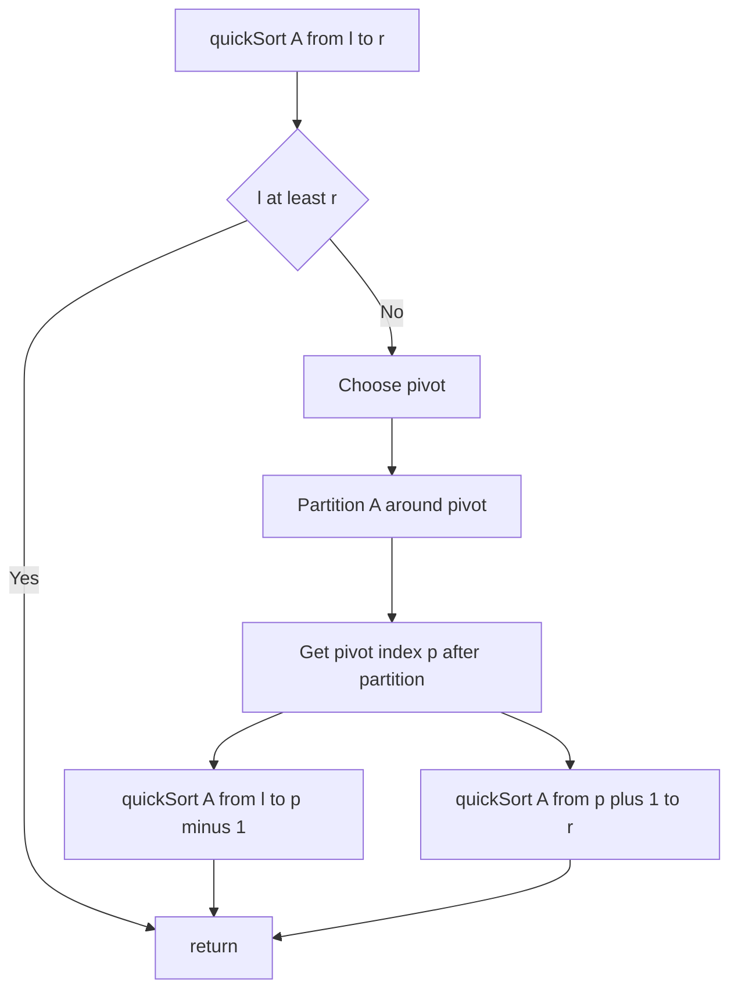

# Intro

Quick sort partitions the array around a pivot so smaller elements go left and larger go right, then recursively sorts the partitions. It is often the fastest comparison sort in practice due to excellent cache behavior and low constant factors, but it has a worst-case O(n²) if pivots are consistently bad. Production implementations use randomized pivots or introsort (fallback to heapsort) to guarantee O(n log n) worst case.

## Mechanism

Choose a pivot, partition the array in-place so all elements less than the pivot are to its left and all greater are to its right, then recurse on both sides. The pivot is in its final sorted position after partitioning.



## Visualization

The card animates the partition loop: blue marks the element being compared against the pivot, violet flashes on a swap, and a bar turns green with a white check when a pivot lands in its final position. The i/j pins track the partition indices; WATCH shows i, j, and the swap count — watch each partition place exactly one pivot, then recurse into the two remaining sides.

```steptrace
{"algorithm":"quick-sort","array":[8,3,5,1,9,2,7,4]}
```

## Complexity

| Case | Time | Space (stack) |
|------|------|---------------|
| Best | O(n log n) | O(log n) |
| Average | O(n log n) | O(log n) |
| Worst (bad pivots) | O(n²) | O(n) |

**Properties:** in-place (Lomuto/Hoare partition), not stable, excellent cache locality.

## C# Implementation (Lomuto partition, randomized pivot)

```csharp
private static readonly Random _rng = new();

public static void QuickSort(int[] a, int left, int right)
{
    if (left >= right) return;

    // Randomized pivot to avoid O(n²) on sorted/reverse-sorted input
    int pivotIdx = _rng.Next(left, right + 1);
    (a[pivotIdx], a[right]) = (a[right], a[pivotIdx]);

    int p = Partition(a, left, right);
    QuickSort(a, left, p - 1);
    QuickSort(a, p + 1, right);
}

private static int Partition(int[] a, int left, int right)
{
    int pivot = a[right];
    int i = left - 1;
    for (int j = left; j < right; j++)
    {
        if (a[j] <= pivot)
        {
            i++;
            (a[i], a[j]) = (a[j], a[i]);
        }
    }
    (a[i + 1], a[right]) = (a[right], a[i + 1]);
    return i + 1;
}
```

### Lomuto vs Hoare partition

The code above uses the **Lomuto** scheme (single forward scan, pivot at the end) — easiest to write and reason about. The original **Hoare** scheme walks two pointers inward from both ends and, on average, does roughly **3× fewer swaps**, which is why it's often faster in practice. The trap: Hoare's returned index is _not_ the pivot's final resting position, so you recurse on `[left, p]` and `[p+1, right]` (not `p-1`/`p+1`). For duplicate-heavy input, three-way (Dutch National Flag) partitioning beats both.

## When to Use

- **General-purpose in-memory sorting:** quick sort's cache-friendly access pattern makes it faster than merge sort in practice for most inputs.
- **When stability is not required:** quick sort is not stable; use merge sort if equal elements must preserve their original order.
- **With randomized pivot or introsort:** .NET's `Array.Sort` uses introsort (quick sort + heap sort fallback) to guarantee O(n log n) worst case.

Avoid naive quick sort (fixed pivot) on inputs that may be sorted or reverse-sorted — it degrades to O(n²).

## Pitfalls

### Fixed Pivot on Sorted Input

**What goes wrong**: using the first or last element as the pivot on already-sorted or reverse-sorted input causes every partition to be maximally unbalanced (one side has n-1 elements, the other has 0). This degrades to O(n²) time and O(n) stack depth, causing a stack overflow for large n.

**Mitigation**: use a randomized pivot (pick a random index and swap it to the end before partitioning) or median-of-three (pick the median of first, middle, last elements). .NET's `Array.Sort` uses introsort, which switches to heapsort when recursion depth exceeds 2×log(n).

### Not Handling Duplicate Keys

**What goes wrong**: standard Lomuto/Hoare partition degrades to O(n²) on arrays with many duplicate keys (e.g., sorting 10,000 elements where 90% are the same value). All duplicates end up on one side of every partition.

**Mitigation**: use three-way partitioning (Dutch National Flag algorithm) for inputs with many duplicates. It partitions into three regions: less than, equal to, and greater than the pivot, so all equal elements are placed in their final positions in one pass.

## Tradeoffs

| Algorithm | Time (avg) | Time (worst) | Space | Stable | Use when |
|-----------|-----------|-------------|-------|--------|----------|
| Quick sort (randomized) | O(n log n) | O(n²) rare | O(log n) | No | General-purpose in-memory; best cache behavior |
| Introsort (Array.Sort) | O(n log n) | O(n log n) | O(log n) | No | Production default; guaranteed O(n log n) |
| Merge sort | O(n log n) | O(n log n) | O(n) | Yes | Stability required; linked lists; external sort |
| Heap sort | O(n log n) | O(n log n) | O(1) | No | Guaranteed O(n log n) in-place; used as introsort fallback |

**Decision rule**: use `Array.Sort` (introsort) for general-purpose in-memory sorting. Implement quick sort directly only when you need fine-grained control (e.g., three-way partition for duplicate-heavy data). Use merge sort when stability is required.

## Questions

> [!QUESTION]- What causes quick sort's O(n²) worst case and how does introsort prevent it?
> O(n²) occurs when every pivot is the minimum or maximum of its partition — each partition step reduces the array by only one element. This happens on already-sorted or reverse-sorted input with a fixed pivot (first or last element). Introsort (.NET's Array.Sort) prevents it by switching to heapsort when recursion depth exceeds 2×log(n), guaranteeing O(n log n) worst case while keeping quick sort's cache-friendly average case.

> [!QUESTION]- Why is quick sort faster than merge sort in practice despite the same O(n log n) average?
> Quick sort is in-place — it requires only O(log n) stack space versus merge sort's O(n) auxiliary array. The in-place partitioning accesses memory sequentially, giving better CPU cache utilization. Merge sort's merge step requires copying between arrays, causing more cache misses. For in-memory sorting where stability is not required, quick sort's constant factor advantage typically makes it 20–40% faster than merge sort.

## References

- [Quicksort (Wikipedia)](https://en.wikipedia.org/wiki/Quicksort) — Lomuto and Hoare partition schemes, randomization, and introsort.

- [Quick sort (cp-algorithms)](https://cp-algorithms.com/sorting/quick_sort.html) — practical implementation tips including three-way partition for duplicate keys.

- [Introsort (Wikipedia)](https://en.wikipedia.org/wiki/Introsort) — the hybrid algorithm used by .NET's Array.Sort; combines quick sort, heapsort, and insertion sort to guarantee O(n log n) worst case while keeping quick sort's cache efficiency.

- [Sorting algorithms comparison (Big-O Cheat Sheet)](https://www.bigocheatsheet.com/) — quick reference for time and space complexity of all common sorting algorithms.
