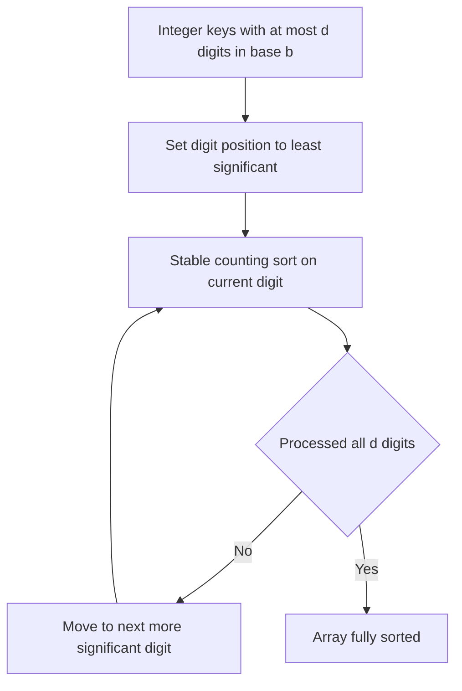

# Intro

Radix Sort orders integers (or anything encodable as fixed-width integer keys) by processing them one digit at a time, never comparing two elements directly. Because it reads the digits of each key instead of ranking pairs, it escapes the `Ω(n log n)` lower bound that binds comparison sorts like [[Quick Sort]] and [[Merge Sort]] — that bound only governs sorts whose sole primitive is _comparing two elements_. Radix Sort exploits the internal structure of the keys and pays for it with an assumption about the key domain: keys must have a bounded number of digits `d` in some base `b`. It runs in `O(d · (n + b))`.

There are two directions. **LSD** (least-significant-digit) makes a full pass per digit from the rightmost digit to the leftmost, using a stable sort each pass; it is the workhorse for fixed-width keys. **MSD** (most-significant-digit) recurses from the leftmost digit down, partitioning into buckets and sorting each independently; it handles variable-length keys (strings) and can stop early once a prefix is unique. Reach for Radix Sort when keys are integers or fixed-length strings over a range too large for a single [[Counting Sort]]; fall back to a comparison sort when keys are long, highly variable, or expensive to decompose into digits.

## How It Works

**LSD Radix Sort:**

1. Pick a base `b` (e.g. 10 for decimal digits, 256 for byte-at-a-time). The number of passes is `d = floor(log_b(maxKey)) + 1` — the digit count of the largest key. (Writing this as `ceil(log_b(maxKey))` under-counts by one at exact powers of `b`: `maxKey = 1000` in base 10 needs four digits, not three.)
2. For each digit position from least- to most-significant, run a **stable** [[Counting Sort]] keyed on that digit only.
3. After the final (most-significant) pass, the array is fully sorted.

The stability of the inner sort is **load-bearing, not an optimization**. Each pass sorts by one digit while trusting that ties on the current digit are already ordered by all the _less_-significant digits sorted in earlier passes. A stable inner sort preserves that established order; an unstable one scrambles it, and the algorithm produces wrong output. This is the whole reason [[Counting Sort]] (which is stable when it iterates the input backwards) is the standard inner loop.

**Choosing the base `b`** trades passes against counter memory. A larger `b` means fewer digits `d` (fewer passes) but a larger `count` array (`O(b)` per pass). Byte-wise radix (`b = 256`, so `d = 4` for 32-bit integers) is a common sweet spot: four passes, a 256-entry table that fits in cache.

Complexity: `O(d · (n + b))` time, `O(n + b)` space. When `d` and `b` are constants (fixed-width keys), this is linear in `n`. The hidden cost is `d`: for keys with many digits, the `d` passes can make Radix Sort slower in practice than an `O(n log n)` comparison sort despite the better asymptotics.

### Handling negatives and floats

Radix Sort assumes non-negative integer keys, so signed and floating-point data need a bijective transform to an unsigned ordering _before_ sorting and its inverse after:

- **Signed integers** — either split the array by sign, radix-sort each part, and concatenate (negatives reversed), or simpler, **bias** every key by adding `2^(bits-1)` (equivalently, flip the sign bit) so the range becomes non-negative and monotonic; subtract it back at the end.
- **IEEE-754 floats** — their bit layout is _almost_ sortable as unsigned integers because exponent and mantissa are already ordered, but the sign bit is backwards and negatives run in reverse. The standard fix: if the sign bit is set (negative), **flip all bits**; otherwise **flip only the sign bit**. That makes the raw 32/64-bit patterns compare as unsigned integers in true numeric order. Reverse the transform after sorting.

This bit-level encoding is exactly how high-throughput LSD radix sorts in databases and on GPUs sort mixed numeric columns, and how LSD string sorts order fixed-length keys.

## Example

LSD Radix Sort on `[170, 45, 75, 90, 802, 24, 2, 66]` in base 10, one stable pass per decimal digit:

```text
Input:            170  45  75  90  802  24   2  66

Pass 1 (ones):    170  90 802   2   24  45  75  66
                   |0   |0  |2   |2   |4   |5   |5   |6      (stable by ones digit)

Pass 2 (tens):    802   2  24  45  66  170  75  90
                   |0   |0   |2   |4   |6    |7  |7  |9      (ties on tens keep ones order)

Pass 3 (hundreds):  2  24  45  66  75   90  170  802
                   |0  |0  |0  |0  |0    |0   |1    |8      (fully sorted)
```

Each pass only looks at one digit; correctness comes entirely from every pass being stable, so the ordering from lower digits survives into higher-digit passes.

## Diagram



## Pitfalls

### Using an Unstable Inner Sort

- **What goes wrong**: swapping the stable [[Counting Sort]] for an unstable per-digit sort produces silently incorrect output — the array looks sorted on the last digit but earlier-digit order is destroyed.
- **Why it happens**: each LSD pass relies on ties being pre-ordered by the less-significant digits from prior passes; only a stable sort preserves that.
- **How to avoid it**: verify the inner sort is stable (Counting Sort iterating the input backwards). This is the most common Radix Sort bug.

### Mishandling Signed or Floating-Point Keys

- **What goes wrong**: radix-sorting raw two's-complement integers puts negatives _after_ positives; radix-sorting raw IEEE-754 bit patterns scatters negatives in reverse and interleaves them wrongly.
- **Why it happens**: the algorithm treats keys as unsigned magnitudes, but signed and float encodings are not monotonic as unsigned integers.
- **How to avoid it**: bias integers by flipping the sign bit; for floats, flip all bits of negatives and just the sign bit of positives, then invert after sorting.

### Assuming Radix Always Beats a Comparison Sort

- **What goes wrong**: for keys with many digits or a small `n`, the `d` passes make Radix Sort slower than [[Quick Sort]] despite its linear asymptotics.
- **Why it happens**: `O(d · (n + b))` hides a real `d` factor and poor cache behavior from the scatter step; `Introsort`-style comparison sorts have excellent constants.
- **How to avoid it**: use Radix Sort when `d` is small relative to `log n` and `n` is large; benchmark rather than assuming the asymptotic win materializes.

## Tradeoffs

| Choice | LSD Radix | MSD Radix | Decision criteria |
| --- | --- | --- | --- |
| direction | least digit first, one stable pass each | most digit first, recursive buckets | LSD for fixed-width keys and simplicity; MSD for variable-length keys or early termination on unique prefixes. |
| vs comparison sort ([[Quick Sort]]) | `O(d · (n + b))`, integer keys | `O(n log n)`, any comparable key | Radix when keys are fixed-width integers or strings and `n` is large; comparison sort for general or long keys. |
| base `b` | large `b`: fewer passes, bigger counters | small `b`: more passes, tiny counters | Pick `b` so the `count` table fits in cache; `b = 256` (byte-wise) is a common four-pass choice for 32-bit keys. |

## Questions

> [!QUESTION]- Why must Radix Sort's per-digit sort be stable?
>
> - Each LSD pass sorts by one digit and trusts that ties on that digit are already ordered by the less-significant digits sorted in earlier passes.
> - A stable inner sort preserves that established order among equal current-digit keys; an unstable one scrambles it.
> - The result of an unstable inner sort is not "slightly off" — it is simply wrong.
> - This is precisely why [[Counting Sort]] (stable when it places elements in a backward pass) is the canonical inner loop, and why stability is a correctness requirement rather than a nice-to-have.

> [!QUESTION]- How do you radix-sort signed integers and IEEE-754 floats?
>
> - Radix Sort treats keys as unsigned magnitudes, but signed and float encodings are not monotonic when read as unsigned bits.
> - For signed integers, flip the sign bit (bias by `2^(bits-1)`) so the range becomes non-negative and ordered, then undo it after sorting.
> - For floats, flip all bits of negative values and only the sign bit of positives, which makes the raw bit patterns compare as unsigned integers in numeric order; reverse the transform afterward.
> - This bit trick is what lets GPU and database radix sorts handle real numeric columns in a single unsigned pass — without it the "linear sort" quietly returns garbage.

> [!QUESTION]- How does the base `b` affect Radix Sort's cost, and how do you choose it?
>
> - Cost is `O(d · (n + b))` where `d = floor(log_b(maxKey)) + 1`, so a larger `b` shrinks `d` (fewer passes) but grows the `O(b)` counter array per pass.
> - Too-large `b` blows the counter table out of cache and wastes memory; too-small `b` means many passes over the data.
> - Byte-wise radix (`b = 256`, four passes for 32-bit keys) keeps the 256-entry table in cache — a common sweet spot.
> - Choosing `b` is the practical lever that decides whether Radix Sort actually beats an `O(n log n)` sort or just loses to cache misses.

## References

- [Radix sort (Wikipedia)](https://en.wikipedia.org/wiki/Radix_sort) — LSD/MSD variants, complexity, and history.
- [Radix sorts (Princeton Algorithms)](https://algs4.cs.princeton.edu/51radix/) — LSD/MSD string sorts and key-indexed counting, with the stability argument.
- [Radix Tricks (Michael Herf)](http://stereopsis.com/radix.html) — the canonical write-up of the sign-bit / flip-all-bits transform for radix-sorting IEEE-754 floats.
