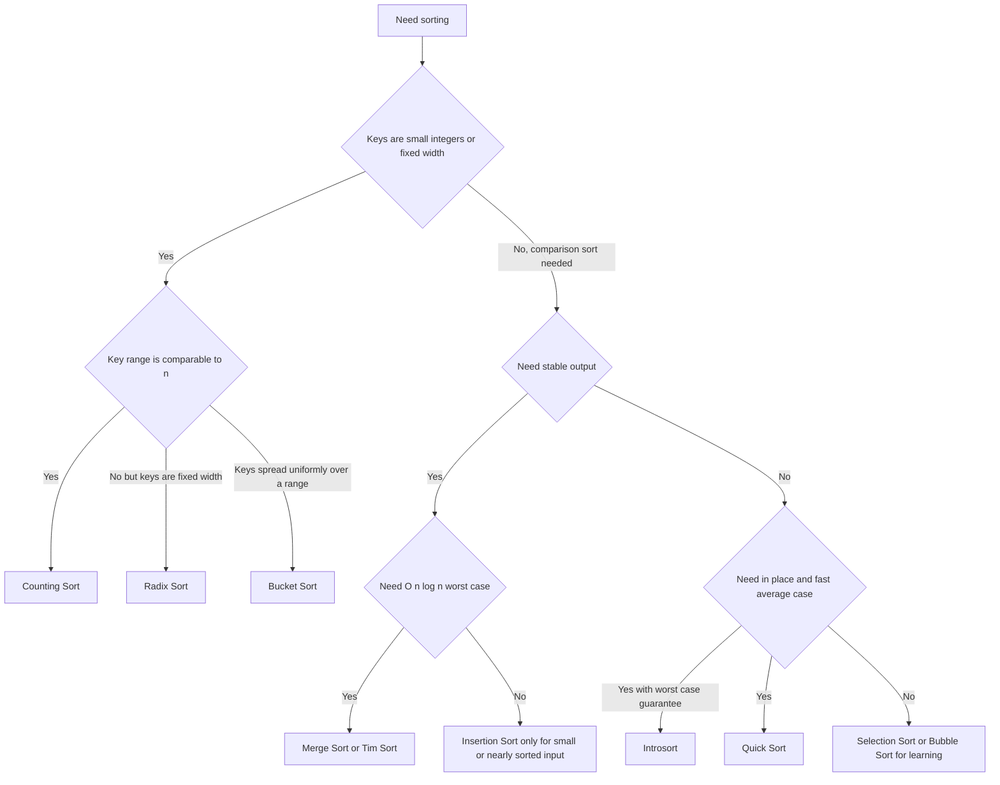

# Intro

Sorting is a foundational operation that impacts performance all over the stack: databases, UIs, pipelines, and in-memory processing. The important part is not memorizing algorithms, but understanding stability, memory tradeoffs, and typical runtime behavior. Example: mergesort is stable and predictable, while quicksort is often fast in practice but has worst-case pitfalls.

<nav style="--card-accent: 239, 68, 68;" class="folder-structure-map" aria-label="Sorting Algorithms section map">
<article class="db-card folder-map-node">

<svg xmlns="http://www.w3.org/2000/svg" stroke-linejoin="round" stroke-linecap="round" stroke-width="2" stroke="currentColor" fill="none" viewBox="0 0 24 24"><path d="M14.5 2H6a2 2 0 0 0-2 2v16a2 2 0 0 0 2 2h12a2 2 0 0 0 2-2V7.5L14.5 2z"/><polyline points="14 2 14 8 20 8"/><line y2="13" y1="13" x2="8" x1="16"/><line y2="17" y1="17" x2="8" x1="16"/><line y2="9" y1="9" x2="8" x1="10"/></svg>Bubble Sort

Repeatedly swaps adjacent out-of-order elements; a slow teaching baseline for why better sorts exist.

<a class="internal-link" href="Home/Computer Science/Algorithms/Sorting Algorithms/Bubble Sort.md" data-tooltip-position="top" aria-label="Bubble Sort">Bubble Sort</a></article><article class="db-card folder-map-node">

<svg xmlns="http://www.w3.org/2000/svg" stroke-linejoin="round" stroke-linecap="round" stroke-width="2" stroke="currentColor" fill="none" viewBox="0 0 24 24"><path d="M14.5 2H6a2 2 0 0 0-2 2v16a2 2 0 0 0 2 2h12a2 2 0 0 0 2-2V7.5L14.5 2z"/><polyline points="14 2 14 8 20 8"/><line y2="13" y1="13" x2="8" x1="16"/><line y2="17" y1="17" x2="8" x1="16"/><line y2="9" y1="9" x2="8" x1="10"/></svg>Bucket Sort

Scatters elements into range buckets, sorts each, then concatenates; near-linear when keys are uniformly distributed.

<a class="internal-link" href="Home/Computer Science/Algorithms/Sorting Algorithms/Bucket Sort.md" data-tooltip-position="top" aria-label="Bucket Sort">Bucket Sort</a></article><article class="db-card folder-map-node">

<svg xmlns="http://www.w3.org/2000/svg" stroke-linejoin="round" stroke-linecap="round" stroke-width="2" stroke="currentColor" fill="none" viewBox="0 0 24 24"><path d="M14.5 2H6a2 2 0 0 0-2 2v16a2 2 0 0 0 2 2h12a2 2 0 0 0 2-2V7.5L14.5 2z"/><polyline points="14 2 14 8 20 8"/><line y2="13" y1="13" x2="8" x1="16"/><line y2="17" y1="17" x2="8" x1="16"/><line y2="9" y1="9" x2="8" x1="10"/></svg>Comb Sort

Bubble sort with a shrinking gap that kills turtles, curing bubble sort's quadratic flaw in practice.

<a class="internal-link" href="Home/Computer Science/Algorithms/Sorting Algorithms/Comb Sort.md" data-tooltip-position="top" aria-label="Comb Sort">Comb Sort</a></article><article class="db-card folder-map-node">

<svg xmlns="http://www.w3.org/2000/svg" stroke-linejoin="round" stroke-linecap="round" stroke-width="2" stroke="currentColor" fill="none" viewBox="0 0 24 24"><path d="M14.5 2H6a2 2 0 0 0-2 2v16a2 2 0 0 0 2 2h12a2 2 0 0 0 2-2V7.5L14.5 2z"/><polyline points="14 2 14 8 20 8"/><line y2="13" y1="13" x2="8" x1="16"/><line y2="17" y1="17" x2="8" x1="16"/><line y2="9" y1="9" x2="8" x1="10"/></svg>Counting Sort

Tallies integer keys in a small range and places each in O(n + k) without comparisons.

<a class="internal-link" href="Home/Computer Science/Algorithms/Sorting Algorithms/Counting Sort.md" data-tooltip-position="top" aria-label="Counting Sort">Counting Sort</a></article><article class="db-card folder-map-node">

<svg xmlns="http://www.w3.org/2000/svg" stroke-linejoin="round" stroke-linecap="round" stroke-width="2" stroke="currentColor" fill="none" viewBox="0 0 24 24"><path d="M14.5 2H6a2 2 0 0 0-2 2v16a2 2 0 0 0 2 2h12a2 2 0 0 0 2-2V7.5L14.5 2z"/><polyline points="14 2 14 8 20 8"/><line y2="13" y1="13" x2="8" x1="16"/><line y2="17" y1="17" x2="8" x1="16"/><line y2="9" y1="9" x2="8" x1="10"/></svg>Insertion Sort

Grows a sorted prefix by inserting each element into place; fast on small or nearly-sorted inputs.

<a class="internal-link" href="Home/Computer Science/Algorithms/Sorting Algorithms/Insertion Sort.md" data-tooltip-position="top" aria-label="Insertion Sort">Insertion Sort</a></article><article class="db-card folder-map-node">

<svg xmlns="http://www.w3.org/2000/svg" stroke-linejoin="round" stroke-linecap="round" stroke-width="2" stroke="currentColor" fill="none" viewBox="0 0 24 24"><path d="M14.5 2H6a2 2 0 0 0-2 2v16a2 2 0 0 0 2 2h12a2 2 0 0 0 2-2V7.5L14.5 2z"/><polyline points="14 2 14 8 20 8"/><line y2="13" y1="13" x2="8" x1="16"/><line y2="17" y1="17" x2="8" x1="16"/><line y2="9" y1="9" x2="8" x1="10"/></svg>Introsort

Hybrid that runs quicksort but falls back to heap sort on deep recursion, removing the O(n²) tail.

<a class="internal-link" href="Home/Computer Science/Algorithms/Sorting Algorithms/Introsort.md" data-tooltip-position="top" aria-label="Introsort">Introsort</a></article><article class="db-card folder-map-node">

<svg xmlns="http://www.w3.org/2000/svg" stroke-linejoin="round" stroke-linecap="round" stroke-width="2" stroke="currentColor" fill="none" viewBox="0 0 24 24"><path d="M14.5 2H6a2 2 0 0 0-2 2v16a2 2 0 0 0 2 2h12a2 2 0 0 0 2-2V7.5L14.5 2z"/><polyline points="14 2 14 8 20 8"/><line y2="13" y1="13" x2="8" x1="16"/><line y2="17" y1="17" x2="8" x1="16"/><line y2="9" y1="9" x2="8" x1="10"/></svg>Merge Sort

Divide-and-conquer sort that is stable and O(n log n) in all cases at the cost of O(n) space.

<a class="internal-link" href="Home/Computer Science/Algorithms/Sorting Algorithms/Merge Sort.md" data-tooltip-position="top" aria-label="Merge Sort">Merge Sort</a></article><article class="db-card folder-map-node">

<svg xmlns="http://www.w3.org/2000/svg" stroke-linejoin="round" stroke-linecap="round" stroke-width="2" stroke="currentColor" fill="none" viewBox="0 0 24 24"><path d="M14.5 2H6a2 2 0 0 0-2 2v16a2 2 0 0 0 2 2h12a2 2 0 0 0 2-2V7.5L14.5 2z"/><polyline points="14 2 14 8 20 8"/><line y2="13" y1="13" x2="8" x1="16"/><line y2="17" y1="17" x2="8" x1="16"/><line y2="9" y1="9" x2="8" x1="10"/></svg>Quick Sort

Partitions around a pivot and recurses; often the fastest comparison sort but with an O(n²) worst case.

<a class="internal-link" href="Home/Computer Science/Algorithms/Sorting Algorithms/Quick Sort.md" data-tooltip-position="top" aria-label="Quick Sort">Quick Sort</a></article><article class="db-card folder-map-node">

<svg xmlns="http://www.w3.org/2000/svg" stroke-linejoin="round" stroke-linecap="round" stroke-width="2" stroke="currentColor" fill="none" viewBox="0 0 24 24"><path d="M14.5 2H6a2 2 0 0 0-2 2v16a2 2 0 0 0 2 2h12a2 2 0 0 0 2-2V7.5L14.5 2z"/><polyline points="14 2 14 8 20 8"/><line y2="13" y1="13" x2="8" x1="16"/><line y2="17" y1="17" x2="8" x1="16"/><line y2="9" y1="9" x2="8" x1="10"/></svg>Radix Sort

Sorts fixed-width integer keys one digit at a time with a stable pass, beating the comparison bound.

<a class="internal-link" href="Home/Computer Science/Algorithms/Sorting Algorithms/Radix Sort.md" data-tooltip-position="top" aria-label="Radix Sort">Radix Sort</a></article><article class="db-card folder-map-node">

<svg xmlns="http://www.w3.org/2000/svg" stroke-linejoin="round" stroke-linecap="round" stroke-width="2" stroke="currentColor" fill="none" viewBox="0 0 24 24"><path d="M14.5 2H6a2 2 0 0 0-2 2v16a2 2 0 0 0 2 2h12a2 2 0 0 0 2-2V7.5L14.5 2z"/><polyline points="14 2 14 8 20 8"/><line y2="13" y1="13" x2="8" x1="16"/><line y2="17" y1="17" x2="8" x1="16"/><line y2="9" y1="9" x2="8" x1="10"/></svg>Selection Sort

Repeatedly selects the minimum of the unsorted suffix; always O(n²) comparisons but only O(n) swaps.

<a class="internal-link" href="Home/Computer Science/Algorithms/Sorting Algorithms/Selection Sort.md" data-tooltip-position="top" aria-label="Selection Sort">Selection Sort</a></article><article class="db-card folder-map-node">

<svg xmlns="http://www.w3.org/2000/svg" stroke-linejoin="round" stroke-linecap="round" stroke-width="2" stroke="currentColor" fill="none" viewBox="0 0 24 24"><path d="M14.5 2H6a2 2 0 0 0-2 2v16a2 2 0 0 0 2 2h12a2 2 0 0 0 2-2V7.5L14.5 2z"/><polyline points="14 2 14 8 20 8"/><line y2="13" y1="13" x2="8" x1="16"/><line y2="17" y1="17" x2="8" x1="16"/><line y2="9" y1="9" x2="8" x1="10"/></svg>Shell Sort

Runs insertion sort over decreasing gaps so elements jump far, beating O(n²) with no recursion or scratch memory.

<a class="internal-link" href="Home/Computer Science/Algorithms/Sorting Algorithms/Shell Sort.md" data-tooltip-position="top" aria-label="Shell Sort">Shell Sort</a></article><article class="db-card folder-map-node">

<svg xmlns="http://www.w3.org/2000/svg" stroke-linejoin="round" stroke-linecap="round" stroke-width="2" stroke="currentColor" fill="none" viewBox="0 0 24 24"><path d="M14.5 2H6a2 2 0 0 0-2 2v16a2 2 0 0 0 2 2h12a2 2 0 0 0 2-2V7.5L14.5 2z"/><polyline points="14 2 14 8 20 8"/><line y2="13" y1="13" x2="8" x1="16"/><line y2="17" y1="17" x2="8" x1="16"/><line y2="9" y1="9" x2="8" x1="10"/></svg>Tim Sort

Natural merge sort that exploits existing runs; stable, adaptive, and the default in Python and Java.

<a class="internal-link" href="Home/Computer Science/Algorithms/Sorting Algorithms/Tim Sort.md" data-tooltip-position="top" aria-label="Tim Sort">Tim Sort</a></article>
</nav>

## Diagram

## Algorithm Selection

### Comparison sorts — bounded below by `O(n log n)`

| Algorithm | Average | Worst | Space | Stable | Reach for it when |
| --- | --- | --- | --- | --- | --- |
| [[Bubble Sort]] | O(n²) | O(n²) | O(1) | Yes | Teaching only |
| [[Comb Sort]] | ~O(n² / 2^p) | O(n²) | O(1) | No | Teaching why bubble sort is slow |
| [[Selection Sort]] | O(n²) | O(n²) | O(1) | No | Writes are far costlier than reads |
| [[Insertion Sort]] | O(n²) | O(n²) | O(1) | Yes | Tiny or nearly-sorted input; base case of hybrids |
| [[Shell Sort]] | ~O(n^1.3) | O(n^1.5) with Hibbard | O(1) | No | No recursion, no scratch memory (embedded) |
| [[Heap Sort]] | O(n log n) | O(n log n) | O(1) | No | Hard worst-case bound with no extra memory |
| [[Merge Sort]] | O(n log n) | O(n log n) | O(n) | Yes | Stability required; linked lists; external sort |
| [[Quick Sort]] | O(n log n) | O(n²) | O(log n) | No | Cache-friendly in-memory default |
| [[Tim Sort]] | O(n log n) | O(n log n) | O(n) | Yes | Real-world partly-ordered data (Python, Java) |
| [[Introsort]] | O(n log n) | O(n log n) | O(log n) | No | Quicksort's speed without its O(n²) tail (C++, .NET) |

### Non-comparison sorts — beat the bound by reading key structure

| Algorithm | Time | Space | Stable | Precondition |
| --- | --- | --- | --- | --- |
| [[Counting Sort]] | O(n + k) | O(n + k) | Yes | Integer keys in a small range `[0, k)` |
| [[Radix Sort]] | O(d · (n + b)) | O(n + b) | Yes | Fixed-width keys; needs a stable inner sort |
| [[Bucket Sort]] | O(n + k) avg, O(n²) worst | O(n + k) | If inner sort is | Keys roughly uniform over a known range |

## Questions

> [!QUESTION]- How do you choose between Merge Sort and Quick Sort in production?
>
> - Merge sort gives reliable `O(n log n)` worst-case behavior and stable ordering.
> - Quick sort is often faster in practice on in-memory arrays due to cache behavior.
> - Quick sort has worst-case `O(n^2)` if pivot strategy is poor, so randomized or introspective variants are safer.
> - Why it matters: this choice affects latency tail risk, memory usage, and correctness when stable ordering is required.

> [!QUESTION]- When is Insertion Sort still a good choice?
>
> - It is strong on very small arrays because constant overhead is tiny.
> - It performs well on nearly sorted data where shifts are minimal.
> - It is commonly used as a base case inside hybrid production sort implementations.
> - Why it matters: knowing this avoids overengineering and explains hybrid sort internals in interviews.

> [!QUESTION]- What does .NET's built-in Array.Sort use, and why?
> .NET uses an introspective sort (IntroSort): it starts with Quick Sort for fast average performance, switches to Heap Sort when recursion depth exceeds a threshold (to guarantee O(n log n) worst case), and uses Insertion Sort for small partitions (to exploit its low overhead on nearly-sorted data).
> This hybrid approach demonstrates why production sort implementations combine multiple algorithms rather than using a single one.

## References

- [Sorting algorithm (Wikipedia)](https://en.wikipedia.org/wiki/Sorting_algorithm)
- [Array Sort method .NET](https://learn.microsoft.com/dotnet/api/system.array.sort)
- [Nearly all binary searches and mergesorts are broken](https://research.google/blog/extra-extra-read-all-about-it-nearly-all-binary-searches-and-mergesorts-are-broken/)
- [Sorting (Sedgewick and Wayne, Algorithms 4th ed.)](https://algs4.cs.princeton.edu/20sorting/) — implementations and empirical performance analysis for the whole family.
