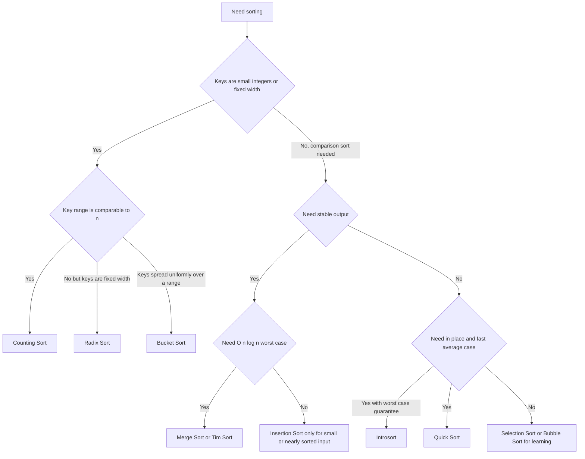

Choosing a sorting algorithm is mostly a choice among guarantees. Stability preserves the input order of equal keys. Extra memory may buy predictable merges, while in-place partitioning usually improves locality. Key structure can remove the comparison bound entirely.

The input decides which tradeoff matters. Nearly sorted data favors adaptive algorithms, a small integer range can make counting sort linear, and strict memory limits narrow the field to in-place choices. The tables below keep those boundaries visible instead of treating one algorithm as a universal default.

<nav style="--card-accent: 239, 68, 68;" class="folder-structure-map" aria-label="Sorting Algorithms section map">
<article class="db-card folder-map-node">

<svg xmlns="http://www.w3.org/2000/svg" stroke-linejoin="round" stroke-linecap="round" stroke-width="2" stroke="currentColor" fill="none" viewBox="0 0 24 24"><path d="M14.5 2H6a2 2 0 0 0-2 2v16a2 2 0 0 0 2 2h12a2 2 0 0 0 2-2V7.5L14.5 2z"/><polyline points="14 2 14 8 20 8"/><line y2="13" y1="13" x2="8" x1="16"/><line y2="17" y1="17" x2="8" x1="16"/><line y2="9" y1="9" x2="8" x1="10"/></svg>Bogo Sort

Repeatedly permutes the input until it happens to be sorted, illustrating probabilistic nontermination.

<a class="internal-link" href="Home/Computer Science/Algorithms/Sorting Algorithms/Bogo Sort.md" data-tooltip-position="top" aria-label="Bogo Sort">Bogo Sort</a></article><article class="db-card folder-map-node">

<svg xmlns="http://www.w3.org/2000/svg" stroke-linejoin="round" stroke-linecap="round" stroke-width="2" stroke="currentColor" fill="none" viewBox="0 0 24 24"><path d="M14.5 2H6a2 2 0 0 0-2 2v16a2 2 0 0 0 2 2h12a2 2 0 0 0 2-2V7.5L14.5 2z"/><polyline points="14 2 14 8 20 8"/><line y2="13" y1="13" x2="8" x1="16"/><line y2="17" y1="17" x2="8" x1="16"/><line y2="9" y1="9" x2="8" x1="10"/></svg>Bubble Sort

Repeatedly swaps adjacent out-of-order elements. A slow teaching baseline for why better sorts exist.

<a class="internal-link" href="Home/Computer Science/Algorithms/Sorting Algorithms/Bubble Sort.md" data-tooltip-position="top" aria-label="Bubble Sort">Bubble Sort</a></article><article class="db-card folder-map-node">

<svg xmlns="http://www.w3.org/2000/svg" stroke-linejoin="round" stroke-linecap="round" stroke-width="2" stroke="currentColor" fill="none" viewBox="0 0 24 24"><path d="M14.5 2H6a2 2 0 0 0-2 2v16a2 2 0 0 0 2 2h12a2 2 0 0 0 2-2V7.5L14.5 2z"/><polyline points="14 2 14 8 20 8"/><line y2="13" y1="13" x2="8" x1="16"/><line y2="17" y1="17" x2="8" x1="16"/><line y2="9" y1="9" x2="8" x1="10"/></svg>Bucket Sort

Scatters elements into range buckets, sorts each, then concatenates. Works best when keys are uniformly distributed.

<a class="internal-link" href="Home/Computer Science/Algorithms/Sorting Algorithms/Bucket Sort.md" data-tooltip-position="top" aria-label="Bucket Sort">Bucket Sort</a></article><article class="db-card folder-map-node">

<svg xmlns="http://www.w3.org/2000/svg" stroke-linejoin="round" stroke-linecap="round" stroke-width="2" stroke="currentColor" fill="none" viewBox="0 0 24 24"><path d="M14.5 2H6a2 2 0 0 0-2 2v16a2 2 0 0 0 2 2h12a2 2 0 0 0 2-2V7.5L14.5 2z"/><polyline points="14 2 14 8 20 8"/><line y2="13" y1="13" x2="8" x1="16"/><line y2="17" y1="17" x2="8" x1="16"/><line y2="9" y1="9" x2="8" x1="10"/></svg>Cocktail Shaker Sort

Alternates forward and backward bubble passes so both ends settle during each round.

<a class="internal-link" href="Home/Computer Science/Algorithms/Sorting Algorithms/Cocktail Shaker Sort.md" data-tooltip-position="top" aria-label="Cocktail Shaker Sort">Cocktail Shaker Sort</a></article><article class="db-card folder-map-node">

<svg xmlns="http://www.w3.org/2000/svg" stroke-linejoin="round" stroke-linecap="round" stroke-width="2" stroke="currentColor" fill="none" viewBox="0 0 24 24"><path d="M14.5 2H6a2 2 0 0 0-2 2v16a2 2 0 0 0 2 2h12a2 2 0 0 0 2-2V7.5L14.5 2z"/><polyline points="14 2 14 8 20 8"/><line y2="13" y1="13" x2="8" x1="16"/><line y2="17" y1="17" x2="8" x1="16"/><line y2="9" y1="9" x2="8" x1="10"/></svg>Comb Sort

Bubble sort with a shrinking gap that moves small tail values toward the front sooner.

<a class="internal-link" href="Home/Computer Science/Algorithms/Sorting Algorithms/Comb Sort.md" data-tooltip-position="top" aria-label="Comb Sort">Comb Sort</a></article><article class="db-card folder-map-node">

<svg xmlns="http://www.w3.org/2000/svg" stroke-linejoin="round" stroke-linecap="round" stroke-width="2" stroke="currentColor" fill="none" viewBox="0 0 24 24"><path d="M14.5 2H6a2 2 0 0 0-2 2v16a2 2 0 0 0 2 2h12a2 2 0 0 0 2-2V7.5L14.5 2z"/><polyline points="14 2 14 8 20 8"/><line y2="13" y1="13" x2="8" x1="16"/><line y2="17" y1="17" x2="8" x1="16"/><line y2="9" y1="9" x2="8" x1="10"/></svg>Counting Sort

Tallies integer keys in a small range and places them directly without comparisons.

<a class="internal-link" href="Home/Computer Science/Algorithms/Sorting Algorithms/Counting Sort.md" data-tooltip-position="top" aria-label="Counting Sort">Counting Sort</a></article><article class="db-card folder-map-node">

<svg xmlns="http://www.w3.org/2000/svg" stroke-linejoin="round" stroke-linecap="round" stroke-width="2" stroke="currentColor" fill="none" viewBox="0 0 24 24"><path d="M14.5 2H6a2 2 0 0 0-2 2v16a2 2 0 0 0 2 2h12a2 2 0 0 0 2-2V7.5L14.5 2z"/><polyline points="14 2 14 8 20 8"/><line y2="13" y1="13" x2="8" x1="16"/><line y2="17" y1="17" x2="8" x1="16"/><line y2="9" y1="9" x2="8" x1="10"/></svg>Cycle Sort

Rotates permutation cycles so displaced elements are written directly to final positions.

<a class="internal-link" href="Home/Computer Science/Algorithms/Sorting Algorithms/Cycle Sort.md" data-tooltip-position="top" aria-label="Cycle Sort">Cycle Sort</a></article><article class="db-card folder-map-node">

<svg xmlns="http://www.w3.org/2000/svg" stroke-linejoin="round" stroke-linecap="round" stroke-width="2" stroke="currentColor" fill="none" viewBox="0 0 24 24"><path d="M14.5 2H6a2 2 0 0 0-2 2v16a2 2 0 0 0 2 2h12a2 2 0 0 0 2-2V7.5L14.5 2z"/><polyline points="14 2 14 8 20 8"/><line y2="13" y1="13" x2="8" x1="16"/><line y2="17" y1="17" x2="8" x1="16"/><line y2="9" y1="9" x2="8" x1="10"/></svg>Gnome Sort

Walks forward across ordered neighbors and steps backward after each adjacent swap.

<a class="internal-link" href="Home/Computer Science/Algorithms/Sorting Algorithms/Gnome Sort.md" data-tooltip-position="top" aria-label="Gnome Sort">Gnome Sort</a></article><article class="db-card folder-map-node">

<svg xmlns="http://www.w3.org/2000/svg" stroke-linejoin="round" stroke-linecap="round" stroke-width="2" stroke="currentColor" fill="none" viewBox="0 0 24 24"><path d="M14.5 2H6a2 2 0 0 0-2 2v16a2 2 0 0 0 2 2h12a2 2 0 0 0 2-2V7.5L14.5 2z"/><polyline points="14 2 14 8 20 8"/><line y2="13" y1="13" x2="8" x1="16"/><line y2="17" y1="17" x2="8" x1="16"/><line y2="9" y1="9" x2="8" x1="10"/></svg>Heap Sort

Heapifies the array, then repeatedly extracts the maximum into a growing sorted suffix.

<a class="internal-link" href="Home/Computer Science/Algorithms/Sorting Algorithms/Heap Sort.md" data-tooltip-position="top" aria-label="Heap Sort">Heap Sort</a></article><article class="db-card folder-map-node">

<svg xmlns="http://www.w3.org/2000/svg" stroke-linejoin="round" stroke-linecap="round" stroke-width="2" stroke="currentColor" fill="none" viewBox="0 0 24 24"><path d="M14.5 2H6a2 2 0 0 0-2 2v16a2 2 0 0 0 2 2h12a2 2 0 0 0 2-2V7.5L14.5 2z"/><polyline points="14 2 14 8 20 8"/><line y2="13" y1="13" x2="8" x1="16"/><line y2="17" y1="17" x2="8" x1="16"/><line y2="9" y1="9" x2="8" x1="10"/></svg>Insertion Sort

Grows a sorted prefix by shifting larger elements right and inserting each new key.

<a class="internal-link" href="Home/Computer Science/Algorithms/Sorting Algorithms/Insertion Sort.md" data-tooltip-position="top" aria-label="Insertion Sort">Insertion Sort</a></article><article class="db-card folder-map-node">

<svg xmlns="http://www.w3.org/2000/svg" stroke-linejoin="round" stroke-linecap="round" stroke-width="2" stroke="currentColor" fill="none" viewBox="0 0 24 24"><path d="M14.5 2H6a2 2 0 0 0-2 2v16a2 2 0 0 0 2 2h12a2 2 0 0 0 2-2V7.5L14.5 2z"/><polyline points="14 2 14 8 20 8"/><line y2="13" y1="13" x2="8" x1="16"/><line y2="17" y1="17" x2="8" x1="16"/><line y2="9" y1="9" x2="8" x1="10"/></svg>Introsort

Hybrid that runs quicksort but falls back to heap sort when recursion becomes too deep.

<a class="internal-link" href="Home/Computer Science/Algorithms/Sorting Algorithms/Introsort.md" data-tooltip-position="top" aria-label="Introsort">Introsort</a></article><article class="db-card folder-map-node">

<svg xmlns="http://www.w3.org/2000/svg" stroke-linejoin="round" stroke-linecap="round" stroke-width="2" stroke="currentColor" fill="none" viewBox="0 0 24 24"><path d="M14.5 2H6a2 2 0 0 0-2 2v16a2 2 0 0 0 2 2h12a2 2 0 0 0 2-2V7.5L14.5 2z"/><polyline points="14 2 14 8 20 8"/><line y2="13" y1="13" x2="8" x1="16"/><line y2="17" y1="17" x2="8" x1="16"/><line y2="9" y1="9" x2="8" x1="10"/></svg>Merge Sort

Stable divide-and-conquer sort that repeatedly merges ordered runs.

<a class="internal-link" href="Home/Computer Science/Algorithms/Sorting Algorithms/Merge Sort.md" data-tooltip-position="top" aria-label="Merge Sort">Merge Sort</a></article><article class="db-card folder-map-node">

<svg xmlns="http://www.w3.org/2000/svg" stroke-linejoin="round" stroke-linecap="round" stroke-width="2" stroke="currentColor" fill="none" viewBox="0 0 24 24"><path d="M14.5 2H6a2 2 0 0 0-2 2v16a2 2 0 0 0 2 2h12a2 2 0 0 0 2-2V7.5L14.5 2z"/><polyline points="14 2 14 8 20 8"/><line y2="13" y1="13" x2="8" x1="16"/><line y2="17" y1="17" x2="8" x1="16"/><line y2="9" y1="9" x2="8" x1="10"/></svg>Odd-Even Sort

Alternates disjoint odd and even adjacent compare-swap phases until neither changes the array.

<a class="internal-link" href="Home/Computer Science/Algorithms/Sorting Algorithms/Odd-Even Sort.md" data-tooltip-position="top" aria-label="Odd-Even Sort">Odd-Even Sort</a></article><article class="db-card folder-map-node">

<svg xmlns="http://www.w3.org/2000/svg" stroke-linejoin="round" stroke-linecap="round" stroke-width="2" stroke="currentColor" fill="none" viewBox="0 0 24 24"><path d="M14.5 2H6a2 2 0 0 0-2 2v16a2 2 0 0 0 2 2h12a2 2 0 0 0 2-2V7.5L14.5 2z"/><polyline points="14 2 14 8 20 8"/><line y2="13" y1="13" x2="8" x1="16"/><line y2="17" y1="17" x2="8" x1="16"/><line y2="9" y1="9" x2="8" x1="10"/></svg>Pancake Sort

Places each suffix maximum using only reversals of prefixes that begin at index zero.

<a class="internal-link" href="Home/Computer Science/Algorithms/Sorting Algorithms/Pancake Sort.md" data-tooltip-position="top" aria-label="Pancake Sort">Pancake Sort</a></article><article class="db-card folder-map-node">

<svg xmlns="http://www.w3.org/2000/svg" stroke-linejoin="round" stroke-linecap="round" stroke-width="2" stroke="currentColor" fill="none" viewBox="0 0 24 24"><path d="M14.5 2H6a2 2 0 0 0-2 2v16a2 2 0 0 0 2 2h12a2 2 0 0 0 2-2V7.5L14.5 2z"/><polyline points="14 2 14 8 20 8"/><line y2="13" y1="13" x2="8" x1="16"/><line y2="17" y1="17" x2="8" x1="16"/><line y2="9" y1="9" x2="8" x1="10"/></svg>Quick Sort

Partitions around a pivot, fixes it in place, then recursively sorts both sides.

<a class="internal-link" href="Home/Computer Science/Algorithms/Sorting Algorithms/Quick Sort.md" data-tooltip-position="top" aria-label="Quick Sort">Quick Sort</a></article><article class="db-card folder-map-node">

<svg xmlns="http://www.w3.org/2000/svg" stroke-linejoin="round" stroke-linecap="round" stroke-width="2" stroke="currentColor" fill="none" viewBox="0 0 24 24"><path d="M14.5 2H6a2 2 0 0 0-2 2v16a2 2 0 0 0 2 2h12a2 2 0 0 0 2-2V7.5L14.5 2z"/><polyline points="14 2 14 8 20 8"/><line y2="13" y1="13" x2="8" x1="16"/><line y2="17" y1="17" x2="8" x1="16"/><line y2="9" y1="9" x2="8" x1="10"/></svg>Radix Sort

Sorts bounded-width keys one digit at a time with stable distribution-and-gather passes.

<a class="internal-link" href="Home/Computer Science/Algorithms/Sorting Algorithms/Radix Sort.md" data-tooltip-position="top" aria-label="Radix Sort">Radix Sort</a></article><article class="db-card folder-map-node">

<svg xmlns="http://www.w3.org/2000/svg" stroke-linejoin="round" stroke-linecap="round" stroke-width="2" stroke="currentColor" fill="none" viewBox="0 0 24 24"><path d="M14.5 2H6a2 2 0 0 0-2 2v16a2 2 0 0 0 2 2h12a2 2 0 0 0 2-2V7.5L14.5 2z"/><polyline points="14 2 14 8 20 8"/><line y2="13" y1="13" x2="8" x1="16"/><line y2="17" y1="17" x2="8" x1="16"/><line y2="9" y1="9" x2="8" x1="10"/></svg>Selection Sort

Repeatedly selects the minimum of the unsorted suffix and places it at the next prefix position.

<a class="internal-link" href="Home/Computer Science/Algorithms/Sorting Algorithms/Selection Sort.md" data-tooltip-position="top" aria-label="Selection Sort">Selection Sort</a></article><article class="db-card folder-map-node">

<svg xmlns="http://www.w3.org/2000/svg" stroke-linejoin="round" stroke-linecap="round" stroke-width="2" stroke="currentColor" fill="none" viewBox="0 0 24 24"><path d="M14.5 2H6a2 2 0 0 0-2 2v16a2 2 0 0 0 2 2h12a2 2 0 0 0 2-2V7.5L14.5 2z"/><polyline points="14 2 14 8 20 8"/><line y2="13" y1="13" x2="8" x1="16"/><line y2="17" y1="17" x2="8" x1="16"/><line y2="9" y1="9" x2="8" x1="10"/></svg>Shell Sort

Runs insertion sort over decreasing gaps so elements jump toward their final positions.

<a class="internal-link" href="Home/Computer Science/Algorithms/Sorting Algorithms/Shell Sort.md" data-tooltip-position="top" aria-label="Shell Sort">Shell Sort</a></article><article class="db-card folder-map-node">

<svg xmlns="http://www.w3.org/2000/svg" stroke-linejoin="round" stroke-linecap="round" stroke-width="2" stroke="currentColor" fill="none" viewBox="0 0 24 24"><path d="M14.5 2H6a2 2 0 0 0-2 2v16a2 2 0 0 0 2 2h12a2 2 0 0 0 2-2V7.5L14.5 2z"/><polyline points="14 2 14 8 20 8"/><line y2="13" y1="13" x2="8" x1="16"/><line y2="17" y1="17" x2="8" x1="16"/><line y2="9" y1="9" x2="8" x1="10"/></svg>Stooge Sort

Recursively sorts overlapping two-thirds ranges in a first-last-first sequence.

<a class="internal-link" href="Home/Computer Science/Algorithms/Sorting Algorithms/Stooge Sort.md" data-tooltip-position="top" aria-label="Stooge Sort">Stooge Sort</a></article><article class="db-card folder-map-node">

<svg xmlns="http://www.w3.org/2000/svg" stroke-linejoin="round" stroke-linecap="round" stroke-width="2" stroke="currentColor" fill="none" viewBox="0 0 24 24"><path d="M14.5 2H6a2 2 0 0 0-2 2v16a2 2 0 0 0 2 2h12a2 2 0 0 0 2-2V7.5L14.5 2z"/><polyline points="14 2 14 8 20 8"/><line y2="13" y1="13" x2="8" x1="16"/><line y2="17" y1="17" x2="8" x1="16"/><line y2="9" y1="9" x2="8" x1="10"/></svg>Tim Sort

Natural merge sort that exploits existing runs. Stable, adaptive, and used for Python lists and Java object arrays.

<a class="internal-link" href="Home/Computer Science/Algorithms/Sorting Algorithms/Tim Sort.md" data-tooltip-position="top" aria-label="Tim Sort">Tim Sort</a></article>
</nav>

# Diagram

```mermaid
flowchart TD
  A[Need sorting] --> B{Keys are small integers or fixed width}
  B -->|Yes| B1{Key range is comparable to n}
  B1 -->|Yes| B2[Counting Sort]
  B1 -->|No but keys are fixed width| B3[Radix Sort]
  B1 -->|Keys spread uniformly over a range| B4[Bucket Sort]
  B -->|No, comparison sort needed| C{Need stable output}
  C -->|Yes| D{Need O n log n worst case}
  D -->|Yes| E[Merge Sort or Tim Sort]
  D -->|No| F[Insertion Sort only for small or nearly sorted input]
  C -->|No| G{Need in place and fast average case}
  G -->|Yes with worst case guarantee| H[Introsort]
  G -->|Yes| I[Quick Sort]
  G -->|No| J[Selection Sort or Bubble Sort for learning]
```

# Algorithm Selection

## Comparison Sorts — Worst-case lower bound `Ω(n log n)`

| Algorithm | Average | Worst | Space | Stable | Reach for it when |
| --- | --- | --- | --- | --- | --- |
| [[Bubble Sort]] | O(n²) | O(n²) | O(1) | Yes | Teaching only |
| [[Computer Science/Algorithms/Sorting Algorithms/Cocktail Shaker Sort\|Cocktail Shaker Sort]] | O(n²) | O(n²) | O(1) | Yes | Teaching bidirectional passes. Moves small tail values forward faster than Bubble Sort |
| [[Computer Science/Algorithms/Sorting Algorithms/Gnome Sort\|Gnome Sort]] | O(n²) | O(n²) | O(1) | Yes | Teaching inversion removal with one walking index |
| [[Computer Science/Algorithms/Sorting Algorithms/Bogo Sort\|Bogo Sort]] | Θ(n · n!) expected | Unbounded | O(1) | No | Bounded demonstrations only. Random retries make no progress guarantee |
| [[Comb Sort]] | Empirically near O(n log n) on random input. Not guaranteed | O(n²) | O(1) | No | Teaching why bubble sort is slow |
| [[Selection Sort]] | O(n²) | O(n²) | O(1) | No | Writes are far costlier than reads |
| [[Computer Science/Algorithms/Sorting Algorithms/Cycle Sort\|Cycle Sort]] | Θ(n²) | Θ(n²) | O(1) | No | Writes are exceptionally expensive and keys can be compared cheaply |
| [[Insertion Sort]] | O(n²) | O(n²) | O(1) | Yes | Tiny or nearly-sorted input. Base case of hybrids |
| [[Computer Science/Algorithms/Sorting Algorithms/Odd-Even Sort\|Odd-Even Sort]] | O(n²) sequential | O(n²) sequential | O(1) | Yes | Disjoint neighbor phases will run in parallel. Otherwise teaching only |
| [[Computer Science/Algorithms/Sorting Algorithms/Pancake Sort\|Pancake Sort]] | Θ(n²) | Θ(n²) | O(1) | No | The only permitted move is a prefix reversal |
| [[Computer Science/Algorithms/Sorting Algorithms/Stooge Sort\|Stooge Sort]] | Θ(n².7095) | Θ(n².7095) | O(log n) | No | Recurrence-analysis exercise only |
| [[Shell Sort]] | ~O(n^1.3) | O(n^1.5) with Hibbard | O(1) | No | No recursion, no scratch memory (embedded) |
| [[Heap Sort]] | O(n log n) | O(n log n) | O(1) | No | Hard worst-case bound with no extra memory |
| [[Merge Sort]] | O(n log n) | O(n log n) | O(n) | Yes | Stability required. Linked lists. External sort |
| [[Quick Sort]] | O(n log n) | O(n²) | O(log n) expected, O(n) worst | No | Cache-friendly in-memory default |
| [[Tim Sort]] | O(n log n) | O(n log n) | O(n) | Yes | Real-world partly-ordered data. Python lists and Java object arrays |
| [[Introsort]] | O(n log n) | O(n log n) | O(log n) | No | Quicksort's speed without its O(n²) tail (C++, .NET) |

## Non-comparison Sorts — Beat the Bound by Reading Key Structure

| Algorithm | Time | Space | Stable | Precondition |
| --- | --- | --- | --- | --- |
| [[Counting Sort]] | O(n + k) | O(n + k) | Yes | Integer keys in a small range `[0, k)` |
| [[Radix Sort]] | O(d · (n + b)) | O(n + b) | Yes | Fixed-width keys. Needs a stable inner sort |
| [[Bucket Sort]] | O(n + k) avg, O(n²) worst | O(n + k) | Depends. Stable with order-preserving scatter and stable per-bucket sort | Keys roughly uniform over a known range |

# References

- [Sorting (Sedgewick and Wayne, Algorithms 4th ed.)](https://algs4.cs.princeton.edu/20sorting/)
