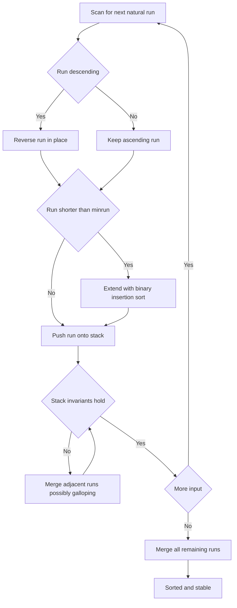

# Intro

Tim sort is the default sort in **CPython** (`list.sort`, `sorted`) and in **Java** (`Arrays.sort` for object arrays and `Collections.sort`). It is a _natural_ [[Merge Sort]]: instead of blindly halving the array, it exploits order that already exists. It scans left to right for **runs** — maximal already-ascending or strictly-descending stretches (a descending run is reversed in place so every run is ascending), extends any run shorter than `minrun` (a computed value between 32 and 64) into a run of that length using binary [[Insertion Sort]], and then merges the runs together. The insight is that real-world data is rarely random: log lines arrive mostly time-ordered, a list gets one item appended, records are already grouped. Tim sort charges nothing for order it finds, so it hits `O(n)` on already-sorted input while still guaranteeing `O(n log n)` and remaining **stable**.

Choose Tim sort — that is, choose the platform default — whenever you are sorting objects and want stability, adaptivity to partially-ordered input, and a guaranteed worst case in one package. Its cost is `O(n)` auxiliary space for the merge buffer, so where memory is tight and stability is unobservable (sorting primitives), platforms deliberately switch to [[Introsort]] or a dual-pivot [[Quick Sort]] instead.

## How It Works

1. **Compute `minrun`** from `n`: take the high-order 6 bits of `n` and add 1 if any lower bit is set, yielding 32–64. This keeps the number of runs near a power of two, which balances the final merges.
2. **Find the next run.** Starting at the current position, extend as long as elements are ascending (`a[i] <= a[i+1]`) or _strictly_ descending (`a[i] > a[i+1]`). A descending run is **reversed in place** — strict descent is what makes that reversal stable (equal elements never trigger a reversal, so their order is preserved).
3. **Extend short runs to `minrun`** with binary insertion sort: if the natural run is shorter than `minrun`, pull in following elements and insert them into the sorted run using a binary search for the position. Small runs cost little and keep merge counts down.
4. **Push each run onto a stack and merge under invariants.** With the top three run lengths `X, Y, Z` (`Z` deepest), Tim sort enforces `Z > Y + X` and `Y > X`. Whenever an invariant breaks it merges `Y` with the smaller of `X` and `Z`. This keeps stacked runs roughly balanced in size, so merges stay near-equal-length and the total work is `O(n log n)`.
5. **Galloping mode** accelerates unbalanced merges. When one run keeps "winning" the merge comparison (`MIN_GALLOP = 7` consecutive times), Tim sort stops comparing element by element and instead **binary-searches** for how many of the winning run's elements can be copied in a block. On data where one run's values are mostly smaller than the other's, this turns an `O(k)` linear scan into `O(log k)`; if galloping stops paying off, it adaptively backs out to one-at-a-time merging.

Complexity: `O(n)` best case (a single already-sorted run), `O(n log n)` average and worst case, `O(n)` auxiliary space for the merge (temporary copy of the smaller run). **Stable**, because every merge and the descending-run reversal preserve the order of equal keys.

## Example

```text
Input: [5, 6, 7, 3, 2, 1, 4, 4, 8]     minrun = 4 (tiny array, illustrative)

Run detection:
  [5,6,7]  ascending run, length 3  -> shorter than minrun,
           pull in next element (3) and binary-insert -> [3,5,6,7]
  [2,1]    descending -> reverse in place -> [1,2] then extend to minrun
           with 4,4 -> binary-insert -> [1,2,4,4]
  [8]      trailing run, length 1

Run stack (lengths): [4, 4, 1]

Merge under invariants (X = 1 on top, Y = 4, Z = 4 deepest):
  Y > X?     4 > 1        yes, holds
  Z > Y + X? 4 > 4 + 1    no  -> invariant broken, must merge Y

  Merge Y with the SMALLER of X and Z. X = 1 < Z = 4, so Y merges with X:
      [1,2,4,4] + [8] -> [1,2,4,4,8]        stack lengths now [4, 5]

  Two runs left, 4 <= 5, so merge them (stable):
      [3,5,6,7] + [1,2,4,4,8] -> [1,2,3,4,4,5,6,7,8]
      (galloping would kick in here if one side kept winning
       7+ comparisons in a row)

Result: [1,2,3,4,4,5,6,7,8]   (the two 4s kept their input order — stable)
```

## Diagram



## Pitfalls

- **The merge-stack invariant bug — a real formal-methods lesson.** In 2015 de Gouw et al. tried to _verify_ the Java/Python implementation with the KeY prover and instead found a genuine defect: the stack invariant check compared only the top few runs, so a crafted sequence of run lengths could leave the invariant violated deeper in the stack. The stack was pre-sized assuming the invariant always held, so the violation could overflow it and throw `ArrayIndexOutOfBoundsException`. Java's initial fix bumped the stack size (a patch, not a proof); the invariant check itself was later corrected. The takeaway: "widely deployed for years" is not a proof of correctness, and a subtle loop invariant can hide a crash reachable only by adversarial input.
- **`O(n)` extra memory, not in place.** Tim sort allocates a temporary buffer up to `n/2` for merging. On memory-constrained systems, or when sorting huge primitive arrays where stability is meaningless, that buffer is pure overhead — which is exactly why Java sorts _primitives_ with a dual-pivot quicksort and .NET sorts with [[Introsort]] instead.
- **Stability depends on strict descent.** Runs are detected as ascending (`<=`) or _strictly_ descending (`>`). If an implementation used `>=` for descending runs, it would reverse stretches of equal keys and silently break stability. The asymmetry between the two comparisons is deliberate and load-bearing, not an accident.

## Questions

> [!QUESTION]- What makes Tim sort adaptive, and why does that matter for real data?
>
> - It scans for existing ascending or strictly-descending runs and merges them instead of halving blindly, so any order already present is reused for free.
> - Descending runs are reversed in place; short runs are padded to `minrun` (32–64) with binary [[Insertion Sort]]; galloping mode block-copies when one run keeps winning.
> - On already-sorted input it finds one run and runs in `O(n)`; worst case is still `O(n log n)`, stable throughout.
> - Real inputs — append-mostly lists, time-ordered logs, pre-grouped records — are rarely random, so an adaptive sort beats a fixed `O(n log n)` sort on exactly the data production systems actually feed it.

> [!QUESTION]- What are the merge-stack invariants and why do they exist?
>
> - Runs are pushed on a stack; for the top three lengths `X, Y, Z` (Z deepest) Tim sort enforces `Z > Y + X` and `Y > X`, merging when either breaks.
> - This keeps adjacent runs within a small size ratio, so each merge is between roughly equal-length runs.
> - Balanced merges are what bound the total merge cost to `O(n log n)` — unbalanced runs would let merging degrade toward quadratic.
> - The invariants are the correctness-and-performance contract of the algorithm, which is exactly why a gap in checking them (the 2015 bug) was both a crash and a performance risk, not a cosmetic flaw.

> [!QUESTION]- What did formal verification reveal about Tim sort in 2015?
>
> - de Gouw et al. attempted to prove the Java/Python merge-collapse routine correct and instead found the invariant was only checked on the top runs, leaving deeper violations possible.
> - A crafted run-length pattern could break the invariant, and since the merge stack was sized assuming the invariant held, it could overflow and throw an out-of-bounds exception.
> - The stopgap fix enlarged the stack; the invariant check was subsequently corrected to actually restore the property.
> - It is a concrete case where code deployed to hundreds of millions of users for years still harbored an adversarially reachable crash — evidence that testing and ubiquity are not substitutes for a proof of a loop invariant.

## References

- [Timsort (Wikipedia)](https://en.wikipedia.org/wiki/Timsort) — runs, `minrun`, galloping, the merge invariants, and the verification bug.
- [CPython listsort.txt (Tim Peters)](https://github.com/python/cpython/blob/main/Objects/listsort.txt) — the original design note explaining run detection, galloping, and the merge-pattern rationale.
- [OpenJDK's java.utils.Collection.sort() is broken (de Gouw et al., 2015)](http://envisage-project.eu/proving-android-java-and-python-sorting-algorithm-is-broken-and-how-to-fix-it/) — the formal-verification write-up of the merge-stack bug and its fix.
