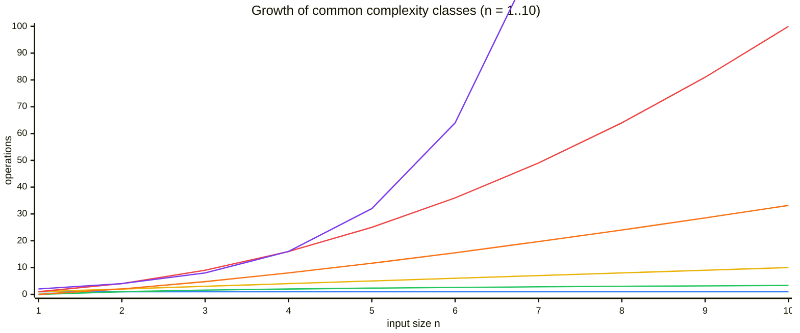

# Intro

Two algorithms sort a million records. One runs in `n log n` steps, the other in `n²`. At `n = 1,000,000` that is ~20 million operations versus a trillion — seconds versus hours, on the same hardware. Big O notation is the tool that predicts this gap _before_ either is written or benchmarked: it describes how an algorithm's cost grows as the input grows, discarding everything that depends on the machine so two algorithms can be compared by their growth alone.

Formally, `f(n) = O(g(n))` means `f` grows no faster than `g` beyond some input size — there exist constants `c` and `n₀` such that `f(n) ≤ c · g(n)` for all `n ≥ n₀`. The practical consequences are two deliberate erasures: **constant factors drop** (`3n + 100` is `O(n)`) and **lower-order terms drop** (`n² + n` is `O(n²)`), because as `n → ∞` only the fastest-growing term decides the outcome. That is the point and the limitation at once — Big O tells you which algorithm wins at scale, and tells you nothing about which wins at `n = 20`, where the discarded constants dominate.

The same notation measures two resources. **Time complexity** counts operations as a function of input size; **space complexity** counts extra memory, including the recursion stack, which is where an otherwise-fine algorithm quietly overflows.

**Core idea:** cost as a function of `n`, keep only the dominant term, drop constants → a hardware-independent growth class that predicts behaviour at scale but not at small `n`.

## The growth classes, side by side

The complexity class is the shape of the curve. This chart plots six classes over a small input range, on a single axis tall enough to hold `2ⁿ` at `n = 10` — which is itself the lesson: making room for the exponential flattens every polynomial class into a thin band along the bottom.



Reading the lines from bottom to top at the right edge (the swatch matches each line's colour on the chart):

- 🔵 **`O(1)` constant** (flat at 1) — cost is independent of `n`. An array index or an average hash lookup.
- 🟢 **`O(log n)` logarithmic** (rises to ~3.3) — each step discards a constant fraction of the input. Binary search, a balanced-tree operation.
- 🟡 **`O(n)` linear** (reaches 10) — cost tracks input size one-for-one. A single scan.
- 🟠 **`O(n log n)` linearithmic** (reaches ~33) — a linear pass repeated a logarithmic number of times. Merge sort, and the comparison-sort lower bound.
- 🔴 **`O(n²)` quadratic** (reaches 100) — every element against every other. Nested loops, naive pair-checking.
- 🟣 **`O(2ⁿ)` exponential** (reaches 1024) — every `+1` to `n` _doubles_ the cost. Trying every subset; naive recursion that branches.

The first five curves share the bottom tenth of the axis — at a scale that holds `2ⁿ`, even `n²`'s climb to 100 reads as almost flat. That is the wall: `n²` and `2ⁿ` are equal near `n = 4`, and by `n = 10` the exponential is already ten times larger and pulling away. That doubling is the practical boundary between "solvable for large inputs" (polynomial) and "solvable only for tiny inputs" (exponential and factorial); it is why an `O(2ⁿ)` [[Backtracking|brute-force]] search caps out around `n = 30` and an `O(n!)` permutation search around `n = 12`. `O(n!)` is left off entirely — it would dwarf even `2ⁿ` here.

## Why the wall is a wall

The chart's crossover understates the gap at real input sizes. Counting operations at a few scales makes it concrete:

| `n` | `log₂ n` | `n` | `n log₂ n` | `n²` | `2ⁿ` |
| --- | --- | --- | --- | --- | --- |
| 10 | ~3 | 10 | ~33 | 100 | ~1,000 |
| 100 | ~7 | 100 | ~664 | 10,000 | ~1.3 × 10³⁰ |
| 1,000 | ~10 | 1,000 | ~10⁴ | 10⁶ | ~10³⁰¹ |
| 1,000,000 | ~20 | 10⁶ | ~2 × 10⁷ | 10¹² | beyond astronomical |

At a million elements, the `log n` column is still 20 while `n²` is a trillion — the difference between a hash lookup and a job that never finishes. This is the whole reason complexity class is the _first_ thing to check: no amount of constant-factor tuning rescues an `n²` algorithm at `n = 10⁶`, but moving it to `n log n` does, by a factor of ~50,000. The `2ⁿ` column crossing 10³⁰ at `n = 100` is why exponential algorithms are a design signal to reach for [[Dynamic Programming]], a [[Greedy Algorithms|greedy]] rule, or an approximation, not a bigger machine.

## Space complexity and the cases

Space is measured the same way, and the term people forget is the **call stack**. A recursive traversal that looks `O(1)` in heap allocation is `O(h)` in stack frames, where `h` is the recursion depth — a chain-shaped input 100k deep overflows the default 1 MB stack even though it allocates nothing. Auxiliary space (extra memory beyond the input) is usually what's quoted: merge sort is `O(n)` auxiliary for its merge buffer, quicksort `O(log n)` for its stack, an in-place scan `O(1)`.

A single algorithm has different bounds depending on the input, and the distinction is not pedantic:

- **Worst case** — the guarantee under adversarial or degenerate input. What an SLA or a security boundary is written against; a [[HashMap]] lookup is `O(n)` worst case when every key collides.
- **Average case** — expected cost over a distribution of inputs. The [[HashMap]] lookup is `O(1)` average, which is what you plan capacity around.
- **Best case** — the floor; usually uninteresting except to note it (a target found on the first probe is `O(1)`).
- **Amortised** — cost averaged over a _sequence_ of operations, distinct from average case. [[Dynamic Array|Dynamic-array]] append is `O(1)` amortised even though a single resize is `O(n)`, and [[Union-Find|union-find]] is `O(α(n))` amortised per operation — a guarantee over the whole sequence, not any one call.

Big O by default states an upper bound; **Big Θ** (theta) states a _tight_ bound where the upper and lower bounds match — merge sort is `Θ(n log n)` because it is `n log n` in every case, whereas quicksort is `O(n²)` worst but `Θ(n log n)` on average. **Big Ω** (omega) is the lower bound. In casual use "O" often means the tight bound; the precise word for "grows exactly like" is Θ.

> [!EXAMPLE]- Reading complexity off the code (C#)
>
> ```csharp
> // O(n): one pass, work per element is O(1).
> long Sum(int[] a)
> {
>     long total = 0;
>     foreach (var x in a) total += x;   // n iterations × O(1)
>     return total;
> }
>
> // O(n²): a loop inside a loop, each O(n).
> bool HasDuplicate(int[] a)
> {
>     for (var i = 0; i < a.Length; i++)
>         for (var j = i + 1; j < a.Length; j++)   // ~n²/2 pairs → drop the ½ → O(n²)
>             if (a[i] == a[j]) return true;
>     return false;
> }
>
> // O(n): the same question, one pass, trading O(n) space for the second loop.
> bool HasDuplicateFast(int[] a)
> {
>     var seen = new HashSet<int>();      // O(n) auxiliary space
>     foreach (var x in a)
>         if (!seen.Add(x)) return true;  // O(1) average per element → O(n) total
>     return false;
> }
> ```
>
> `HasDuplicate` and `HasDuplicateFast` answer the same question; the second trades `O(n)` memory to drop time from `O(n²)` to `O(n)`. Reading a bound is mostly counting nested loops and multiplying by the per-iteration cost, then discarding constants and lower-order terms.

## Where Big O misleads

- **Constants matter at small `n`.** Big O drops them, so an `O(n log n)` algorithm with heavy setup can lose to an `O(n²)` one on small inputs. This is why `Array.Sort` switches to insertion sort for small subarrays inside its `O(n log n)` introsort — the quadratic algorithm's tiny constant wins below ~16 elements.
- **The hidden constant can be huge.** Two `O(n)` algorithms can differ 100× in wall-clock from cache behaviour, branch prediction, or allocation. Big O narrows the field; profiling on representative data picks the winner within a class.
- **"`n`" must be defined.** For string work, is `n` the number of strings or their total length? A [[Trie]] lookup is `O(L)` in key length, independent of the `n` keys stored — stating the bound without naming the variable is meaningless.
- **The base of a logarithm is irrelevant.** `log₂ n` and `log₁₀ n` differ by a constant factor, which Big O drops, so `O(log n)` needs no base. Inside an exponent the base is decisive: `2ⁿ` and `3ⁿ` are different classes.

## Questions

> [!QUESTION]- Why does Big O drop constant factors and lower-order terms?
> Because it describes growth as `n → ∞`, where the fastest-growing term dominates everything else and the machine-specific constants wash out. `n² + 100n + 500` is `O(n²)`: past some size the `n²` term buries the rest. This makes the notation a hardware-independent way to compare _scaling_, at the deliberate cost of saying nothing about behaviour at small `n`, where the dropped constants are exactly what decides the winner.

> [!QUESTION]- What is the difference between average-case and amortised complexity?
> Average case is the expected cost of one operation over a distribution of _inputs_ — a hash lookup is `O(1)` average because random keys spread across buckets. Amortised is the cost of one operation averaged over a _sequence_ of operations on the same structure — a dynamic-array append is `O(1)` amortised because the occasional `O(n)` resize is paid for by the many cheap appends around it. One averages over inputs, the other over a run of operations.

> [!QUESTION]- Why include the call stack in space complexity?
> Because recursion consumes memory per active frame, and that memory is bounded by the recursion depth. An algorithm can allocate no heap yet still be `O(n)` in space if it recurses `n` deep — and it fails by overflowing the stack, not by running slowly. A recursive DFS on a 100k-node chain is the canonical example; converting it to an explicit-stack loop moves the same `O(n)` to the heap where it won't overflow.

> [!QUESTION]- When is an algorithm with worse Big O the right choice?
> When inputs are small and bounded, so the dropped constants dominate — insertion sort inside a hybrid sort below ~16 elements, or a linear scan over 10 items instead of building a hash set. Big O is an asymptotic statement; below the crossover point a "worse" class with a smaller constant and better cache behaviour is genuinely faster. Narrow candidates by complexity class, then measure on representative data.

## References

- [Big O notation (Wikipedia)](https://en.wikipedia.org/wiki/Big_O_notation) — the formal `c`/`n₀` definition, the relationship between O, Θ, and Ω, and the algebra of dropping terms.
- [Big-O Cheat Sheet](https://www.bigocheatsheet.com/) — a reference table of time and space complexity for common data structures and algorithms, with the same growth-class curves plotted.
- [Introduction to Algorithms (MIT 6.006)](https://ocw.mit.edu/courses/6-006-introduction-to-algorithms-spring-2020/) — the asymptotic-analysis unit deriving worst/average/amortised bounds from first principles.
- [Cormen, Leiserson, Rivest, Stein — _Introduction to Algorithms_](https://mitpress.mit.edu/9780262046305/introduction-to-algorithms/) — the "Growth of Functions" and "Divide-and-Conquer" chapters formalise asymptotic notation and the recurrence methods behind these bounds.
