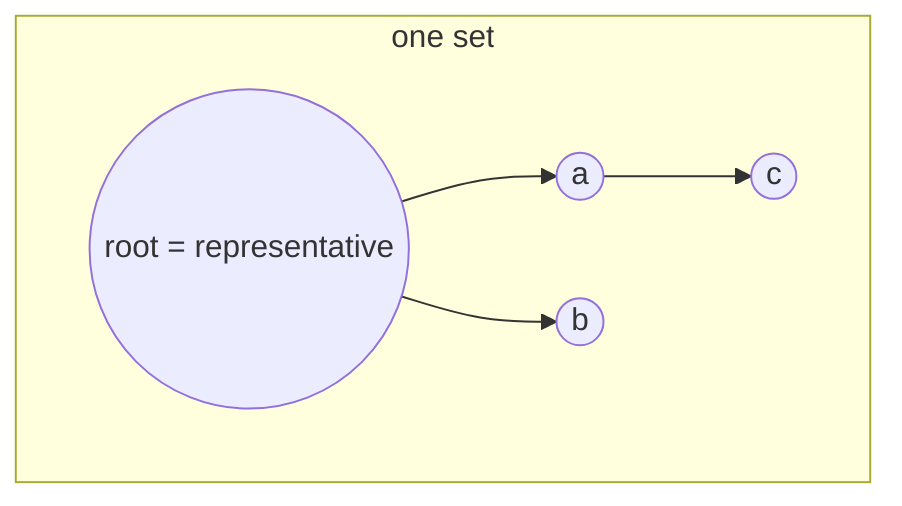

# Intro

A disjoint set (also called a union-find structure) tracks a collection of elements partitioned into disjoint (non-overlapping) sets. Each set has a single **representative** (canonical element) that identifies it. The structure answers one core question — "do these two elements belong to the same set?" — while letting you merge sets over time. .NET has no built-in disjoint-set type — you implement it with two `int[]` arrays (parent and rank/size), as shown below.

This note covers the **data structure** itself: how the sets are represented in memory and the cost of its operations. The optimizations that make those operations near-constant time (path compression, union by rank) and the analysis behind them live in the [[Union-Find]] algorithm note.

## How It Works

Each element starts as its own set. The structure is a **forest of trees**, where every node points to its parent and the root of each tree is that set's representative.

It is stored compactly as two parallel arrays rather than linked nodes:

- `_parent[i]` — the parent of element `i` (a root points to itself).
- `_rank[i]` (or `_size[i]`) — metadata used when merging to keep trees shallow.

Three operations are defined over this layout:

- **`find(x)`** — follow parent pointers up to the root; returns the set's representative.
- **`union(a, b)`** — link the root of one tree under the root of the other, merging two sets into one.
- **`connected(a, b)`** — `find(a) == find(b)`; true when both elements share a representative.



## C# Implementation

```csharp
public class DisjointSet
{
    private readonly int[] _parent;
    private readonly int[] _rank;

    public DisjointSet(int n)
    {
        _parent = Enumerable.Range(0, n).ToArray(); // each element is its own root
        _rank = new int[n];
    }

    public int Find(int x)
    {
        if (_parent[x] != x)
            _parent[x] = Find(_parent[x]); // path compression
        return _parent[x];
    }

    public bool Union(int a, int b)
    {
        int ra = Find(a), rb = Find(b);
        if (ra == rb) return false; // already in the same set

        // Union by rank: attach smaller tree under larger
        if (_rank[ra] < _rank[rb])      (ra, rb) = (rb, ra);
        _parent[rb] = ra;
        if (_rank[ra] == _rank[rb])     _rank[ra]++;
        return true;
    }

    public bool Connected(int a, int b) => Find(a) == Find(b);
}
```

The two lines doing the real work — `_parent[x] = Find(_parent[x])` (path compression) and the rank comparison (union by rank) — are _algorithmic_ optimizations. Why they reduce the cost to near-constant time is explained in the [[Union-Find]] note.

## Complexity

| Operation | Without optimizations | With path compression + union by rank |
|-----------|----------------------|---------------------------------------|
| `find` | O(n) worst case | O(α(n)) amortized ≈ O(1) |
| `union` | O(n) worst case | O(α(n)) amortized ≈ O(1) |
| Space | O(n) | O(n) |

α(n) is the inverse Ackermann function — it grows so slowly that α(n) ≤ 4 for any n that fits in the observable universe.

## Questions

> [!QUESTION]- How is a disjoint set represented in memory?
> As a forest of trees stored in a flat `_parent` array: `_parent[i]` is the parent of element `i`, and a root points to itself. A second `_rank` (or `_size`) array holds the metadata used to keep trees shallow during merges. No linked nodes or per-element allocation — just two integer arrays.

> [!QUESTION]- What does the "representative" of a set mean, and how do you get it?
> The representative is the root of an element's tree — the canonical element that identifies the whole set. You obtain it by calling `find(x)`, which walks up the parent chain to the root. Two elements are in the same set exactly when they share a representative.

> [!QUESTION]- Why store the structure as arrays instead of linked tree nodes?
> Arrays give O(1) index access, no per-node allocation, and excellent cache locality. Mapping elements to integers 0…n-1 lets `find`/`union` be simple array reads and writes, which is what makes the structure fast in practice.

## Pitfalls

**Path compression invalidates parent-array snapshots**: Path compression rewires `_parent` entries on every `Find` call. If you copy the `_parent` array to implement undo or rollback, those snapshots become stale after any `Find`. For rollback-capable disjoint sets (used in offline algorithms), use union by rank only — no path compression — and maintain an explicit undo stack of `(node, oldParent, oldRank)` tuples.

**Rank vs size confusion**: `_rank` approximates tree height; a `_size` field tracks element count. Both achieve O(log n) height when used alone, but they serve different purposes. Mixing them — for example, using a size field but calling it rank — silently degrades efficiency (size can grow faster than rank would, producing taller trees). Choose one consistently and document the invariant. Union by size has the bonus of answering "how big is this set?" in O(1) via `_size[Find(x)]`.

**Integer index assumption**: The standard implementation maps elements to integers 0…n-1. Using non-integer keys requires a separate `Dictionary<T, int>` to assign indices before construction. Forgetting this indirection causes index-out-of-range errors at runtime, not compile time.

## References

- [Disjoint-set data structure (Wikipedia)](https://en.wikipedia.org/wiki/Disjoint-set_data_structure) — formal description, proof of O(α(n)) amortized complexity, and history.
- [Union-Find (Princeton Algorithms)](https://algs4.cs.princeton.edu/15uf/) — Sedgewick's implementation walkthrough with complexity analysis and practical variants.
