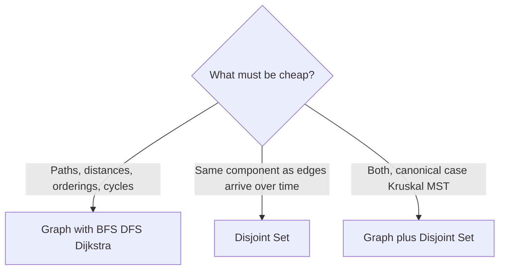

Graph structures model relationships between entities — service dependencies, social edges, road networks — where trees are too restrictive: cycles exist, multiple paths connect the same pair, and there's no root. .NET has no `Graph<T>` type; you compose one from primitives, and the composition depends on which relationship question must be cheap. A `Dictionary<TNode, List<TNode>>` adjacency list makes neighbor traversal cheap; a `bool[,]` matrix makes edge-existence O(1); two `int[]` arrays (a disjoint set) make "are these connected?" near-O(1) without storing edges at all.

That last option is the reason this folder splits into three notes. [[Graph]] is the explicit representation — you keep vertices and edges and run traversals (BFS, DFS, Dijkstra) over them. [[Disjoint Set]] keeps no edges: it collapses the graph into "which component is this vertex in?", trading every other question away for near-constant connectivity queries and merges. [[Union-Find]] is the companion to Disjoint Set — the two heuristics (union by rank, path compression) that keep that forest shallow, and the amortized `O(α(n))` analysis that proves the near-constant bound.

<nav style="--card-accent: 239, 68, 68;" class="folder-structure-map" aria-label="Graph Structures section map">
<article class="db-card folder-map-node">

<svg xmlns="http://www.w3.org/2000/svg" stroke-linejoin="round" stroke-linecap="round" stroke-width="2" stroke="currentColor" fill="none" viewBox="0 0 24 24"><path d="M14.5 2H6a2 2 0 0 0-2 2v16a2 2 0 0 0 2 2h12a2 2 0 0 0 2-2V7.5L14.5 2z"/><polyline points="14 2 14 8 20 8"/><line y2="13" y1="13" x2="8" x1="16"/><line y2="17" y1="17" x2="8" x1="16"/><line y2="9" y1="9" x2="8" x1="10"/></svg>Disjoint Set

A union-find structure that partitions elements into disjoint sets and answers whether two share a set.

<a class="internal-link" href="Home/Computer Science/Data Structures/Graph Structures/Disjoint Set.md" data-tooltip-position="top" aria-label="Disjoint Set">Disjoint Set</a></article><article class="db-card folder-map-node">

<svg xmlns="http://www.w3.org/2000/svg" stroke-linejoin="round" stroke-linecap="round" stroke-width="2" stroke="currentColor" fill="none" viewBox="0 0 24 24"><path d="M14.5 2H6a2 2 0 0 0-2 2v16a2 2 0 0 0 2 2h12a2 2 0 0 0 2-2V7.5L14.5 2z"/><polyline points="14 2 14 8 20 8"/><line y2="13" y1="13" x2="8" x1="16"/><line y2="17" y1="17" x2="8" x1="16"/><line y2="9" y1="9" x2="8" x1="10"/></svg>Graph

Vertices and edges modelling relationships that allow cycles, multiple paths, and no single root.

<a class="internal-link" href="Home/Computer Science/Data Structures/Graph Structures/Graph.md" data-tooltip-position="top" aria-label="Graph">Graph</a></article><article class="db-card folder-map-node">

<svg xmlns="http://www.w3.org/2000/svg" stroke-linejoin="round" stroke-linecap="round" stroke-width="2" stroke="currentColor" fill="none" viewBox="0 0 24 24"><path d="M14.5 2H6a2 2 0 0 0-2 2v16a2 2 0 0 0 2 2h12a2 2 0 0 0 2-2V7.5L14.5 2z"/><polyline points="14 2 14 8 20 8"/><line y2="13" y1="13" x2="8" x1="16"/><line y2="17" y1="17" x2="8" x1="16"/><line y2="9" y1="9" x2="8" x1="10"/></svg>Union-Find

Answers connectivity queries over a disjoint set via find and union, in near-constant O(α(n)) amortized time.

<a class="internal-link" href="Home/Computer Science/Data Structures/Graph Structures/Union-Find.md" data-tooltip-position="top" aria-label="Union-Find">Union-Find</a></article>
</nav>

# Which Note You Need

The decision hinges on whether connectivity is **static or dynamic**. One-off "is B reachable from A?" on a fixed graph — a single BFS is simpler and answers directionality too. Edges arriving incrementally with connectivity queries interleaved — re-running BFS per query is O(V + E) each time, while a disjoint set amortizes to near-constant. The cost of the disjoint set: it only handles _undirected_ connectivity and can never un-merge (no edge deletion).

# Questions

> [!QUESTION]- When does a disjoint set beat BFS for connectivity, and what do you give up?
> When edges arrive over time and connectivity queries interleave with insertions: each union/find is O(α(n)) ≈ O(1), versus O(V + E) to re-traverse per query. You give up everything except component identity — no paths, no distances, no directed reachability, and merges are irreversible (no edge deletion).

# References

- [Graph theory (Wikipedia)](https://en.wikipedia.org/wiki/Graph_theory) — vocabulary for vertices, edges, directed vs undirected, and connectivity; the shared language both child notes assume.
- [Disjoint-set data structure (Wikipedia)](https://en.wikipedia.org/wiki/Disjoint-set_data_structure) — the operations, the forest representation, and the O(α(n)) analysis.
- [PriorityQueue\<TElement, TPriority> class](https://learn.microsoft.com/en-us/dotnet/api/system.collections.generic.priorityqueue-2) — the one .NET primitive built specifically for weighted-graph algorithms (Dijkstra, Prim).
