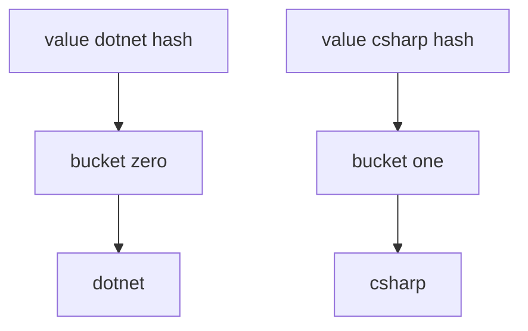

# Intro

A hash set is a collection of **unique** values backed by a hash table, giving O(1) average membership checks, inserts, and removals. Use it when uniqueness and lookup speed matter more than ordering. In .NET it is `HashSet<T>`, with `SortedSet<T>` as the ordered (O(log n)) alternative. A concrete use case: deduplicating 500K event IDs in a message processing pipeline — `HashSet<string>.Contains` checks each ID in sub-microsecond time, while `List<string>.Contains` would scan up to 500K entries per check, turning a 200 ms job into a 40-minute one.

## Deeper Explanation

`HashSet<T>` is hash-based: `GetHashCode` determines the bucket; `Equals` resolves collisions within a bucket. Core operations (`Add`, `Contains`, `Remove`) are O(1) average.

`HashSet<T>` also exposes the full set algebra in O(n) time:

- `UnionWith` — adds all elements from another collection (set A ∪ B).
- `IntersectWith` — keeps only elements present in both (A ∩ B).
- `ExceptWith` — removes elements found in another collection (A − B).
- `SymmetricExceptWith` — keeps elements present in exactly one set (A △ B).

These are in-place mutations. `IsSubsetOf`, `IsSupersetOf`, and `SetEquals` test structural relationships without modifying the set. A common production pattern: accumulate processed IDs in a `HashSet<int>`, then call `ExceptWith` against the full batch to find unprocessed items in O(n) instead of O(n²).

### Capacity, load factor, and resizing

Like `Dictionary<TKey,TValue>`, a `HashSet<T>` keeps a backing array sized to a prime number of buckets and tracks a **load factor** (entries ÷ buckets). When it fills past the threshold it **resizes** — allocating a larger array and **rehashing every element** into new buckets, an O(n) operation. Many small grows turn a "fast O(1)" insert loop into repeated O(n) copies, so if you know the rough size up front, **pre-size** with `new HashSet<T>(expectedCount)`. This load-factor/rehash machinery underlies all the hash-based collections — see [[HashMap]].

> [!WARNING]
> **Hash flooding (algorithmic-complexity DoS).** If an attacker can submit many keys that deliberately collide into one bucket (e.g. user-controlled string keys), every lookup degrades to O(n) and CPU spikes. .NET randomizes the `string` hash seed per process to blunt this, but custom key types with a weak `GetHashCode` remain vulnerable — give user-facing keys a well-distributed hash, or validate/cap untrusted key counts.

## Structure



### Example

```csharp
var tags = new HashSet<string>(StringComparer.OrdinalIgnoreCase)
{
    "dotnet",
    "csharp"
};

var added = tags.Add("DOTNET"); // false, already exists by comparer
```

### Pitfalls

- **Broken `GetHashCode`/`Equals` contract** — overriding `Equals` without matching `GetHashCode` causes `Add` to accept duplicates and `Contains` to miss existing entries. Two objects that are `Equals` must produce the same `GetHashCode`.
- **Mutable fields in hash computation** — mutating a field that participates in `GetHashCode` after insertion makes the entry unreachable in its bucket. `Contains` returns `false` even though the entry exists. Use immutable types or never mutate hash-participating fields after adding to the set.
- **Assuming stable enumeration order** — `HashSet<T>` enumeration order depends on internal bucket layout and can change after `Add`/`Remove` operations or across .NET versions. If you serialize a `HashSet` and compare output strings, tests will be flaky. Use `SortedSet<T>` or `.OrderBy()` when order matters.

### Tradeoffs

- Use `HashSet<T>` for fast uniqueness checks.
- Use `SortedSet<T>` if you need sorted uniqueness and accept O(log n) operations.

## Questions

> [!QUESTION]- What is the difference between `HashSet<T>` and `List<T>` for membership checks?
> `HashSet<T>.Contains` is O(1) average; `List<T>.Contains` is O(n).

> [!QUESTION]- Why can `HashSet<T>.Contains` fail for logically equal objects?
> Because hash/equality contracts are broken (for example, mismatched `GetHashCode`).

## References

- [`HashSet<T>` class](https://learn.microsoft.com/en-us/dotnet/api/system.collections.generic.hashset-1) — API reference with set operation methods (UnionWith, IntersectWith, ExceptWith).
- [`ISet<T>` interface](https://learn.microsoft.com/en-us/dotnet/api/system.collections.generic.iset-1) — interface contract for set semantics; useful for abstracting over HashSet and SortedSet.
- [Collections overview and complexity](https://learn.microsoft.com/en-us/dotnet/standard/collections/) — Microsoft overview of all collection types with complexity guidance.
- [HashSet implementation in dotnet runtime](https://github.com/dotnet/runtime/blob/main/src/libraries/System.Private.CoreLib/src/System/Collections/Generic/HashSet.cs) — source code for internal bucket and slot layout.
