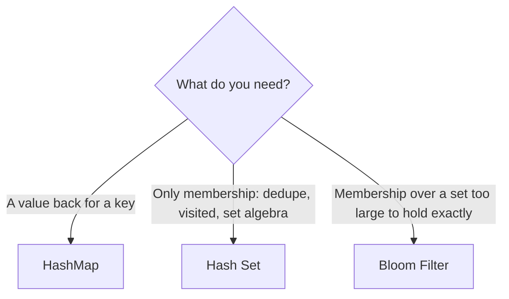

Hash-based structures use a key's hash to choose a small part of the collection to inspect. With a sound hash distribution and controlled load factor, lookup remains expected or amortized O(1) as the collection grows. That is a performance expectation, not a worst-case guarantee. A constant `GetHashCode` or deliberate hash flooding can force a map or set toward an O(n) scan. The `GetHashCode` contract governs that starting point. `Equals` then decides whether a candidate is the requested key.

In .NET, this family includes `Dictionary<TKey, TValue>` and related maps ([[HashMap]]) plus `HashSet<T>` ([[Hash Set]]). A [[Bloom Filter]] uses the same broad idea for probabilistic membership, but it stores shared bits rather than keys. These structures fit key lookup and duplicate detection when ordering is not part of the contract. [[Collision Resolution]] covers the separate question of what a table does when several keys choose the same home bucket.

<nav style="--card-accent: 239, 68, 68;" class="folder-structure-map" aria-label="Hash-based Structures section map">
<article class="db-card folder-map-node">

<svg xmlns="http://www.w3.org/2000/svg" stroke-linejoin="round" stroke-linecap="round" stroke-width="2" stroke="currentColor" fill="none" viewBox="0 0 24 24"><path d="M14.5 2H6a2 2 0 0 0-2 2v16a2 2 0 0 0 2 2h12a2 2 0 0 0 2-2V7.5L14.5 2z"/><polyline points="14 2 14 8 20 8"/><line y2="13" y1="13" x2="8" x1="16"/><line y2="17" y1="17" x2="8" x1="16"/><line y2="9" y1="9" x2="8" x1="10"/></svg>Bloom Filter

A probabilistic membership filter using fixed bits, with tunable false positives but never false negatives.

<a class="internal-link" href="Home/Computer Science/Data Structures/Hash-based Structures/Bloom Filter.md" data-tooltip-position="top" aria-label="Bloom Filter">Bloom Filter</a></article><article class="db-card folder-map-node">

<svg xmlns="http://www.w3.org/2000/svg" stroke-linejoin="round" stroke-linecap="round" stroke-width="2" stroke="currentColor" fill="none" viewBox="0 0 24 24"><path d="M14.5 2H6a2 2 0 0 0-2 2v16a2 2 0 0 0 2 2h12a2 2 0 0 0 2-2V7.5L14.5 2z"/><polyline points="14 2 14 8 20 8"/><line y2="13" y1="13" x2="8" x1="16"/><line y2="17" y1="17" x2="8" x1="16"/><line y2="9" y1="9" x2="8" x1="10"/></svg>Collision Resolution

Resolves hash collisions by chaining entries outside the table or probing alternative in-array slots.

<a class="internal-link" href="Home/Computer Science/Data Structures/Hash-based Structures/Collision Resolution.md" data-tooltip-position="top" aria-label="Collision Resolution">Collision Resolution</a></article><article class="db-card folder-map-node">

<svg xmlns="http://www.w3.org/2000/svg" stroke-linejoin="round" stroke-linecap="round" stroke-width="2" stroke="currentColor" fill="none" viewBox="0 0 24 24"><path d="M14.5 2H6a2 2 0 0 0-2 2v16a2 2 0 0 0 2 2h12a2 2 0 0 0 2-2V7.5L14.5 2z"/><polyline points="14 2 14 8 20 8"/><line y2="13" y1="13" x2="8" x1="16"/><line y2="17" y1="17" x2="8" x1="16"/><line y2="9" y1="9" x2="8" x1="10"/></svg>Hash Set

A hash-table-backed collection that stores one comparer-distinct copy of each value.

<a class="internal-link" href="Home/Computer Science/Data Structures/Hash-based Structures/Hash Set.md" data-tooltip-position="top" aria-label="Hash Set">Hash Set</a></article><article class="db-card folder-map-node">

<svg xmlns="http://www.w3.org/2000/svg" stroke-linejoin="round" stroke-linecap="round" stroke-width="2" stroke="currentColor" fill="none" viewBox="0 0 24 24"><path d="M14.5 2H6a2 2 0 0 0-2 2v16a2 2 0 0 0 2 2h12a2 2 0 0 0 2-2V7.5L14.5 2z"/><polyline points="14 2 14 8 20 8"/><line y2="13" y1="13" x2="8" x1="16"/><line y2="17" y1="17" x2="8" x1="16"/><line y2="9" y1="9" x2="8" x1="10"/></svg>HashMap

Key-value pairs located by hashing into buckets, with collisions resolved by chaining or probing.

<a class="internal-link" href="Home/Computer Science/Data Structures/Hash-based Structures/HashMap.md" data-tooltip-position="top" aria-label="HashMap">HashMap</a></article>
</nav>

# Choosing Within the Family

The choice turns on how much information must survive insertion.

| | [[HashMap]] | [[Hash Set]] | [[Bloom Filter]] |
|---|---|---|---|
| Answers | "What value belongs to key k?" | "Is x in the set?" | "Might x be in the set?" |
| Stores per element | Key + value | The element | Nothing — ~10 bits of a shared bit array |
| Wrong answers | Never | Never | False positives (tunable, e.g. 1% at ~10 bits/element). Never false negatives |
| Delete | Yes | Yes | No (needs counting/cuckoo variants) |
| .NET | `Dictionary<TKey,TValue>` | `HashSet<T>` | None built in — `BitArray` + k hashes |

```mermaid
flowchart TD
    A{What do you need?} -->|A value back for a key| B[HashMap]
    A -->|Only membership: dedupe, visited, set algebra| C[Hash Set]
    A -->|Membership over a set too large to hold exactly| D[Bloom Filter]
```

A `Dictionary<TKey, bool>` used only for membership carries a value slot with no useful meaning. [[Hash Set]] expresses that contract directly. A [[Bloom Filter]] becomes attractive when exact keys are too expensive to retain: 100 million URLs need about 120 MB of filter bits at a 1% target false-positive rate, while an exact `HashSet<string>` takes far more memory.

The Bloom filter is a pre-filter, not an authoritative set. "Definitely not" can skip the expensive lookup. "Possibly present" still goes to the map, database, or other source of truth.

# References

- [Selecting a collection class (Microsoft Learn)](https://learn.microsoft.com/en-us/dotnet/standard/collections/selecting-a-collection-class)
