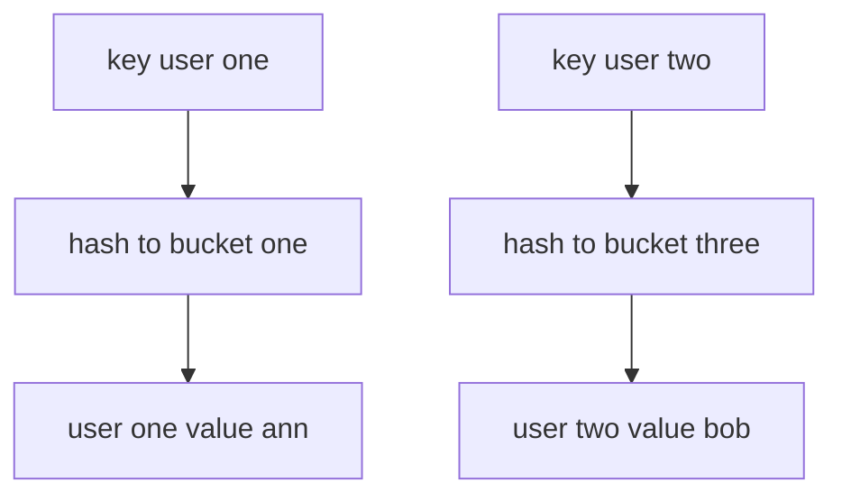

# Intro

A hash map (also called a hash table, associative array, or dictionary) stores key-value pairs and uses **hashing** to find the bucket for a key in near-constant time. The goal is fast insert, lookup, and delete by key — **O(1) average**, **O(n) worst case** when all keys collide into one bucket. A concrete example: a session cache storing 50K active sessions by session ID achieves sub-microsecond lookups, where the same lookup in a linear [[Dynamic Array]] would scan 25K entries on average.

In .NET the hash map is realized by several types: `Dictionary<TKey, TValue>` (generic, the default), the legacy non-generic `Hashtable`, `ConcurrentDictionary<TKey, TValue>` (thread-safe), and `FrozenDictionary<TKey, TValue>` (read-optimized, .NET 8+). These are covered under [.NET implementations](HashMap.md#net-implementations) below.

## How It Works

A hash map combines two rules: **hash distribution** and **equality checks**.

- The key's hash code chooses an index (bucket).
- If several keys land in the same bucket, equality checks (`Equals`) resolve the collision by comparing entries in that bucket.
- Good hash distribution keeps bucket chains short, which keeps operations close to O(1).

Collisions are handled by **chaining** (each bucket holds a list/chain of entries) or **open addressing** (probe to the next free slot). .NET's `Dictionary` uses chaining via an entry array indexed by bucket.



### Load factor and resizing

The reason inserts are _amortized_ O(1) — not strictly O(1) — is resizing. The map tracks a **load factor** (entries ÷ buckets). When it crosses the threshold, the map allocates a larger bucket array and **rehashes every existing entry** into it, an O(n) operation. Across many inserts this averages out to O(1) each, but any single insert can trigger a full O(n) rehash.

Two practical consequences:

- **Pre-size when you know the count.** Allocating enough buckets up front (e.g. `new Dictionary<TKey,TValue>(expectedCount)`) skips the repeated grow-and-rehash churn. Filling a 1M-entry map from default capacity rehashes ~20 times along the way.
- **Prime-sized bucket counts distribute better.** .NET's `Dictionary` resizes to the next prime above double the current size, because modulo a prime scatters keys better than modulo a power of two.

> [!WARNING]
> **Hash flooding (algorithmic-complexity DoS).** If an attacker controls the keys and can force many into one bucket, every operation degrades from O(1) to O(n) and CPU spikes — a real denial-of-service vector for anything that builds a map from untrusted input (HTTP form/query keys, JSON properties). .NET randomizes the `string` hash seed per process to defend against this; custom key types with a weak `GetHashCode` (or one returning a constant) are still exposed.

## .NET implementations

```csharp
var usersById = new Dictionary<int, string>
{
    [1001] = "Ann",
    [1002] = "Bob"
};

if (usersById.TryGetValue(1002, out var name))
{
    Console.WriteLine(name);
}
```

`Dictionary<TKey, TValue>` is the default key-value map in modern .NET. Entries live in a flat array with collision chaining by index, so iteration order roughly tracks insertion but is **not** guaranteed — never depend on it. Average lookup/add/remove is O(1); worst case (all keys in one bucket) degrades to O(n).

A production example: an ASP.NET Core middleware that resolves tenant configuration by hostname uses `FrozenDictionary<string, TenantConfig>` to serve 200K req/s with sub-microsecond lookup per request — build-once, read-many.

| Type | Key type | Thread-safe | Ordering | When to use |
|---|---|---|---|---|
| `Dictionary<TKey,TValue>` | Generic | No | Insertion (not guaranteed) | Default key-value map in modern .NET |
| `Hashtable` | `object` | No (Synchronized wrapper only) | None | Legacy interop only (see below) |
| `HashSet<T>` | N/A (values only) | No | None | Unique value membership — see [[Hash Set]] |
| `ConcurrentDictionary<TKey,TValue>` | Generic | Yes | None | Concurrent read/write without external locks |
| `FrozenDictionary<TKey,TValue>` | Generic | Yes (read-only) | None | Build-once, read-many hot paths |

**Decision rule**: start with `Dictionary<TKey,TValue>`. Switch to `ConcurrentDictionary` for concurrent writes, `FrozenDictionary` for read-only hot paths, and `SortedDictionary` for ordered iteration.

### Legacy: `Hashtable`

Before generics, .NET's hash map was the non-generic `Hashtable` (in `System.Collections`). It stores keys and values as `object`, so every value-type key or value is **boxed** — extra allocation and CPU. It also resolves collisions by **open addressing with double hashing** (probing other slots in the same backing array), whereas `Dictionary<TKey,TValue>` uses **array-based separate chaining**: all entries live in one contiguous `entries[]` array linked by a `next` **index**, with a `buckets[]` array mapping each hash to its chain head — no per-collision heap allocation and cache-friendly traversal. That (plus no boxing) is the primary reason to prefer `Dictionary` in new code; `Hashtable` survives only for interop with old APIs. Its `Synchronized()` wrapper guards single calls but does not make multi-step operations atomic.

## Pitfalls

- **`GetHashCode`/`Equals` contract violation** — if `Equals` says two keys are equal but `GetHashCode` returns different values, the map stores both as separate entries; later lookups find one but not the other, causing silent data duplication. Always ensure: if `a.Equals(b)` then `a.GetHashCode() == b.GetHashCode()`.
- **Mutable key fields break lookups** — if you insert a key, then mutate a field that participates in `GetHashCode`, the entry becomes orphaned in the wrong bucket. Lookups return `false` even though the entry exists. Use immutable key types (`string`, `int`, records with `init` properties) or never mutate key fields after insertion.
- **Poor `GetHashCode` creates O(n) degradation** — a `GetHashCode` that returns the same value for all instances (e.g., `return 0;`) puts every entry in one bucket, turning the hash map into a linked list. In .NET, the default `GetHashCode` for value types uses reflection-based field hashing which is slow; always override it for custom struct keys.
- **Concurrent writes corrupt state** — a plain hash map is not thread-safe. Two threads inserting simultaneously can corrupt the internal bucket array, causing infinite loops on later reads (a real production incident pattern). Use a concurrent variant (`ConcurrentDictionary`) or externally synchronize with a lock.
- **Using a hash map when sorted iteration is needed** — enumeration order is unspecified. If you insert keys 3, 1, 2 and iterate, you might get any permutation. Use a sorted map (`SortedDictionary`) for ordered keys, or sort after retrieval.

## Tradeoffs

| Choice | Hash map | Alternative | Decision criteria |
| --- | --- | --- | --- |
| vs linear search in a [[Dynamic Array]] | O(1) average lookup | O(n) scan, no hashing overhead | For very small N a list scan can win (no hashing, better locality); use the hash map as N grows. |
| vs sorted map (`SortedDictionary`) | Unordered, O(1) average | Ordered keys, O(log n) | Pick the sorted variant only when you need ordered iteration or range queries. |
| vs read-optimized (`FrozenDictionary`) | Cheap writes, mutable | Read-optimized, build cost | Use the frozen variant for build-once/read-many hot paths; never for collections that keep changing. |

## Questions

> [!QUESTION]- What data structure is a hash map, and why does it give O(1) average lookups?
> Keys are mapped to buckets by hash code, with equality checks resolving collisions inside a bucket. Computing a hash and jumping straight to one bucket avoids scanning every element, so lookup cost is roughly constant regardless of size — negligible at 5 elements, enormous at 5 million. The cost is unordered iteration and a correctness dependency on the hash contract.

> [!QUESTION]- Why can hash map performance degrade from O(1) to O(n)?
> Excessive collisions put many keys in the same bucket, so operations must compare more entries one by one. Poor `GetHashCode` distribution — or an attacker deliberately choosing colliding keys — concentrates entries and degrades the whole table toward a linear scan.

> [!QUESTION]- Why does a bad `GetHashCode` implementation create both correctness and performance risk?
> Hash maps rely on the hash and equality contracts. If equal keys do not produce equal hashes, lookups can fail or silently duplicate entries (correctness). If hashes are poorly distributed, bucket chains grow and every operation slows (performance). A stronger hash spreads keys better but costs more per call — for adversarial input prefer collision-resistant hashing even at that cost.

## References

- [Dictionary\<TKey, TValue> class (Microsoft Learn)](https://learn.microsoft.com/en-us/dotnet/api/system.collections.generic.dictionary-2) — API reference; the primary hash map in modern .NET, with remarks on hash contract requirements and capacity.
- [Selecting a collection class (Microsoft Learn)](https://learn.microsoft.com/en-us/dotnet/standard/collections/selecting-a-collection-class) — decision guide for choosing between hash-based and sorted collections.
- [Anatomy of the .NET dictionary](https://dunnhq.com/posts/2024/anatomy-of-the-dotnet-dictionary/) — practitioner deep-dive into bucket layout, collision handling, and resize behavior.
