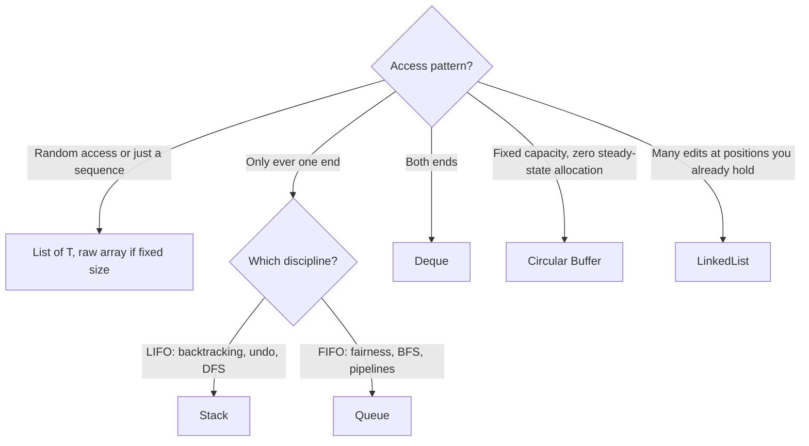

# Intro

Linear structures store elements in a sequence. The academic category is about access order and position, not one concrete memory layout: arrays give index arithmetic and locality; linked lists trade locality for node-local edits; stacks, queues, deques, and circular buffers restrict which end can be read or written.

.NET's everyday defaults lean array-backed: `T[]`, `List<T>`, `Stack<T>`, and `Queue<T>` all use contiguous storage internally. `LinkedList<T>` lives here as the contrast case. It answers the same "ordered sequence" question, but pays pointer overhead and poor cache locality to avoid shifting elements during node-local edits.

<nav style="--card-accent: 239, 68, 68;" class="folder-structure-map" aria-label="Linear Structures section map">
<article class="db-card folder-map-node">

<svg xmlns="http://www.w3.org/2000/svg" stroke-linejoin="round" stroke-linecap="round" stroke-width="2" stroke="currentColor" fill="none" viewBox="0 0 24 24"><path d="M14.5 2H6a2 2 0 0 0-2 2v16a2 2 0 0 0 2 2h12a2 2 0 0 0 2-2V7.5L14.5 2z"/><polyline points="14 2 14 8 20 8"/><line y2="13" y1="13" x2="8" x1="16"/><line y2="17" y1="17" x2="8" x1="16"/><line y2="9" y1="9" x2="8" x1="10"/></svg>Arrays

A fixed-size contiguous block of same-typed elements, the substrate every other linear structure builds on.

<a class="internal-link" href="Home/Computer Science/Data Structures/Linear Structures/Arrays.md" data-tooltip-position="top" aria-label="Arrays">Arrays</a></article><article class="db-card folder-map-node">

<svg xmlns="http://www.w3.org/2000/svg" stroke-linejoin="round" stroke-linecap="round" stroke-width="2" stroke="currentColor" fill="none" viewBox="0 0 24 24"><path d="M14.5 2H6a2 2 0 0 0-2 2v16a2 2 0 0 0 2 2h12a2 2 0 0 0 2-2V7.5L14.5 2z"/><polyline points="14 2 14 8 20 8"/><line y2="13" y1="13" x2="8" x1="16"/><line y2="17" y1="17" x2="8" x1="16"/><line y2="9" y1="9" x2="8" x1="10"/></svg>Circular Buffer

A fixed-size array with wrapping read/write indices, giving O(1) allocation-free enqueue/dequeue for streaming and bounded-history scenarios.

<a class="internal-link" href="Home/Computer Science/Data Structures/Linear Structures/Circular Buffer.md" data-tooltip-position="top" aria-label="Circular Buffer">Circular Buffer</a></article><article class="db-card folder-map-node">

<svg xmlns="http://www.w3.org/2000/svg" stroke-linejoin="round" stroke-linecap="round" stroke-width="2" stroke="currentColor" fill="none" viewBox="0 0 24 24"><path d="M14.5 2H6a2 2 0 0 0-2 2v16a2 2 0 0 0 2 2h12a2 2 0 0 0 2-2V7.5L14.5 2z"/><polyline points="14 2 14 8 20 8"/><line y2="13" y1="13" x2="8" x1="16"/><line y2="17" y1="17" x2="8" x1="16"/><line y2="9" y1="9" x2="8" x1="10"/></svg>Deque

A double-ended queue with O(1) push and pop at both ends, the superset of stack and queue.

<a class="internal-link" href="Home/Computer Science/Data Structures/Linear Structures/Deque.md" data-tooltip-position="top" aria-label="Deque">Deque</a></article><article class="db-card folder-map-node">

<svg xmlns="http://www.w3.org/2000/svg" stroke-linejoin="round" stroke-linecap="round" stroke-width="2" stroke="currentColor" fill="none" viewBox="0 0 24 24"><path d="M14.5 2H6a2 2 0 0 0-2 2v16a2 2 0 0 0 2 2h12a2 2 0 0 0 2-2V7.5L14.5 2z"/><polyline points="14 2 14 8 20 8"/><line y2="13" y1="13" x2="8" x1="16"/><line y2="17" y1="17" x2="8" x1="16"/><line y2="9" y1="9" x2="8" x1="10"/></svg>Dynamic Array

A contiguous, index-addressable buffer that grows automatically, giving O(1) random access and amortized O(1) append.

<a class="internal-link" href="Home/Computer Science/Data Structures/Linear Structures/Dynamic Array.md" data-tooltip-position="top" aria-label="Dynamic Array">Dynamic Array</a></article><article class="db-card folder-map-node">

<svg xmlns="http://www.w3.org/2000/svg" stroke-linejoin="round" stroke-linecap="round" stroke-width="2" stroke="currentColor" fill="none" viewBox="0 0 24 24"><path d="M14.5 2H6a2 2 0 0 0-2 2v16a2 2 0 0 0 2 2h12a2 2 0 0 0 2-2V7.5L14.5 2z"/><polyline points="14 2 14 8 20 8"/><line y2="13" y1="13" x2="8" x1="16"/><line y2="17" y1="17" x2="8" x1="16"/><line y2="9" y1="9" x2="8" x1="10"/></svg>LinkedList

A doubly linked list giving O(1) inserts and removes around node references you already hold, at the cost of locality.

<a class="internal-link" href="Home/Computer Science/Data Structures/Linear Structures/LinkedList.md" data-tooltip-position="top" aria-label="LinkedList">LinkedList</a></article><article class="db-card folder-map-node">

<svg xmlns="http://www.w3.org/2000/svg" stroke-linejoin="round" stroke-linecap="round" stroke-width="2" stroke="currentColor" fill="none" viewBox="0 0 24 24"><path d="M14.5 2H6a2 2 0 0 0-2 2v16a2 2 0 0 0 2 2h12a2 2 0 0 0 2-2V7.5L14.5 2z"/><polyline points="14 2 14 8 20 8"/><line y2="13" y1="13" x2="8" x1="16"/><line y2="17" y1="17" x2="8" x1="16"/><line y2="9" y1="9" x2="8" x1="10"/></svg>Queue

A FIFO collection where the earliest enqueued item is processed first, used for buffering, BFS, and pipelines.

<a class="internal-link" href="Home/Computer Science/Data Structures/Linear Structures/Queue.md" data-tooltip-position="top" aria-label="Queue">Queue</a></article><article class="db-card folder-map-node">

<svg xmlns="http://www.w3.org/2000/svg" stroke-linejoin="round" stroke-linecap="round" stroke-width="2" stroke="currentColor" fill="none" viewBox="0 0 24 24"><path d="M14.5 2H6a2 2 0 0 0-2 2v16a2 2 0 0 0 2 2h12a2 2 0 0 0 2-2V7.5L14.5 2z"/><polyline points="14 2 14 8 20 8"/><line y2="13" y1="13" x2="8" x1="16"/><line y2="17" y1="17" x2="8" x1="16"/><line y2="9" y1="9" x2="8" x1="10"/></svg>Span

A stack-only view over contiguous memory that owns nothing, enabling high-performance zero-copy slicing and parsing.

<a class="internal-link" href="Home/Computer Science/Data Structures/Linear Structures/Span.md" data-tooltip-position="top" aria-label="Span">Span</a></article><article class="db-card folder-map-node">

<svg xmlns="http://www.w3.org/2000/svg" stroke-linejoin="round" stroke-linecap="round" stroke-width="2" stroke="currentColor" fill="none" viewBox="0 0 24 24"><path d="M14.5 2H6a2 2 0 0 0-2 2v16a2 2 0 0 0 2 2h12a2 2 0 0 0 2-2V7.5L14.5 2z"/><polyline points="14 2 14 8 20 8"/><line y2="13" y1="13" x2="8" x1="16"/><line y2="17" y1="17" x2="8" x1="16"/><line y2="9" y1="9" x2="8" x1="10"/></svg>Stack

A LIFO collection where the most recently pushed element is popped first, used for backtracking, undo, and DFS.

<a class="internal-link" href="Home/Computer Science/Data Structures/Linear Structures/Stack.md" data-tooltip-position="top" aria-label="Stack">Stack</a></article>
</nav>

## The Family at a Glance

Every structure in this folder is an answer to two questions: _where can you touch the sequence_ (any index, one end, both ends) and _what backs it_ (one contiguous array, or nodes). Contiguous backing wins locality and allocation-free steady state; nodes win only when you hold a reference into the middle.

| Structure | Access discipline | Backing | Key costs | .NET |
|---|---|---|---|---|
| [[Arrays\|Array]] | Any index, O(1) | Contiguous, fixed size | Resize = reallocate + copy | `T[]` |
| [[Dynamic Array]] | Any index, O(1); append amortized O(1) | Contiguous, grows ×2 | Mid-sequence insert/remove O(n) | `List<T>` |
| [[LinkedList]] | O(1) at a _held node_; O(n) to find it | Doubly-linked nodes | Allocation per node, cache-hostile traversal | `LinkedList<T>` |
| [[Stack]] | One end (LIFO) | Contiguous | Resize on growth; no access below the top | `Stack<T>` |
| [[Queue]] | In back, out front (FIFO) | Ring over an array | Unbounded growth if producers outpace consumers | `Queue<T>` |
| [[Deque]] | Both ends, O(1) | Ring or linked nodes | No built-in .NET type | roll your own / `LinkedList<T>` |
| [[Circular Buffer]] | FIFO, fixed capacity | Ring, wraps in place | Full ⇒ reject or overwrite oldest | hand-rolled; inside `Channel<T>` |
| [[Span]] | Any index — a _view_, owns nothing | Points at existing memory | Stack-only, can't cross `await` | `Span<T>` / `Memory<T>` |

## Choosing

Start from the access pattern, not the structure:

Wrap any contiguous sequence in [[Span]] to slice without copying. [[Stack]] and [[Queue]] make the restriction the feature: it states intent and can't be violated by a stray `Insert(0, …)`. .NET ships no [[Deque]] (bring a ring buffer, preferred over `LinkedList<T>`); [[Circular Buffer]] suits streaming and "last N events". [[LinkedList]] only wins for edits at held positions, and everywhere else its per-node allocations and pointer-chasing lose to contiguous storage (the numbers are in [[Arrays]]).

The recurring theme: contiguous beats linked unless you can prove otherwise with a profiler. Cache locality is the dominant constant factor, and every "O(1) insert" claim for linked nodes quietly assumes you already found the node.

## References

- [Collections and data structures (Microsoft Learn)](https://learn.microsoft.com/en-us/dotnet/standard/collections/) — overview of .NET collection families with complexity notes.
- [Selecting a collection class (Microsoft Learn)](https://learn.microsoft.com/en-us/dotnet/standard/collections/selecting-a-collection-class) — Microsoft's own decision guide across the linear (and other) collection types.
- [System.Array class (Microsoft Learn)](https://learn.microsoft.com/en-us/dotnet/api/system.array) — base API for the fixed-size contiguous storage everything here builds on.
- [Latency numbers every programmer should know](https://gist.github.com/jboner/2841832) — the cache/memory latencies behind the "contiguous beats linked" rule of thumb.
