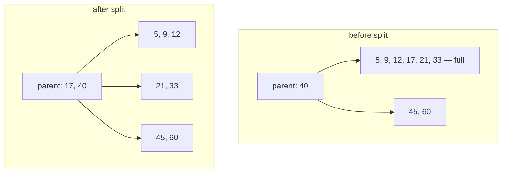

# Intro

A B-tree is a self-balancing search tree where each node holds **many keys** (hundreds, not one) and each internal node has one more child than keys. The design target is storage, not RAM: one node is sized to one disk/SSD page (typically 4–16 KB), so every node visited costs exactly one page read. High fan-out makes the tree extremely shallow — with 500 keys per node, 125 million keys fit in a tree of height 3, meaning any lookup touches at most 3–4 pages. The same data in a [[Binary Search Tree]] would be ~27 levels deep: 27 random page reads instead of 3.

That page-per-node economics is why B-trees (and the [[B+ Tree]] variant) are the default index structure in virtually every database and many filesystems — see [[Indexes]] for the SQL side. Reach for a B-tree mentally whenever data lives on a device where a random read fetches a whole block and each read is expensive; in pure memory, a [[Red-Black Tree]] or [[HashMap]] usually wins on constant factors (see [[Trees]] for the family overview).

## How It Works

A B-tree of order _m_ maintains three invariants:

- Every node holds between ⌈m/2⌉−1 and m−1 **sorted** keys (the root is exempt from the minimum).
- An internal node with k keys has exactly k+1 children; child _i_ covers the key range between key _i−1_ and key _i_.
- **All leaves sit at the same depth** — the tree is always perfectly balanced by construction.

Search is binary search within a node, then descend into the child whose range brackets the key; repeat until a leaf. Height stays at O(log\_m n), and since m is in the hundreds, the log base makes the tree 5–10× shallower than a binary tree.

### Insert: split upward

Keys are always inserted into a leaf, in sorted position. If the leaf overflows (m keys), it **splits**: the median key moves up into the parent, and the node becomes two half-full nodes. If the parent overflows too, it splits the same way — splits cascade upward, and when the root itself splits, a new root is created and the tree grows one level. This is the only way a B-tree gains height, and it grows from the top, which is what keeps all leaves at equal depth without rotations.

### Delete: borrow or merge

Deleting can leave a node under the ⌈m/2⌉−1 minimum. The fixes mirror splitting:

- **Borrow** — if a sibling has spare keys, rotate one through the parent (sibling's key moves into the parent, parent's separator moves down).
- **Merge** — if both siblings are minimal, fuse the node with a sibling plus the separating parent key into one node. Merges can cascade upward; when the root is emptied, the tree shrinks one level.

Deleting from an internal node is reduced to the leaf case by first swapping the key with its in-order predecessor (rightmost key of the left subtree), then deleting from that leaf.

## Complexity

| Operation | Cost | In page reads |
|---|---|---|
| Search | O(log n) | O(log\_m n) — typically 3–4 pages |
| Insert | O(log n) | Same + occasional split writes |
| Delete | O(log n) | Same + occasional borrow/merge writes |
| Space | O(n) | Pages are 50–100% full (≥ 50% guaranteed by the minimum-fill invariant) |

## Where you meet it

- **PostgreSQL** — `CREATE INDEX` defaults to its B-tree access method (a Lehman–Yao variant with sibling links, making it B+-tree-like in practice). One 8 KB page per node.
- **SQLite** — the entire database file is B-trees: table B+ trees keyed by rowid, index B-trees keyed by column values.
- **Filesystems** — NTFS directories, APFS metadata, Btrfs (it's in the name), and ext4's HTree directories (a hashed B-tree-like index) all take the same bet, for the same reason: directory lookups cost block reads.

In each of these the practical structure is closer to a [[B+ Tree]] — values only in leaves, leaves chained for range scans. That note owns the differences; this one owns the shared machinery above.

## Tradeoffs

- **vs binary search trees in memory** — the B-tree's win is fewer block reads; in RAM there are no block reads, so red-black/AVL trees with their simpler nodes usually beat it. Exception: cache-line-sized B-tree nodes (a "B-tree of order ~8") can beat pointer-chasing binary trees on cache locality — this is why some in-memory engines still use them.
- **vs LSM trees** — B-trees update in place: reads are cheap and predictable (3–4 pages), but every write dirties a page. LSM trees (RocksDB, Cassandra) buffer writes and merge later: much higher write throughput, slower and less predictable reads. Pick B-trees for read-heavy or mixed OLTP; LSM when write volume dominates.
- **Half-full pages are the rent** — the ≥50% fill invariant means an index can occupy up to 2× the minimal space, and random-order inserts cause ongoing splits (write amplification). Bulk-loading sorted data builds near-100%-full pages, which is why databases build indexes faster from sorted input.

## Questions

> [!QUESTION]- Why do databases use B-trees instead of plain binary search trees?
> A B-tree reads many keys per page, reducing random disk or SSD page reads because the tree is much shallower.

> [!QUESTION]- How does a B-tree stay balanced without rotations?
> It only grows at the root: an overflowing node splits and pushes its median key up, and if the split cascades to the root, a new root adds one level. Since height changes only at the top, all leaves stay at the same depth by construction.

> [!QUESTION]- What happens on delete when a node drops below its minimum fill?
> First try to borrow a key from an adjacent sibling through the parent; if both siblings are already minimal, merge the node with a sibling and the separating parent key. Merges can cascade up and shrink the tree by one level.

> [!QUESTION]- When is a B-tree the wrong choice?
> In pure memory (no page reads to save — simpler balanced trees or hash maps win on constants) and under write-dominated load, where LSM trees trade read predictability for far better write throughput.

## References

- [PostgreSQL indexes](https://www.postgresql.org/docs/current/indexes.html) — index overview, including the default B-tree index type.
- [PostgreSQL B-Tree implementation README](https://github.com/postgres/postgres/blob/master/src/backend/access/nbtree/README) — production notes on the Lehman–Yao variant Postgres actually ships: sibling links, page splits, concurrency.
- [SQLite database file format](https://www.sqlite.org/fileformat2.html#b_tree_pages) — precise on-disk layout of B-tree pages; the clearest "node = page" walkthrough available.
- Bayer & McCreight, [Organization and Maintenance of Large Ordered Indexes (1972)](https://doi.org/10.1007/BF00288683) — the original paper introducing the structure and its split/merge maintenance.
