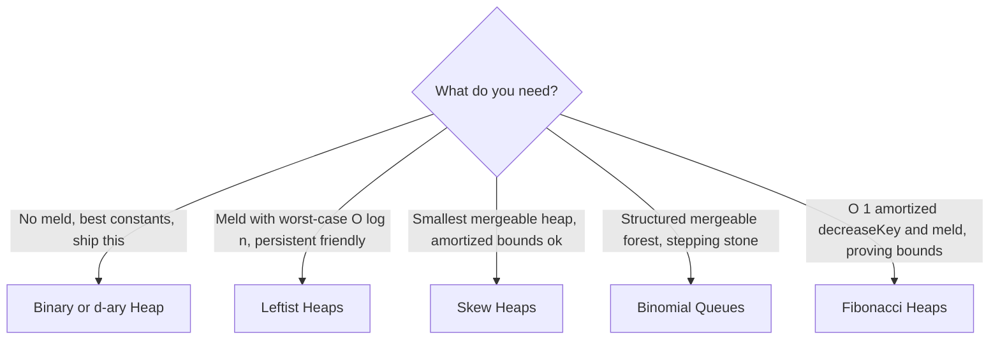

# Intro

Heap-like structures share one contract — a **partial order** (parent beats child, nothing promised between siblings) that keeps the best-priority item at a root for O(1) peek — and differ on everything else. The axis that splits the family is **meld** (merging two heaps into one). An array-backed binary heap can't meld cheaply: concatenating two arrays and re-heapifying is O(n). Every other member of the family exists to fix that, paying for it with pointer-based nodes — per-node allocation, GC pressure, cache misses on every hop.

The second axis is **decreaseKey** — raising an item's priority in place, the operation Dijkstra and Prim lean on. Only [[Fibonacci Heaps]] make it O(1) amortized, and that theoretical win rarely survives contact with real hardware: .NET's `PriorityQueue<TElement, TPriority>` (an array-backed quaternary heap) ships with _no meld and no decreaseKey_ and still wins most benchmarks, because sequential index arithmetic in a flat array beats chasing four pointers per node. The lazy-deletion workaround for decreaseKey lives in [[Heap]].

<nav style="--card-accent: 239, 68, 68;" class="folder-structure-map" aria-label="Heap-like section map">
<article class="db-card folder-map-node">

<svg xmlns="http://www.w3.org/2000/svg" stroke-linejoin="round" stroke-linecap="round" stroke-width="2" stroke="currentColor" fill="none" viewBox="0 0 24 24"><path d="M14.5 2H6a2 2 0 0 0-2 2v16a2 2 0 0 0 2 2h12a2 2 0 0 0 2-2V7.5L14.5 2z"/><polyline points="14 2 14 8 20 8"/><line y2="13" y1="13" x2="8" x1="16"/><line y2="17" y1="17" x2="8" x1="16"/><line y2="9" y1="9" x2="8" x1="10"/></svg>Binomial Queues

A forest of binomial trees mirroring the item count's binary form, giving O(log n) meld.

<a class="internal-link" href="Home/Computer Science/Data Structures/Trees/Heap-like/Binomial Queues.md" data-tooltip-position="top" aria-label="Binomial Queues">Binomial Queues</a></article><article class="db-card folder-map-node">

<svg xmlns="http://www.w3.org/2000/svg" stroke-linejoin="round" stroke-linecap="round" stroke-width="2" stroke="currentColor" fill="none" viewBox="0 0 24 24"><path d="M14.5 2H6a2 2 0 0 0-2 2v16a2 2 0 0 0 2 2h12a2 2 0 0 0 2-2V7.5L14.5 2z"/><polyline points="14 2 14 8 20 8"/><line y2="13" y1="13" x2="8" x1="16"/><line y2="17" y1="17" x2="8" x1="16"/><line y2="9" y1="9" x2="8" x1="10"/></svg>Fibonacci Heaps

A lazy binomial queue that defers work to extractMin, buying O(1) amortized decreaseKey and meld.

<a class="internal-link" href="Home/Computer Science/Data Structures/Trees/Heap-like/Fibonacci Heaps.md" data-tooltip-position="top" aria-label="Fibonacci Heaps">Fibonacci Heaps</a></article><article class="db-card folder-map-node">

<svg xmlns="http://www.w3.org/2000/svg" stroke-linejoin="round" stroke-linecap="round" stroke-width="2" stroke="currentColor" fill="none" viewBox="0 0 24 24"><path d="M14.5 2H6a2 2 0 0 0-2 2v16a2 2 0 0 0 2 2h12a2 2 0 0 0 2-2V7.5L14.5 2z"/><polyline points="14 2 14 8 20 8"/><line y2="13" y1="13" x2="8" x1="16"/><line y2="17" y1="17" x2="8" x1="16"/><line y2="9" y1="9" x2="8" x1="10"/></svg>Heap

An implicit complete d-ary tree with a parent-child priority rule, keeping the best item at the root.

<a class="internal-link" href="Home/Computer Science/Data Structures/Trees/Heap-like/Heap.md" data-tooltip-position="top" aria-label="Heap">Heap</a></article><article class="db-card folder-map-node">

<svg xmlns="http://www.w3.org/2000/svg" stroke-linejoin="round" stroke-linecap="round" stroke-width="2" stroke="currentColor" fill="none" viewBox="0 0 24 24"><path d="M14.5 2H6a2 2 0 0 0-2 2v16a2 2 0 0 0 2 2h12a2 2 0 0 0 2-2V7.5L14.5 2z"/><polyline points="14 2 14 8 20 8"/><line y2="13" y1="13" x2="8" x1="16"/><line y2="17" y1="17" x2="8" x1="16"/><line y2="9" y1="9" x2="8" x1="10"/></svg>Leftist Heaps

A heap-ordered binary tree whose null-path-length invariant gives merge in O(log n) worst case.

<a class="internal-link" href="Home/Computer Science/Data Structures/Trees/Heap-like/Leftist Heaps.md" data-tooltip-position="top" aria-label="Leftist Heaps">Leftist Heaps</a></article><article class="db-card folder-map-node">

<svg xmlns="http://www.w3.org/2000/svg" stroke-linejoin="round" stroke-linecap="round" stroke-width="2" stroke="currentColor" fill="none" viewBox="0 0 24 24"><path d="M14.5 2H6a2 2 0 0 0-2 2v16a2 2 0 0 0 2 2h12a2 2 0 0 0 2-2V7.5L14.5 2z"/><polyline points="14 2 14 8 20 8"/><line y2="13" y1="13" x2="8" x1="16"/><line y2="17" y1="17" x2="8" x1="16"/><line y2="9" y1="9" x2="8" x1="10"/></svg>Skew Heaps

A leftist heap without the bookkeeping, self-adjusting for amortized O(log n) merge.

<a class="internal-link" href="Home/Computer Science/Data Structures/Trees/Heap-like/Skew Heaps.md" data-tooltip-position="top" aria-label="Skew Heaps">Skew Heaps</a></article>
</nav>

## The family

| | Backing | Meld | Insert | ExtractMin | DecreaseKey | Bounds |
|---|---|---|---|---|---|---|
| [[Heap\|Binary / d-ary heap]] | array | O(n) | O(log n) | O(log n) | O(log n)\* | worst case |
| [[Binomial Queues]] | pointers | O(log n) | O(1) am. | O(log n) | O(log n) | mixed |
| [[Leftist Heaps]] | pointers | O(log n) | O(log n) | O(log n) | — | worst case |
| [[Skew Heaps]] | pointers | O(log n) | O(log n) | O(log n) | — | amortized |
| [[Fibonacci Heaps]] | pointers | O(1) | O(1) | O(log n) | O(1) | amortized |

\* not exposed by .NET's `PriorityQueue`; use lazy deletion.

**When each wins:**

The [[Heap|binary or d-ary heap]] is what you actually ship: no meld needed, so nothing else comes close on constants. [[Leftist Heaps]] give worst-case O(log n) meld in ~30 lines and are the natural persistent mergeable heap — the cost is one extra null-path-length field per node; [[Skew Heaps]] are the same idea minus that stored metadata when amortized bounds suffice. [[Binomial Queues]] meld as binary addition and are mostly a stepping stone to [[Fibonacci Heaps]], whose O(1) amortized decreaseKey and meld prove bounds like Dijkstra in O(m + n log n) but rarely win in running code: each node carries four pointers plus a degree and a mark bit, scattered across memory, so the "large constants" are literal per-node overhead.

## References

- [PriorityQueue\<TElement, TPriority> class (Microsoft Learn)](https://learn.microsoft.com/en-us/dotnet/api/system.collections.generic.priorityqueue-2) — the .NET baseline the pointer-based variants are measured against; note the absent meld/decreaseKey surface.
- [Larkin, Sen & Tarjan, "A back-to-basics empirical study of priority queues" (ALENEX 2014)](https://arxiv.org/abs/1403.0252) — benchmarks across the family; implicit d-ary heaps win most real workloads.
- [Mergeable heap (Wikipedia)](https://en.wikipedia.org/wiki/Mergeable_heap) — the meld-centric view of the family with links to each variant.
